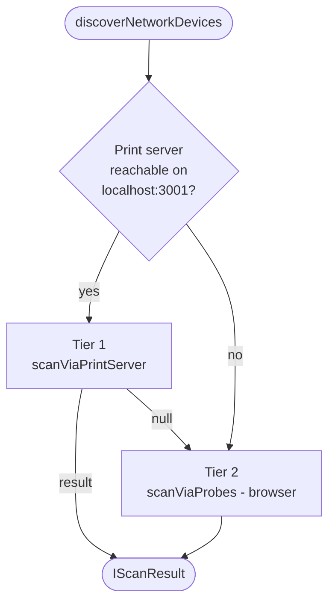

# 02 — Network Discovery

> **Last verified**: 2026-05-03

LAN discovery answers a single operator question: **"Which devices are on this subnet right now?"** It is used during initial setup (find the kitchen printer), after a network change (the router was replaced), or when a tablet is reported missing.

The implementation lives in `src/services/lan/networkDiscovery.ts` (424 lines). It is consumed via the `useNetworkDiscovery()` hook, which powers the **Network Scan** tab at `/settings/network-devices`.

---

## 1. Two-tier strategy



| Tier | Source | Method | Reliable for | File location |
|------|--------|--------|--------------|---------------|
| **Tier 1 — Print server** | `IScanResult.source = 'print_server'` | Real TCP probes via Node.js (`net.Socket`) | ESC/POS thermal printers (port 9100), web apps | `scanViaPrintServer()` lines 255–302 |
| **Tier 2 — Browser** | `IScanResult.source = 'browser_probe'` | `fetch(..., { mode: 'no-cors' })` and HTTP probes | Web apps on port 3000 only | `scanViaProbes()` lines 312–362 |

The browser **cannot** reliably probe raw TCP ports (e.g. port 9100 thermal printers) because a `no-cors` `fetch` returns success on any TCP open + HTTP-shaped response, and silently succeeds on every network error. This is why the print server's TCP probe is preferred whenever it is reachable.

---

## 2. Detecting the network prefix

`detectNetworkPrefix(knownIps?)` (lines 86–108) tries three heuristics:

1. **Known IPs** — first valid IPv4 from `lan_nodes.ip_address` history (caller passes `knownIps`)
2. **`window.location.hostname`** — only if it parses as a private IPv4 (192.x, 10.x, 172.x)
3. **Fallback** — `'192.168.1'`

Only the first three octets are kept (e.g. `'192.168.1'`). The fourth octet is filled by the scan range (default `1–254`).

```ts
detectNetworkPrefix(['192.168.1.50']) // => '192.168.1'
detectNetworkPrefix()                  // => '192.168.1' (fallback)
```

---

## 3. Probing a single device

`probeDevice(ip, timeoutMs, signal)` (lines 204–242) is the per-IP unit. For each IP it tries, in order:

1. **Port 9100 via print server** (`probePrinterViaPrintServer`, lines 140–156)
   - Calls `GET ${printServerUrl}/status/probe?ip=<ip>&port=9100`
   - Parses `{ reachable: true }` from the response
   - Returns `type: 'network_printer'` if reachable
2. **Port 3000 web app** (`probeWebApp`, lines 161–198)
   - Calls `GET http://<ip>:3000/api/health`
   - If the response is JSON with `{ device_type, device_name, node_id }`, populates `deviceInfo`
   - Returns `type: 'web_app'`
3. Returns `null` if neither responds.

Latency is measured per probe and surfaced in `IDiscoveredDevice.latencyMs`.

> **Security**: Every IP is validated through `isValidIPv4()` (lines 30–37) before any HTTP / WebSocket call. This prevents the discovery API from being weaponised into an SSRF gadget if the scan range were ever influenced by external input.

---

## 4. Performance — concurrency, timeout, range

| Parameter | Default | Constant | Tunable |
|-----------|---------|----------|---------|
| Probe timeout | **1 500 ms** | `DEFAULT_PROBE_TIMEOUT_MS` | `IScanOptions.probeTimeoutMs` |
| Parallel probes | **20** | `DEFAULT_CONCURRENCY` | `IScanOptions.concurrency` |
| Host range | `[1, 254]` | inline default | `IScanOptions.hostRange` |
| Print-server scan total timeout | **60 000 ms** | inline | not exposed |

A full subnet scan in browser-probe mode therefore runs `254 / 20 ≈ 13` chunks of 20 parallel probes. Worst case (all probes time out): `13 × 1.5 s = ~20 s`. Typical case with mostly empty subnets: 5–10 s.

The print-server scan delegates the loop to Node.js, which can fan out further; round-trip is usually 2–5 s for a /24.

The scan can be **cancelled** mid-flight via an `AbortSignal` (`IScanOptions.signal`). The `useNetworkDiscovery` hook wires a `useRef<AbortController>` to its `cancelScan()` function so the operator can hit "Cancel" in the UI.

---

## 5. The result envelope

```ts
interface IDiscoveredDevice {
  ip: string;
  port: number;
  type: 'network_printer' | 'web_app' | 'unknown';
  latencyMs: number;
  deviceInfo?: {
    device_type: string;
    device_name: string;
    node_id: string;
  };
  already_configured: boolean; // populated by UI layer, not the scanner
}

interface IScanResult {
  devices: IDiscoveredDevice[];
  duration: number;            // total ms
  hostsScanned: number;
  source: 'print_server' | 'browser_probe' | 'manual';
}
```

`already_configured` is **not** set by the discovery service itself. The UI layer (`NetworkScanTab.tsx`) cross-references each result against the `device_configurations` table to know whether to show "Add" or "Already configured".

---

## 6. The `useNetworkDiscovery` hook

`src/hooks/lan/useNetworkDiscovery.ts` (88 lines) provides a small React-friendly wrapper:

```ts
const {
  isScanning,
  progress,        // { hostsScanned, hostsTotal, devicesFound } | null
  result,          // IScanResult | null
  error,
  startScan,       // (opts?) => Promise<void>
  cancelScan,      // () => void
  testDevice,      // (ip, port) => Promise<{ reachable, latencyMs }>
  detectedPrefix,  // string memoised at mount
} = useNetworkDiscovery();
```

Behavioural notes:

- `startScan()` is a no-op if `isScanning` is already true (line 39).
- It aborts any prior scan via `abortRef.current?.abort()` before starting a new one (line 42).
- On `AbortError`, the error is silently swallowed — only "real" errors surface in `error` (line 58).
- `testDevice()` is the single-IP form, used by the manual-add UI to validate operator-typed IPs.

---

## 7. UI: `/settings/network-devices`

Source: `src/pages/settings/NetworkDevicesPage.tsx` (72 lines). Three tabs:

| Tab | File | Responsibility |
|-----|------|----------------|
| **Registered Devices** | `devices/RegisteredDevicesTab.tsx` | Lists `device_configurations` rows + their live `is_reachable` status |
| **Network Scan** | `devices/NetworkScanTab.tsx` | Drives `useNetworkDiscovery`, shows progress bar, renders `ScanResultCard` per discovered device |
| **Printers** | `devices/PrintersTab.tsx` | Cross-edit between `printer_configurations` and `device_configurations` (linking) |

The scan tab is the entry point for setup flows like "add the kitchen printer". Workflow:

1. Operator clicks **Scan**.
2. Hook resolves the prefix from `detectedPrefix` (memoised).
3. Tier 1 attempted first. Live progress callback updates the bar.
4. Each `IDiscoveredDevice` is rendered as a `ScanResultCard`.
5. Operator clicks **Add** → opens `DeviceConfigModal` pre-filled with IP, port, suggested type.
6. Modal posts via `useCreateDeviceConfiguration()` (see `06-device-types.md` for the resulting row shape).

---

## 8. Manual addition (when scan misses a device)

When a device cannot be auto-discovered (firewalled, on a different subnet bridge, asleep during scan), operators add it manually:

1. Open `DeviceConfigModal` directly via the **+ Add Device** button on the Registered Devices tab.
2. Fill IP, port, device type, name.
3. Modal calls `testDeviceConnectivity(ip, port)` (`networkDiscovery.ts:401-424`) to validate before saving.
4. On save, `useCreateDeviceConfiguration()` writes the row.

`testDeviceConnectivity` uses port-aware logic:

| Port | Method |
|------|--------|
| `9100` | Print-server TCP probe |
| `3000` | Web-app HTTP probe (parses `/api/health`) |
| Other | Generic `probeHttpPort` (fetch, no-cors) |

---

## 9. Failure modes & gotchas

| Symptom | Likely cause | Resolution |
|---------|--------------|------------|
| Scan completes with 0 devices but printer is reachable | Print server not running; browser fallback can't probe port 9100 | Start the Express print server on the hub |
| Scan finds dozens of "web apps" that aren't ours | Other devices respond to `/` with HTTP 200 in `no-cors` mode (browser tier) | Prefer Tier 1; configure firewall to drop port 3000 on non-bakery devices |
| Wrong subnet detected | Hub on Wi-Fi but printer on Ethernet with different /24 | Pass `networkPrefix` explicitly to `startScan({ networkPrefix: '192.168.10' })` |
| `discoveredDevice.deviceInfo` is undefined for a known web app | Target's `/api/health` did not return the expected JSON | Acceptable — UI just shows IP/port without device name |
| Scan is slow (~30 s) | Browser fallback hitting an unresponsive subnet | Lower `probeTimeoutMs` to 1 000 or raise `concurrency` to 40 |

---

## 10. Cross-references

- Result rows are persisted as `device_configurations` — see `06-device-types.md`
- The print server's `/scan/printers` endpoint is documented in `05-integrations/06-print-server.md`
- SSRF mitigations on the related `send-to-printer` Edge Function: `07-security/02-edge-function-security.md`
