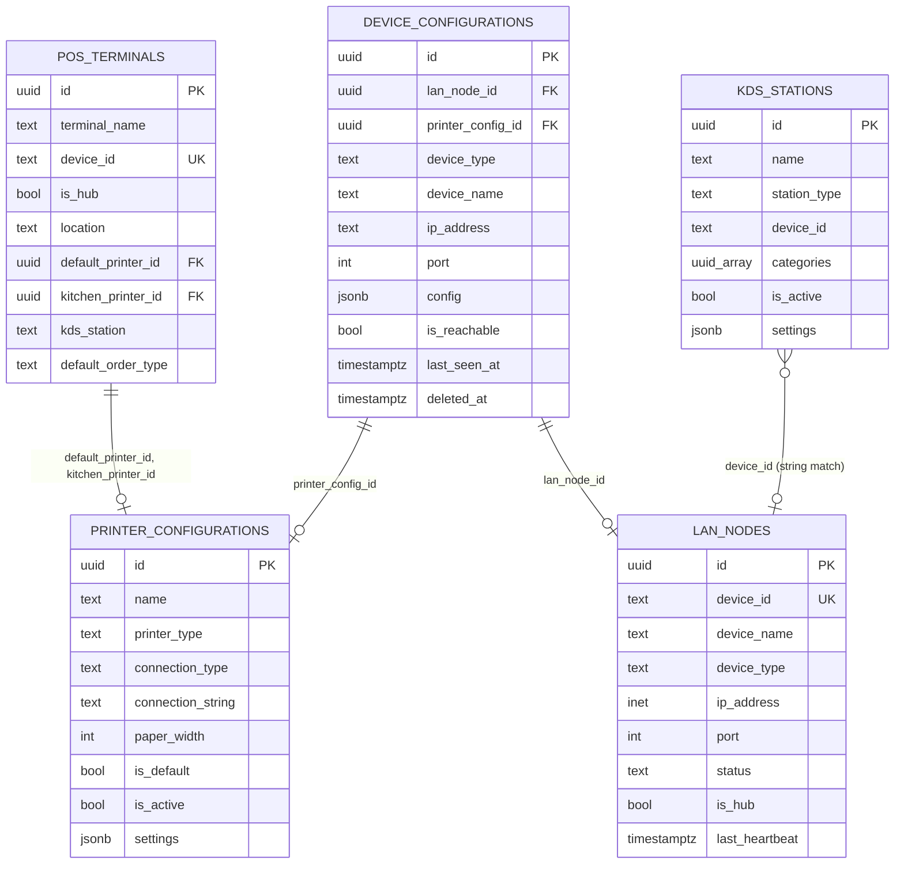

# 06 — Device Types & Configuration

> **Last verified**: 2026-05-03

The Breakery POS treats every screen on the LAN as a "device" with a typed role: cashier (POS), kitchen screen (KDS), customer display, waiter tablet, mobile POS, or a network printer. Each role has different capabilities, a different default place in the hub/client topology, and different config rows in the database. This page is the map.

---

## 1. Two type enums — do not confuse them

| Enum | Source | Values | Used by |
|------|--------|--------|---------|
| `TDeviceType` | Generated from DB; re-exported `lanProtocol.ts:15` | `'desktop' \| 'tablet' \| 'pos' \| 'mobile' \| 'kds' \| 'display'` | **Runtime** — `lan_nodes` table, LAN protocol heartbeats |
| `TNetworkDeviceType` | Inferred from `device_configurations.device_type` CHECK | `'network_printer' \| 'pos' \| 'kds' \| 'display' \| 'waiter_tablet' \| 'mobile'` | **Persistent** — `device_configurations` table, scan results, UI tabs |

The differences:

- `TDeviceType` has `'desktop'` (a back-office laptop on the LAN) and `'tablet'`. It does **not** have a printer category — printers don't run our app and never appear in `lan_nodes`.
- `TNetworkDeviceType` has `'network_printer'` (printers must be configurable) and `'waiter_tablet'` (more specific than the generic `'tablet'`). It does not have `'desktop'`.

When a tablet running the waiter app comes online, it registers in `lan_nodes` as `device_type='tablet'` and is also recorded in `device_configurations` as `device_type='waiter_tablet'`. The `lan_node_id` FK on `device_configurations` links the two views.

---

## 2. Capability matrix

| Device | LAN role default | Can be hub? | Submits orders | Prints locally | Receives KDS_NEW_ORDER | Connects via |
|--------|-----------------|-------------|----------------|----------------|------------------------|--------------|
| **POS terminal** (`pos`) | Hub (the main one) | **Yes** — exactly one, controlled by `pos_terminals.is_hub` | Yes (full POS UI) | Yes (owns print server) | No | `useLanHub` |
| **Mobile POS** (`mobile`) | Client | No | Yes (lightweight) | No (routes via hub) | No | `useLanClient` |
| **Waiter tablet** (`tablet`) | Client | No | Yes (table-side) | No (routes via hub) | No | `useLanClient` |
| **KDS station** (`kds`) | Client | No | No | No (routes via hub) | **Yes** | `useLanClient` |
| **Customer display** (`display`) | Client | No | No | No | No (display-only) | `useLanClient` |
| **Network printer** | n/a | n/a | n/a | n/a (it IS the printer) | n/a | TCP port 9100 |
| **Back-office desktop** (`desktop`) | Client (rare) | No | No | No | No | `useLanClient` (admin tools) |

In practice, only one POS is the hub. Other POS terminals (if any) connect as `useLanClient` clients.

---

## 3. Per-type integration with V2 modules

| Device | Where the route is registered | Module doc |
|--------|-------------------------------|------------|
| POS | `src/routes/pos.tsx` → `/pos` | `04-modules/01-pos.md` |
| Mobile POS | `src/routes/mobile.tsx` → `/mobile/*` | `04-modules/18-mobile.md` |
| Waiter tablet | `src/routes/index.tsx` → `/tablet/*` | `04-modules/17-tablet.md` |
| KDS station | `src/routes/index.tsx` → `/kds`, `/kds/:station` | `04-modules/04-kds.md` |
| Customer display | `src/routes/index.tsx` → `/display` | `04-modules/16-display.md` |
| Network printer | n/a — config under `/settings/printing` | `05-integrations/06-print-server.md` |

Each device type opens the matching route on its physical hardware, then the hook on that page (`useLanHub` for POS, `useLanClient` for everyone else) wires up the LAN connection.

---

## 4. Database tables — the four-table picture



Migrations of record:

- `pos_terminals` — `supabase/migrations/004_sales_orders.sql:10-30`
- `lan_nodes` — `supabase/migrations/010_lan_sync_display.sql:10-23`
- `kds_stations` — `supabase/migrations/010_lan_sync_display.sql:160-170`
- `printer_configurations` — `supabase/migrations/009_system_settings.sql:94-106`
- `device_configurations` — `supabase/migrations/20260330800000_create_device_configurations.sql`

---

## 5. The `device_configurations.config` JSONB shape

The same column holds different shapes depending on `device_type`:

| `device_type` | Expected `config` shape | Example |
|---------------|------------------------|---------|
| `'kds'` | `{ station: 'kitchen' \| 'barista' }` | `{ "station": "kitchen" }` |
| `'waiter_tablet'` | `{ waiter_name: string, zone?: string }` | `{ "waiter_name": "Ahmad", "zone": "Terrace" }` |
| `'network_printer'` | `{ paper_width: number, printer_type: string }` | `{ "paper_width": 80, "printer_type": "thermal" }` |
| `'pos'` | `{}` (config lives in `pos_terminals` instead) | `{}` |
| `'display'` | `{}` (no per-display config in V2) | `{}` |
| `'mobile'` | `{}` (no per-mobile config in V2) | `{}` |

The shape is **not enforced** by the DB — it's a TEXT-checked `device_type` plus a freeform JSONB. Validation happens client-side in `DeviceConfigModal.tsx` based on the selected type.

---

## 6. Configuration via `/settings/network-devices`

`src/pages/settings/NetworkDevicesPage.tsx` (72 lines). Three tabs share the page:

| Tab | What it lists | Mutations |
|-----|---------------|-----------|
| **Registered Devices** | All `device_configurations` rows where `deleted_at IS NULL`, joined with `lan_nodes` for live status | `useCreateDeviceConfiguration`, `useUpdateDeviceConfiguration`, `useDeleteDeviceConfiguration` |
| **Network Scan** | Live results from `useNetworkDiscovery` | "Add" → opens `DeviceConfigModal` pre-filled |
| **Printers** | All `printer_configurations` rows + their linked `device_configurations` | `useLinkDeviceToPrinter` |

Adding a new device:

1. Click **+ Add Device** (or click **Add** on a scan result).
2. `DeviceConfigModal` shows fields driven by the selected `device_type` (e.g. `station` dropdown only appears for `kds`).
3. On save, `useCreateDeviceConfiguration` writes the row.
4. Optional: link to a printer via the **Printers** tab (only meaningful for `network_printer` type).

---

## 7. Initial setup workflow (per role)

### 7.1 POS / Hub

1. First app launch: operator names the terminal at `/settings/devices` ("Caisse Principale", `isHub: true`).
2. `useTerminalStore.registerTerminal(name, true, location)` writes to sessionStorage.
3. Sync to DB: `useUpsertPosTerminal()` creates the `pos_terminals` row.
4. POS page loads `useLanHub({ autoStart: true, deviceName: 'Caisse Principale' })`.
5. Hub registers in `lan_nodes` with `is_hub=true`, subscribes to channels, starts heartbeat.

### 7.2 KDS station

1. Open the KDS app on the station hardware → `/kds/kitchen` (or `/barista`).
2. Page mounts `useLanClient({ deviceType: 'kds', station: 'kitchen' })` with `autoConnect: true`.
3. Client generates / reuses `lan-device-id` from localStorage.
4. Client registers in `lan_nodes` (type `'kds'`), broadcasts `NODE_REGISTER`.
5. Operator opens `/settings/network-devices` on the hub, sees the new KDS appear, clicks **Save** to also persist a `device_configurations` row with `config: { station: 'kitchen' }`.
6. Optionally configure the matching `kds_stations` row — `categories` array drives which products appear on this station.

### 7.3 Waiter tablet

1. Open `/tablet/orders` on the tablet.
2. `useLanClient({ deviceType: 'tablet', deviceName: 'Tablet Ahmad' })`.
3. Operator persists `device_configurations` with `device_type='waiter_tablet'`, `config: { waiter_name: 'Ahmad' }`.
4. Tablet now sends `TABLET_ORDER_SUBMIT`; hub's `handleTabletOrderSubmit` validates the sender is a registered tablet (`lanHubMessageHandler.ts:107-128`).

### 7.4 Customer display

1. Open `/display` on the display hardware.
2. `useLanClient({ deviceType: 'display', deviceName: 'Counter Display' })`.
3. Operator persists `device_configurations` with `device_type='display'`, empty config.
4. Display subscribes to `DISPLAY_CART`, `DISPLAY_TOTAL`, `DISPLAY_WELCOME`, `DISPLAY_ORDER_READY` and re-renders on each.

### 7.5 Mobile POS

1. Open the app on the phone → `/mobile`.
2. `useLanClient({ deviceType: 'mobile', deviceName: 'Mobile POS 1' })`.
3. Operator persists `device_configurations` with `device_type='mobile'`.
4. Mobile uses `requestPrintViaHub()` for any kitchen / barista ticket — receipts (if mobile owns a thermal printer) are local.

### 7.6 Network printer

1. Power on the printer; assign it a static IP on the LAN.
2. From the hub: `/settings/network-devices` → **Network Scan** → printer appears (Tier 1 print-server scan finds port 9100).
3. Click **Add** → `DeviceConfigModal` fills `device_type='network_printer'`, `port=9100`, prompts for `paper_width` (80 typical) and `printer_type` (`'thermal'` or `'inkjet'`).
4. Switch to **Printers** tab → create a matching `printer_configurations` row with `connection_type='network'`, `connection_string='<ip>:9100'`, configure `settings.category_ids` to map products → printer.
5. Link the device to the printer config via `useLinkDeviceToPrinter`.
6. Test: open `/settings/printing` → click **Print test page**.

---

## 8. Switching the hub manually

When the current hub machine is being replaced (hardware swap, reformat, retiring):

1. **On the OLD hub** — open `/settings/lan` and click **Stop hub** (calls `lanHub.stop()`). Then in `/settings/devices`, set `is_hub: false` on the terminal row (`useTerminalStore.setIsHub(false)` + `useUpdateTerminal`). The DB `pos_terminals.is_hub` flips false; `lan_nodes` row is marked offline.
2. **On the NEW hub** — register the terminal with `isHub: true` (`useTerminalStore.registerTerminal(name, true, location)`). Sync to DB. The `pos_terminals.is_hub` flips true on this row.
3. **Start the hub on the new machine** — open the POS, `useLanHub({ autoStart: true })` runs and registers `lan_nodes` with `is_hub=true`.
4. **Move the print server** — install / start the Express server on the new hub machine; verify `GET localhost:3001/health`.
5. **Reconnect printers** — printers themselves don't move; their IPs stay the same. But verify the new hub machine can reach them on the LAN (`testDeviceConnectivity`).
6. **Restart all clients** — KDS / tablets / display / mobile do not need to know the new hub's IP (they all connect via Supabase Realtime channel `'lan-hub'`), so a simple page refresh is enough.

There is no automatic election. Two terminals with `is_hub=true` simultaneously is a misconfiguration (both will register as hub in `lan_nodes` and both `getHubNode()` will return one of them indeterminately). The `idx_lan_nodes_hub WHERE is_hub = TRUE` partial index on `lan_nodes` exists for query performance, not as a uniqueness constraint.

---

## 9. Special considerations per device

### 9.1 KDS

- `useLanClient({ deviceType: 'kds', station })` builds the device name as `"<base> - <Station>"` (`useLanClient.ts:77-79`).
- Item-level state changes (`KDS_ITEM_PREPARING`, `KDS_ITEM_READY`) drive the cross-screen sync between kitchen and barista when an order has items for both stations.

### 9.2 Tablets

- The `device_id` is generated once and persisted in `localStorage` (`lan-device-id` key in `useLanClient.ts:33`).
- Hub validates `TABLET_ORDER_SUBMIT` senders against `useLanStore.connectedDevices` and **auto-registers** an unknown sender if the order payload includes `waiter_name`. This is a pragmatic recovery from hub restarts (`lanHubMessageHandler.ts:111-128`).

### 9.3 Display

- Strictly read-only — the display never sends order-related messages; it only receives.
- Connection failures are non-fatal: the display falls back to the welcome screen.

### 9.4 Mobile

- Treated as a lightweight POS but **does not** become hub. Even if the main POS is offline, mobile cannot promote itself.
- Print routing is identical to KDS / tablet — always via hub.

---

## 10. Soft-delete and cleanup

`device_configurations` uses **soft delete** via `deleted_at` (`useDeleteDeviceConfiguration` sets it; queries filter `is null`). Hard delete is only available via direct SQL.

The corresponding `lan_nodes` row is **not** soft-deleted — it just gets `status='offline'` when the device disconnects, and the row stays. To prune `lan_nodes` of dead rows, run:

```sql
SELECT public.mark_stale_lan_nodes_offline(p_timeout_seconds => 3600);
```

This is intended as an ops cron, not a product feature. There is no UI for it in V2.

If a `device_configurations` row is hard-deleted while its `lan_node_id` FK still points somewhere, the FK is `ON DELETE SET NULL` (see migration line 14) so referential integrity is preserved.

---

## 11. Cross-references

- Hub topology and transports: `01-hub-client-model.md`
- Discovery (how new devices show up in scans): `02-discovery.md`
- Heartbeat that drives `lan_nodes.last_heartbeat`: `03-heartbeat-and-state.md`
- Print routing rules tied to printer device type: `04-print-routing.md`
- Wire-format for `HEARTBEAT.deviceType`, `NODE_REGISTER`, etc.: `05-message-protocol.md`
- Per-device app modules: `04-modules/01-pos.md`, `04-modules/04-kds.md`, `04-modules/16-display.md`, `04-modules/17-tablet.md`, `04-modules/18-mobile.md`
- Print server endpoints: `05-integrations/06-print-server.md`
