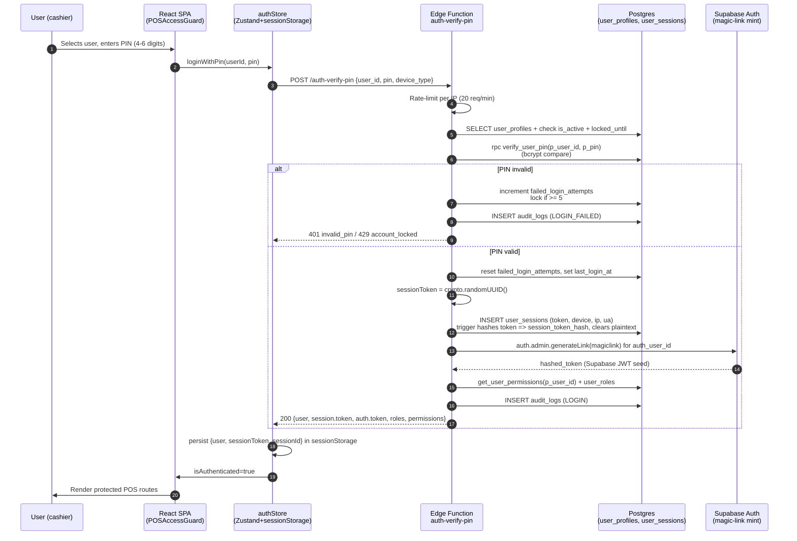
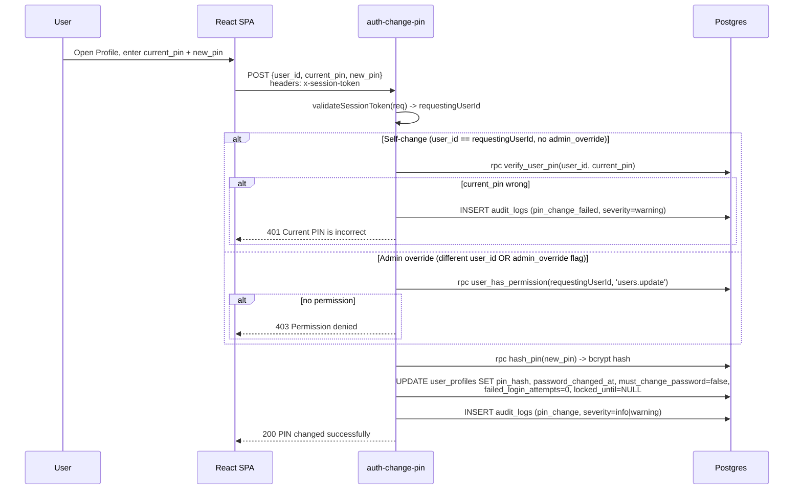
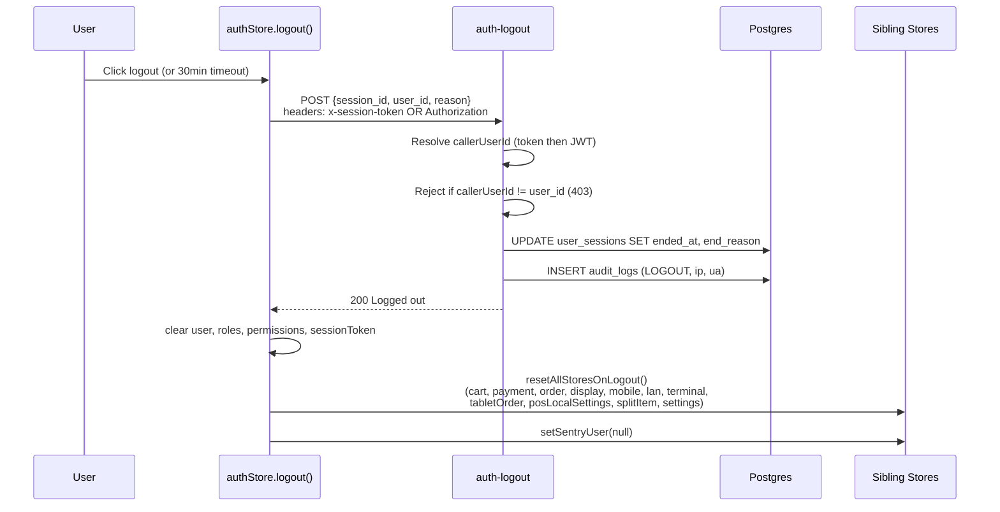

# 01 — Authentication Flow (PIN)

> **Last verified**: 2026-05-03

## Overview

AppGrav V2 uses a custom PIN-based authentication flow on top of Supabase Auth. The POS terminal is shared by ~20 users, so traditional email/password is impractical: every cashier, baker, server, and manager has a 4-6 digit numeric PIN. The PIN is bcrypt-hashed server-side, the session is materialised as an opaque session token (UUID v4) hashed with SHA-256 in the database, and a parallel Supabase Auth JWT is minted via magic-link so RLS policies that check `auth.uid()` keep working.

Source files:

- Frontend store: [src/stores/authStore.ts](../../../src/stores/authStore.ts)
- Auth service (Edge Function caller + fallback): [src/services/authService.ts](../../../src/services/authService.ts)
- Hooks: [src/hooks/auth/useAuthService.ts](../../../src/hooks/auth/useAuthService.ts), [src/hooks/auth/useSessionTimeout.ts](../../../src/hooks/auth/useSessionTimeout.ts), [src/hooks/auth/useMobileAuth.ts](../../../src/hooks/auth/useMobileAuth.ts)
- Edge Functions: [supabase/functions/auth-verify-pin/](../../../supabase/functions/auth-verify-pin/), [auth-get-session/](../../../supabase/functions/auth-get-session/), [auth-change-pin/](../../../supabase/functions/auth-change-pin/), [auth-logout/](../../../supabase/functions/auth-logout/), [set-user-pin/](../../../supabase/functions/set-user-pin/)
- DB functions: `verify_user_pin`, `set_user_pin`, `hash_pin`, `get_user_permissions` (see [03-database/04-functions-and-rpcs.md](../03-database/04-functions-and-rpcs.md) once authored)

## End-to-end sequence

## PIN format

- **Length**: 4-6 digits, numeric only.
- **Validation**: `/^\d{4,6}$/.test(pin)` enforced both client- and server-side ([auth-verify-pin/index.ts:55](../../../supabase/functions/auth-verify-pin/index.ts), [auth-change-pin/index.ts:43](../../../supabase/functions/auth-change-pin/index.ts), [set-user-pin/index.ts](../../../supabase/functions/set-user-pin/index.ts)).
- **Hashing**: bcrypt with cost factor 10 via `extensions.crypt(p_pin, extensions.gen_salt('bf', 10))`. See migration [20260210100000_remove_plaintext_pin.sql](../../../supabase/migrations/20260210100000_remove_plaintext_pin.sql) — the legacy `pin_code` plaintext column was scrubbed and `set_user_pin` rewritten to store `pin_hash` only.
- **Verification**: `verify_user_pin(p_user_id, p_pin)` is `SECURITY DEFINER STABLE`, returns boolean, and compares `pin_hash = crypt(p_pin, pin_hash)`.

## Lockout policy

| Setting | Value | Source |
|---|---|---|
| Max consecutive failed attempts | 5 | [auth-verify-pin/index.ts:112](../../../supabase/functions/auth-verify-pin/index.ts) |
| Lockout duration | 15 minutes | same file, line 113 |
| Counter column | `user_profiles.failed_login_attempts` | reset on success |
| Lock-until column | `user_profiles.locked_until` | TIMESTAMPTZ, NULL when unlocked |
| Audit severity | `warning` when 1 attempt remains, else `info` | logged on every failure |

The lock state is checked server-side at every PIN submission (`if (profile.locked_until && new Date(profile.locked_until) > new Date())` returns `403 account_locked` with minutes remaining).

## Session token

- **Plaintext**: `crypto.randomUUID()` (UUID v4, 122 bits of entropy) returned to the client.
- **Storage at rest**: SHA-256 hex digest stored in `user_sessions.session_token_hash`. A DB trigger clears the plaintext column right after insert, so a database breach does not expose live tokens.
- **Storage in client**: `sessionStorage` under key `breakery-auth` via Zustand `persist + createJSONStorage(() => sessionStorage)`. Scoped to the tab; cleared on close. See the inline SECURITY note at the top of [authStore.ts](../../../src/stores/authStore.ts).
- **Persisted shape** (partialize): only `user.{id,first_name,last_name,display_name,avatar_url}`, `isAuthenticated`, `sessionId`, `sessionToken` — never roles, permissions, or PINs.
- **Validation header**: clients send `x-session-token: <uuid>` to non-JWT Edge Functions (auth-change-pin, auth-logout, auth-user-management, set-user-pin). Server hashes the token, looks up `user_sessions.session_token_hash`, verifies `ended_at IS NULL`, and checks the 24h max-age (see [_shared/session-auth.ts:52-63](../../../supabase/functions/_shared/session-auth.ts)).
- **Refresh & timeout**: client-side activity rolls `last_activity_at` server-side; 30 minutes of inactivity = session ended, see below.

## Session lifetime & timeout

Two layers enforce timeout:

1. **Client-side activity tracker** — [useSessionTimeout.ts](../../../src/hooks/auth/useSessionTimeout.ts):
   - Default `timeoutMinutes = 30` (configurable via `pos_config` row in DB → wired through `coreSettingsStore`).
   - Listens to `mousedown, mousemove, keydown, touchstart, scroll, click`.
   - Polls every 15s, shows a warning banner 5 minutes before logout, then calls `useAuthStore.logout()`.
   - When a manager-PIN override is active in `posShift`, the hook clears the override first and only logs the user out on the next timeout window.
2. **Server-side session probe** — [auth-get-session/index.ts:81](../../../supabase/functions/auth-get-session/index.ts):
   - `SESSION_TIMEOUT_MS = 30 * 60 * 1000`. If `now - last_activity_at > 30 min`, sets `ended_at` + `end_reason='timeout'` and responds `401 session_timeout`.
   - Also rolls `last_activity_at` to NOW on every successful probe, keeping the session alive while the SPA is active.
3. **Hard cap** — [_shared/session-auth.ts:52](../../../supabase/functions/_shared/session-auth.ts):
   - `MAX_SESSION_AGE_MS = 24 * 60 * 60 * 1000`. Any non-`auth-get-session` Edge Function rejects sessions older than 24h, regardless of activity.

## Refresh / restore on app load

`initializeAuth()` ([authStore.ts:229](../../../src/stores/authStore.ts)) runs on every page load:

1. If a `sessionToken` is in `sessionStorage`, call `authService.validateSession(token)` → `auth-get-session`. Server returns up-to-date roles + permissions; store updates only if data changed (avoid no-op rerenders).
2. On transient errors (`Network error`, `Server error`), keep the session alive locally (don't punish the user for a flaky uplink). Only `session_not_found / session_ended / session_timeout / user_inactive` trigger forced logout.
3. PIN-recovery branch: if user is persisted but the token is gone (e.g., partial restore), re-fetch `user_roles` + `role_permissions` directly from Postgres so permission guards still work — but with no live session, write operations will fail RLS.

## PIN change

Source: [auth-change-pin/index.ts](../../../supabase/functions/auth-change-pin/index.ts).

## Admin PIN reset (set-user-pin)

When an admin must rotate or initialise a user's PIN without knowing the current one, the SPA calls [set-user-pin](../../../supabase/functions/set-user-pin/index.ts):

- Caller authenticates via Supabase JWT (`Authorization: Bearer <jwt>`), not via `x-session-token` (different design choice — the admin UI runs in a context that has the JWT).
- Edge Function resolves the caller's `user_profiles.id` via `auth_user_id`, then if the target is not the caller checks `user_has_permission(callerProfile.id, 'users.update')`.
- New PIN format validated (4-6 digits), hashed with bcryptjs (cost 10) — note: this function uses esm bcryptjs, while the `verify_user_pin` SQL path uses pgcrypto bcrypt. Both are bcrypt-compatible.
- Updates `user_profiles.pin_hash`, sets `must_change_password = true` so the user is prompted to rotate on first login.

## Logout

Even if the API call fails (network down), local state is always cleared — the user is locked out of the SPA regardless. See [authStore.ts:96-126](../../../src/stores/authStore.ts) and [resetAllStores.ts](../../../src/stores/resetAllStores.ts).

## Mobile / tablet path

[useMobileAuth.ts](../../../src/hooks/auth/useMobileAuth.ts) bypasses the Edge Function and calls `supabase.rpc('mobile_verify_pin', { p_pin })` directly. The RPC searches all active users for a matching PIN hash and returns the matched user_id + role. Used by the waiter tablet ordering app where there is no user-selection UI — the cashier simply types their PIN. This path skips lockout and audit logging, which is acceptable for a LAN-restricted device but is documented in [07-known-risks.md](./07-known-risks.md) as a risk if the tablet ever leaves the LAN.

## Audit trail

Every auth event is appended to `audit_logs` with: `user_id`, `action` (`LOGIN`, `LOGIN_FAILED`, `LOGOUT`, `pin_change`, `pin_change_failed`), `entity_type` (`user_profiles` or `user_sessions`), `entity_id`, `ip_address`, `user_agent`, `session_id`, `severity` (`info | warning | critical`). Reports module surfaces these via the security/audit dashboard.

## Manager PIN override (mid-session)

A second auth surface lives on top of the user session: certain sensitive POS actions (apply a discount above the cashier's permission cap, void an item already sent to the kitchen, open the cash drawer outside a sale) require a manager-level PIN even when a regular cashier is logged in. The flow:

1. Cashier triggers the action → UI invokes `<PinVerificationModal>` ([src/components/auth/](../../../src/components/auth/)).
2. Modal calls `useAuthorizedUsers(['MANAGER', 'OWNER', 'ADMIN'])` to list eligible users.
3. Manager selects their name + types their PIN → `useVerifyPin().mutateAsync({ userId, pin })` calls `supabase.rpc('verify_user_pin', ...)` directly (no Edge Function — this is mid-session, no new session token is created).
4. On success, the action proceeds and the manager PIN override is stored in `posShift.verifiedUser` for a short window.
5. `useSessionTimeout` clears `verifiedUser` first when inactivity hits the timeout, so a forgotten manager override does not stay live.

The manager PIN does **not** swap the session — the cashier remains logged in, the audit log records both `user_id` (cashier) and a `verified_by` field (manager).

## Authorization header propagation

When the magic-link JWT is established at PIN login, the Supabase client picks it up (via `supabase.auth.setSession({ access_token, refresh_token })`) and automatically adds it to every subsequent REST/Realtime/RPC request as `Authorization: Bearer <jwt>`. This is what makes RLS policies that check `auth.uid()` work for PIN-logged-in users.

If the magic-link mint fails (e.g. user has no `auth_user_id`), the client falls back to anon-role access for direct DB calls — only the Edge Function path with `x-session-token` continues to work, which restricts the user to the limited operations exposed via Edge Functions. This is a graceful-degradation strategy, not the happy path.

## Cross-references

- [02-rls-patterns.md](./02-rls-patterns.md) — how `is_authenticated()` enforces auth at the row level.
- [03-rbac-permissions.md](./03-rbac-permissions.md) — role + permission codes returned by `auth-verify-pin`.
- [04-edge-function-security.md](./04-edge-function-security.md) — `verify_jwt`, JWT vs session-token paths.
- [07-known-risks.md](./07-known-risks.md) — fallback path, anon RLS surface, P1/P2 findings.
