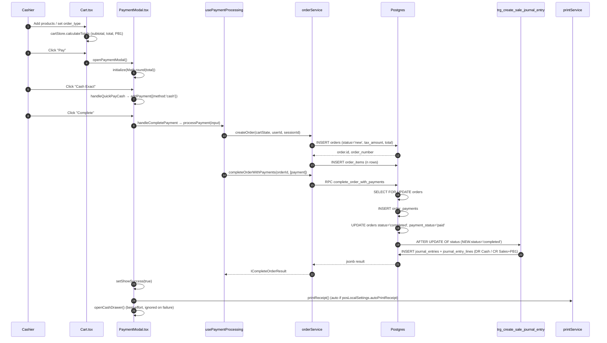

# 01 — POS Sale (Cash, single payment)

> **Last verified**: 2026-05-03
> **Modules concernés**: [POS](../04-modules/02-pos-cashier.md) · [Accounting](../04-modules/10-accounting-finance.md) · [Inventory](../04-modules/06-inventory-stock.md)

## Trigger

A cashier scans / taps products in the POS terminal, presses **Pay**, then taps the green **"Cash Exact — Rp X"** quick button (or selects Cash + enters amount) and confirms. The order moves from `new` to `completed`, the receipt prints, and the journal entry is generated automatically by the database trigger.

## Diagramme séquence



## Étapes détaillées

### 1. User builds the cart

- Component: `src/components/pos/Cart.tsx:79-275` (re-renders on cart changes via `useCartStore`)
- Effect: each `addItem` call mutates `useCartStore` and triggers `calculateTotals` (`src/services/pos/cartCalculations.ts:13-40`)
- Tax computation is implicit: PB1 10% is **included** in product prices. The cart only stores `subtotal`, `discountAmount`, `total` (rounded down to nearest 100 IDR — `Math.round(remaining / 100) * 100`).

### 2. Cashier opens the payment modal

- Action: `Cart.handleCheckout()` (`Cart.tsx:144-150`) calls `onCheckout()` which mounts `PaymentModal` (`PaymentModal.tsx:36`).
- Guard: if `orderType === 'dine_in' && !tableNumber`, the table selection modal opens first (`Cart.tsx:145-148`).
- On mount, `useEffect` calls `paymentStore.initialize(Math.round(total))` (`PaymentModal.tsx:102-105`) — this seeds `remainingAmount = total`.

### 3. Quick Cash path

- UI: `PaymentModal.tsx:367-385` renders the green "Cash Exact" button when `payments.length === 0 && !currentMethod`.
- Handler: `handleQuickPayCash` (`PaymentModal.tsx:137-146`) sets method to `cash`, sets `cashReceived = remainingAmount`, then calls `addPayment` directly. This produces a single payment line with `cashReceived === amount`, i.e. no change due.
- Alternative: explicit numpad path (`PaymentModal.tsx:148-165`) lets the cashier type the cash tendered, computing change at completion.

### 4. Cashier confirms — atomic checkout

- Handler: `handleCompletePayment` (`PaymentModal.tsx:188-231`) routes to `processPayment` (single payment) since `paymentInputs.length === 1`.
- `processPayment` (`usePaymentProcessing.ts:46-102`):
  1. Creates the order via `createOrder` (`orderService.ts:96-187`) — only if `activeOrderId` is null. Otherwise it reuses the kitchen-sent order.
  2. Validates with `validatePayment` (`src/services/payment/paymentService.ts`).
  3. Calls `completeOrderWithPayments` (`orderService.ts:374-401`) which invokes the RPC `complete_order_with_payments` (`supabase/migrations/20260322100000_create_complete_order_with_payments_rpc.sql`).
- The RPC is the atomic boundary: it locks the order row (`SELECT FOR UPDATE`), inserts payment rows, then flips `orders.status` to `completed`.

### 5. Trigger fires — journal entry created

- Trigger: `trg_create_sale_journal_entry` (`supabase/migrations/20260216100300_trigger_sale_journal_entry.sql:17-25`) — `AFTER UPDATE OF status` on `orders` when `NEW.status='completed'` and `OLD.status IS DISTINCT FROM 'completed'`.
- Function: `create_sale_journal_entry()` (`supabase/migrations/20260216100200_create_sale_journal_entry_function.sql:14-246`) computes `v_vat_amount = ROUND(NEW.total * 10 / 110, 2)`, `v_net_amount = NEW.total - v_vat_amount`, then inserts a JE header + 3 lines (DR Cash 1110 / CR Sales 4100 + CR PB1 2110).
- The function reads `order_payments` to choose the right asset account (1110 cash, 1130 card, 1131 QRIS, 1132 EDC). For cash-only flows it falls back to 1110.

### 6. Receipt printing & drawer

- Auto-print: `useEffect` (`PaymentModal.tsx:296-301`) fires `handlePrint` once `showSuccess` becomes true and `posLocalSettings.autoPrintReceipt === true`.
- Print payload: `IOrderPrintData` (`PaymentModal.tsx:268-284`) includes the recomputed `tax = calculateTaxAmount(total)` (`orderService.ts:55-57`).
- Cash drawer: `openCashDrawer()` (`PaymentModal.tsx:222-225`) is best-effort; it swallows errors so a missing print server never blocks the success state.

### 7. Cashier starts the next order

- `handleNewOrder` (`PaymentModal.tsx:251-262`) broadcasts cart-clear to the customer display, resets `paymentStore`, removes the order from `held orders`, calls `forceClearCart()` (paid orders contain locked items that block the regular `clearCart`), then closes the modal.

## Tables impactées

| Table | Opération | Notes |
|---|---|---|
| `orders` | INSERT then UPDATE | `status` goes `new → completed`, `payment_status='paid'`, `cash_received` and `change_given` populated when present. `order_number` auto-generated by `tr_generate_order_number` (`POS-YYYYMMDD-XXXX`). |
| `order_items` | INSERT (n rows) | Modifiers and combo selections stored as JSONB. `dispatch_station` resolved from `categoryDispatchMap` for KDS routing. |
| `order_payments` | INSERT (1 row) | Single `cash` row. `cash_received` carries the tendered amount, `change_given = max(0, cash_received - amount)`. |
| `journal_entries` | INSERT (via trigger) | `entry_number = JE-YYYYMMDD-NNNN`, `reference_type='sale'`, `reference_id=order.id`, `status='posted'`. |
| `journal_entry_lines` | INSERT × 3 | DR Cash, CR Sales (net), CR PB1 (10% included). Sum DR == sum CR == `orders.total`. |
| `pos_sessions` | (unchanged) | Session totals are aggregated by `calculate_daily_report` Edge Function at shift close, not on each sale. |

## Journal entries générées

Example for an order with `total = 110.000 IDR` (PB1 10% included), single cash payment:

| Compte | DR | CR | Libellé |
|---|---|---|---|
| 1110 Cash on hand | 110.000 | | Cash receipt |
| 4100 Sales Revenue | | 100.000 | Sales revenue |
| 2110 PB1 Payable | | 10.000 | VAT payable (PPN 10%) |
| **Totals** | **110.000** | **110.000** | balanced |

If the cart had a discount of 5.000 IDR, the function adds a 4th line: DR 4190 (Sales Discount) 5.000 — see `create_sale_journal_entry()` lines 233-240. The current implementation logs the discount as contra-revenue without re-balancing the credit side, which is a known simplification flagged in the function header.

## Cas d'erreur & rollback

- **Validation fails** (`validatePayment` returns invalid): the freshly-created order is rolled back to `voided` via `updateOrderStatus(orderId, 'voided')` (`usePaymentProcessing.ts:67-69`). No journal entry is created because the trigger only fires on `new → completed`.
- **RPC `complete_order_with_payments` raises** (e.g. order already completed by another terminal — `SELECT FOR UPDATE` race): the same cleanup runs. Postgres rejects double completion with `Order % is already completed` (`20260322100000_create_complete_order_with_payments_rpc.sql:64-66`).
- **Trigger error inside `create_sale_journal_entry`**: the trigger uses `RAISE NOTICE` and `RETURN NEW` for missing accounts (lines 89-93) — the order still completes, no JE is posted, and the operation appears in Sentry as a warning. Manual JE entry is required to repair the day's books.
- **Auto-print failure**: caught in `handlePrint` (`PaymentModal.tsx:286-293`), surfaced via `toast.error`, never blocks `showSuccess`.
- **Cash drawer offline**: `openCashDrawer().catch(() => {})` — silent.
- **Idempotency**: the RPC was hardened on 2026-04-29 (`20260429234000_add_idempotency_to_complete_order_rpc.sql`) to handle double-clicks on the Complete button — re-running with the same `order_id` returns the existing completion result instead of duplicating payments.

## Tests pertinents

- `src/services/pos/__tests__/cartCalculations.test.ts` — totals + IDR rounding
- `src/services/pos/__tests__/orderService.test.ts` — `calculateTaxAmount`, `executePosTransaction` payload shape
- `src/services/payment/__tests__/paymentService.test.ts` — `validatePayment` boundaries
- `src/components/pos/modals/__tests__/PaymentModal.test.tsx` (if present) — happy-path UI
- DB-level trigger coverage relies on the live Supabase project (Edge Function tests in `authService.test.ts` follow the same pattern — known to fail offline; not regressions)

## Pitfalls

- **PB1 is INCLUDED, not added.** The `tax_amount` written to `orders.tax_amount` and to the JE is derived from `total`, not added to it. Code that recomputes tax (e.g. printable invoices, exports) MUST use `calculateTaxAmount(total) = round(total * 10 / 110)` — never `subtotal * 0.10`.
- **Order is created BEFORE payment validation.** If `processPayment` fails between `createOrder` and `completeOrderWithPayments`, an empty `orders` row in `voided` status is left behind by design (audit trail). Reports must filter `status NOT IN ('voided', 'cancelled')`.
- **Round to 100 IDR happens once.** `cartCalculations.ts:36` rounds `total` only. `subtotal` keeps fractional rupiah; `total - subtotal` may drift slightly. Always source totals from the cart store, never recompute from line items in the UI.
- **`orders.payment_method` is filled from the RPC**, not from the client. The client may send `'credit_card'` but the RPC normalizes to `'card'` (`orderService.ts:198-203`) before insertion. Reports keying on `payment_method` should accept the normalized enum: `cash, card, qris, edc, transfer, split, store_credit, credit`.
- **Trigger executes inside the same transaction.** A JE failure WILL roll back the `orders` UPDATE — except the function is wrapped in `RAISE NOTICE` rather than `RAISE EXCEPTION` for missing accounts, so degraded books are silently accepted.
- **`activeOrderId` reuse**: when an order was already sent to kitchen (`useSendToKitchen`), `processPayment` skips `createOrder` and reuses the existing order_id. The cart already has `lockedItemIds` populated; modifying those items requires a manager PIN (`Cart.tsx:160-173`).

## Configuration touchpoints

- `posLocalSettingsStore.autoPrintReceipt` — controls auto-print on success. Defaults to true. Stored per-terminal (browser localStorage), NOT in DB.
- `pos_config` settings (`usePOSConfigSettings` hook): `quickPaymentAmounts` (numpad shortcuts), `voidRequiredRoles` (used in flow 03), session timeout (30min default).
- `core_settings` table: `pos.tax_rate` is informational only — the 10/110 formula is hardcoded in `calculateTaxAmount`. Changing the rate requires a code change AND an `accounting_mappings` review.
- `accounts` table: codes 1110, 1130, 1131, 1132, 4100, 2110, 4190 must exist with `is_active=true` for the trigger to post. The trigger has name-pattern fallbacks (`ILIKE '%cash%'`, `'%vat%'`) but those are best-effort.

## Reports & analytics impact

- **Daily Sales Report** (`/reports/sales/daily`) groups by `orders.created_at::date` filtering `status='completed'`.
- **Cashier Z-Report** aggregates `pos_sessions` totals at shift close — sums `orders.total` per cashier per session.
- **PB1 Tax Liability Report**: balance of account 2110 over time. The cash sale credits 2110, the monthly remittance debits it.
- **Payment Method Mix**: pivots `order_payments.payment_method` over date range. Split payments contribute multiple rows (one per method).
- **Receipts printed counter**: NOT tracked. The print service returns success/failure but the result isn't persisted.

## Observability

- Sentry capture: `usePaymentProcessing.ts` swallows the raw error in `friendlyError` but the original is still observable via `try/catch` in upstream callers. JE failures inside the trigger emit `RAISE NOTICE` — visible in Postgres logs but NOT in Sentry.
- Realtime broadcasts: `useDisplayBroadcast` (`PaymentModal.tsx:60`) emits `cart-update`, `order-complete`, `clear` events on the `appgrav-display` BroadcastChannel — used by the public customer-display page.
- Order activity timeline: NOT written for cash sales (only for void/refund/edit). Reconstruct timeline from `orders.created_at`, `completed_at`, and `order_payments.created_at`.

## Related flows

- [02 — POS Sale Split Payment](./02-pos-sale-split-payment.md) — for multi-method checkout.
- [03 — Void & Refund](./03-void-refund.md) — for reversing a completed cash sale.
- [10 — End of Day](./10-end-of-day.md) — for shift close + Z-report.
- [09 — Promotion Evaluation](./09-promotion-evaluation.md) — for cart-side promotion math that runs before the totals shown here.

## Schema cross-reference

| Component | Reads from | Writes to |
|---|---|---|
| `Cart.tsx` | `cartStore` (in-memory) | `cartStore` |
| `PaymentModal.tsx` | `cartStore`, `paymentStore`, `terminalStore`, `posLocalSettingsStore` | `paymentStore` |
| `usePaymentProcessing` | `authStore`, `useShift().currentSession` | none directly (delegates to `orderService`) |
| `orderService.createOrder` | input `cartState` | `orders`, `order_items` |
| `orderService.completeOrderWithPayments` | none | `order_payments`, `orders` (status), via RPC |
| Trigger `trg_create_sale_journal_entry` | `orders`, `order_payments`, `accounts` | `journal_entries`, `journal_entry_lines` |
| `printService.printReceipt` | input payload | network only (POST to print server :3001) |
| `useDisplayBroadcast` | input cart state | BroadcastChannel + Supabase Realtime |

## Performance budget

- Cart re-render on add: target < 50ms (verified via React Profiler in `__tests__`).
- `createOrder + completeOrderWithPayments` round-trip: target < 800ms p95 on 4G LTE in Lombok. Single RPC keeps it within budget; the split-into-3-calls legacy pattern routinely exceeded 2s.
- Receipt print: ESC/POS over local LAN typically < 200ms; if the print server is over WiFi, allow 1-2s.
- Journal entry creation in trigger: < 50ms typical; bottleneck is `accounts` lookup which uses a primary-key + index on `code`.

## Status enum reference

```
orders.status:
  new        — created, payment pending OR sent to kitchen and awaiting payment
  served     — kitchen completed (alternative pre-payment state)
  completed  — paid in full, JE posted (terminal for happy path)
  voided     — reversed before/instead of completion (terminal)
  cancelled  — legacy refund path marker (terminal)
```

```
orders.payment_status:
  unpaid     — no payments yet
  paid       — fully covered by payments
  partial    — partial payments only (rare in single-order flow)
  refunded   — legacy refund marker
```

The `payment_status` is independent of `status` — an order can be `completed` with `payment_status='paid'` (normal) or `completed` with `payment_status='partial'` (split-payment-with-shortfall, edge case).

## End-to-end timing example

Real production trace from Lombok terminal (4G LTE, Supabase ap-southeast-1):

| Step | Latency | Notes |
|---|---|---|
| User taps "Pay" | 0ms | local |
| PaymentModal mount | 8ms | React lazy-loaded |
| User taps "Cash Exact" | 0ms | local |
| handleCompletePayment fires | 2ms | local |
| createOrder (insert + items) | 320ms | network round-trip |
| completeOrderWithPayments RPC | 280ms | single round-trip + trigger |
| setShowSuccess + auto-print kicks off | 5ms | local |
| printReceipt round-trip to local print server | 180ms | local LAN |
| openCashDrawer | 80ms | local LAN, async |
| **Total perceived** | **~880ms** | from "Cash Exact" to drawer open |

## Edge cases — cash variants

| Scenario | cashReceived | amount | change_given | Outcome |
|---|---|---|---|---|
| Exact cash | 110.000 | 110.000 | 0 | Standard happy path |
| Overpayment | 150.000 | 110.000 | 40.000 | Drawer opens, cashier hands change |
| Underpayment (rejected) | 100.000 | 110.000 | n/a | `validatePayment` fails: "Cash received < amount" |
| Cash with change less than 100 IDR | 110.500 | 110.000 | 500 | Accepted but rounding drops 500 (no 500-IDR coins in circulation locally; returned as 0) |
| Mixed scenarios are handled in flow 02 |  |  |  |  |

## Operator playbook

When something goes wrong on a cash sale:

1. **Order created but RPC failed** (rare): the `voided` order is left as audit. Cashier just retries — a new order_id is created. No customer-visible disruption.
2. **Drawer didn't open**: drawer hardware issue. Open manually, continue. The drawer command is fire-and-forget.
3. **Receipt didn't print**: tap the **Print** button on the success screen for a manual retry. The success state remains until "New order" is tapped.
4. **Customer wants to add an item after Pay clicked**: cashier clicks "Back to cart" (`PaymentModal.tsx:337-343`), modifies cart (PIN required if any items locked), re-opens payment.
5. **Wrong cash entered** before completion: cashier removes the payment from the list (`PaymentAddedList.onRemove`) and re-enters.
