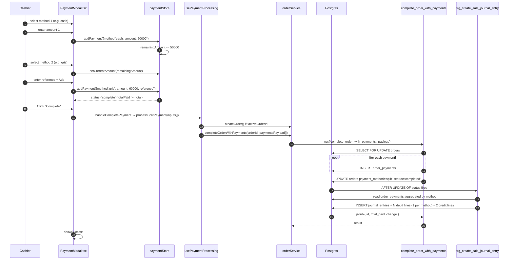

# 02 — POS Sale (Split payment)

> **Last verified**: 2026-05-03
> **Modules concernés**: [POS](../04-modules/02-pos-cashier.md) · [Accounting](../04-modules/10-accounting-finance.md) · [B2B](../04-modules/04-b2b-wholesale.md) (when `store_credit` involved)

## Trigger

A cashier checks out an order with two or more payment methods (e.g. 50.000 cash + 60.000 QRIS for a 110.000 total), or splits the bill by item across two payers. All payments are inserted in a single Postgres transaction via the RPC `complete_order_with_payments`. A single consolidated journal entry is generated by the trigger.

## Diagramme séquence



## Étapes détaillées

### 1. First payment added

- Component: `PaymentModal.tsx:387-391` (`PaymentMethodSelector`) lists `availableMethods` (`cash`, `card`, `qris`, `edc`, `transfer`, plus `store_credit` if customer is wholesale).
- Handler: `handleSelectMethod` (`PaymentModal.tsx:122-134`) — for non-cash methods, pre-fills `currentAmount = remainingAmount`. Cashier can then accept that or override via numpad.
- Add: `handleAddPayment` (`PaymentModal.tsx:176-186`) calls `paymentStore.addPayment()` which appends to the `payments` array and recomputes `totalPaid` and `remainingAmount`.

### 2. Second (or Nth) payment added

- The selector re-renders with label `"ADD ANOTHER PAYMENT"` (`PaymentModal.tsx:390`).
- Each payment can carry an optional `reference` (e.g. last-4 digits of the QRIS transaction ID) entered via `PaymentAmountEntry.tsx`.
- The footer's **Complete** button is enabled only when `paymentStore.isComplete()` returns true (`totalPaid >= roundedTotal`).

### 3. Cashier presses Complete — atomic dispatch

- `handleCompletePayment` (`PaymentModal.tsx:188-231`) decides between `processPayment` (1 input) and `processSplitPayment` (≥2 inputs):
  ```
  paymentInputs.length === 1
    ? processPayment(paymentInputs[0])
    : processSplitPayment(paymentInputs)
  ```
- `processSplitPayment` (`usePaymentProcessing.ts:104-158`) builds `paymentsPayload[]` with `method`, `amount`, `cash_received` (only for cash rows), `reference`, then calls `completeOrderWithPayments` once with the full array.

### 4. RPC executes the entire transaction

- RPC: `complete_order_with_payments` (`supabase/migrations/20260322100000_create_complete_order_with_payments_rpc.sql`).
- Steps inside the function (lines 36-149):
  1. Validate inputs (lines 39-49).
  2. `SELECT FOR UPDATE` the order — prevents concurrent completion (lines 54-58). Throws if the order is already `completed`, `voided`, or `cancelled`.
  3. Loop `jsonb_array_elements(p_payments)` — for each, compute cash change client-side equivalents and `INSERT INTO order_payments` (lines 77-114).
  4. Decide `payment_method`: `'split'` if `>1` payment, else the single method (lines 119-123).
  5. `UPDATE orders` to `status='completed'`, `payment_status='paid'`, with consolidated `cash_received` + `change_given` totals (lines 128-136).
- Atomicity: any error (validation, FK violation, unknown payment_method enum) raises and rolls back ALL inserted payments + the order update.

### 5. Consolidated journal entry

- Trigger: same `trg_create_sale_journal_entry` as the cash-only flow.
- Function loop: `create_sale_journal_entry()` lines 174-202 iterates `order_payments` grouped by `payment_method` and produces ONE debit line per method:
  ```
  FOR v_payment IN
    SELECT payment_method, SUM(amount) FROM order_payments
    WHERE order_id = NEW.id AND status = 'completed'
    GROUP BY payment_method
  LOOP ...
  ```
- Credits remain consolidated: one CR Sales (4100) for net amount + one CR PB1 (2110) for the 10/110 portion.
- `total_debit == total_credit == orders.total` is enforced by computation, not by a check constraint.

### 6. UI state transition

- `processSplitPayment` returns `{ success, id, change }`. The modal sets `successChange` and flips to `<PaymentSuccess>` (`PaymentModal.tsx:316-326`).
- Receipt rendering: `IOrderPrintData.payments` carries one entry per payment row (`PaymentModal.tsx:279`), so the printed receipt shows each method on its own line.

## Tables impactées

| Table | Opération | Notes |
|---|---|---|
| `orders` | UPDATE only (insert happens before in `createOrder`) | `payment_method = 'split'`, `cash_received` = sum of cash rows, `change_given` = sum of changes from cash rows. |
| `order_payments` | INSERT (N rows in 1 transaction) | One row per method. `cash_received` and `change_given` populated only on cash rows. `reference` carries QRIS/EDC tx ID. |
| `journal_entries` | INSERT (1 row via trigger) | Single consolidated JE referencing the order. `total_debit == total_credit == orders.total`. |
| `journal_entry_lines` | INSERT (N+2 rows) | N debit lines (one per payment method via aggregation) + 2 credit lines (Sales 4100 + PB1 2110). |
| `customers.credit_balance` | UPDATE | Only when `store_credit` is one of the methods AND `customerCategorySlug==='wholesale'` — see step 7 below. |
| `b2b_orders` | INSERT | Same condition as above — `createB2BPosOrder` (`PaymentModal.tsx:198-209`) creates a parallel B2B credit record. |

## Journal entries générées

Example: total 110.000 IDR paid 50.000 cash + 60.000 QRIS:

| Compte | DR | CR | Libellé |
|---|---|---|---|
| 1110 Cash on hand | 50.000 | | Cash receipt |
| 1131 QRIS clearing | 60.000 | | QRIS receipt |
| 4100 Sales Revenue | | 100.000 | Sales revenue |
| 2110 PB1 Payable | | 10.000 | VAT payable (PPN 10%) |
| **Totals** | **110.000** | **110.000** | balanced |

For 3-way split (e.g. 30k cash + 40k card + 40k transfer for a 110k total), the JE has 3 debit lines (1110, 1130, 1110-fallback if no transfer account is configured) + 2 credit lines.

## Cas d'erreur & rollback

- **Partial-failure during INSERT loop**: impossible by design — all `INSERT INTO order_payments` happen inside the SQL function, so a single failed insert raises and rolls back the whole transaction (no orphan payments, order stays at `new`).
- **Row lock contention**: if a second terminal tries to complete the same `order_id` simultaneously, it waits on `SELECT FOR UPDATE`, then either succeeds (if first still pending) or fails with `Order % is already completed` (`migration:64-66`).
- **Validation upstream**: `validateSplitPayments` (`paymentService.ts`) checks that the sum of all payment amounts equals the rounded `orderTotal` to within tolerance. If not, the order is created then immediately voided via `updateOrderStatus(orderId, 'voided')` (`usePaymentProcessing.ts:124-127`).
- **store_credit + B2B failure**: `createB2BPosOrder` (`b2bPosOrderService.ts:63-176`) runs AFTER the POS order completes. If it fails (e.g. credit limit exceeded), the POS order is already paid via store_credit but the B2B AR record is missing — surfaced as a toast error but **not** auto-rolled back. Manual reconciliation required (known limitation, tracked in deferred-work).
- **Idempotency**: `isSubmittingRef` in `PaymentModal.tsx:189-190` blocks double-clicks on Complete; the RPC also enforces idempotency via the lock + status check.
- **Friendly errors**: `friendlyError()` (`usePaymentProcessing.ts:13-31`) maps technical strings (`network`, `jwt`, `duplicate`, `insufficient`) to cashier-readable messages: "Connection lost — check WiFi and try again", "Session expired — please log in again", etc.

## Tests pertinents

- `src/services/payment/__tests__/paymentService.test.ts` — `validateSplitPayments`, sum checks
- `src/services/payment/__tests__/splitPaymentState.test.ts` — store transitions
- `src/components/pos/modals/__tests__/SplitByItemModal.test.tsx` (if present) — split-by-item allocation
- `src/services/pos/__tests__/orderService.test.ts` — `completeOrderWithPayments` payload shape
- DB-level RPC contract: not currently covered by automated tests (same gap as flow 01)

## Pitfalls

- **NEVER call `createOrder + processPayment + updateOrderStatus` separately.** The pre-2026-03-22 pattern was non-atomic and could leave half-paid orders. The codebase enforces the new RPC path; new code MUST use `complete_order_with_payments`. CLAUDE.md repeats this rule.
- **`order_payments.payment_method` is a Postgres enum.** Adding a new method requires an `ALTER TYPE payment_method ADD VALUE` migration AND an update to the `VALID_PAYMENT_METHODS` set in `orderService.ts:193-195` AND `PAYMENT_METHODS` in `paymentModalConstants.ts`.
- **`change_given` is per-payment, not per-order.** The order's `change_given` is the sum of cash overpayments across all cash rows. Multiple cash payments (e.g. two customers each paying cash) accumulate change.
- **Split-by-item path** uses `<SplitByItemModal>` (lazy-loaded `PaymentModal.tsx:8`) and pushes per-payer payment items via `payer_label` and `items[]` — see `ICompleteOrderPayment.items` (`orderService.ts:347-357`). Reports must aggregate by `payer_label` for split-bill receipts.
- **Trigger groups by method**, not by individual payment. If two cash payments come in (one per payer), the JE will show ONE DR Cash line summing both, not two. To trace per-payment debits, query `order_payments` directly.
- **The trigger reads `order_payments`, not the RPC payload.** The trigger fires AFTER the UPDATE, so it sees committed payment rows. If the trigger ever ran BEFORE payment inserts, it would silently miss everything — a defensive INSERT-after-UPDATE ordering is implicit in `complete_order_with_payments` (payments inserted first, status flipped last).
- **Outstanding (Pay Later)** is a separate flow: `processOutstanding` (`usePaymentProcessing.ts:161-193`) calls `complete_order_as_outstanding` instead, which posts a different JE (`postPOSOutstandingJE`: DR POS_RECEIVABLE / CR Revenue + Tax). Don't confuse split-payment with outstanding.

## Configuration touchpoints

- `paymentModalConstants.ts` — `PAYMENT_METHODS` array, `B2B_PAYMENT_METHOD` (gated to wholesale customers).
- `usePOSConfigSettings.quickPaymentAmounts` — numpad quick-amount buttons.
- `posLocalSettingsStore.autoPrintReceipt` — same flag as flow 01.
- `pos.split_payment.max_payments` — currently no DB-backed limit; the UI allows arbitrary splits but practical limit is screen real estate (~6 visible payments).
- `accounts` table: each method needs an active asset account (1110 cash, 1130 card, 1131 QRIS, 1132 EDC, configurable for transfer/store_credit).

## Reports & analytics impact

- **Split Payment Distribution**: filter `orders.payment_method='split'` then JOIN `order_payments` to dissect.
- **Payment Method Mix**: aggregates `order_payments` (NOT `orders.payment_method`) so split rows attribute correctly to each method.
- **Cashier Reconciliation**: cash count expects `SUM(order_payments.amount) WHERE method='cash' AND created_by=cashier_id`. Mixing this with `orders.cash_received` yields incorrect tallies because the latter is per-order.
- **B2B Sales Report** must EXCLUDE POS orders that contributed only `store_credit` to avoid double-counting (the parallel `b2b_orders` row already books the AR side).

## Observability

- `paymentStore` exposes `status` (`pending | partial | complete`) — drives the green progress bar in `PaymentStatusBar.tsx`.
- The RPC raises descriptive errors that propagate as toast messages — no Sentry capture of expected business errors (already-completed, validation), only of unexpected exceptions.
- The customer display (`useDisplayBroadcast`) shows running totals during multi-payment entry, useful for diners splitting bills.
- Realtime channel `lan-hub` (when LAN mode active) broadcasts `order:completed` to KDS / display nodes.

## Related flows

- [01 — POS Sale Cash](./01-pos-sale-cash.md) — single-payment baseline.
- [03 — Void & Refund](./03-void-refund.md) — reverses a split sale; the void JE uses `orders.payment_method='split'` which falls through to the cash-account fallback in the trigger (a known gap — voids of split orders may credit the wrong asset account).
- [06 — B2B Order to Invoice](./06-b2b-order-to-invoice.md) — store_credit on a wholesale POS order branches into the B2B flow.
- [10 — End of Day](./10-end-of-day.md) — Z-report reconciliation.

## paymentStore state machine

```
initial:        status='pending', payments=[], totalPaid=0, remainingAmount=total
addPayment(p):  status='partial' if totalPaid<total else 'complete'
                payments=[...payments, p], totalPaid+=p.amount, remainingAmount=total-totalPaid
removePayment:  status reverts to 'partial' or 'pending' depending on totalPaid
reset:          back to initial (called on close + on success)
```

`isComplete()` = `totalPaid >= Math.round(total)`. The rounding is critical — the cart store rounds `total` to nearest 100 IDR, so allowing `>=` not `===` accepts overpayment by less than 100 (e.g. customer hands 110.000 for a 109.300 bill rounded to 109.300; but 110.000 cash with `cashReceived` populates change as 700).

## Schema cross-reference

| Step | Tables touched | Notes |
|---|---|---|
| 1. createOrder (if no activeOrderId) | `orders`, `order_items` | Same as flow 01 |
| 2. RPC complete_order_with_payments | locks `orders` row | `SELECT FOR UPDATE` |
| 3. Loop INSERT order_payments | `order_payments` | One row per method, all in same TX |
| 4. UPDATE orders status='completed' | `orders` | `payment_method='split'` set |
| 5. Trigger fires | `journal_entries`, `journal_entry_lines`, reads `order_payments` | One JE, N+2 lines |
| 6. Optional B2B branch | `b2b_orders`, `b2b_order_items`, `customers.credit_balance`, JE | Only if store_credit on wholesale customer |

## Performance budget

- RPC end-to-end: < 1s p95 even with 5 split payments. Each row insert is < 5ms; the dominant cost is the trigger reading `order_payments` aggregated by method.
- Trigger time scales O(distinct methods), not O(payment count).
- B2B parallel-order creation adds ~300-500ms (additional INSERTs + JE post + customer balance update).

## Worked example — three-way bill split

Order total: 330.000 IDR. Three friends pay separately:
- Alice: 100.000 cash (gives 110.000, change 10.000)
- Bob: 130.000 QRIS (reference: QR-2026-05-03-1234)
- Claire: 100.000 card (reference: ****1234)

Cashier flow:
1. Selects "Split by Item" or builds payment array directly.
2. Adds Alice's payment: method=cash, amount=100.000, cashReceived=110.000.
3. Adds Bob's payment: method=qris, amount=130.000, reference="QR-2026-05-03-1234".
4. Adds Claire's payment: method=card, amount=100.000, reference="****1234".
5. `paymentStore.totalPaid = 330.000`, `remainingAmount = 0`, `status = 'complete'`.
6. Click Complete.

Result in DB:

`orders` (1 row):
- payment_method: `split`
- cash_received: 110.000 (Alice's tendered amount, only cash row)
- change_given: 10.000
- payment_status: `paid`, status: `completed`

`order_payments` (3 rows):
- Row 1: method=cash, amount=100.000, cash_received=110.000, change_given=10.000
- Row 2: method=qris, amount=130.000, reference="QR-2026-05-03-1234"
- Row 3: method=card, amount=100.000, reference="****1234"

JE (1 entry, 5 lines):
- DR 1110 Cash 100.000
- DR 1131 QRIS 130.000
- DR 1130 Card 100.000
- CR 4100 Sales 300.000 (net of PB1)
- CR 2110 PB1 30.000

`total_debit = total_credit = 330.000`. Balanced.
