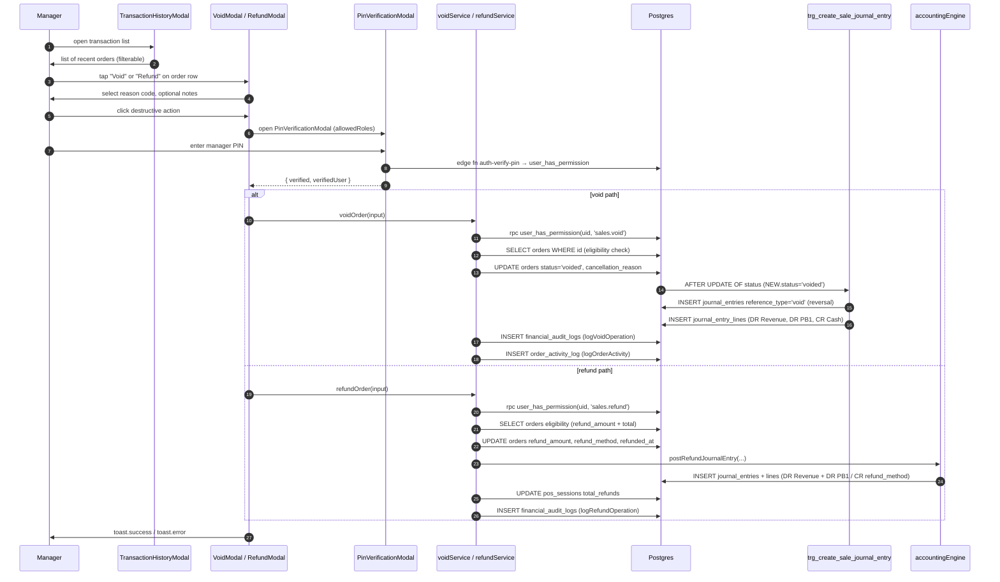

# 03 — Void & Refund

> **Last verified**: 2026-05-03
> **Modules concernés**: [POS](../04-modules/02-pos-cashier.md) · [Accounting](../04-modules/10-accounting-finance.md) · [Audit](../07-security/03-audit-trail.md)

## Trigger

A manager (or a cashier with the right permission) opens the **Transaction History** panel from the POS, picks an order, and chooses either:

- **Void** — order has not been paid yet (status `new` or `served`). Reason + manager PIN required. Reverses the original journal entry.
- **Refund** — order is already `completed`. Reason + amount + refund method + PIN required. Posts a separate refund JE (DR Revenue + DR PB1 / CR Cash or Bank).

Void and refund are mutually exclusive: a completed order cannot be voided (the void service rejects it: "Completed orders should be refunded, not voided" — `voidService.ts:77-78`).

## Diagramme séquence

## Étapes détaillées

### A. VOID flow

#### A.1. Eligibility check

- Component: `src/components/pos/modals/VoidModal.tsx:35-251`.
- Pre-flight: `canOrderBeVoided` (`voidService.ts:53-82`) refuses if:
  - Order not found
  - Already voided
  - Has refund_amount > 0
  - Status is `completed` (refund instead)

#### A.2. PIN gate

- `PinVerificationModal` opens with `allowedRoles = posConfig.voidRequiredRoles` (`VoidModal.tsx:241-247`) — typically `['manager', 'admin']`.
- The Edge Function `auth-verify-pin` validates the PIN AND that the user holds `sales.void`. The result flows back as `{ verified, verifiedUser }`.

#### A.3. Server-side void

- `voidOrder` (`voidService.ts:96-133`):
  1. `validateVoidInput(input)` — input shape check
  2. `canVoidOrder(input.voidedBy)` — calls `rpc('user_has_permission', { p_user_id, p_permission_code: 'sales.void' })` (line 33-45) — second-line defense.
  3. `applyVoid()` (lines 138-195):
     - Re-checks `canOrderBeVoided`
     - `UPDATE orders SET status='voided', cancellation_reason='[REASON_CODE] reason', cancelled_at, cancelled_by`
     - `logVoidOperation` → `financial_audit_logs`
     - `logOrderActivity` → `order_activity_log`

#### A.4. Trigger reverses the JE

- The same `trg_create_sale_journal_entry` fires on `status: new → voided` or `served → voided`.
- Function branch `v_is_reversal := TRUE` (`20260216100200_create_sale_journal_entry_function.sql:48-52`) creates a JE with:
  - `reference_type = 'void'`
  - `description = 'VOID: Order #...'`
  - DR Sales Revenue (cancel revenue)
  - DR PB1 Payable (cancel liability)
  - CR Cash/Card/QRIS (cancel asset receipt) — chosen via `NEW.payment_method`
- Important: voiding a `new` order (never paid) still triggers the reversal because the trigger condition is `NEW.status='voided' AND OLD.status IS DISTINCT FROM 'voided'`. For un-paid voids, the original sale JE was never posted (because the order never reached `completed`), so the void posts a "phantom" reversal. Migration `20260413200000_fix_void_discount_reversal.sql` and `20260414130000_fix_void_discount_by_staff_rpc.sql` address related discount-reversal edge cases — refer to those files for the current canonical reversal behaviour.

### B. REFUND flow

#### B.1. Eligibility check

- Component: `src/components/pos/modals/RefundModal.tsx` (uses `RefundFormFields` + `RefundOrderSummary`).
- Pre-flight: `canOrderBeRefunded` (`refundService.ts:71-112`) refuses if:
  - Order not found
  - Status is `voided` or `cancelled`
  - Status is not `completed` or `served`
  - Requested amount > `total - refund_amount` (multiple partial refunds allowed up to the total)

#### B.2. Apply refund

- `refundOrder` (`refundService.ts:147-193`) → `applyRefund` (`refundService.ts:198-292`):
  1. `UPDATE orders SET refund_amount = previous + new, refund_reason, refund_method, refunded_at, refunded_by`
  2. `postRefundJournalEntry` (`accountingEngine.ts`): DR 4100 (Sales Revenue, cancel revenue) + DR 2110 (PB1 Payable, cancel collected tax) / CR Cash 1110 OR Bank 1130 depending on `refund_method`
  3. `updateSessionRefundTotal(userId, refundAmount)` (lines 297-320): increments `pos_sessions.total_refunds` for the open session of `refundedBy`. Used for shift Z-report reconciliation.
  4. `logRefundOperation` → `financial_audit_logs`
  5. `logOrderActivity` → timeline event

#### B.3. JE failure handling

- If `postRefundJournalEntry` returns `{ success: false }` AND not `skipped`, the refund is still committed but a Sentry-tracked error is logged (`refundService.ts:256-258`). The order shows `refund_amount > 0` but the books are out by that amount until manual entry — flagged as known degradation in the function comment.

## Tables impactées

### Void

| Table | Opération | Notes |
|---|---|---|
| `orders` | UPDATE | `status='voided'`, `cancellation_reason='[CODE] text'`, `cancelled_at`, `cancelled_by`. Migration `20260210110005_db010_add_voided_order_status.sql` introduced the enum value. |
| `journal_entries` | INSERT (via trigger) | `reference_type='void'`, balanced reversal lines. |
| `journal_entry_lines` | INSERT × 3 | DR Revenue + DR PB1 / CR <payment account> |
| `financial_audit_logs` | INSERT | Operation type `void`, includes reason + reasonCode + voidedBy. |
| `order_activity_log` | INSERT | Timeline entry visible in Order Detail UI. |

### Refund

| Table | Opération | Notes |
|---|---|---|
| `orders` | UPDATE | `refund_amount += new`, `refund_reason`, `refund_method`, `refunded_at`, `refunded_by`. Status stays `completed`. |
| `journal_entries` | INSERT (via accountingEngine) | NOT auto-trigger — explicit call from `refundService`. `reference_type='refund'`. |
| `journal_entry_lines` | INSERT × 3 | DR Sales (4100) + DR PB1 (2110) / CR Cash (1110) or Bank/Card (1130). |
| `pos_sessions` | UPDATE | `total_refunds += amount` for cashier's open session. |
| `financial_audit_logs` | INSERT | Operation type `refund`, includes amount + method. |
| `order_activity_log` | INSERT | Timeline entry. |

## Journal entries générées

### Void of a 110.000 IDR cash sale

| Compte | DR | CR | Libellé |
|---|---|---|---|
| 4100 Sales Revenue | 100.000 | | Void sales revenue |
| 2110 PB1 Payable | 10.000 | | Void VAT payable |
| 1110 Cash on hand | | 110.000 | Void cash receipt |
| **Totals** | **110.000** | **110.000** | balanced reversal |

### Partial refund of 50.000 IDR on a 110.000 IDR card sale

Net portion = round(50.000 × 100/110) = 45.455
PB1 portion = 50.000 - 45.455 = 4.545

| Compte | DR | CR | Libellé |
|---|---|---|---|
| 4100 Sales Revenue | 45.455 | | Refund: revenue cancelled |
| 2110 PB1 Payable | 4.545 | | Refund: PB1 cancelled |
| 1130 Card clearing | | 50.000 | Refund: card chargeback |

(Exact account selection in `accountingEngine.postRefundJournalEntry` — verify implementation for cents-rounding policy.)

## Cas d'erreur & rollback

- **Permission denied**: both services double-check via `user_has_permission` RPC after PIN verification — if a stale session has the PIN cached but the user lost the role, the operation fails with `Permission denied: user does not have sales.void permission`.
- **Already voided / refunded / cancelled**: rejected by the pre-flight checks, no DB writes, toast surfaces the reason.
- **Refund amount > remaining**: `canOrderBeRefunded` returns `Refund amount exceeds remaining refundable amount (max: X IDR)` (line 105-108).
- **JE failure on refund**: refund is still applied (orders.refund_amount updates) but the JE is missing — Sentry logs the failure and the books need manual reconciliation. **NOT** the case for voids: the trigger runs in the same transaction so a JE failure rolls back the void.
- **Concurrent void + refund**: not protected by a row lock — two managers could try to void/refund simultaneously. The second operation will see updated state and fail at the pre-flight check.

## Tests pertinents

- `src/services/financial/__tests__/voidService.test.ts` — eligibility + permission paths
- `src/services/financial/__tests__/refundService.test.ts` — partial refund math
- `src/services/financial/__tests__/financialOperationService.test.ts` — `VOID_REASON_OPTIONS`, `validateVoidInput`, `validateRefundInput`
- `src/services/pos/__tests__/refundService.test.ts` — legacy `refund_pos_transaction` RPC wrapper

## Pitfalls

- **Two refund services exist.** `src/services/pos/refundService.ts` calls the legacy `rpc('refund_pos_transaction')` (migration `20260318184800_create_refund_rpc.sql`) which sets `status='cancelled'`, restocks inventory, and inserts a NEGATIVE `order_payments` row. `src/services/financial/refundService.ts` is the V2 path used by `RefundModal.tsx` — it keeps `status='completed'`, only mutates `refund_amount/refund_reason/refund_method`, and posts an explicit JE. **Don't mix them.** New code must use `services/financial/refundService.ts`.
- **Void-reversal JE for unpaid orders.** A `new`-status order voided immediately produces a JE that debits Revenue + PB1 it never recorded. This is intentional symmetry but inflates monthly debit/credit totals without affecting net P&L. Reports must filter `journal_entries.reference_type` to exclude void-of-new from sales analytics.
- **Refund vs Void semantics**: refund is a financial event (money goes out), void is a state correction (the sale never happened). Don't refund what should be voided — once `status` is `completed`, the void path is closed by design.
- **`pos_sessions.total_refunds` only updates if the refunder has an OPEN session.** A manager working without a shift session sees the JE post but the cash count won't reflect it — flagged in `updateSessionRefundTotal` lines 309-312.
- **Reason code is enforced** via `VOID_REASON_OPTIONS` / `REFUND_REASON_OPTIONS` (`financialOperationService.ts`). The reason text is concatenated as `[CODE] free-text` and stored verbatim in `cancellation_reason` / `refund_reason`. Reports key on the prefix when categorizing.
- **Audit-log foreign keys**: `financial_audit_logs.user_id` references `auth.users.id` (NOT `user_profiles`). Make sure to pass `verifiedUser.id` (auth UUID) and not the profile id.
- **The Refund and Void modals both nest a `PinVerificationModal`** — closing one while the PIN is open can leave a phantom backdrop. The components defensively guard against this (`isProcessing` flag in `VoidModal.tsx:51-57`) but tests must mount them within the same DOM portal hierarchy.
- **Migrations to know**: `20260413200000_fix_void_discount_reversal.sql` (discount-aware void), `20260414130000_fix_void_discount_by_staff_rpc.sql` (staff-attribution fix). Do not regress on these when modifying the trigger.

## Configuration touchpoints

- `pos_config.voidRequiredRoles` — array of role names allowed to enter the manager PIN. Default: `['manager','admin']`. Stored in `core_settings`.
- `pos_config.refundRequiredRoles` — same pattern for refunds.
- `permissions` table: `sales.void`, `sales.refund` codes seeded by `001_initial_schema.sql` and updated by RBAC migrations. Verify presence with the `/security-review` skill.
- `VOID_REASON_OPTIONS` / `REFUND_REASON_OPTIONS` (`financialOperationService.ts`) — drives the dropdown. Add/remove reasons here AND update reports that key on the prefix.
- `accounting_mappings`: refund JE uses mappings `SALE_REFUND_REVENUE`, `SALE_REFUND_TAX`, `SALE_CASH_OUT`/`SALE_BANK_OUT` (verify against current `accountingEngine.postRefundJournalEntry`).

## Reports & analytics impact

- **Void Report** (`/reports/sales/voids`): filter `orders.status='voided'` joined with audit log for reason.
- **Refund Report**: `orders.refund_amount > 0`, group by `refund_reason` prefix `[CODE]`.
- **Cashier Z-Report**: `pos_sessions.total_refunds` reflects refunds processed during the shift.
- **Daily Sales (net)** = SUM(orders.total) - SUM(orders.refund_amount) for completed orders + EXCLUDE voided orders entirely.
- **PB1 Report**: voids and refunds REDUCE the period's PB1 collected. The DJP report (if enabled) must handle reversed JEs.

## Observability

- All void/refund operations write to `financial_audit_logs` and `order_activity_log` — full timeline reconstructable.
- Sentry tags: failures emit `operation_type` and `order_id`. Permission-denied errors are intentional, not alerts.
- The order detail page renders the timeline showing `created → sent_to_kitchen → completed → refunded` with timestamps and actor name.
- Realtime: voided orders trigger a `lan-hub` broadcast so KDS terminals can flag the order as voided (the kitchen team sees a strikethrough or red banner).

## Related flows

- [01 — POS Sale Cash](./01-pos-sale-cash.md) — the original sale being reversed.
- [02 — POS Sale Split Payment](./02-pos-sale-split-payment.md) — voiding split orders has the cash-account-fallback caveat.
- [05 — Stock Opname](./05-stock-opname.md) — refund via legacy `refund_pos_transaction` restocks inventory; the V2 refund path does NOT (refund is financial only — physical goods returned require a separate stock_movement).
- [10 — End of Day](./10-end-of-day.md) — Z-report includes voids and refunds in the cashier reconciliation.

## Reason code reference

`VOID_REASON_OPTIONS` (`financialOperationService.ts`):
- `customer_request` — Customer changed mind
- `wrong_order` — Cashier mistake
- `kitchen_error` — Wrong items prepared
- `stock_unavailable` — Cannot fulfill
- `system_error` — Technical issue
- `other` — Free-text required

`REFUND_REASON_OPTIONS` typically includes:
- `defective_product`
- `wrong_item_received`
- `customer_dissatisfied`
- `pricing_error`
- `gesture_commercial` (goodwill)
- `other`

The codes prefix the stored reason text (`[CODE] free-text`) so reports can categorize without parsing free text.

## Decision matrix — Void vs Refund

| Order status | Paid? | Action |
|---|---|---|
| `new` | No | Void |
| `served` (kitchen-sent, awaiting payment) | No | Void |
| `completed` | Yes | Refund |
| `voided` | n/a | Neither (terminal) |
| `cancelled` (legacy refund) | Yes (refunded) | Neither (terminal) |
| `completed` with `refund_amount > 0` (partial refund) | Yes | Additional refund up to `total - refund_amount` |

A common operator mistake is trying to void a completed order — the UI should hide the Void button when status is `completed` (not always enforced; the service rejects it server-side).

## Performance budget

- Eligibility check (`canOrderBeVoided` / `canOrderBeRefunded`): < 100ms (single SELECT).
- Permission RPC (`user_has_permission`): < 50ms (cached per session via STABLE).
- Void/refund commit: < 500ms p95 including audit log write and JE post.
- PIN verification via Edge Function: < 800ms (network + bcrypt comparison).
