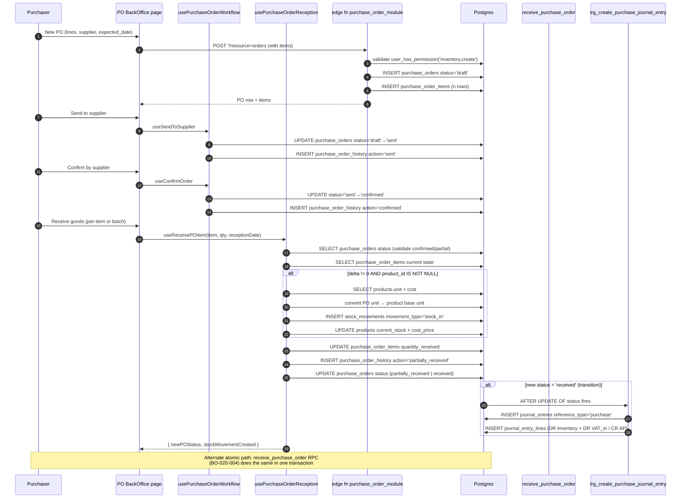

# 04 — Purchase Order Cycle (Draft → Received)

> **Last verified**: 2026-05-03
> **Modules concernés**: [Purchasing](../04-modules/07-purchasing-suppliers.md) · [Inventory](../04-modules/06-inventory-stock.md) · [Accounting](../04-modules/10-accounting-finance.md)

## Trigger

A purchaser drafts a PO in BackOffice (`/purchasing/orders/new`), submits it to the supplier, and later receives goods (full or partial). When all items are fully received, the PO transitions to `received` and a Postgres trigger automatically posts the inventory + AP journal entry. The reception itself is an atomic operation through the `receive_purchase_order` RPC.

## Diagramme séquence



## Étapes détaillées

### 1. PO creation (Draft)

- UI: page under `src/pages/purchasing/` (PO form), uses hooks from `src/hooks/purchasing/`.
- Route: `EF purchase_order_module` `POST ?resource=orders` (`supabase/functions/purchase_order_module/index.ts`).
- Permission gate (Edge Function lines 49-65): `user_has_permission(uid, 'inventory.create')`.
- Inserts `purchase_orders` row with `status='draft'`, `po_number` generated by trigger (similar pattern to `tr_generate_po_number`).
- Inserts `purchase_order_items` with `quantity`, `unit_price`, `unit` (per item), `product_id` nullable for ad-hoc lines.
- `expense_type` field on the PO (e.g. `ingredients`, `raw_materials`, `consumables`, `services`) determines which account the future JE will debit.

### 2. Workflow transitions (Draft → Sent → Confirmed)

- Hook: `useSendToSupplier` (`usePurchaseOrderWorkflow.ts:134-189`).
  - Pre-flight: `getValidTransitions(currentStatus)` (lines 57-76) — refuses anything not declared in the state machine.
  - `UPDATE purchase_orders SET status='sent', updated_at`.
  - `logPOHistory({ actionType: 'sent', metadata: { sent_date } })` writes to `purchase_order_history`.
- Hook: `useConfirmOrder` (`usePurchaseOrderWorkflow.ts:199-254`) — same pattern, status `'sent' | 'draft' → 'confirmed'`.
- Hook: `useCancelOrder` (`usePurchaseOrderWorkflow.ts:264-322`) — terminal cancel from `draft`/`sent`.

State machine (full):

```
draft ─send→ sent ─confirm→ confirmed ─receive→ partially_received ─receive→ received
  │            │                                                                   │
  │            └─cancel→ cancelled                                                 │
  └─cancel→ cancelled                                                              ✓
modified ─confirm→ confirmed
```

`getValidTransitions` is the source of truth — never bypass it.

### 3. Reception (per-item)

- Hook: `useReceivePOItem` (`usePurchaseOrderReception.ts:93-282`).
- Steps:
  1. **Status guard**: `canReceiveItems(status)` accepts only `confirmed` or `partially_received` (line 75-77).
  2. **Item snapshot**: SELECT current `quantity_received` and `unit_price`.
  3. **Delta computation**: `delta = quantityReceived - previousReceived`. Negative deltas are allowed for corrections.
  4. **Unit conversion** ([UNIT-FIX] lines 134-201): the PO line may use a different unit than the product's base unit (e.g. PO in kg, product tracked in g). `getUnitConversionFactor(poUnit, productBaseUnit)` returns the multiplier; `deltaInProductUnit = delta * factor`.
  5. **Stock movement INSERT** with `movement_type='stock_in'`, `unit_cost = unit_price / factor`.
  6. **Product update**: `current_stock += deltaInProductUnit`, `cost_price = costPerBaseUnit` (auto-update of moving cost).
  7. **Item update**: `quantity_received = quantityReceived`.
  8. **History**: `logPOHistory({ actionType: 'partially_received', metadata })`.
  9. **PO status recompute**: `calculateReceptionStatus(allItems)` (line 55-62) — `received` if every line is fully received, else `partially_received`. Sets `actual_delivery_date` when the PO transitions to `received`.

### 4. Atomic batch reception (BO-020-004)

- RPC: `receive_purchase_order(p_po_id, p_items, p_receiver_id)` (`supabase/migrations/20260503002703_create_receive_purchase_order_rpc.sql`).
- This RPC replaces the V2 hook's 6+ sequential calls with a single SECURITY DEFINER transaction. Any failure rolls back ALL prior INSERT/UPDATEs INCLUDING the JE created by the trigger (the trigger fires inside the same transaction).
- Permission: `purchasing.receive`.
- Returns `{ po_id, new_status, total_received_amount, items_received_count, journal_entry_created }`.
- This is the path the V3 reception dialog will use; V2 still wires the per-item hook.

### 5. Trigger posts the JE

- Trigger: `trg_create_purchase_journal_entry` (`supabase/migrations/20260216100500_trigger_purchase_journal_entry.sql:17-21`) — `AFTER UPDATE OF status` on `purchase_orders` when `NEW.status='received' AND OLD.status IS DISTINCT FROM 'received'`.
- Function: `create_purchase_journal_entry()` (`supabase/migrations/20260216100400_create_purchase_journal_entry_function.sql:14-189`) chooses the debit account by `expense_type`:
  - `ingredients` / `raw_materials` → 1300 Inventory
  - else → 5100 COGS / Operating expense
- VAT input (1400) is posted only if `tax_amount > 0`.
- Credit goes to 2100 AP unless `payment_status = 'paid'` already (then CR 1110 Cash).
- The migration `20260330600000_fix_accounting_p0_audit.sql` (referenced from `receive_purchase_order` migration header) tightened account mapping — review when troubleshooting JE.

## Tables impactées

| Table | Opération | Notes |
|---|---|---|
| `purchase_orders` | INSERT (draft) then UPDATE × N (status transitions) | `po_number` auto-generated; `actual_delivery_date` set on full reception. |
| `purchase_order_items` | INSERT (n rows) then UPDATE (quantity_received per reception) | `unit` is per-line and may differ from product base unit. |
| `purchase_order_history` | INSERT × N | One row per workflow transition + one per reception event. Visible in PO detail page. |
| `stock_movements` | INSERT (one per item received with delta != 0) | `movement_type='stock_in'`, `reference_type='purchase_order'`, `unit_cost` carries the actual landed cost. |
| `products` | UPDATE | `current_stock += deltaInProductUnit`, `cost_price = unit_price / conversionFactor` (rolling cost from latest reception). |
| `journal_entries` | INSERT (1 row via trigger) | `reference_type='purchase'`, `entry_date = actual_delivery_date OR order_date`. |
| `journal_entry_lines` | INSERT × 2 or 3 | DR Inventory or Expense + DR VAT input (if tax_amount > 0) / CR AP or Cash. |
| `suppliers.last_order_date` | UPDATE (if wired by trigger — verify) | Some installs maintain supplier KPIs. |

## Journal entries générées

PO with subtotal 1.000.000 IDR + VAT 100.000 IDR (total 1.100.000), expense_type `ingredients`, on credit:

| Compte | DR | CR | Libellé |
|---|---|---|---|
| 1300 Inventory | 1.000.000 | | Goods received |
| 1400 VAT Input (PPN Masukan) | 100.000 | | VAT input |
| 2100 Accounts Payable | | 1.100.000 | Accounts payable |
| **Totals** | **1.100.000** | **1.100.000** | balanced |

Same PO marked `payment_status='paid'` upfront (rare — typical for cash-on-delivery suppliers):

| Compte | DR | CR | Libellé |
|---|---|---|---|
| 1300 Inventory | 1.000.000 | | Goods received |
| 1400 VAT Input | 100.000 | | VAT input |
| 1110 Cash on hand | | 1.100.000 | Cash payment |

For services / expenses (e.g. `expense_type='services'`), the debit goes to 5100 (COGS) or 6xxx accounts instead of 1300.

## Cas d'erreur & rollback

- **Invalid status transition**: `useSendToSupplier`/`useConfirmOrder`/`useReceivePOItem` throw `Error('INVALID_TRANSITION')` or `'INVALID_PO_STATUS'`. Caught by the calling component and surfaced as a toast.
- **Reception with `product_id IS NULL`**: stock movement step is skipped (`usePurchaseOrderReception.ts:134`) but the line still records `quantity_received`. The JE will still post on `received` because it relies on PO totals, not on stock movements.
- **Unit conversion missing**: `getUnitConversionFactor` returns 1 by default — silent fallback. Missing entries in the conversion table cause stock to inflate (e.g. 5 kg recorded as 5 g if mismatch).
- **JE function missing accounts**: `RAISE NOTICE` then `RETURN NEW` (lines 89-93). PO becomes `received`, no JE — manual fix required. The retry tool is `/accounting-audit`.
- **Atomic RPC failures**: any `RAISE EXCEPTION` rolls back everything within the call, including the JE. The frontend never sees a half-applied state when using `receive_purchase_order`.
- **Per-item hook failures (the V2 path)**: writes are sequential. A failure at step 3 (stock_movements INSERT) leaves `purchase_order_items.quantity_received` un-updated and no JE — but if a previous successful reception had already incremented `products.current_stock`, that state survives. This is the gap that `receive_purchase_order` closes.
- **Idempotency**: receiving the same delta twice would double-count stock; the hook does NOT track an idempotency key. UI must disable the submit button while in flight (handled by `useMutation`'s `isPending`).
- **PO modification post-confirmation**: the `modified` status exists in the workflow but is rarely used in practice — modifying an already-confirmed PO usually means cancel + recreate.

## Tests pertinents

- `src/hooks/purchasing/__tests__/usePurchaseOrderWorkflow.test.ts` — state transitions
- `src/hooks/purchasing/__tests__/usePurchaseOrderReception.test.ts` — delta + unit conversion
- `src/services/purchasing/poImportExportService.test.ts` (if present) — Excel import/export
- DB-level RPC: covered indirectly through V3 BO-020-004 story tests — see `_bmad/output/implementation-artifacts/`.

## Pitfalls

- **Stock_movements trigger does NOT post a JE for `stock_in` movement type.** The journal entry comes from the PO status trigger, not the stock movement trigger (`create_stock_movement_journal_entry` only handles `waste`, `production_*`, `adjustment_*` — see `20260402110000_create_stock_movement_journal_entry_trigger.sql:33`). Posting a stock_in JE manually would double the inventory debit.
- **`unit_price` on `purchase_order_items` is in the PO unit, not the product base unit.** Consumers of `unit_price` for valuation must convert. The hook stores `unit_cost = unit_price * (1 / conversionFactor)` on the stock movement to land in product-unit terms.
- **`actual_delivery_date` is only set when fully received.** Partial receptions never populate this field. Reports filtering by delivery date must use `MAX(stock_movements.created_at)` to capture partial flows.
- **`expense_type` is mandatory for correct JE routing.** A PO without `expense_type` defaults to inventory if the inventory account is found, else expense — silently. UI should require this field on draft creation.
- **Cancelling a `received` PO is impossible.** State machine returns `[]` from `getValidTransitions('received')`. To "undo" a reception, post a manual reverse stock_movement and a manual JE.
- **PO history is best-effort**: `logPOHistory` swallows errors (`usePurchaseOrderWorkflow.ts:111-114`). A successful status update with a missing history row is a known data-quality risk.
- **Edge Function vs direct hooks**: PO creation goes through `purchase_order_module` Edge Function (permission-gated). Reception bypasses the Edge Function and goes direct via Supabase client (the hook holds the JWT). Both paths exercise RLS, but only the Edge Function explicitly checks `user_has_permission`. New PO mutations should follow the Edge Function pattern.
- **The trigger reads `tax_amount` from PO row**, not derived from `subtotal * tax_rate`. If `tax_amount` is null, it falls back to `subtotal * tax_rate`. PO import scripts must set `tax_amount` explicitly to avoid drift.
- **Migration `20260212190000_fix_purchase_orders_tax_rate_default.sql`** changed the default `tax_rate` — verify when seeding test data.

## Configuration touchpoints

- `accounting_mappings`: codes referenced by the purchase trigger include the inventory account (1300), VAT input (1400), AP (2100), Cash (1110), COGS (5100). The function falls back to ILIKE name patterns if codes are missing.
- `unit_conversions` table (or hardcoded in `src/utils/unitConversion.ts`): drives PO → product unit conversion at reception. Missing entries cause a 1.0 fallback (silent drift).
- `core_settings`: `purchasing.default_payment_terms_days` (used for AR aging on the supplier side, mirrors B2B).
- `permissions` table: `inventory.create`, `inventory.view`, `purchasing.receive` (used by the BO-020-004 atomic RPC).
- Edge Function env: `purchase_order_module` requires `SUPABASE_URL`, `SUPABASE_ANON_KEY`, `SUPABASE_SERVICE_ROLE_KEY`.

## Reports & analytics impact

- **PO Status Report**: `/reports/purchasing/orders` filters by `status` enum.
- **Supplier Performance Report**: `actual_delivery_date - expected_delivery_date` for on-time delivery; `quantity_received - quantity` for fill rate.
- **Inventory Valuation Report**: SUM(`products.current_stock * cost_price`). PO reception updates `cost_price` to the most recent landed cost (a moving-cost approximation, NOT FIFO/LIFO).
- **AP Aging Report**: filters `purchase_orders.payment_status IN ('unpaid','partial')` and computes `days_overdue` from `expected_payment_date`.
- **Cash Disbursement Report**: `journal_entries.reference_type='purchase_payment'` aggregates payments to suppliers.

## Observability

- `purchase_order_history` is the canonical audit timeline — surfaces in the PO detail UI as a chronological list.
- Sentry: reception failures emit the product_id and PO id for triage.
- Realtime: `purchase-orders` channel emits row-level changes — used by the dashboard to refresh counts without polling.
- Trigger debug: missing `accounting_mappings` produces `RAISE NOTICE` rows visible in Supabase logs (`/logs/database`).

## Related flows

- [05 — Stock Opname](./05-stock-opname.md) — same `accounting_mappings` patterns; opname handles the inverse (loss/gain), purchasing handles the inflow.
- [06 — B2B Order to Invoice](./06-b2b-order-to-invoice.md) — mirror of the AR side; PO is the AP side.
- [10 — End of Day](./10-end-of-day.md) — daily AP movement is in the Z-report's accounting summary.

## Status enum reference

```
purchase_orders.status:
  draft               — editable, not yet sent
  sent                — communicated to supplier, awaiting confirmation
  confirmed           — supplier acknowledged, ready to receive
  partially_received  — at least one line received, not all complete
  received            — all lines fully received, JE posted
  cancelled           — terminated before completion
  modified            — supplier proposed changes, requires re-confirm
```

Transitions enforced by `getValidTransitions` (`usePurchaseOrderWorkflow.ts:57-76`). The trigger `trg_create_purchase_journal_entry` only fires on `→ received`.

## Edge cases — reception math

| Scenario | quantity | quantity_received before | New input | delta | Stock impact | History row |
|---|---|---|---|---|---|---|
| First reception (full) | 10 | 0 | 10 | +10 | +10 in product unit | "Réception de 10 unité(s) de X" |
| First reception (partial) | 10 | 0 | 6 | +6 | +6 | "Réception de 6 unité(s) de X" |
| Second reception (complete remaining) | 10 | 6 | 10 | +4 | +4 | "Réception de 4 unité(s) de X" |
| Adjustment downward (correction) | 10 | 6 | 4 | -2 | -2 | "Ajustement réception: X (6 → 4)" |
| Already-fully-received re-entry | 10 | 10 | 10 | 0 | none | none (delta=0) |
| Receipt > ordered | 10 | 0 | 12 | +12 | +12 | "Réception de 12 unité(s)" — overage allowed, may flag in QC review |

## Performance budget

- PO list page: < 1s for 200 POs (paginated).
- Reception per item via `useReceivePOItem`: ~200-400ms (5 sequential supabase calls in V2 path).
- Reception via `receive_purchase_order` RPC (V3 path): single round-trip, < 200ms even for 50 items.
- JE post in trigger: < 50ms typical; depends on `accounts` lookup.
