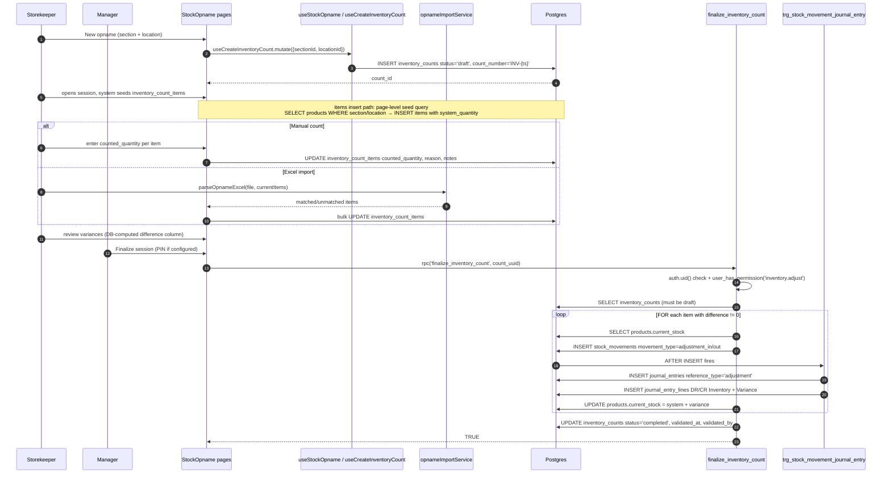

# 05 — Stock Opname (Physical Count → Adjustment)

> **Last verified**: 2026-05-03
> **Modules concernés**: [Inventory](../04-modules/06-inventory-stock.md) · [Accounting](../04-modules/10-accounting-finance.md) · [Audit](../07-security/03-audit-trail.md)

## Trigger

A storekeeper opens a new opname session for a section (and optionally a location), counts every product physically, enters the actual quantities (manually or via Excel import), then a manager finalizes the session. Finalization computes per-product variances, creates compensating `stock_movements` (`adjustment_in` / `adjustment_out`), updates `products.current_stock`, and the stock-movement trigger posts the JE for each adjustment.

## Diagramme séquence



## Étapes détaillées

### 1. Open a new session

- Hook: `useCreateInventoryCount` (`src/hooks/inventory/useStockOpname.ts:36-65`).
- INSERT into `inventory_counts` with `count_number = 'INV-{Date.now()}'`, `status='draft'`, `section_id`, `location_id`.
- The list view re-fetches via `useInventoryCounts` (lines 15-29) which selects sessions with their section + location FK joins.

### 2. Seed items from products in scope

- The opname item rows are NOT created by the hook above. The page-level `useStockOpname` (`src/pages/inventory/useStockOpname.ts`, distinct from the inventory hook) loads the products belonging to the section/location and inserts `inventory_count_items` with:
  - `system_quantity` = current `products.current_stock` snapshot (or location-aware view)
  - `counted_quantity` = NULL until entered
  - `unit_cost` = current `products.cost_price` (used later for valuation in JE)
  - `difference` = computed column (or app-side `counted - system`)
- Section/location filter ensures distributed teams can count physical zones in parallel.

### 3. Counting

- **Manual entry**: storekeeper inputs `counted_quantity` per row in the UI grid. Optionally selects a `reason` (`breakage`, `expired`, `theft`, `other` — added by migration `20260320104000_add_reason_to_inventory_count_items.sql`) and free-text `notes`.
- **Excel import**: `parseOpnameExcel` (`src/services/inventory/opnameImportService.ts:51-117`):
  - Reads `SKU`, `Actual Stock`, `Reason`, `Notes` columns.
  - Matches by SKU, returns `{ updatedItems, errors, stats }`.
  - The page applies a bulk UPDATE on matched items.
- Template generator: `exportOpnameTemplate` (lines 18-46) lets the user download a pre-filled spreadsheet to take to the warehouse.

### 4. Review variances

- The UI shows variance = `counted - system` per row (DB column `difference` is set on UPDATE; some installs compute it client-side).
- Aggregates: total positive variance (gain), total negative variance (loss), valuation impact at `unit_cost`.
- The session can be saved as draft repeatedly; only finalization triggers stock changes.

### 5. Finalize (Submit)

- RPC: `finalize_inventory_count(count_uuid)` (`supabase/migrations/20260208120000_fix_finalize_inventory_count.sql`).
- Security:
  - `auth.uid()` (cannot be spoofed) used as caller identity.
  - `user_has_permission(profile_id, 'inventory.adjust')` enforced (lines 42-44).
  - Session must be in `draft` status (lines 55-57).
- Loop over items where `counted_quantity IS NOT NULL AND difference != 0` (lines 60-67):
  - Generate `movement_id = 'MV-{epoch}-{4-char hash}'`.
  - INSERT `stock_movements` with:
    - `movement_type = 'adjustment_in'` if variance > 0 else `'adjustment_out'`
    - `quantity = ABS(variance)`
    - `stock_before = current_stock`, `stock_after = current_stock + variance`
    - `reference_type = 'inventory_count'`, `reference_id = count_uuid::text`
    - `reason = 'Stock Opname {count_number}'`
    - `staff_id = v_user_profile_id`
  - UPDATE `products.current_stock = current + variance`.
- Final UPDATE `inventory_counts` to `completed`, `validated_at = NOW()`, `validated_by = profile_id`.
- Returns `TRUE`.

### 6. JE auto-posted by trigger

- Trigger: `trg_stock_movement_journal_entry` (`supabase/migrations/20260402110000_create_stock_movement_journal_entry_trigger.sql:199-202`) — `AFTER INSERT ON stock_movements`.
- Function: `create_stock_movement_journal_entry()` handles `adjustment_in` and `adjustment_out` (lines 33-90):
  - `adjustment_in` → `mapping_code = 'ADJUSTMENT_IN'` → DR Inventory (1300) / CR Adjustment Gain (4200)
  - `adjustment_out` → `mapping_code = 'ADJUSTMENT_OUT'` → DR Adjustment Loss (6300) / CR Inventory (1300)
- `v_amount = quantity * unit_cost`. Skipped silently if `unit_cost IS NULL OR 0` (line 38-40) — opname rows MUST seed `unit_cost`.
- Idempotency check (line 119): one JE per `stock_movements.id`.
- Fiscal period guard (line 125): if the date falls in a closed period, the JE is skipped and a `RAISE WARNING` surfaces.

## Tables impactées

| Table | Opération | Notes |
|---|---|---|
| `inventory_counts` | INSERT (draft) then UPDATE (completed on finalize) | `status` enum: `draft → completed`. `validated_by` = profile id (NOT auth uid). |
| `inventory_count_items` | INSERT (one per product in scope) then UPDATE (counted_quantity, reason, notes) | `difference` may be a generated column or app-computed; `unit_cost` snapshot used for JE valuation. |
| `stock_movements` | INSERT (one per varying item) | Two `movement_type` values exercised: `adjustment_in`, `adjustment_out`. `reference_type='inventory_count'`. |
| `products` | UPDATE (current_stock per varying product) | `current_stock = system_quantity + variance`. Cost is NOT changed by opname (cost still owned by the latest PO reception). |
| `journal_entries` | INSERT (one per stock_movement, via trigger) | `reference_type='adjustment'`, `entry_date = stock_movement.created_at::date`. |
| `journal_entry_lines` | INSERT × 2 per JE | DR/CR pair valued at `quantity * unit_cost`. |

## Journal entries générées

Example: opname session reveals 5 units of Product A missing (cost 8.000 IDR/unit) and 2 extra units of Product B (cost 12.000 IDR/unit).

### Adjustment Out (loss) — Product A

| Compte | DR | CR | Libellé |
|---|---|---|---|
| 6300 Stock Adjustment Loss | 40.000 | | Stock Adjustment Out: count correction |
| 1300 Inventory | | 40.000 | Reduce inventory |

### Adjustment In (gain) — Product B

| Compte | DR | CR | Libellé |
|---|---|---|---|
| 1300 Inventory | 24.000 | | Increase inventory |
| 4200 Adjustment Gain | | 24.000 | Stock Adjustment In: count correction |

Each variance row generates ITS OWN JE (one stock_movement = one JE). For a session with 30 varying items, expect 30 JEs. The Inventory Adjustment Report aggregates by `inventory_counts.id` for cleaner readouts.

The exact account codes come from `accounting_mappings` (`mapping_code IN ('ADJUSTMENT_IN','ADJUSTMENT_OUT')`). If the mapping is missing, the trigger logs `RAISE NOTICE 'Missing account mappings for ...'` and skips the JE.

## Cas d'erreur & rollback

- **Permission denied at finalize**: `RAISE EXCEPTION 'Permission denied: inventory.adjust required'` (`finalize_inventory_count` line 43). The session stays in `draft`, no movements created.
- **Session already finalized**: `RAISE EXCEPTION 'Inventory count is not in draft status'` (line 55-57). Idempotent in practice — operators see a clear error.
- **Item with `counted_quantity IS NULL`**: skipped silently (line 64). Forces operators to count every item or explicitly enter `0`.
- **Item with `difference = 0`**: skipped — no JE noise from products that match.
- **Missing `unit_cost`**: trigger skips JE (`create_stock_movement_journal_entry` line 38-40). The stock_movement is still created; cash position drifts. Mitigation: enforce non-null `unit_cost` at item seeding time.
- **Closed fiscal period**: trigger refuses to post (line 125). Stock change still applies. Operators must reopen the period or post the JE manually in the next period.
- **Mid-loop failure**: the loop is inside the SQL function; any RAISE EXCEPTION rolls back ALL inserts and updates, leaving the session in `draft`. Safe to retry.
- **Concurrent counts on same product**: not protected. If two simultaneous opname sessions adjust the same product, the second overwrite wins on `products.current_stock`. UI should warn when a product is in another draft session.

## Tests pertinents

- `src/hooks/inventory/__tests__/useStockOpname.test.ts` (if present) — CRUD on sessions
- `src/services/inventory/__tests__/opnameImportService.test.ts` — Excel parser
- DB-level finalize RPC: covered indirectly via integration tests on the live Supabase project. The RPC signature changed in `20260208120000_*` (drops the spoofable `(UUID, UUID)` form) and again in `20260210110001_db006_*` — verify which form your branch ships.

## Pitfalls

- **DO NOT mutate `products.current_stock` outside `finalize_inventory_count` during an open session.** A POS sale completing mid-count will create a stock_movement that the opname doesn't see — the next finalize will reverse the sale's stock impact. Best practice: freeze the product (or section) for new sales while counting, or keep counts very short.
- **`reference_type='inventory_count'` vs `'opname'`**: the codebase uses `inventory_count` consistently. Reports filtering on a different string will miss adjustments.
- **`reason` is application-level only.** It is stored in `inventory_count_items.reason` and copied to the stock_movement description, but the JE bucket (Loss vs Gain) is derived solely from the SIGN of the variance. A "theft" loss and a "breakage" loss go to the same account 6300.
- **Two services with similar names exist**: `src/services/inventory/opnameImportService.ts` (Excel I/O) vs `src/services/inventory/inventoryAlerts.ts` (low-stock alerts). Don't conflate.
- **`validated_by` is the user_profiles.id, not auth.users.id.** Reports joining on auth must go through `user_profiles.auth_user_id`.
- **Negative `current_stock`**: not blocked. If the system snapshot is wrong (e.g. stock was already negative), the variance might push it further negative. UI surfaces a warning but does not refuse.
- **Per-section opname is the recommended cadence.** Whole-store counts often time out the UI grid (>1000 rows). The flow supports it but the UX struggles past ~500 items per session.
- **Inventory Adjustment Report** under `/reports/inventory` aggregates these JEs — it relies on `journal_entries.reference_type = 'adjustment'`. If a future migration changes the trigger's `v_ref_type`, the report breaks silently.
- **Migration 015_security_fixes.sql restricts inventory_count_items RLS** to authenticated users with explicit policies. New tooling that bypasses the React app must hold an authenticated JWT.
- **Cost basis frozen at count time**: the JE values use `unit_cost` snapshotted at item creation, not the live `products.cost_price`. If cost has changed since the count started, the JE understates/overstates by the delta.

## Configuration touchpoints

- `accounting_mappings`: `ADJUSTMENT_IN` (debit Inventory 1300 / credit Adjustment Gain 4200) and `ADJUSTMENT_OUT` (debit Adjustment Loss 6300 / credit Inventory 1300). Both must exist with `is_active=true` and matching `mapping_type` of `'debit'` / `'credit'`.
- `permissions` table: `inventory.adjust` is required by `finalize_inventory_count`. Verify after RBAC migrations.
- Fiscal period table (referenced by trigger): `closed_periods` (or similar — verify the migration that introduced the guard `20260402120000_add_fiscal_period_guard_to_journal_triggers.sql`). When a period is closed, the trigger refuses to post.
- `core_settings`: opname session naming pattern, default reasons, allowed variance thresholds (configurable to flag suspicious counts).

## Reports & analytics impact

- **Stock Opname Report**: lists sessions, total variance valuation, validated-by user.
- **Inventory Adjustment Report** (`/reports/inventory/adjustments`): groups stock_movements by `reference_type='inventory_count'` and date.
- **Variance by Reason**: pivots `inventory_count_items.reason` (breakage / theft / expired / other) — useful for shrinkage analysis.
- **P&L impact**: account 6300 (Adjustment Loss) hits operating expenses; 4200 (Adjustment Gain) hits other income. Materially distorts margins if opname uncovers large discrepancies.
- **Inventory Valuation Report**: post-finalize valuation may shift significantly — schedule comparison snapshots before and after each opname.

## Observability

- Each finalize emits N stock_movements + N JEs in the same transaction — Supabase logs show clusters of inserts.
- The opname UI shows a per-row colored badge (green = match, red = variance) before submission.
- `inventory_counts.notes` is free-text — operators record context (e.g. "monthly count after Ramadan inventory reset").
- `validated_at` provides an audit trail of who approved the variances; combined with `created_by` it traces the whole count chain.
- Realtime: `inventory_counts` table is broadcast on the `inventory` channel — dashboards refresh automatically.

## Related flows

- [04 — Purchase Order Cycle](./04-purchase-order-cycle.md) — PO reception is the inverse (stock_in increases inventory + creates AP).
- [09 — Promotion Evaluation](./09-promotion-evaluation.md) — opname does not interact with promotions but variance reports may correlate with promotional periods (high-velocity items more prone to count errors).
- [03 — Void & Refund](./03-void-refund.md) — legacy `refund_pos_transaction` restocks via `restock` movement_type; that path bypasses opname JE rules entirely.

## Schema cross-reference

| Component | Reads | Writes |
|---|---|---|
| `useCreateInventoryCount` | input params | `inventory_counts` (1 row, draft) |
| Page-level seed | `products`, `sections`, `stock_locations` | `inventory_count_items` (n rows) |
| Manual UI grid | `inventory_count_items` | `inventory_count_items` (counted_quantity, reason, notes) |
| `parseOpnameExcel` | uploaded file | none directly (returns parsed rows) |
| `finalize_inventory_count` RPC | `auth.uid`, `user_profiles`, `inventory_counts`, `inventory_count_items`, `products` | `stock_movements`, `products.current_stock`, `inventory_counts` (status, validated_at) |
| Trigger `trg_stock_movement_journal_entry` | `accounting_mappings`, `stock_movements` | `journal_entries`, `journal_entry_lines` |

## Status enum reference

```
inventory_counts.status:
  draft     — being counted, items can be edited
  completed — finalized, no further edits, JEs posted
  cancelled — abandoned (rare; some installs add this state)
```

Transitions:
- `draft → completed` via `finalize_inventory_count` (atomic).
- `draft → cancelled` via direct UPDATE (no JE impact, no stock impact).
- `completed → *` is forbidden — to "redo" a count, create a new session.

## Performance budget

- Open session + seed 500 items: target < 3s. Bottleneck is the bulk INSERT of `inventory_count_items` plus the products query that filters by section.
- Excel import: ~50ms per row (parsing) + bulk UPDATE ~100ms total.
- Finalize 500-item session with 50 variances: target < 5s. Each variance row triggers an INSERT + UPDATE + JE — the JE post is the dominant cost (~30ms each for `accounting_mappings` lookup + `journal_entries` + 2 lines).
- Realtime broadcast: minimal — only the parent `inventory_counts` row is broadcast on status change; item updates are batched.

## Worked example — month-end bakery section count

Section: Bakery. 12 SKUs counted on 2026-04-30 evening. System vs counted:

| SKU | system_quantity | counted_quantity | difference | unit_cost | Variance value |
|---|---|---|---|---|---|
| BRD-001 baguette | 18 | 16 | -2 | 5.000 | -10.000 |
| BRD-002 sourdough | 8 | 8 | 0 | 12.000 | 0 (skipped) |
| PAS-001 croissant | 30 | 28 | -2 | 6.500 | -13.000 |
| PAS-002 pain choc | 25 | 25 | 0 | 7.000 | 0 (skipped) |
| PAS-003 escargot | 12 | 14 | +2 | 7.500 | +15.000 |
| ... 7 more matching | | | | | |

Finalize processes the 3 varying rows:
- 2 stock_movements with `adjustment_out` (BRD-001 = 2 units lost, PAS-001 = 2 units lost)
- 1 stock_movement with `adjustment_in` (PAS-003 = 2 units found)
- 3 JEs created (one per movement), each balanced

Net P&L impact: -10.000 - 13.000 + 15.000 = -8.000 IDR (small loss). Most likely cause: morning rush over-counted by one batch. Operator notes "Likely a counting error during morning rush" in the session notes.

Account ending balances after finalize:
- 1300 Inventory: -8.000 net (debit 15k, credit 23k from the three JEs)
- 6300 Adjustment Loss: +23.000 (debit)
- 4200 Adjustment Gain: -15.000 (credit)
- Net P&L: 23.000 - 15.000 = 8.000 IDR loss

The Inventory Adjustment Report renders this as a single grouped row "INV-1714521600 Bakery section — Net loss 8.000 IDR (3 items adjusted)".
