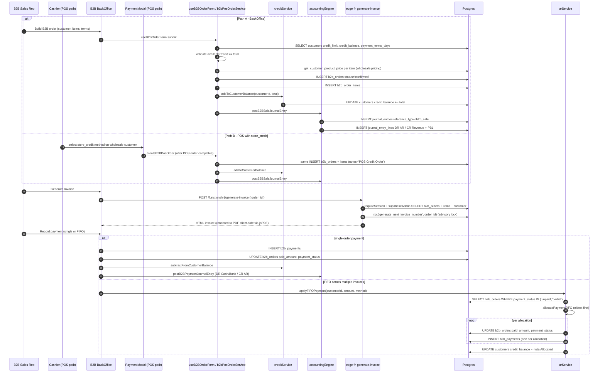

# 06 — B2B Order to Invoice (Order → Delivery → Invoice → Payment)

> **Last verified**: 2026-05-03
> **Modules concernés**: [B2B Wholesale](../04-modules/04-b2b-wholesale.md) · [Customers](../04-modules/05-customers-loyalty.md) · [Accounting](../04-modules/10-accounting-finance.md)

## Trigger

A B2B sales rep (or a wholesale customer paying with `store_credit` at the POS) creates an order for a wholesale customer. The order is confirmed, fulfilled (delivery), an invoice PDF is generated by the `generate-invoice` Edge Function, and later one or more payments are recorded — possibly across multiple invoices via FIFO allocation. Each step posts its own journal entry through `accountingEngine.ts` (NOT through database triggers).

## Diagramme séquence

## Étapes détaillées

### 1. Order creation — BackOffice path

- Hook: `useB2BOrderForm` (`src/hooks/b2b/useB2BOrderForm.ts`).
- Pricing: each line resolves through `get_customer_product_price(product_id, customerCategorySlug)` (DB function — see `CLAUDE.md` Key DB Functions). For wholesale customers this returns the `wholesale_price` (or category-specific price from `product_category_prices`).
- Credit gate: customer must have `credit_status='active'` and `credit_limit - credit_balance >= total`.
- INSERT `b2b_orders`:
  - `status='confirmed'` (skips draft for the simple path; UI may also support draft)
  - `payment_status='unpaid'`, `payment_method='credit'`
  - `tax_rate=0.10`, `tax_amount = round(total * 10 / 110)` (PB1 included like POS)
  - `delivery_date = order_date + customer.payment_terms_days OR settings.b2b.default_payment_terms_days (30)` (re-purposed as due date)
  - `order_number = 'B2B-{NNNNN}-{XXX}'` with random 3-char suffix to avoid races (`b2bPosOrderService.ts:38-58`)
- INSERT `b2b_order_items` (one row per line).
- `addToCustomerBalance(customerId, total)` (`creditService.ts`) increments `customers.credit_balance`.
- `postB2BSaleJournalEntry` (`accountingEngine.ts:307-330`): DR `SALE_RECEIVABLE` / CR `SALE_B2B_REVENUE` + CR `SALE_PB1_TAX`.

### 2. Order creation — POS-with-store-credit path

- Trigger: cashier selects `store_credit` on a wholesale customer's POS order.
- After the POS order completes (single or split payment containing `store_credit`), `PaymentModal.tsx:198-209` calls `createB2BPosOrder` (`b2bPosOrderService.ts:63-176`).
- Same logic as Path A but:
  - `notes` = `'POS Credit Order (ref: <pos_order_id>)'` to prevent double-counting in revenue reports.
  - `posOrderId` carried in `notes` field links the B2B order back to the originating POS order.
- The POS order is already paid via `store_credit`; the B2B record is the AR side of the same transaction.

### 3. Delivery / Fulfillment

- B2B orders use `status` enum: `draft → confirmed → in_progress → delivered → completed`. Some fields:
  - `actual_delivery_date` (set by Delivery component)
  - `delivery_notes`
- Stock impact: B2B orders trigger `stock_movements` of `movement_type='sale_out'` (similar to POS) at delivery/confirmation. Verify the trigger / hook in `src/hooks/b2b/` for the live behavior — pre-2026-04 implementations consumed stock on `confirmed`, post-2026-04 may defer to `delivered`.

### 4. Invoice generation

- Edge Function: `generate-invoice` (`supabase/functions/generate-invoice/index.ts`).
- Auth: `requireSession` (SEC-006). Permission gating noted as KNOWN_ACCEPTED_RISK in the file header — any authenticated user can request any order_id; hardening is tracked.
- Steps:
  1. SELECT `b2b_orders` joined with `customers` (lines 213-238).
  2. SELECT `b2b_order_items` (lines 244-252).
  3. If no `invoice_number` yet, call `rpc('generate_next_invoice_number', { p_order_id })` (lines 254-268). The RPC uses `pg_advisory_xact_lock` to serialize concurrent calls and prevent duplicate numbers.
  4. Render HTML via `generateInvoiceHTML` (line 67+). The function returns HTML; the client converts to PDF using `jsPDF` + `jspdf-autotable` for download/print.
- The `b2b_orders.invoice_number` is persisted on first generation — subsequent calls reuse it.

### 5. Payment recording

#### 5a. Single-order payment

- UI: B2B order detail page → "Record Payment".
- INSERT `b2b_payments` row with `payment_number`, `payment_method`, `amount`, `reference_number`.
- UPDATE `b2b_orders.paid_amount += amount`, `payment_status = paid_amount >= total ? 'paid' : 'partial'`.
- `subtractFromCustomerBalance(customerId, amount)` decrements `customers.credit_balance`.
- `postB2BPaymentJournalEntry` (`accountingEngine.ts:337-359`): DR `SALE_CASH_IN` (cash) or `SALE_BANK_IN` (other) / CR `SALE_RECEIVABLE`.

#### 5b. FIFO allocation across multiple invoices

- Service: `arService.applyFIFOPayment` (`src/services/b2b/arService.ts:175-281`).
- Steps:
  1. Guard: only customers with `customer_type='b2b'` can use FIFO (lines 182-191).
  2. Fetch all outstanding orders for the customer (`getOutstandingOrders`, lines 57-96).
  3. `allocatePaymentFIFO(orders, paymentAmount)` (lines 135-170): sort by `order_date ASC`, allocate from oldest until `remaining` runs out.
  4. For each allocation: UPDATE `b2b_orders` (paid_amount, payment_status, paid_at if fully paid), INSERT `b2b_payments`.
  5. After all allocations, UPDATE `customers.credit_balance -= totalAllocated` (lines 257-278).
- **Per-allocation JE is NOT posted by `applyFIFOPayment`** — the function returns `appliedAllocations` and the calling code is responsible for posting one `postB2BPaymentJournalEntry` per allocation. Verify the call site in the AR receipts UI.

### 6. Aging report

- `generateAgingReport` (`arService.ts:101-130`) buckets outstanding orders into:
  - `Current (0-30 days)`
  - `Overdue (31-60 days)`
  - `Critical (60+ days)`
- `days_overdue = max(0, floor((now - delivery_date) / 86400000))` — note: `delivery_date` doubles as the due date for B2B (set at order creation as `order_date + payment_terms_days`).
- CSV export via `exportOutstandingCSV` + `downloadCSV` (lines 286-331).

## Tables impactées

| Table | Opération | Notes |
|---|---|---|
| `b2b_orders` | INSERT (creation) then UPDATE (status, paid_amount) | `order_number = 'B2B-NNNNN-XXX'`. `delivery_date` doubles as due date for AR aging. |
| `b2b_order_items` | INSERT (n rows) | `unit_price` from `get_customer_product_price` (wholesale tier). |
| `customers` | UPDATE | `credit_balance += total` on order, `credit_balance -= amount` on payment. `credit_limit` enforced. |
| `b2b_payments` | INSERT (one per payment, possibly multiple via FIFO) | `payment_number = 'PAY-{ts}-{4-char hash}'`. `status='completed'`. |
| `journal_entries` | INSERT (one per sale + one per payment) | NOT trigger-driven — explicit calls from `accountingEngine`. `reference_type IN ('b2b_sale','b2b_payment')`. |
| `journal_entry_lines` | INSERT × 3 (sale) or × 2 (payment) | Mappings via `accounting_mappings` table — NOT hardcoded account codes. |
| `stock_movements` | INSERT (at fulfillment) | `movement_type='sale_out'`, `reference_type='b2b_order'`. Triggers `trg_stock_movement_journal_entry`? — only for waste/production/adjustment types. Sale_out does NOT post a JE here (COGS handled separately). |
| `b2b_orders.invoice_number` | UPDATE (first invoice generation) | Generated by `generate_next_invoice_number` RPC with advisory lock. |

## Journal entries générées

### B2B Sale (110.000 IDR total, customer Alice)

| Compte | DR | CR | Libellé |
|---|---|---|---|
| 1130 (mapping `SALE_RECEIVABLE`) Accounts Receivable | 110.000 | | Accounts receivable |
| 4110 (mapping `SALE_B2B_REVENUE`) B2B Revenue | | 100.000 | B2B revenue |
| 2110 (mapping `SALE_PB1_TAX`) PB1 Payable | | 10.000 | PB1 payable |

### B2B Payment received via bank transfer 50.000 IDR

| Compte | DR | CR | Libellé |
|---|---|---|---|
| 1120 (mapping `SALE_BANK_IN`) Bank | 50.000 | | transfer receipt |
| 1130 (mapping `SALE_RECEIVABLE`) Accounts Receivable | | 50.000 | Clear receivable |

### FIFO allocation 100.000 IDR across 3 invoices (oldest 30k unpaid + middle 40k unpaid + recent 60k unpaid)

The function applies 30k + 40k + 30k = 100k. Three `b2b_payments` rows created, three `b2b_orders` updated:
- Invoice #1 fully paid (paid_at set)
- Invoice #2 fully paid (paid_at set)
- Invoice #3 partially paid (status='partial')

Three independent JEs (one per `b2b_payments` row) when the AR UI calls `postB2BPaymentJournalEntry` for each allocation. Each JE is balanced individually.

## Cas d'erreur & rollback

- **Insufficient credit at order creation**: `b2bPosOrderService.ts:80-86` returns `{ success: false, error: "Insufficient credit. Available: X, Required: Y" }`. No rows inserted.
- **Customer credit not active**: `customer.credit_status !== 'active'` rejected with `"Customer credit not approved. Contact manager."`.
- **B2B items INSERT fails**: order row is already inserted. The code logs the error but does NOT roll back (lines 138-144). Manual cleanup required. **Known weakness — should be wrapped in an RPC** (similar to `complete_order_with_payments`).
- **Credit balance UPDATE fails**: order + items + JE are all created; balance is wrong. Logged, not rolled back. Same weakness.
- **JE post fails**: order is created and credit balance updated; the books are out by the order amount. Tracked via `accountingEngine` return type `{ success: false, error }` — UI surfaces as a non-blocking warning.
- **FIFO mid-loop failure**: stops on first error (`arService.ts:222-226`) and returns `{ success: false, error: "... N allocation(s) were already applied." }`. Operators must reconcile partial application manually.
- **Invoice number generation race**: protected by `pg_advisory_xact_lock` inside `generate_next_invoice_number` — multiple concurrent calls serialize.
- **Edge Function authorization gap**: `generate-invoice` accepts any authenticated session and any `order_id`. Treat as KNOWN_ACCEPTED_RISK; do NOT log sensitive customer data in invoice HTML.
- **Negative credit_balance**: protected by `Math.max(0, ...)` (`arService.ts:265`). Cannot go below zero.

## Tests pertinents

- `src/services/b2b/__tests__/b2bPosOrderService.test.ts` — order creation + credit gate
- `src/services/b2b/__tests__/arService.test.ts` — FIFO allocation math, aging buckets
- `src/services/b2b/__tests__/creditService.test.ts` — balance arithmetic
- `src/services/accounting/__tests__/accountingEngine.test.ts` — JE mapping resolution
- Edge Function: `supabase/functions/generate-invoice/test.ts` (if present) — HTML rendering. Generally requires live Supabase.

## Pitfalls

- **B2B orders bypass the POS order trigger.** They are NOT in `orders` table; they're in `b2b_orders`. The sale JE comes from explicit `postB2BSaleJournalEntry` calls, NOT from `trg_create_sale_journal_entry`. Reports must UNION POS sales + B2B sales for total revenue.
- **Tax computation is identical (10% included, formula `total * 10/110`).** Despite `tax_rate=0.10` being stored on the row, the actual `tax_amount` is computed as `Math.round(total * 10 / 110)` (`b2bPosOrderService.ts:105`). Don't use `subtotal * tax_rate` for B2B PB1 — the result drifts.
- **`payment_method` for B2B orders is always `'credit'`** at creation, regardless of how the customer eventually pays. The actual payment method is on `b2b_payments.payment_method`. Reports filtering POS-style on `b2b_orders.payment_method` will miss everything.
- **`delivery_date` is overloaded.** It's the "due date" for AR aging purposes. The actual delivery happened (or will happen) at `actual_delivery_date`. Naming was preserved for backward compat with the legacy schema.
- **Wholesale pricing requires customer category set.** A customer with `category=null` falls back to retail prices in `get_customer_product_price`. The B2B form must enforce wholesale category before allowing order creation.
- **Two services to know**: `b2bPosOrderService.ts` (creates B2B order from POS cart) vs `useB2BOrderForm.ts` (BackOffice direct creation). They share the same INSERT pattern but differ in entry point and validation.
- **POS-credit double-counting risk**: `notes='POS Credit Order (ref: <pos_order_id>)'` is the marker — sales reports must filter out B2B orders whose notes start with `'POS Credit Order'` to avoid double-counting. The POS order itself recognized revenue at completion; the B2B order only carries the AR side.
- **FIFO does NOT post the JE itself.** `arService.applyFIFOPayment` only updates `b2b_orders` and inserts `b2b_payments`. The accounting JE must be posted by the calling code, looping over `appliedAllocations`. Skipping this leaves cash on the books with no AR clearance.
- **Edge Function returns HTML, not PDF.** PDF rendering is client-side (jsPDF + autotable). The Edge Function header explicitly notes this — don't search for a `puppeteer`/`chromium` integration.
- **`customers.credit_balance` is the SOURCE OF TRUTH for outstanding amount.** Re-deriving from `SUM(b2b_orders.amount_due)` may diverge if a payment was recorded but the balance update failed. The aging report uses the per-order `amount_due` (computed from `total - paid_amount`), not the customer-level balance — they should match but can drift.
- **`b2b_orders.notes` carries cross-references.** The `posOrderId` link is in `notes`, not in a dedicated FK column. Migrations introducing a proper `pos_order_id` column would simplify reporting; that migration is not yet shipped.
- **Migration `20260206100000_create_b2b_order_history.sql`** introduced an audit table mirroring PO history — verify if your branch wires writes to it (some hooks may not).

## Configuration touchpoints

- `core_settings`: `b2b.default_payment_terms_days` (fallback when `customers.payment_terms_days` is null) — defaulted to 30.
- `customers` schema: `customer_type='b2b'`, `category` (slug `wholesale`), `credit_limit`, `credit_balance`, `credit_status`, `payment_terms_days`, `tax_id`.
- `accounting_mappings`: `SALE_RECEIVABLE`, `SALE_B2B_REVENUE`, `SALE_PB1_TAX`, `SALE_CASH_IN`, `SALE_BANK_IN` (verify all `is_active=true`).
- `permissions` table: `b2b.view`, `b2b.create`, `b2b.invoice.generate`, `b2b.payment.record`.
- Edge Function env: `generate-invoice` requires `SUPABASE_URL`, `SUPABASE_SERVICE_ROLE_KEY` (uses `supabaseAdmin`); CORS via `_shared/cors.ts`.
- `product_category_prices` table: per-category override pricing referenced by `get_customer_product_price`.

## Reports & analytics impact

- **B2B Sales Report**: `b2b_orders.status='confirmed'` (or further), grouped by customer/category. Must EXCLUDE POS-credit-marker orders to avoid double-counting.
- **AR Aging Report** (`/reports/b2b/aging`): output of `arService.generateAgingReport`. Buckets: 0-30 / 31-60 / 60+.
- **Customer Statement**: per-customer history of orders, invoices, payments, balance. Pulls from `b2b_orders` + `b2b_payments` joined on customer_id.
- **Cash Receipts Report**: `journal_entries.reference_type='b2b_payment'` aggregates by date and method.
- **Credit Utilization**: `customers.credit_balance / customers.credit_limit` — flags customers near the ceiling.
- **PB1 Report**: B2B sales contribute to monthly PB1 collected (account 2110), same as POS.

## Observability

- Sentry captures `b2bPosOrderService` and `arService` failures; the silent JE-failure path (order created but JE failed) emits a Sentry warning, not a blocking error — review the `accountingEngine` failure rate weekly.
- `b2b_order_history` (when wired) records workflow transitions analogous to `purchase_order_history`.
- Realtime: `b2b_orders` and `b2b_payments` channels broadcast row changes; dashboards auto-refresh.
- The aging report timestamps are computed on read (`days_overdue` from `delivery_date`), so the report reflects real-time aging without nightly recompute.

## Related flows

- [01 — POS Sale Cash](./01-pos-sale-cash.md) — for the POS path that recognizes revenue at the till.
- [02 — POS Sale Split Payment](./02-pos-sale-split-payment.md) — `store_credit` triggers the B2B parallel-order creation.
- [03 — Void & Refund](./03-void-refund.md) — voiding a POS order with `store_credit` does NOT auto-void the parallel B2B order; manual reversal required.
- [04 — Purchase Order Cycle](./04-purchase-order-cycle.md) — symmetric AP flow; same `accounting_mappings` discipline.
- [10 — End of Day](./10-end-of-day.md) — daily AR movement reflected in the close-of-day summary.
