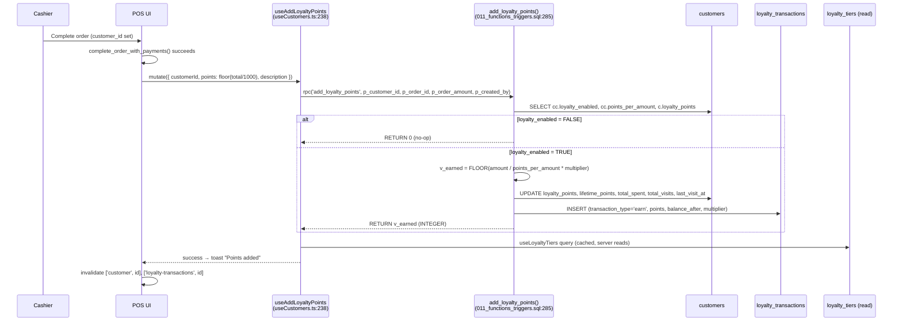
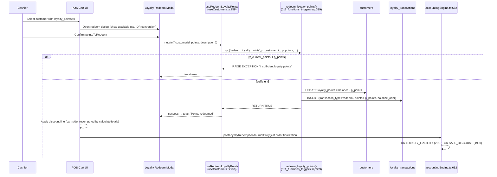

# 07 — Loyalty: Earn & Redeem

> **Last verified**: 2026-05-03
> **Scope**: V2 monolith (Vite + React + Supabase). Covers point accrual on order completion, automatic tier upgrade, and points redemption (discount on cart).
> **Related modules**: [04-modules/08-customers-loyalty.md](../04-modules/08-customers-loyalty.md), [04-modules/02-pos-cart-orders.md](../04-modules/02-pos-cart-orders.md), [04-modules/10-accounting-double-entry.md](../04-modules/10-accounting-double-entry.md)

---

## 1. Trigger

Two distinct sub-flows:

| Sub-flow | Trigger | Actor | Permission |
|---|---|---|---|
| **EARN** | A POS or B2B order reaches `status='completed'` AND `customer_id IS NOT NULL` AND the customer's `customer_categories.loyalty_enabled = TRUE` | System (manual call from cashier flow / B2B service) | `sales.create` |
| **REDEEM** | Cashier selects a customer with `loyalty_points > 0` in the cart, clicks "Redeem Points", chooses a redemption amount or attaches a redemption to a `loyalty_rewards` row | Cashier or Manager | `customers.loyalty` |
| **Manual adjust** | Manager opens `CustomerLoyaltyTab.tsx`, clicks "Add Points" / "Adjust" | Manager | `customers.loyalty` |

EARN is **NOT** wired to a SQL trigger on `orders` — it is invoked from application code (`useAddLoyaltyPoints` mutation, `src/hooks/customers/useCustomers.ts:238`) after a successful order completion. The B2B sale path posts via `add_loyalty_points` from the B2B service layer. Tier upgrade is a side effect of the same RPC (it bumps `lifetime_points`; tier recomputation is read-time via `loyalty_tiers.min_lifetime_points`, fallback constants in `src/constants/loyalty.ts:30`).

---

## 2. Sequence diagram (EARN sub-flow)

---

## 3. Sequence diagram (REDEEM sub-flow)

---

## 4. Étapes détaillées

### 4.1 EARN

| # | Acteur | Action | Fichier | Lignes |
|---|---|---|---|---|
| 1 | POS | Order completion (`complete_order_with_payments` RPC succeeds, `payment_status='paid'`, `status='completed'`) | `supabase/migrations/20260429234000_add_idempotency_to_complete_order_rpc.sql` | 87+ |
| 2 | POS code | Computes `pointsToEarn = Math.floor(orderTotal / 1000)` (default 1 pt / 1 000 IDR) | `src/hooks/customers/useCustomers.ts` | 238-257 |
| 3 | `useAddLoyaltyPoints` | Mutation calls `supabase.rpc('add_loyalty_points', ...)` with `customer_id`, `order_id`, `order_amount` | `src/hooks/customers/useCustomers.ts` | 242-249 |
| 4 | `add_loyalty_points()` | Reads `customer_categories.loyalty_enabled`, `points_per_amount` (default 1000), `points_multiplier` | `supabase/migrations/011_functions_triggers.sql` | 300-308 |
| 5 | RPC | Early return `0` if loyalty disabled for that category | id. | 310 |
| 6 | RPC | `v_earned_points = FLOOR(p_order_amount / v_points_per_amount * v_points_multiplier)` | id. | 312 |
| 7 | RPC | `UPDATE customers SET loyalty_points = balance + earned, lifetime_points += earned, total_spent += amount, total_visits += 1, last_visit_at = NOW()` | id. | 317-323 |
| 8 | RPC | `INSERT INTO loyalty_transactions` with `transaction_type='earn'`, `points_balance_after`, `points_rate`, `multiplier` | id. | 325-332 |
| 9 | Hook | Invalidates `['customer', id]` and `['loyalty-transactions', id]` query keys | `src/hooks/customers/useCustomers.ts` | 250-254 |
| 10 | UI | `LoyaltyBadge.tsx` re-renders with new tier (read from `lifetime_points` against `loyalty_tiers.min_lifetime_points`) | `src/components/pos/LoyaltyBadge.tsx`, `src/constants/loyalty.ts:30` | n/a |

### 4.2 Tier upgrade (read-time)

There is **no UPDATE trigger** that mutates `customers.loyalty_tier`. The current implementation reads `lifetime_points` and matches against `loyalty_tiers` rows ordered by `min_lifetime_points` (`useLoyaltyTiers` query, `src/hooks/customers/useCustomers.ts:222`). Defaults from `src/constants/loyalty.ts:30`:

| Tier | min_lifetime_points | Discount % |
|---|---:|---:|
| Bronze | 0 | 0 |
| Silver | 500 | 5 |
| Gold | 2 000 | 8 |
| Platinum | 5 000 | 10 |

The `customers.loyalty_tier` text column is a **denormalised cache** updated by `LoyaltySettingsPage.tsx` (manager re-tier) or by manual admin scripts; the runtime authority is `lifetime_points` joined with `loyalty_tiers`.

### 4.3 REDEEM (POS cart)

| # | Acteur | Action | Fichier | Lignes |
|---|---|---|---|---|
| 1 | Cashier | Selects customer in `CustomerSearchModal` | `src/components/pos/` | n/a |
| 2 | UI | Reads `customer.loyalty_points`, opens redemption modal showing IDR equivalent | `src/components/customers/CustomerLoyaltyCard.tsx` | n/a |
| 3 | UI | User enters `pointsToRedeem` (or selects a `loyalty_rewards` row) | id. | n/a |
| 4 | `useRedeemLoyaltyPoints` | Mutation → `rpc('redeem_loyalty_points', { p_customer_id, p_points, p_description })` | `src/hooks/customers/useCustomers.ts` | 259-277 |
| 5 | `redeem_loyalty_points()` | Locks customer row, checks `loyalty_points >= p_points` else `RAISE EXCEPTION 'Insufficient loyalty points'` | `supabase/migrations/011_functions_triggers.sql` | 351-356 |
| 6 | RPC | `UPDATE customers SET loyalty_points = balance - p_points` | id. | 360 |
| 7 | RPC | `INSERT INTO loyalty_transactions (transaction_type='redeem', points=-p_points, points_balance_after, description)` | id. | 362-368 |
| 8 | Cart | Applies a discount line equal to `pointsRedeemed × redemption_value_per_point` (default 1 IDR / pt or per `loyalty_rewards.discount_value`) | `src/stores/cartStore.ts` | n/a |
| 9 | Order finalisation | After `complete_order_with_payments`, calls `postLoyaltyRedemptionJournalEntry({ orderId, orderNumber, redemptionDate, pointsRedeemed, discountAmount, customerName })` | `src/services/accounting/accountingEngine.ts` | 652-676 |
| 10 | JE engine | Writes balanced JE: DR `LOYALTY_LIABILITY` (2210), CR `SALE_DISCOUNT` | id. | 671-672 |

---

## 5. Tables impactées

| Table | Operations | Notes |
|---|---|---|
| `customers` | UPDATE `loyalty_points`, `lifetime_points`, `total_spent`, `total_visits`, `last_visit_at` (earn) ; UPDATE `loyalty_points` (redeem) | Single-column FOR UPDATE row-lock implicit in PL/pgSQL UPDATE |
| `loyalty_transactions` | INSERT `transaction_type='earn'` or `'redeem'` with `points_balance_after` audit trail | `points_balance_after` stored = idempotent reconstruction |
| `loyalty_tiers` | SELECT only (read-time tier resolution) | Seeded by migration 003, manager-editable in `LoyaltySettingsPage.tsx` |
| `loyalty_rewards` | SELECT (catalogue), INSERT into `loyalty_redemptions` if rewards-based | Optional path; many redemptions are points-only |
| `loyalty_redemptions` | INSERT when `loyalty_rewards` row attached (status `pending` → `applied`) | Joins `loyalty_transaction_id` for back-ref |
| `journal_entries` + `journal_entry_lines` | INSERT for redemption only (DR 2210 / CR 4900) | `reference_type='loyalty_redemption'` (added by migration `20260413200200_add_loyalty_accounting.sql:36-41`) |
| `accounts` (2210) | Read-only (resolved by `LOYALTY_LIABILITY` mapping key) | Account 2210 = "Loyalty Points Liability", liability class 2 (current liabilities) |

---

## 6. Journal entries

### 6.1 EARN — no JE posted (V2 design choice)

V2 does NOT post a JE on point accrual. The deferred-revenue liability (DR Sales Revenue / CR Loyalty Points Liability) on earn is intentionally **deferred to V3** because:

1. The V2 dataset is small (~200 tx/day) and points outstanding are trivial vs. revenue.
2. SAK EMKM does not require accrual recognition for unmatured loyalty obligations.
3. Posting on earn would require a JE per order, doubling JE volume.

The 2210 account exists and is funded only on **redemption** (a CR mirrored against `SALE_DISCOUNT`). This means 2210 carries a **negative balance** until V3 enables earn-side accrual — documented in `docs/audit/` as a known acceptable gap.

### 6.2 REDEEM JE (posted by `postLoyaltyRedemptionJournalEntry`)

| Account | Code | Debit | Credit |
|---|---|---:|---:|
| Loyalty Points Liability | 2210 | `discountAmount` | 0 |
| Sales Discount (contra-revenue) | resolved by `SALE_DISCOUNT` mapping | 0 | `discountAmount` |

`reference_type='loyalty_redemption'`, `reference_id=order.id`. Entry number prefix `LR-` (`accountingEngine.ts:248`).

---

## 7. Cas d'erreur

| Code / Symptôme | Cause | Recovery |
|---|---|---|
| `Insufficient loyalty points` | Cashier requested redeem > balance (race condition or stale UI) | Refresh customer data; redeem ≤ `loyalty_points` |
| RPC returns `0` on EARN | `customer_categories.loyalty_enabled = FALSE` for that customer's category | Manager: enable loyalty on the category in `LoyaltySettingsPage.tsx` |
| `42501` permission denied | Authenticated user lacks `customers.loyalty` for redeem manual adjust path | Grant `customers.loyalty` on user's role |
| Double-spend (redeem same points twice) | Two cashiers concurrently redeem before UI refresh | Mitigated by RPC's atomic UPDATE + `points_balance_after` audit; second call raises `Insufficient loyalty points` because first already debited the row |
| Tier visually wrong | `customers.loyalty_tier` cache stale vs. `lifetime_points` | Re-run tier resync from `LoyaltySettingsPage.tsx` (manual button) |
| JE not posted on redeem | `LOYALTY_LIABILITY` or `SALE_DISCOUNT` mapping unresolved | Check `accounting_mappings` rows; defensive fallback returns `success:false` without crashing the order |
| `customer_categories.loyalty_enabled` NULL | New category created without setting flag | RPC defaults via `COALESCE(cc.loyalty_enabled, FALSE)` (line 301) — silently no-ops |

---

## 8. Tests

| Type | Fichier | Coverage |
|---|---|---|
| Unit | `src/components/pos/__tests__/LoyaltyBadge.test.tsx` | Tier color/discount fallback, badge rendering |
| Unit | `src/services/reporting/__tests__/reportingSalesService.test.ts` | Loyalty tier surfaced in customer report rows |
| Integration (manual) | n/a | RPC `add_loyalty_points` + `redeem_loyalty_points` tested via Supabase SQL editor; no automated DB integration tests in V2 |
| E2E (manual) | n/a | Open POS, complete an order with a tagged customer, verify badge + transactions tab in Customer detail |

**Gap**: no Vitest covers the EARN→tier visual update round-trip. Tracked in `docs/audit/` as a low-priority gap.

---

## 9. Pitfalls

1. **EARN is application-side, not trigger-side.** If you bypass `useAddLoyaltyPoints` (e.g. direct `INSERT INTO orders` from a script), no points accrue. Unlike `create_sale_journal_entry`, there is no SQL trigger on `orders.completed` for loyalty.
2. **Tier is denormalised**. `customers.loyalty_tier` may lag behind `lifetime_points`. Always recompute from `lifetime_points + loyalty_tiers` for authoritative reads.
3. **Multiplier vs. discount confusion**. `customer_categories.points_multiplier` boosts EARN rate (e.g. VIP earn 2× pts). `loyalty_tiers.discount_percentage` discounts the cart on the next order. They are independent.
4. **Redeem JE only**. Earning never posts a JE. If accountant complains 2210 is a credit balance going up (it should), explain V2 books only the contra-side at redemption.
5. **`points_balance_after` is the audit anchor**. Never patch `customers.loyalty_points` without inserting a corresponding `loyalty_transactions` row with the new `points_balance_after`, or audit reports break.
6. **Race condition on REDEEM**. Two cashiers can read `loyalty_points=100`, both submit `redeem 60`. The RPC's atomic UPDATE ensures only one succeeds; the second raises `Insufficient loyalty points`. UI must display this as a non-fatal toast and re-query.
7. **`add_loyalty_points` is NOT idempotent on `order_id`**. Calling it twice with the same `p_order_id` will accrue twice. The application is responsible for idempotency (mutation only fires once on order completion success). If retried, the user will be over-credited.
8. **Loyalty rewards path (`loyalty_redemptions` + `loyalty_rewards`) is partially wired**. The catalogue exists but the cart UX for "redeem reward X" path is minimal in V2; most redemptions go straight points→IDR discount. V3 will formalise rewards.
9. **Manual adjust uses same RPC**. `useAddLoyaltyPoints({ description: 'Manager bonus', ... })` is logged with `transaction_type='earn'` (NOT `'adjust'`). To distinguish in audits, filter `loyalty_transactions.description` or use the dedicated audit report (`LoyaltyAdjustmentsAuditTab.tsx`).
10. **No expiry job in V2**. The `loyalty_transactions.transaction_type='expire'` enum value exists but no scheduled task posts expirations. Track as future work.

---

## 10. Configuration prerequisites

- `customer_categories.loyalty_enabled = TRUE` for at least one category, otherwise `add_loyalty_points` is a no-op for all customers in that category.
- `customer_categories.points_per_amount` (default 1000 IDR per pt) and `points_multiplier` (default 1.0) — drive the EARN formula.
- `loyalty_tiers` rows seeded by migration `003_customers_loyalty.sql` (Bronze 0 / Silver 500 / Gold 2000 / Platinum 5000 by default — manager-editable).
- `accounting_mappings` rows: `LOYALTY_LIABILITY` → 2210 (seeded by `20260413200200_add_loyalty_accounting.sql`); `SALE_DISCOUNT` mapping resolved by mapping engine.
- Account 2210 ("Loyalty Points Liability") MUST exist with `is_postable=true`. Verify via `SELECT * FROM accounts WHERE code='2210'`.
- `journal_entries.reference_type` CHECK constraint MUST include `'loyalty_redemption'` (added by same migration). Older databases that haven't applied this migration will reject the JE INSERT.
- Permission `customers.loyalty` granted to roles that can adjust points (manager, supervisor).

---

## 11. Reports & analytics impact

- **Loyalty Report** (`/reports/loyalty`): per-customer earn/redeem totals, current balance, lifetime points, tier distribution. Source: `loyalty_transactions` aggregations joined with `customers`.
- **Loyalty Adjustments Audit** (`LoyaltyAdjustmentsAuditTab.tsx`): manager-initiated adjustments (earns with `description LIKE '%bonus%'` or `'%adjust%'`). Used to detect unauthorized point grants.
- **Customer Lifetime Value**: derived from `customers.total_spent` updated by `add_loyalty_points` — the function is the de-facto CLV authority for loyalty-enabled customers.
- **Tier Distribution Pie Chart**: `customers.loyalty_tier` GROUP BY — shows mix of Bronze/Silver/Gold/Platinum.
- **Liability Aging**: 2210 balance over time — currently always negative in V2 because earn-side accrual is deferred (V3 fixes this). Comptable sees a contra-revenue offset on redemptions only.

---

## 12. Observability

- Sentry captures all RPC errors via the `useAddLoyaltyPoints` / `useRedeemLoyaltyPoints` `onError` callback (toasts the error, logs to Sentry).
- `loyalty_transactions.points_balance_after` is the audit anchor — every row records the customer's balance immediately after the operation. SQL audit query: `SELECT customer_id, points_balance_after, LAG(points_balance_after) OVER (PARTITION BY customer_id ORDER BY created_at) AS prev FROM loyalty_transactions` to detect gaps.
- No Realtime channel for `loyalty_transactions` in V2 — UI relies on react-query invalidation after mutations. If a manager adjusts points from the BackOffice while POS is open with the same customer, the POS will not auto-refresh.

---

## 13. Related flows

- [01 — POS Sale Cash](./01-pos-sale-cash.md) — order completion is the typical entry point for the EARN call.
- [02 — POS Sale Split Payment](./02-pos-sale-split-payment.md) — split orders also trigger EARN if a customer is attached.
- [03 — Void & Refund](./03-void-refund.md) — `loyalty_transactions.transaction_type='refund'` reverses points on void; not yet automated, manager runs `useAddLoyaltyPoints({ points: -X, description: 'Void reversal' })` manually.
- [06 — B2B Order to Invoice](./06-b2b-order-to-invoice.md) — B2B orders also accrue loyalty if the customer's category has `loyalty_enabled=true`.
- [10 — End of Day](./10-end-of-day.md) — daily report does NOT include loyalty totals (separate report).
