# 08 — KDS Order Lifecycle

> **Last verified**: 2026-05-03
> **Scope**: V2 monolith. Covers POS "Send to Kitchen" → LAN broadcast → KDS station receive → status transitions (`new` → `preparing` → `ready` → `served`) → POS / Customer Display update.
> **Related modules**: [04-modules/04-kds-kitchen.md](../04-modules/04-kds-kitchen.md), [04-modules/02-pos-cart-orders.md](../04-modules/02-pos-cart-orders.md), [06-lan-architecture/](../06-lan-architecture/)

---

## 1. Trigger

The KDS lifecycle starts when the POS cashier sends a cart batch to the kitchen, either:

| Sub-event | Initiator | Permission | Effect |
|---|---|---|---|
| **Send to Kitchen** | Cashier clicks the "Send to Kitchen" button on a non-empty cart | `sales.create` | `cartStore.lockedItems` snapshots current items; `dispatchOrderToKds` is called |
| **Order completion** | Cashier finalises payment | `sales.create` | Already-sent items remain locked; cashier cannot edit unless they re-verify a manager PIN |
| **Item status update** | KDS operator marks "Start" / "Ready" / "Served" on a tile | n/a (KDS is single-purpose terminal, auth implicit) | `order_items.item_status` UPDATE; LAN ACK broadcast back to POS |
| **Order auto-complete** | Last item of an order transitions to `ready`/`served` | system | `orders.status` cascades to `ready` or `served`; Customer Display receives a notification |

Items dispatched are **immutable on the cashier side** (PIN required to modify) — see `cartStore.lockedItems` and PIN guard in cart UI.

---

## 2. Sequence diagram

```mermaid
sequenceDiagram
    participant Cashier
    participant POS as POS Cart UI
    participant Cart as cartStore (Zustand)
    participant Disp as kdsDispatcher.ts
    participant Hub as lanHub.ts<br/>(BroadcastChannel + Realtime)
    participant Client as lanClient.ts<br/>(KDS station)
    participant Recv as useKdsOrderReceiver
    participant Tile as KDSOrderGrid (tile UI)
    participant DB as orders + order_items
    participant Display as Customer Display

    Cashier->>POS: Click "Send to Kitchen"
    POS->>Cart: lockItems(cart.items)
    POS->>Disp: dispatchOrderToKds(orderId, orderNumber, items, orderType, tableNumber)
    Disp->>Disp: batchGetDispatchStations(items) → station per product
    Disp->>Disp: Group items by station (kitchen / barista)
    loop per station with items
        Disp->>Hub: lanHub.broadcast(LAN_MESSAGE_TYPES.KDS_NEW_ORDER, payload)
        Hub->>Hub: BroadcastChannel('appgrav-lan').postMessage(...)
        Hub->>Hub: supabase.channel('lan-hub').send(...)
    end
    Hub->>Client: BroadcastChannel + Realtime delivery
    Client->>Recv: dispatch KDS_NEW_ORDER
    Recv->>Recv: Filter by station; dedupe by order_id
    Recv->>Recv: playSound() if enabled
    Recv->>Tile: onNewOrder(payload, 'lan')
    Tile->>Tile: Render new tile
    Recv->>Hub: lanClient.send(KDS_ORDER_ACK, { order_id, station, acknowledged_at })

    Note over Tile,DB: KDS operator works the order
    Tile->>DB: UPDATE order_items SET item_status='preparing' (markItemsPreparing)
    Tile->>DB: UPDATE order_items SET item_status='ready' (markItemsReady)
    alt all items ready
        Tile->>DB: UPDATE orders SET status='ready'
        Tile->>Display: broadcastOrderStatus(orderId, orderNumber, 'ready')
        Display->>Display: Show "Order #N ready" banner
    end
    Tile->>DB: UPDATE order_items SET item_status='served', served_at=NOW()
    alt all items served
        Tile->>DB: UPDATE orders SET status='served'
    end
    Tile->>POS: completeOrder() (optional auto-remove)
```

---

## 3. Étapes détaillées

### 3.1 Dispatch (POS → LAN → KDS)

| # | Acteur | Action | Fichier | Lignes |
|---|---|---|---|---|
| 1 | Cashier | Click "Send to Kitchen" on POS | `src/pages/pos/POSMainPage.tsx` | n/a |
| 2 | POS hook | Snapshot cart items into `cartStore.lockedItems` (PIN required to modify after this) | `src/stores/cartStore.ts` | n/a |
| 3 | POS hook | Call `dispatchOrderToKds(orderId, orderNumber, items, orderType, tableNumber)` | `src/services/pos/kdsDispatcher.ts` | 51-125 |
| 4 | Dispatcher | `batchGetDispatchStations(items)` resolves each `product_id` → `kitchen` / `barista` / `display` / `none` (via `dispatchStationResolver.ts`) | `src/services/pos/kdsDispatcher.ts` | 71 |
| 5 | Dispatcher | For combo items, resolve sub-product stations and pick `kitchen` if any sub-item is kitchen, else `barista` | id. | 81-90 |
| 6 | Dispatcher | Group items by station; `display` and `none` are silently skipped | id. | 60-63, 96 |
| 7 | Dispatcher | Per station, build `IKdsNewOrderPayload` (`order_id`, `order_number`, `table_number`, `order_type`, `items[]`, `station`, `timestamp`) | id. | 99-107 |
| 8 | Dispatcher | If `lanHub.isActive()` or `lanStore.connectionStatus === 'connected'`, call `lanHub.broadcast(LAN_MESSAGE_TYPES.KDS_NEW_ORDER, payload)` | id. | 109-117 |
| 9 | LAN Hub | Posts to `BroadcastChannel('appgrav-lan')` (intra-browser) AND `supabase.channel('lan-hub').send(...)` (cross-device) | `src/services/lan/lanHub.ts` | n/a |
| 10 | LAN Client | KDS device receives via `lanClient.on(LAN_MESSAGE_TYPES.KDS_NEW_ORDER, handler)` | `src/services/lan/lanClient.ts` | n/a |

### 3.2 Receive on KDS station

| # | Acteur | Action | Fichier | Lignes |
|---|---|---|---|---|
| 1 | `useKdsOrderReceiver` | Subscribes once via `lanClient.on(KDS_NEW_ORDER, handleNewOrder)` | `src/hooks/kds/useKdsOrderReceiver.ts` | 186-201 |
| 2 | Handler | Validates payload (`order_id`, `station` required) | id. | 96-100 |
| 3 | Handler | **Station filter**: drops if `station !== 'all'` AND `payload.station !== station` | id. | 105-110 |
| 4 | Handler | **Dedupe**: skips if `existingOrderIds` already contains `payload.order_id` | id. | 113-118 |
| 5 | Handler | Plays notification sound if enabled | id. | 124-127 |
| 6 | Handler | Invokes `onNewOrder(payload, 'lan')` → adds tile to `useKdsOrderQueue` state | id. | 132 |
| 7 | Handler | Sends `lanClient.send(KDS_ORDER_ACK, { order_id, station, acknowledged_at })` back to hub | id. | 136, 172-183 |
| 8 | Handler | Subscribes also to `KDS_TABLE_TRANSFER` to handle table moves mid-prep | id. | 144-167, 203-213 |

### 3.3 Item status transitions

| # | Acteur | Action | Fichier | Lignes |
|---|---|---|---|---|
| 1 | Operator | Click "Start" on selected items | `src/components/kds/KDSOrderGrid.tsx` | n/a |
| 2 | `useKdsOrderActions` | Optimistic: `updateOrderItem(orderId, itemId, { item_status: 'preparing' })` | `src/hooks/kds/useKdsOrderActions.ts` | 32-53 |
| 3 | `markItemsPreparing` | `UPDATE order_items SET item_status='preparing', preparing_at=NOW() WHERE id IN (...)` (via `kdsStatusService`) | `src/services/kds/kdsStatusService.ts` | n/a |
| 4 | On error | Revert to `previousStatuses` map | `src/hooks/kds/useKdsOrderActions.ts` | 46-51 |
| 5 | Operator | Click "Ready" on items | `src/components/kds/KDSOrderGrid.tsx` | n/a |
| 6 | `markItemsReady` | `UPDATE order_items SET item_status='ready', ready_at=NOW()` | `src/services/kds/kdsStatusService.ts` | n/a |
| 7 | Hook | If all items now `ready`/`served`, broadcast `displayBroadcast.broadcastOrderStatus(orderId, orderNumber, 'ready')` to Customer Display | `src/hooks/kds/useKdsOrderActions.ts` | 76-82 |
| 8 | Operator | Click "Served" (waiter station) | `src/components/kds/KDSOrderGrid.tsx` | n/a |
| 9 | `handleMarkServed` | `UPDATE order_items SET item_status='served', served_at=NOW()` | `src/hooks/kds/useKdsOrderActions.ts` | 97-105 |
| 10 | Hook | If all items served, `UPDATE orders SET status='served'` | id. | 108-118 |
| 11 | `handleOrderComplete` | Optional: call `completeOrder` service which removes the tile + broadcasts ready | id. | 126-139 |

### 3.4 Auto-remove + urgent alert

- `useOrderAutoRemove` removes a completed tile from the queue after a configurable delay (e.g. 5 min) so the screen stays uncluttered.
- `useKdsUrgentAlertLoop` re-rings the alert sound every N seconds for orders whose age exceeds the urgent threshold (configurable per station).

---

## 4. State machine — item status

```mermaid
stateDiagram-v2
    [*] --> new: Item dispatched to KDS
    new --> preparing: Operator clicks Start (markItemsPreparing)
    preparing --> ready: Operator clicks Ready (markItemsReady)
    ready --> served: Waiter clicks Served (handleMarkServed)
    served --> [*]: Auto-remove tile (useOrderAutoRemove)

    new --> preparing: (skip-step path)
    preparing --> served: (rare; bypass ready)
    state "is_held" as held
    new --> held: Toggle Hold (handleToggleHold)
    held --> new: Toggle Hold (release)
```



`item_status` enum (`src/types/orders.ts:36`): `'new' | 'preparing' | 'ready' | 'served'`. The order-level `orders.status` (`src/types/orders.ts:13`) cascades:

| order_items aggregate | Resulting `orders.status` |
|---|---|
| Any `new`/`preparing` | `preparing` (set on Send to Kitchen) |
| All items `ready` or `served` | `ready` (broadcast to Display) |
| All items `served` | `served` |
| `complete_order_with_payments` succeeded | `completed` (paid) |
| Manager voids | `voided` |

---

## 5. Tables impactées

| Table | Operations | Notes |
|---|---|---|
| `orders` | UPDATE `status` (`preparing` / `ready` / `served`) | Status change triggered from KDS, NOT directly from POS dispatch |
| `order_items` | UPDATE `item_status`, `preparing_at`, `ready_at`, `served_at`, `is_held` | Source of truth for KDS tiles; one row = one cart item |
| `kds_stations` | SELECT only (configuration: which station this device represents) | Persistent in DB; mapped to `lan_nodes.role` at runtime |
| `lan_nodes` | UPDATE `last_seen_at` (heartbeat 30 s) | Used by hub to know which clients are alive |
| `printer_configurations` | SELECT (when KDS routes to a kitchen ticket printer via hub) | Hub forwards `PRINT_REQUEST` based on station→printer map |

No journal entries are created during the KDS lifecycle — only on `complete_order_with_payments` (see flow 04).

---

## 6. LAN message types used

| Message type | Sender | Receiver | Payload shape |
|---|---|---|---|
| `KDS_NEW_ORDER` (`'kds_new_order'`) | Hub | KDS clients | `IKdsNewOrderPayload { order_id, order_number, table_number, order_type, items[], station, timestamp }` |
| `KDS_ORDER_ACK` (`'kds_order_ack'`) | Client | Hub | `{ order_id, station, acknowledged_at }` |
| `KDS_TABLE_TRANSFER` (`'kds_table_transfer'`) | Hub | KDS clients | `IKdsTableTransferPayload { order_id, order_number, old_table, new_table }` |
| `ORDER_UPDATE` (`'order_update'`) | Hub | All | Generic order update fan-out (rare in KDS path; used by display + tablet) |

Constants: `src/services/lan/lanProtocol.ts:33-90`.

---

## 7. Cas d'erreur

| Code / Symptôme | Cause | Recovery |
|---|---|---|
| `[kdsDispatcher] LAN not connected` | `lanHub.isActive()` false AND store status not `connected` | Operator opens Settings → Network Devices, reconnects hub. KDS will not receive until reconnect. Items still saved in `cartStore`; manager can re-Send when LAN restored. |
| Duplicate tile on KDS | Same `order_id` arrives twice (race between BroadcastChannel + Realtime) | `useKdsOrderReceiver` dedupes via `existingOrderIdsRef` (line 113-118). No-op for duplicates. |
| Tile not appearing on a station | Station filter mismatch — payload `station` differs from KDS device's configured station | Check `dispatchStationResolver.ts` mapping (`products.dispatch_station` column or category default). Reseed via Settings → Stations. |
| `useKdsOrderActions` revert on UPDATE failure | RLS denied (`42501`) or item already `served` (CHECK constraint) | Hook restores prior status from `previousStatuses` map; toast shown. Operator retries. |
| Customer Display never shows "Ready" | `broadcastOrderStatus` only fires when ALL items in the order reach `ready`/`served` | If some items stay `new`/`preparing`, mark them ready first; or use the manager override on the Customer Display admin page. |
| ACK lost (`KDS_ORDER_ACK` not delivered) | LAN hub crashed mid-broadcast | Hub logs missing ACK; in V2 this is informational only (no auto-retry). Operator reissues from POS or asks kitchen verbally. |
| `KDS_TABLE_TRANSFER` toast doesn't update tile | Page hasn't subscribed to `kds-table-transfer` window event | Confirm `KDSMainPage.tsx` listens; reload device. |

---

## 8. Tests

| Type | Fichier | Coverage |
|---|---|---|
| Unit | `src/hooks/kds/__tests__/useKdsOrderReceiver.test.ts` | Station filter, dedupe, ACK send, sound trigger |
| Unit | `src/hooks/kds/__tests__/useKdsOrderQueue.test.ts` | Queue add/remove/update item state |
| Unit | `src/services/lan/lanHub.test.ts` + `lanProtocol.test.ts` | Broadcast fan-out + payload schema |
| Manual E2E | n/a | Open POS + KDS in two tabs (BroadcastChannel works without network), Send to Kitchen, verify tile, transitions, served |

---

## 9. Pitfalls

1. **`KDS_NEW_ORDER` is fire-and-forget.** If the hub broadcasts but no KDS device is listening (or all are offline), the kitchen ticket is **lost** (no DB queue). The tile resurrects only if `KDSMainPage` calls `fetchOrders()` from DB on reload.
2. **Locked items vs. cart items.** `cartStore.items` includes locked AND new items; `cartStore.lockedItems` is the snapshot of what was sent. UI must distinguish (lock icon, PIN to modify) — see CLAUDE.md "Locked cart items require PIN to modify".
3. **Combo dispatch is best-effort.** A combo with mixed sub-items (kitchen + barista) defaults to **kitchen** (`kdsDispatcher.ts:86`). If the combo should split, set `dispatch_station` per sub-product and adjust the resolver.
4. **`'display'` and `'none'` stations are skipped.** Items mapped to these are silently NOT dispatched. If a product disappears from KDS, check its `dispatch_station` column.
5. **Status transitions are NOT enforced server-side.** No CHECK constraint forbids `ready` → `new`. UI prevents this, but a misbehaving client could write any value. V3 will add a state-machine guard.
6. **`served_at` is set by `handleMarkServed`, NOT by `markItemsReady`.** Reports counting "service time" must use `(served_at - ready_at)` not `(now - ready_at)`.
7. **Sound playback is hook-driven.** If `soundEnabled=false` is passed, ACK is still sent but no audio. Operators sometimes complain — check `posLocalSettingsStore.kdsSoundEnabled`.
8. **Realtime + BroadcastChannel double delivery.** On the same device, both channels deliver. Dedupe in `useKdsOrderReceiver` prevents double-tiles. Do NOT remove the dedupe.
9. **Order-level `status='ready'` only fires when all items aggregate to ready/served.** If the queue UI uses item statuses to render, and an order has 3 items but only 2 are ready, `orders.status` stays `preparing`. Reports filtering on `orders.status='ready'` will undercount in-flight orders.
10. **`useKdsUrgentAlertLoop` keeps ringing until acknowledged.** If the operator silences sound system-wide but the loop still ticks, server logs fill with no audible alarm — set `soundEnabled` AND clear the urgency on action.

---

## 10. Configuration prerequisites

- LAN hub must be active on at least one device (`lanHub.start()` invoked at app boot for hub-role devices). See `lanStore.role='hub'` and `device_configurations` table.
- KDS station device configured in `kds_stations` (slug `kitchen` / `barista` / `display`) and registered in `lan_nodes` (heartbeat 30 s).
- `products.dispatch_station` (or category default in `categories.default_station`) MUST be set for every product expected to appear on a station — otherwise it falls into `'none'` and is silently dropped.
- Sound assets present in `public/sounds/` (`KdsSoundService.ts` loads them at boot).
- BroadcastChannel API available (modern browsers only; Safari iOS 15+).
- Supabase Realtime channel `'lan-hub'` reachable (websockets allowed by network/firewall).
- POS `cartStore.lockItems()` action wired into the "Send to Kitchen" button flow.

---

## 11. Reports & analytics impact

- **Service Time Report** (`/reports/operations/service-time`): `(served_at - ready_at)` per item, aggregated by station and hour. Surfaces slow-service patterns.
- **KDS Throughput**: items prepared per station per hour (`COUNT(*) FROM order_items WHERE item_status='ready' AND ready_at IN window`).
- **Order Cycle Time**: `(completed_at - created_at)` for orders — combines KDS prep + payment latency.
- **Held Items Report**: `order_items WHERE is_held=TRUE` — items the kitchen paused (out of stock, customer wait). Should be near-zero in normal operations.
- **Station Workload Heatmap**: items dispatched per station per hour; helps balance staff.

---

## 12. Observability

- `useKdsOrderReceiver` logs every received order via `logger.debug` (visible in browser console, Sentry breadcrumbs).
- LAN ACK timing is captured in `useKdsOrderReceiver.sendOrderAck` (`acknowledged_at` ISO timestamp). Hub can compute round-trip latency by comparing payload `timestamp` vs ACK `acknowledged_at`.
- `lan_nodes.last_seen_at` indicates KDS device liveness (heartbeat 30 s, stale at 120 s — `lanStore.STALE_THRESHOLD_MS`).
- Sentry breadcrumbs: `[useKdsOrderReceiver]`, `[kdsDispatcher]` prefixes filter for KDS-specific issues.
- Customer Display has its own `displayBroadcast` channel — broadcasts are fire-and-forget; if Display is offline, no retry.

---

## 13. Related flows

- [01 — POS Sale Cash](./01-pos-sale-cash.md) — typical preceding flow (cart → KDS → payment).
- [02 — POS Sale Split Payment](./02-pos-sale-split-payment.md) — KDS dispatch happens at "Send to Kitchen", payment can come later.
- [03 — Void & Refund](./03-void-refund.md) — voiding a sent order broadcasts a reverse signal; KDS manually removes the tile.
- [04 — Purchase Order Cycle](./04-purchase-order-cycle.md) — unrelated, but ingredient consumption from production (flow 12) feeds the products that the KDS prepares.
- [09 — Promotion Evaluation](./09-promotion-evaluation.md) — promotions affect cart totals, NOT what the KDS sees (KDS only knows item names + modifiers).
- [11 — Shift Cash Reconciliation](./11-shift-cash-reconciliation.md) — KDS items are tied to the shift via `orders.pos_session_id`.
