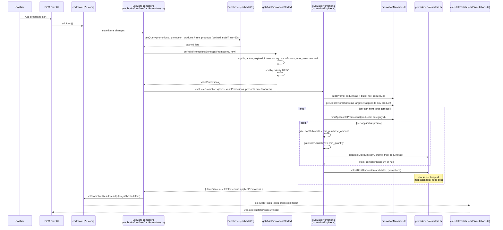
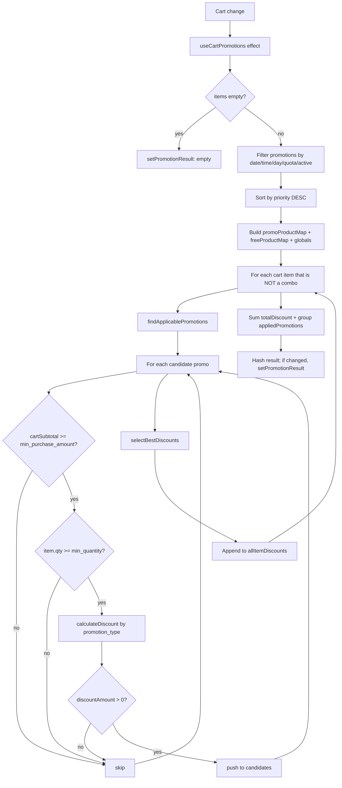

# 09 — Promotion Evaluation

> **Last verified**: 2026-05-03
> **Scope**: V2 monolith. Auto-evaluation of active promotions on every cart change, candidate selection (stackable vs. non-stackable), application to cart totals.
> **Related modules**: [04-modules/13-promotions-discounts.md](../04-modules/13-promotions-discounts.md), [04-modules/02-pos-cart-orders.md](../04-modules/02-pos-cart-orders.md)

---

## 1. Trigger

Promotion evaluation is **fully reactive** — there is no manual "Apply promo" click in the cashier flow:

| Sub-event | Initiator | Effect |
|---|---|---|
| Cart item added / removed / quantity changed | `useCartStore.items` change | `useCartPromotions` `useEffect` re-runs `evaluatePromotions` |
| Promotions table updated server-side | React Query stale (60 s) → refetch | New evaluation on next render |
| Cashier opens POS at the boundary of a time-window promotion (e.g. happy hour starts at 17:00) | Render at the right minute | `getValidPromotionsSorted` filter selects newly-valid promo |
| Customer selected | (Future) tier-based promos | Currently the engine ignores customer; tier-discount uses `loyalty_tiers` directly |

**No SQL trigger** is involved. The engine is 100 % client-side after fetching `promotions`, `promotion_products`, `promotion_free_products`.

---

## 2. Sequence diagram



---

## 3. Étapes détaillées

### 3.1 Subscription + fetch

| # | Acteur | Action | Fichier | Lignes |
|---|---|---|---|---|
| 1 | `useCartPromotions` | Subscribes to `cartStore.items` and `setPromotionResult` selectors | `src/hooks/pos/useCartPromotions.ts` | 40-41 |
| 2 | Hook | `useQuery(['promotions-active'])` fetches all `is_active=true` rows; `staleTime=60_000` ms | id. | 44-54 |
| 3 | Hook | Two more queries: `promotion_products` (target product / category links) and `promotion_free_products` (free-item bundles) | id. | 56-76 |
| 4 | Hook | `useEffect` re-runs whenever `items` or any of the 3 query results change | id. | 81-100 |

### 3.2 Validity filter

`getValidPromotionsSorted(promotions)` (`src/hooks/pos/useCartPromotions.ts:19-37`) drops promotions that fail any of:

| Condition | Source field | Logic |
|---|---|---|
| Inactive | `is_active = false` | drop |
| Not yet started | `start_date > now` | drop |
| Expired | `end_date < now` | drop |
| Wrong day of week | `days_of_week` array doesn't include `now.getDay()` | drop |
| Before window | `time_start > 'HH:MM' (now)` | drop |
| After window | `time_end < 'HH:MM' (now)` | drop |
| Quota reached | `max_uses_total != NULL && current_uses >= max_uses_total` | drop |

Then sorts the survivors by `priority DESC` (line 36).

### 3.3 Engine pass

`evaluatePromotions(cartItems, validPromotions, promotionProducts, freeProducts)` (`src/services/pos/promotionEngine.ts:40-104`):

| # | Step | Detail |
|---|---|---|
| 1 | Empty short-circuit | If no items or no promos → `{ itemDiscounts: [], totalDiscount: 0, appliedPromotions: [] }` |
| 2 | Build maps | `buildPromoProductMap(promotionProducts)` indexes target product/category per promotion |
| 3 | Build free-product map | `buildFreeProductMap(freeProducts)` for `free_product` type promotions |
| 4 | Identify global promos | `getGlobalPromotions` returns promos with NO targets (apply to any item) |
| 5 | Compute cart subtotal | Sum of `item.totalPrice` for `min_purchase_amount` gating |
| 6 | Per-item loop | Skip combos (`item.type === 'combo'` not promo-eligible in V2) |
| 7 | `findApplicablePromotions(productId, categoryId, …)` | Returns promos targeting this product/category + globals |
| 8 | Per-promo gates | `cartSubtotal >= min_purchase_amount` AND `item.quantity >= min_quantity` |
| 9 | `calculateDiscount(item, promo, freeProductMap)` | Branches by `promotion_type` |
| 10 | `selectBestDiscounts(candidates, promotions)` | Stacking algorithm (see §3.5) |
| 11 | Aggregate | Sum `discountAmount`, group `appliedPromotions` by `promotionId` |

### 3.4 Discount calculators

(`src/services/pos/promotionCalculators.ts:8-153`)

| `promotion_type` | Function | Formula |
|---|---|---|
| `percentage` | `calculatePercentageDiscount` | `Math.round(item.totalPrice × discount_percentage / 100)` |
| `fixed_amount` | `calculateFixedAmountDiscount` | `min(round(discount_amount × quantity), item.totalPrice)` |
| `buy_x_get_y` | `calculateBuyXGetYDiscount` | Groups of `(buy_quantity + get_quantity)`; free units = `floor(qty / groupSize) × get_quantity`; discount = `freeUnits × unitPrice` |
| `free_product` | `calculateFreeProductDiscount` | Free quantity from `promotion_free_products`; discount = `freeQty × unit_price` of the matched free product |

All amounts are integer IDR (rounded with `Math.round`, per business rule "currency rounded to nearest 100" applied later in totals).

### 3.5 Stacking selection (`selectBestDiscounts`)

`src/services/pos/promotionCalculators.ts:129-153`

```text
Inputs: candidates[] (per-item discount proposals) + promotions[] (lookup for is_stackable flag)

1. Partition candidates into stackable[] and nonStackable[]
2. bestNonStackable = nonStackable.reduce(maxByDiscountAmount) or null
3. If stackable is empty:
     → return [bestNonStackable] (or [] if null)
4. If no non-stackable winner:
     → return all stackable
5. Else:
     → return [bestNonStackable, ...all stackable]
```

So a **non-stackable** promo wins as a single best discount on that item; **stackable** promos all apply on top of the best non-stackable. Within stackable, all matches sum (no further filter).

### 3.6 Apply to totals

| # | Step | Fichier |
|---|---|---|
| 1 | Hook computes a `resultKey` JSON hash to avoid useless store updates on every render | `src/hooks/pos/useCartPromotions.ts:91-98` |
| 2 | If hash differs, calls `cartStore.setPromotionResult(result)` | id. |
| 3 | `cartCalculations.ts` (`calculateTotals`) reads `promotionResult.totalDiscount`, subtracts from subtotal before tax | `src/services/pos/cartCalculations.ts` |
| 4 | UI rebinds via `useCartStore` selectors → cart line shows discount, total recomputes |

---

## 4. Tables impactées

| Table | Operations | Notes |
|---|---|---|
| `promotions` | SELECT (cached 60 s) | Source of truth for promo definitions; `is_active`, `priority`, `is_stackable`, `current_uses`, `max_uses_total` |
| `promotion_products` | SELECT | Target products + categories per promo |
| `promotion_free_products` | SELECT | Free items per `free_product` type |
| `applied_promotions` | INSERT (at order finalisation, NOT at evaluation) | Audit trail of which promos discounted which order; also feeds `current_uses` increment |
| `orders` / `order_items` | UPDATE `discount_amount` (per item or aggregated on order) | Written by `complete_order_with_payments` RPC, NOT by the engine |

Evaluation itself is read-only. Persistence happens at the order finalisation step.

---

## 5. Algorithme — flow chart



---

## 6. Cas d'erreur

| Code / Symptôme | Cause | Recovery |
|---|---|---|
| Promotion not appearing | Filter rejected it (date / day / time / `current_uses ≥ max_uses_total`) | Manager: extend dates, reset `current_uses`, or toggle `is_active` |
| Wrong discount amount | `min_quantity` or `min_purchase_amount` gating drops a promo silently | Inspect `validPromotions` log; check thresholds |
| Multiple non-stackable promos applied | Bug — `is_stackable` flag missing/null on row | Backfill `is_stackable=false` on legacy rows |
| Combo never gets discount | Engine intentionally skips combos (`item.type === 'combo'` early continue, line 59) | Apply per-product promos on combo's sub-products via separate cart entries, or use a combo-level price override |
| Discount > item price | Possible on `fixed_amount` if `quantity × discount_amount > totalPrice` | Calculator clamps with `Math.min(..., item.totalPrice)` (line 56-58) |
| Stale promo cache | User edited a promotion in BackOffice but POS still uses old data | Wait 60 s (staleTime) or hard-refresh the POS tab |
| Time-window edge case | Crossing midnight (`time_start > time_end`) | NOT supported; configure two promos |
| Performance lag on large cart | O(items × promos × calculators) | OK up to ~50 items / 20 promos; beyond, switch to memoised `useMemo` (V3) |
| `useEffect` infinite loop | `setPromotionResult` referenced unstable; mitigated by `prevResultRef` hash compare (line 79, 96-98) | Do not remove the hash check |

---

## 7. Tests

| Type | Fichier | Coverage |
|---|---|---|
| Unit | `src/services/pos/__tests__/promotionEngine.test.ts` | Per-type calculators, gating, stacking selection, dedupe |
| Unit (implicit) | n/a in V2 — calculators tested through engine | `calculatePercentageDiscount`, `calculateFixedAmountDiscount`, `calculateBuyXGetYDiscount`, `calculateFreeProductDiscount` |
| Manual E2E | n/a | Add promo in BackOffice, refresh POS, add target item, observe discount; toggle stackable; flip `is_active`; verify quota gating |

**Gap**: `getValidPromotionsSorted` is inline in the hook and lacks dedicated tests for time-window edge cases. Tracked in audit reports.

---

## 8. Pitfalls

1. **Combos are NEVER discounted by the engine.** The early `continue` (line 59) means `combo` cart items skip evaluation entirely. If a combo needs a discount, set its price via the combo definition or via a per-line manual discount.
2. **Stacking is per-item, NOT per-cart.** Two stackable promos on the SAME item both apply. Stackability does not extend to "this promo stacks with promo X but not promo Y" — V2 has no pairwise rules.
3. **Priority only matters for sort order**, NOT for tie-breaking inside `selectBestDiscounts`. The best non-stackable is chosen by `discountAmount`, not `priority`. If two non-stackable promos give the same amount, the one returned by `findApplicablePromotions` first wins (deterministic but not priority-driven).
4. **`current_uses` is read but not written by the engine.** Increment of `current_uses` happens in the order finalisation step (or by a server-side trigger on `applied_promotions` insert, depending on environment). Evaluation never updates the DB.
5. **`min_purchase_amount` checks `cartSubtotal`, NOT `totalAfterPriorDiscounts`.** Apply order: gating uses raw subtotal; you cannot create a promo that activates only after another discount drops the subtotal.
6. **Days-of-week format**: `days_of_week` stores `0=Sunday` … `6=Saturday` to match JS `Date.getDay()`. Manually-edited rows that use `1=Monday` (ISO) will misfire.
7. **Time-window strings are `'HH:MM'`** and compared lexicographically — works because zero-padded; do NOT store `'9:00'`.
8. **`updated_at` is part of the SELECT but not used for cache busting.** The 60-second `staleTime` is the only invalidation. Manager edits propagate within ≤60 s; force a refetch via `queryClient.invalidateQueries(['promotions-active'])` if instant.
9. **Engine ignores customer**. There is no per-customer eligibility (e.g., "VIP only") in V2. Tier-based discounts are applied separately by the loyalty subsystem (see flow 07).
10. **Hash comparison key uses sorted array shape**: `result.itemDiscounts.map(d => …).join`. If the engine ever returns items in non-deterministic order, the hash will differ on every render, causing infinite store updates. Keep ordering deterministic in `evaluatePromotions`.

---

## 9. Configuration prerequisites

- `promotions.is_active = TRUE` for any candidate.
- `promotion_products` rows linking the promo to specific products / categories (or empty for global).
- `promotion_free_products` rows for `'free_product'` type promos.
- `promotions.priority` (INTEGER) set per promo — higher = evaluated first (sort order).
- `promotions.is_stackable` (BOOLEAN) explicitly set per promo — null defaults treated as falsy in current code.
- `promotions.days_of_week` (INT[]) using JS day numbers (0=Sun ... 6=Sat).
- `promotions.time_start` / `time_end` strings `'HH:MM'` zero-padded.
- For `'buy_x_get_y'`: both `buy_quantity` and `get_quantity` > 0.
- For `'fixed_amount'` and `'percentage'`: `discount_amount` or `discount_percentage` > 0.
- `applied_promotions` table for audit (written at order finalisation, not at evaluation).

---

## 10. Reports & analytics impact

- **Promotions Effectiveness Report**: `applied_promotions` aggregations — uses, discount_total per promo, conversion impact.
- **Top Discounted Products**: `applied_promotions` JOIN `order_items` GROUP BY `product_id`.
- **Quota Tracking**: `promotions.current_uses` vs. `max_uses_total` — alert when ≥80%.
- **Discount Margin Erosion**: Daily cumulative `applied_promotions.discount_amount` vs. `orders.subtotal` — comptable monitors that promo discount stays under, e.g., 10% of GMV.
- **Stacking Analysis**: cases where multiple promos applied to same item — reveals over-permissive stackable flags.

---

## 11. Observability

- `useCartPromotions` is silent (no logs) by default. Add `logger.debug('[useCartPromotions]', result)` in dev mode if debugging.
- `evaluatePromotions` is pure — easy to test in isolation (`promotionEngine.test.ts`).
- React Query devtools surface the `['promotions-active']` query state — manager can see staleness.
- No Realtime subscription on `promotions` in V2 — manager edits propagate only on next refetch (≤60 s) or hard refresh.
- Sentry: not specifically instrumented; promotion bugs surface as wrong discounts (not exceptions).

---

## 12. Related flows

- [01 — POS Sale Cash](./01-pos-sale-cash.md) — promo discount applied at cart, persisted to `orders.discount_amount` via `complete_order_with_payments`.
- [02 — POS Sale Split Payment](./02-pos-sale-split-payment.md) — same.
- [03 — Void & Refund](./03-void-refund.md) — voiding decrements `promotions.current_uses` (if wired); refund reverses revenue but not promo usage.
- [06 — B2B Order to Invoice](./06-b2b-order-to-invoice.md) — B2B does NOT use this engine; B2B has its own price-list path via `customer_categories.price_modifier_type`.
- [07 — Loyalty Earn & Redeem](./07-loyalty-earn-redeem.md) — loyalty discounts are SEPARATE from promotion discounts; both can apply on the same cart.
