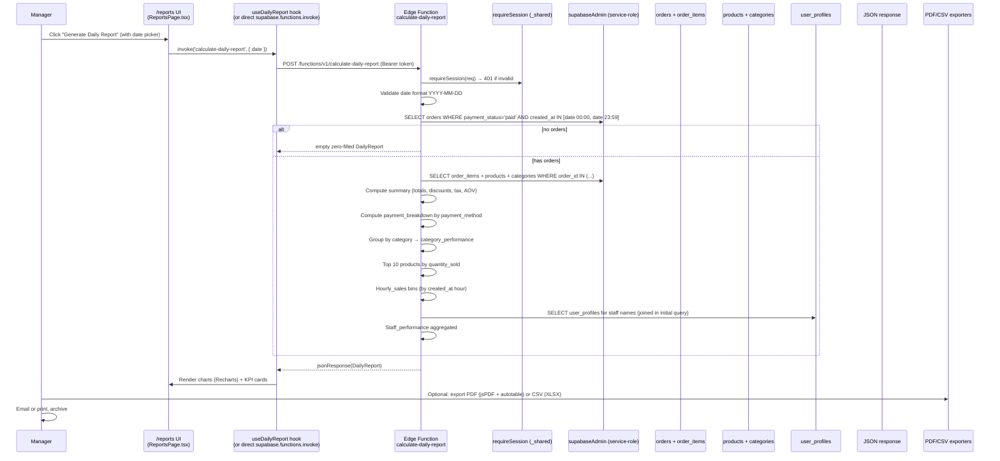

# 10 — End of Day (Daily Report)

> **Last verified**: 2026-05-03
> **Scope**: V2 monolith. Manager-triggered (or scheduled) generation of the daily sales report via the `calculate-daily-report` Edge Function, aggregating orders, payment breakdown, top products, hourly sales, and staff performance.
> **Related modules**: [04-modules/14-reports-analytics.md](../04-modules/14-reports-analytics.md), [04-modules/12-cash-register-shift.md](../04-modules/12-cash-register-shift.md), [04-modules/10-accounting-double-entry.md](../04-modules/10-accounting-double-entry.md)

---

## 1. Trigger

| Sub-event | Initiator | Permission | Cadence |
|---|---|---|---|
| **Manual** — manager clicks "Generate End-of-Day Report" in `/reports` or POS dashboard | Manager | `reports.financial` | Ad hoc, typically at closing time |
| **Cron** — service-role schedule fires once after midnight | Supabase scheduler | service-role bypass | Daily 00:05 WITA (configurable) |
| **Reprint / re-export** — manager re-runs the function with a past `date` parameter | Manager | `reports.financial` | Ad hoc backfill |

The Edge Function `calculate-daily-report` is invoked over HTTPS with `verify_jwt: true` (`supabase/functions/calculate-daily-report/config.toml`); the body is `{ "date": "YYYY-MM-DD" }` (defaults to "today" if omitted). Authenticated session required (`requireSession` helper in `_shared/session-auth.ts`).

---

## 2. Sequence diagram



---

## 3. Étapes détaillées

### 3.1 Invocation

| # | Acteur | Action | Fichier | Lignes |
|---|---|---|---|---|
| 1 | Manager | Opens `/reports` (`ReportsPage.tsx`) and selects "Daily Report" with date | `src/pages/reports/ReportsPage.tsx` | n/a |
| 2 | Hook | Calls `supabase.functions.invoke('calculate-daily-report', { body: { date } })` | `src/hooks/reports/` | n/a |
| 3 | EF entry | `serve(async (req) => …)` validates CORS + session | `supabase/functions/calculate-daily-report/index.ts` | 49-56 |
| 4 | EF | Validates date string matches `^\d{4}-\d{2}-\d{2}$`, defaults to `today` UTC if missing | id. | 59-63 |

### 3.2 Order aggregation

| # | Acteur | Action | Fichier | Lignes |
|---|---|---|---|---|
| 5 | EF | `SELECT id, order_number, total, subtotal, discount_amount, tax_amount, payment_method, staff_id, created_at, user_profiles!orders_staff_id_fkey(name) FROM orders WHERE payment_status='paid' AND created_at >= 'date T00:00:00' AND < 'date T23:59:59'` | `supabase/functions/calculate-daily-report/index.ts` | 66-83 |
| 6 | EF | If no orders, return zero-filled `DailyReport` shell | id. | 89-106 |
| 7 | EF | Bulk fetch `order_items` for `order_id IN (...)` joining `products → category_id → categories(name)` | id. | 109-123 |

### 3.3 Computation

| # | Aggregate | Formula | Lignes |
|---|---|---|---|
| 8 | `summary.total_orders` | `orders.length` | 127 |
| 9 | `summary.total_revenue` | `sum(orders.total)` | 128 |
| 10 | `summary.total_discounts` | `sum(orders.discount_amount)` | 129 |
| 11 | `summary.total_tax` | `sum(orders.tax_amount)` (PB1 component) | 130 |
| 12 | `summary.net_revenue` | `total_revenue − total_tax` | 134 |
| 13 | `summary.average_order_value` | `total_revenue / total_orders` | 135 |
| 14 | `payment_breakdown` | Filter by `payment_method` ∈ `{cash, card, qris, split}` | 138-143 |
| 15 | `category_performance` | Map by category name; `items_sold`, `revenue`; sorted by revenue DESC, with `percentage = revenue / total_revenue × 100` | 146-162 |
| 16 | `top_products` | Map by `product_name`; sorted by `quantity_sold` DESC; sliced to 10 | 165-180 |
| 17 | `hourly_sales` | Bucket by `new Date(created_at).getHours()`; orders + revenue per hour | 183-198 |
| 18 | `staff_performance` | Map by `user_profiles.name`; `orders_processed` + `total_sales`; sorted by total_sales DESC | 201-216 |

### 3.4 Output + downstream

| # | Acteur | Action | Fichier | Lignes |
|---|---|---|---|---|
| 19 | EF | Returns `DailyReport` JSON via `jsonResponse(report)` | `supabase/functions/calculate-daily-report/index.ts` | 218-228 |
| 20 | UI | Renders charts: bar (hourly), pie (payment_breakdown), table (top products), KPI cards (summary) | `src/pages/reports/components/` | n/a |
| 21 | Manager | Optional export: jsPDF + autotable for PDF, `xlsx` for spreadsheet, sonner toast on success | `src/services/reports/pdfExport.ts`, `csvExport.ts` | n/a |
| 22 | Manager | Optional email: handled outside this flow (Edge Function `send-test-email` for SMTP test only; production email path is manual share) | n/a | n/a |

---

## 4. Tables impactées

The Edge Function performs **read-only** aggregations. No table is mutated as part of end-of-day:

| Table | Operation | Notes |
|---|---|---|
| `orders` | SELECT WHERE `payment_status='paid'` AND date window | Service-role bypass; no RLS check |
| `order_items` | SELECT IN `order_id` list | Joined to `products` |
| `products` | SELECT (via embedded join) → `category_id` | Read-only |
| `categories` | SELECT (via nested join) → `name` | Read-only |
| `user_profiles` | SELECT via FK `orders_staff_id_fkey` → `name` | Staff-performance breakdown |

V2 does NOT persist the report itself in a `daily_reports` table — each invocation regenerates from raw data. This means:

- Reports are **always live** (no stale snapshot).
- Re-running for the same date yields the same result unless underlying orders changed (e.g., late voids).
- **No history** is kept of "what we sent the manager last night"; the PDF is the only artefact.

V3 will introduce a `daily_reports` materialised snapshot table for archival.

---

## 5. Journal entries

End-of-day generation does **NOT post journal entries**. JEs are posted continuously throughout the day by:

- `create_sale_journal_entry()` trigger on `orders.completed/voided` (`reference_type='sale'` / `'void'`)
- `create_sale_cogs_journal_entry()` (`reference_type='sale_cogs'`)
- `create_purchase_journal_entry()` on PO received
- `create_shift_close_journal_entry()` on shift close (`reference_type='shift_close'`, see flow 11)

The end-of-day report **reads** the cumulative effect via `tax_amount`, `discount_amount`, `total` columns — which were already journalised at order time. No reconciliation JE is created.

If the manager wants a "consolidated daily JE" view, they consult the General Ledger (`/accounting/journals`) filtered by `entry_date = report_date`. There is no separate "daily summary JE".

---

## 6. Cas d'erreur

| Code / Symptôme | Cause | Recovery |
|---|---|---|
| HTTP 401 / "Unauthorized" | Bearer token expired or missing | Re-login; ensure session active in client |
| HTTP 400 "date must be in YYYY-MM-DD format" | Body sent malformed date string | UI must zero-pad month/day; reject local-formatted strings |
| HTTP 500 "Failed to fetch orders" | Database unreachable, RLS misconfigured for service-role (rare), table corruption | Check Supabase logs; verify `supabaseAdmin` env vars in Edge Function |
| Zero-filled response on a busy day | `payment_status='paid'` filter excluded orders (e.g. `'pending'` outstanding orders) — by design | Confirm; outstanding orders are reported separately in POS Outstanding tab |
| Orders missing from a date you expected | Timezone — function uses UTC bounds (`'date T00:00:00'`) but Asia/Makassar (WITA) is +08:00; orders between 16:00 UTC and 23:59 UTC of day D-1 are excluded from D's window | **KNOWN LIMITATION** — for WITA-correct daily totals, supply `date` matching the WITA calendar day; UTC-based slicing causes a fixed 8-hour shift |
| `category_performance` shows `'Uncategorized'` for too many lines | Products lacking `category_id` or category name NULL | Backfill `categories.name`; clean `products.category_id` |
| Staff name `'Unknown'` | `user_profiles` row missing or FK resolved to NULL | Ensure cashiers have a `user_profiles` row with `name` populated |
| AOV = `Infinity` | `total_orders=0` but code path reached (race) | Should not occur — early-return at line 89 prevents division; if seen, file bug |
| Top products list very short | <10 distinct products sold that day | OK, slice(0,10) returns whatever exists |

---

## 7. Tests

| Type | Fichier | Coverage |
|---|---|---|
| Unit (Edge Function) | `supabase/functions/calculate-daily-report/__tests__/` (if present) | Aggregation logic |
| Manual | n/a | Run from Supabase Studio "Functions" panel with `{"date":"2026-05-02"}`, inspect JSON shape |
| E2E | n/a | None — Edge Function tests are excluded from CI in V2 (require live DB) |

**Known**: 9 pre-existing test failures in `authService.test.ts` are Edge-Function-related and skipped in CI. End-of-day function is similarly untested in CI; verified by manager workflow only.

---

## 8. Pitfalls

1. **UTC vs. WITA day boundary.** The function slices by UTC (`'date T00:00:00'` … `'date T23:59:59'`). The bakery operates in WITA (UTC+08:00), so a "Monday" in business reality = 16:00 UTC Sunday → 16:00 UTC Monday. Calling the function with `date='2026-05-03'` returns orders 00:00 UTC May 3 → 23:59 UTC May 3 — i.e., **08:00 WITA May 3 → 07:59 WITA May 4**. Operators must shift the input by 1 day or accept the drift. Tracked in `docs/audit/`.
2. **No persistence**. If the manager wants yesterday's report next month, they must re-run the function. Voids posted in between will change the historical answer. Always export PDF if archival matters.
3. **`payment_method='split'` short-circuit**. Split orders count under `split`, not under their composite payments. To get true cash vs. card split, query `order_payments` (the children) — the daily report's `payment_breakdown` is approximate for split orders.
4. **Excludes `payment_status != 'paid'` orders**. Outstanding (POS layaway) orders never appear; refunded orders that flipped status to `voided` also drop from the count. Use the dedicated Refunds Report for refunds.
5. **`user_profiles!orders_staff_id_fkey` join is implicit**. If the FK is renamed in a migration, the EF query breaks. Lock-step changes required.
6. **No deduplication on order items**. If a product is sold twice in a single order (two cart lines), they appear as separate `order_items` and aggregate normally. No bug, but verify `top_products` quantity reflects line sums.
7. **Hourly sales hour=0..23 in **local server time**.** `new Date(created_at).getHours()` uses the runtime's TZ, which on Deno Edge is UTC. So "hour 17" = 17:00 UTC = 01:00 next-day WITA. Charts must label accordingly or offset client-side.
8. **`requireSession` does NOT check permissions.** The function only verifies the JWT is valid; any authenticated user can call it. If sales numbers are sensitive, gate the UI by `reports.financial` and rely on UI-level access control.
9. **Service-role select bypasses RLS.** Even if app-level RLS hides certain orders (e.g. soft-deleted), the function sees them. Coordinate with RLS strategy when introducing soft-delete on `orders`.
10. **Linked flow**: shift close (`flow 11`) computes a sub-set of these aggregates per terminal/cashier, persisted in `shift_snapshots.payload`. Daily report is the sum across terminals + the day; do not compute "shift close × N" — durations and overlaps differ.

---

## 9. Configuration prerequisites

- Edge Function `calculate-daily-report` deployed (`supabase functions deploy calculate-daily-report`).
- `config.toml` for the function sets `verify_jwt = true` (required by SEC-006).
- `_shared/cors.ts`, `_shared/supabase-client.ts`, `_shared/session-auth.ts` helpers present.
- Env vars in Supabase project: `SUPABASE_URL`, `SUPABASE_SERVICE_ROLE_KEY`.
- `orders.payment_status` populated correctly (`'paid'` for completed orders).
- `orders.staff_id` FK to `user_profiles.id` valid; `user_profiles.name` populated.
- `products.category_id` FK valid; `categories.name` non-NULL for accurate breakdowns.
- Permission `reports.financial` granted to managers (UI gate).

---

## 10. Reports & analytics impact

- The daily report is **the** report — its output feeds the `/reports` page, the printed end-of-day summary, and the manager email digest (manual).
- Inputs cross-check against:
  - **Sales Summary by Period** (`reportingSalesService.ts`) — should match for same date.
  - **Payment Method Stats** (`reportingFinancialService.ts`) — should match `payment_breakdown`.
  - **Shift Z-Reports** (flow 11) — sum of all closed shifts for the date should equal `summary.total_revenue` (modulo cross-shift orders, refunds).
- KPIs surfaced:
  - Total revenue, net revenue (excl. tax), AOV
  - Payment method mix
  - Category mix (revenue + items)
  - Top 10 SKUs by quantity
  - Hourly load curve (peak hours)
  - Staff leaderboard

---

## 11. Observability

- Edge Function logs visible in Supabase Studio → Functions → `calculate-daily-report` → Logs.
- Sentry: client-side errors on `supabase.functions.invoke('calculate-daily-report', …)` failure; server-side errors logged to Supabase function logs (not Sentry).
- Latency: typical execution ~200-800 ms for ~200 orders/day; scales linearly with order volume.
- No metric/dashboard for invocation rate in V2; tracked via Supabase project monitoring.

---

## 12. Related flows

- [01 — POS Sale Cash](./01-pos-sale-cash.md) — orders that contribute to the daily total.
- [02 — POS Sale Split Payment](./02-pos-sale-split-payment.md) — split orders count under `payment_method='split'`.
- [03 — Void & Refund](./03-void-refund.md) — voids drop the order from the `payment_status='paid'` filter; refunds are tracked separately.
- [06 — B2B Order to Invoice](./06-b2b-order-to-invoice.md) — B2B orders that paid same-day appear in the report; layaway / open invoices do not.
- [11 — Shift Cash Reconciliation](./11-shift-cash-reconciliation.md) — per-terminal sub-totals; daily report is the union across terminals.
- [12 — Production & Stock Impact](./12-production-stock-impact.md) — production happens outside the daily-sales aggregate; production COGS appears in JE journals (filter `reference_type='production'`) but not in the function output.

---

## 13. Sample response shape

```json
{
  "date": "2026-05-02",
  "summary": {
    "total_orders": 187,
    "total_revenue": 4528000,
    "total_discounts": 124000,
    "total_tax": 411636,
    "net_revenue": 4116364,
    "average_order_value": 24214
  },
  "payment_breakdown": {
    "cash": 2150000,
    "card": 980000,
    "qris": 1248000,
    "split": 150000
  },
  "category_performance": [
    { "category_name": "Pastries",  "items_sold": 142, "revenue": 1875000, "percentage": 41.4 },
    { "category_name": "Coffee",    "items_sold": 98,  "revenue": 1620000, "percentage": 35.8 },
    { "category_name": "Bread",     "items_sold": 67,  "revenue": 1033000, "percentage": 22.8 }
  ],
  "top_products": [
    { "product_name": "Croissant",   "quantity_sold": 48, "revenue": 480000 },
    { "product_name": "Espresso",    "quantity_sold": 39, "revenue": 312000 }
  ],
  "hourly_sales": [
    { "hour":  7, "orders":  8, "revenue": 195000 },
    { "hour":  8, "orders": 22, "revenue": 521000 }
  ],
  "staff_performance": [
    { "staff_name": "Aurélie", "orders_processed": 92, "total_sales": 2240000 },
    { "staff_name": "Putu",    "orders_processed": 95, "total_sales": 2288000 }
  ]
}
```

All amounts in IDR. `percentage` rounded to 1 decimal in UI; raw float in API.
