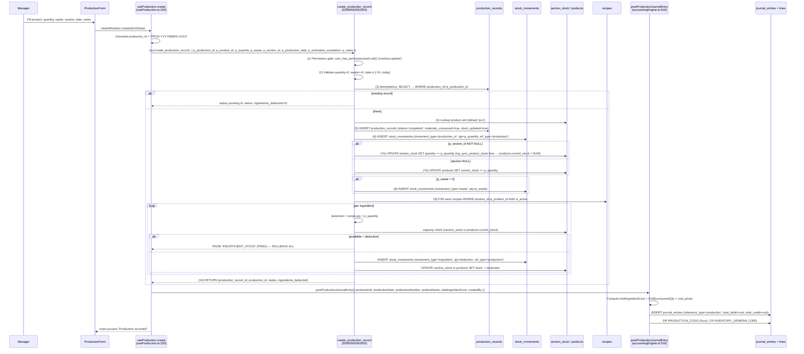

# 12 — Production & Stock Impact

> **Last verified**: 2026-05-03
> **Scope**: V2 monolith. A bakery production batch (e.g. 50 baguettes) is recorded by a manager, the recipe ingredients are deducted from raw-material stock, the finished product stock is incremented, stock_movements are logged, and a JE posts the COGS / inventory transfer.
> **Related modules**: [04-modules/15-production-recipes.md](../04-modules/15-production-recipes.md), [04-modules/06-inventory-stock.md](../04-modules/06-inventory-stock.md), [04-modules/10-accounting-double-entry.md](../04-modules/10-accounting-double-entry.md)

---

## 1. Trigger

| Sub-event | Initiator | Permission | Effect |
|---|---|---|---|
| **New production batch** | Manager (or shift lead) opens `/inventory/stock-production` → `ProductionForm`, picks a finished product, enters quantity + waste + section + date + notes, submits | `inventory.update` | Insert `production_records`, deduct ingredient stock, increment finished stock, post JE for ingredient cost |
| **Replay (idempotent)** | Same `production_id` re-submitted (network retry) | `inventory.update` | RPC returns the existing record without re-execution |
| **Backfill (past 7 days)** | Manager records a production retroactively for a date in `[CURRENT_DATE - 7 days, CURRENT_DATE]` | `inventory.update` | Same as new; production_date in the past |
| **Multi-row submit** | BackOffice Production tab batches several drafts (`Promise.allSettled`) | `inventory.update` | One RPC call per draft |

Two implementations coexist:

- **Application-side flow** (`useProduction.create`, `src/hooks/inventory/useProduction.ts:220-380`) — non-atomic, swallowed errors, used by V2 UI.
- **Atomic RPC** (`create_production_record`, migration `20260502061925`) — SECURITY DEFINER, all-or-nothing, idempotent, used by V3 BackOffice and recommended for new code.

---

## 2. Sequence diagram

---

## 3. Étapes détaillées

### 3.1 UI submission

| # | Acteur | Action | Fichier | Lignes |
|---|---|---|---|---|
| 1 | Manager | Opens `/inventory/stock-production` (`StockProductionPage.tsx`) | `src/pages/inventory/StockProductionPage.tsx` | n/a |
| 2 | Manager | Fills `ProductionForm`: product, quantity, waste (optional), batch_number, section, production_date, notes | `src/pages/inventory/components/ProductionForm.tsx` | n/a |
| 3 | Form | Submits → `useProduction().create.mutateAsync(formData)` | id. | n/a |
| 4 | Hook | Generates `productionId = 'PROD-YYYYMMDD-XXXX'` (timestamped + random suffix) | `src/hooks/inventory/useProduction.ts` | n/a |

### 3.2 Atomic RPC path (recommended)

| # | Step | Detail | Lignes |
|---|---|---|---|
| 1 | Permission gate | `IF v_caller IS NULL OR NOT public.user_has_permission(v_caller, 'inventory.update') THEN RAISE 42501` | `supabase/migrations/20260502061925_create_production_record_rpc.sql` 92-96 |
| 2 | Input validation | `quantity > 0`, `waste >= 0`, `production_date IN [CURRENT_DATE - 7 days, CURRENT_DATE]`, `production_id NOT NULL` | id. 98-116 |
| 3 | Idempotency | `SELECT id, status FROM production_records WHERE production_id = p_production_id` → return early if found | id. 118-133 |
| 4 | Product unit lookup | `SELECT unit FROM products WHERE id = p_product_id` (default `'pcs'`) | id. 135-143 |
| 5 | INSERT production_records | (status='completed', materials_consumed=TRUE, stock_updated=TRUE) RETURNING id | id. 146-174 |
| 6 | Stock movement (finished) | `INSERT stock_movements (movement_type='production_in', quantity=p_quantity, reference_type='production', reference_id=v_new_record_id)` | id. 177-198 |
| 7 | Update finished stock | If `p_section_id IS NOT NULL` → UPDATE `section_stock SET quantity += p_quantity`; else fallback UPDATE `products.current_stock += p_quantity` | id. 200-219 |
| 8 | Waste movement (optional) | If `p_waste > 0` → INSERT `stock_movements (movement_type='waste', quantity=p_waste)` | id. 223-247 |
| 9 | Recipe loop | `FOR v_recipe IN SELECT material_id, quantity AS recipe_qty, unit FROM recipes WHERE product_id=p_product_id AND is_active=TRUE` | id. 250-256 |
| 10 | Per-ingredient deduction | `v_deduction = recipe_qty × p_quantity`. Check available stock; if `< deduction` → `RAISE INSUFFICIENT_STOCK (P0001)` (rolls back ALL prior inserts/updates in the same transaction) | id. 258-290 |
| 11 | Movement (ingredient) | INSERT `stock_movements (movement_type='ingredient', quantity=v_deduction, reference_type='production', reference_id=v_new_record_id)` | id. 293-314 |
| 12 | Material stock update | UPDATE `section_stock` (if material has section) or `products.current_stock` (fallback) — decrement by `v_deduction` | id. 317-329 |
| 13 | Return | `RETURN QUERY (production_record_id, production_id, 'completed', ingredients_deducted)` | id. 333-340 |

### 3.3 Application-side flow (legacy `useProduction.create`)

The TS hook (`src/hooks/inventory/useProduction.ts:220-380`) performs the same steps as 4 separate Supabase calls:

| # | Operation | Risk |
|---|---|---|
| A | INSERT `production_records` | OK |
| B | INSERT `stock_movements` (`production_in`) + UPDATE `section_stock` / `products.current_stock` for finished product | If B fails, A's row is orphaned (no rollback) |
| C | SELECT `recipes`, then INSERT `stock_movements` (ingredients) + UPDATE stocks per ingredient | If C fails partially, some ingredients deducted while others not |
| D | `postProductionJournalEntry({ totalIngredientCost })` (computed from `cost_price × consumedQty` map) | If D fails, stock moved without JE |

Errors at B/C/D are `console.error`-swallowed. Replaced by the atomic RPC for V3 — V2 paths are preserved for backward compatibility (BO-019b-003 architectural decision D-019b-1).

### 3.4 Unit conversion (TS path only)

The TS hook applies `getUnitConversionFactor(recipeUnit, materialUnit)` (`src/hooks/inventory/useProduction.ts:289`) to convert recipe units → material units (e.g. recipe in `g`, material stocked in `kg`). The atomic RPC assumes `recipe.unit === material.unit` (D-019b-003-3 — MVP simplification; V3 will introduce a SQL `convert_unit()`).

### 3.5 Trigger interactions

| Trigger | When | Effect |
|---|---|---|
| `tr_update_product_stock` on `stock_movements` | DISABLED (DB-005, migration 20260210110000) | No-op — V2 explicitly drives stock via UPDATE rather than via stock_movement triggers (avoids double-counting) |
| `trg_sync_product_stock` on `section_stock` INSERT/UPDATE | Active | Sets `products.current_stock = SUM(section_stock.quantity)` automatically when section_stock changes — so updating section_stock alone is enough |
| `create_stock_movement_journal_entry` | Active for some movement types | Currently NOT triggered for `'production'` reference_type — JE is posted by application (`postProductionJournalEntry`) instead |

---

## 4. Tables impactées

| Table | Operations | Notes |
|---|---|---|
| `production_records` | INSERT 1 row per batch. UNIQUE constraint on `production_id` enables replay idempotency | Status `'completed'` immediately (no `'in_progress'` workflow in V2 batches) |
| `stock_movements` | INSERT 1 (`production_in`) + 1 (`waste`, optional) + N (`ingredient`, one per recipe row) | `reference_type='production'`, `reference_id = production_records.id` |
| `section_stock` | UPDATE (`quantity += p_quantity` for finished, `quantity -= deduction` for ingredients) when product has `section_id` | `trg_sync_product_stock` cascades to `products.current_stock` |
| `products` | UPDATE `current_stock` when no `section_id`, else read-only | Fallback path keeps `current_stock` authoritative for non-sectioned products |
| `recipes` | SELECT (`material_id`, `quantity`, `unit`) WHERE `product_id` AND `is_active=TRUE` | Source of truth for ingredient consumption |
| `journal_entries` | INSERT 1 row (`reference_type='production'`, `entry_number` prefix `'PR'`) | Total = ingredient cost |
| `journal_entry_lines` | INSERT 2 rows (DR `PRODUCTION_COGS` / CR `INVENTORY_GENERAL`) | Balanced |

---

## 5. Journal entries

### Production JE (posted by `postProductionJournalEntry`)

`src/services/accounting/accountingEngine.ts:516-539`

| Account | Mapping key | Debit | Credit |
|---|---|---|---|
| Production COGS (typically 5100 or 5xxx) | `PRODUCTION_COGS` | `totalIngredientCost` | 0 |
| Inventory — General (1300) | `INVENTORY_GENERAL` | 0 | `totalIngredientCost` |

Where `totalIngredientCost = Σ (consumedQty × products.cost_price)` for each recipe ingredient.

`reference_type='production'`, `reference_id = production_records.id`.

If `totalIngredientCost <= 0` (no recipe / cost_price all NULL), `postProductionJournalEntry` returns `{ success: false, error: 'Production cost must be positive' }` — the JE is **NOT posted** but stock movements still happen. This is acceptable for products without configured costs (common in early data) — accounts will show stock ↑ without COGS recognition.

---

## 6. Cas d'erreur

| Code / Symptôme | Cause | Recovery |
|---|---|---|
| `42501 — permission denied: inventory.update required` | Caller lacks the permission | Grant `inventory.update` to the user's role |
| `22023 — INVALID_QUANTITY: p_quantity must be > 0` | Form sent zero or negative | UI validation should prevent; defensive RPC raises |
| `22023 — INVALID_DATE: production_date must be within last 7 days` | Backfill > 7 days old | Use a manual stock adjustment (`/inventory/stock-adjustment`) instead |
| `P0001 — INSUFFICIENT_STOCK: not enough material X (need Y, have Z)` | Recipe demands more than available — entire transaction ROLLBACK (no partial deduction) | Receive PO first OR reduce production quantity OR record waste of remaining material |
| Replay returns `ingredients_deducted=0` | Same `production_id` re-submitted | Expected — idempotency. `0` here means "not re-deducted"; original call did the work |
| Stock not updated after success | `trg_sync_product_stock` not firing (check trigger enabled) | Inspect `pg_trigger` for `trg_sync_product_stock` on `section_stock` |
| JE not posted (TS path, swallowed) | `cost_price` zero on all ingredients OR `postProductionJournalEntry` returned `success:false` | Backfill `products.cost_price`; for past records, post a manual adjustment JE |
| Material stock goes negative (TS path) | Concurrent productions race on same material — TS path uses non-atomic UPDATEs | Use the atomic RPC instead. The RPC's pre-flight `v_available < v_deduction` check prevents negative stock |
| Recipe missing for product | `useProduction.create` proceeds without ingredient deduction (just adds finished stock) | Define a recipe in `/products/{id}/recipe` — productions before recipe was set will not retroactively deduct |
| Section_stock row missing | UPDATE in step 7a affects 0 rows; fallback to `products.current_stock` engages (`v_section_rows = 0 → UPDATE products`) | OK — RPC handles gracefully (line 212-219) |

---

## 7. Tests

| Type | Fichier | Coverage |
|---|---|---|
| Embedded SQL smoke | `supabase/migrations/20260502061925_create_production_record_rpc.sql` (lines 365-404) | TEST 1: function registered as SECURITY DEFINER; TEST 2: `authenticated` role has EXECUTE |
| Unit | `src/hooks/inventory/__tests__/useProduction.test.ts` (if present) | Form submission, optimistic UI, rollback handling |
| Manual E2E | n/a | Pick product with recipe, set qty, submit, verify: production_records row, stock_movements (1 production_in + N ingredients), section_stock or products.current_stock updated, JE posted with DR PRODUCTION_COGS / CR INVENTORY_GENERAL |
| Integration | n/a | Replay same `production_id` → expect early-return with `ingredients_deducted=0`; `INSUFFICIENT_STOCK` test with intentionally low stock |

---

## 8. Pitfalls

1. **Two paths, two safety levels.** The TS hook (`useProduction.create`) is non-atomic — partial failures leave inconsistent state. Use the atomic RPC `create_production_record` for any new code.
2. **`INSUFFICIENT_STOCK` rolls back EVERYTHING.** The RPC's `RAISE EXCEPTION` undoes the production_records INSERT, finished-stock UPDATE, prior ingredient deductions, etc. UI must show this clearly: "production cancelled, no stock changed". The TS path does NOT roll back — it leaves orphans.
3. **Recipe must exist for ingredient deduction.** A product without `recipes` rows produces finished stock but consumes nothing. Common gap: cleaning out `is_active=false` recipes by accident → silent over-production.
4. **`production_id` must be supplied by client and unique.** Format: `'PROD-YYYYMMDD-XXXX'`. The RPC enforces uniqueness for replay; the TS hook generates with timestamp + random — collisions extremely rare but possible across multiple managers in same second.
5. **Date range guard `[-7d, today]`.** Cannot record a future date; cannot backfill > 7 days. For older corrections use `/inventory/stock-adjustment` and post a manual JE.
6. **Unit conversion only in TS path.** The RPC assumes `recipe.unit === material.unit`. If you have a recipe in `g` for a material stocked in `kg`, the TS path converts (`getUnitConversionFactor`); the RPC will deduct 1000× too much. Ensure recipes match material units when using the RPC, OR call the TS path.
7. **`trg_sync_product_stock` is the cascade source.** When you UPDATE `section_stock`, do NOT also UPDATE `products.current_stock` — you'll double-count. The RPC follows the right pattern (UPDATE section_stock OR products, never both).
8. **`tr_update_product_stock` is intentionally DISABLED.** Don't re-enable it without coordinating — it would cause double-counting on every `stock_movements` INSERT (since the application also UPDATEs the stock columns).
9. **Waste tracking is informational only.** The `waste` movement is logged but does NOT separately reduce stock (the production_in only counted `p_quantity`, not `p_quantity + p_waste`). Reports treat waste as ingredient cost loss; fix in V3 if waste-as-deduction is needed.
10. **Cost price NULLs cause silent missing JE.** If any recipe ingredient has `cost_price=NULL` or 0, `totalIngredientCost` may be < total real cost. The JE posts with the partial cost (or skips entirely if zero). Audit reports can flag products with missing `cost_price`.
11. **Atomicity is per-transaction.** PL/pgSQL function bodies run inside the caller's transaction. A wrapping client transaction can extend rollback scope — but Supabase JS client doesn't expose explicit transactions, so practically the RPC body IS the transaction.
12. **Multi-row submit fan-out.** `Promise.allSettled([rpc1, rpc2, …])` processes each draft independently — one failure does NOT roll back the others. UI must surface per-draft status.
13. **No "in_progress" workflow.** V2 marks every batch `'completed'` instantly. There's no "started → completed" tracking; if you need that for a long bake, add `production_records.status` transitions in a follow-up story.

---

## 9. Configuration prerequisites

- `recipes` table populated with `(product_id, material_id, quantity, unit, is_active=TRUE)` rows for every produced product. Without recipes, productions add finished stock without consuming materials.
- `products` rows for both finished products AND raw materials, with `unit` set (e.g., `'pcs'`, `'kg'`, `'g'`, `'L'`).
- `products.cost_price` populated for every raw material — required for accurate JE; missing/zero cost_price → JE under-states or skips.
- `products.section_id` if using sectioned stock; else NULL (uses `products.current_stock` directly).
- `section_stock` rows seeded for every (product, section) combination expected.
- `accounting_mappings`: `PRODUCTION_COGS` → 5xxx COGS account, `INVENTORY_GENERAL` → 1300.
- Account 1300 (Inventory) and the COGS account must exist with `is_postable=TRUE`.
- `journal_entries.reference_type` CHECK includes `'production'`.
- Trigger `trg_sync_product_stock` ENABLED on `section_stock`.
- Trigger `tr_update_product_stock` DISABLED on `stock_movements` (per DB-005).
- Permission `inventory.update` granted to producers (managers / shift leads).

---

## 10. Reports & analytics impact

- **Production Report** (`ProductionReportTab.tsx`): batches per day, total produced, total waste, ingredient cost.
- **Production Efficiency** (`ProductionEfficiencyTab.tsx`): yield vs. recipe (actual vs. expected output), waste rate.
- **COGS by Production** (`COGSProductionTab.tsx`): production-related COGS breakdown by product, period.
- **Recipe Cost Analysis**: `Σ (recipe.qty × material.cost_price)` per finished product — shows margin if compared to `products.retail_price`.
- **Material Consumption**: `stock_movements WHERE movement_type='ingredient'` aggregated by material.
- **Stock Turnover (Production-driven)**: how fast finished products move from `production_in` to `out` (sale).

---

## 11. Observability

- `production_records.materials_consumed=TRUE` and `stock_updated=TRUE` indicate a successful run.
- Sentry: `useProduction.create` (`onError`) captures hook-side failures; the swallowed `console.error` in step B-D of TS path is a known gap (RPC path is preferred).
- `stock_movements.reference_type='production'` + `reference_id=production_record.id` enables forward/backward audit.
- JE chain: `journal_entries.reference_id = production_record.id, reference_type='production'`.
- No Realtime channel for `production_records` in V2 — UI invalidates `['production']` query on success.
- Embedded SQL smoke tests in migration `20260502061925` verify SECURITY DEFINER + EXECUTE grant on every deploy.

---

## 12. Related flows

- [04 — Purchase Order Cycle](./04-purchase-order-cycle.md) — POs replenish raw materials that productions consume.
- [05 — Stock Opname](./05-stock-opname.md) — periodic counts reconcile production drift; opname adjustments post separate JEs.
- [06 — B2B Order to Invoice](./06-b2b-order-to-invoice.md) — B2B orders typically pre-order produced items; production planning ahead.
- [10 — End of Day](./10-end-of-day.md) — daily report does NOT include production metrics; check `/reports/production` separately.
- [11 — Shift Cash Reconciliation](./11-shift-cash-reconciliation.md) — production happens outside shift cash (no cash impact); only JE impact via inventory.
