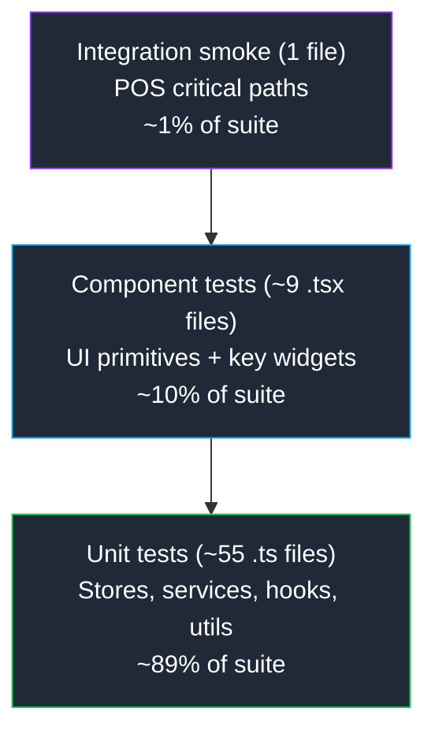

# 01 — Test Strategy

> **Last verified**: 2026-05-03

## Purpose

Codify how AppGrav V2 is tested today: stack, layers, ownership, and what is intentionally out of scope. This file is the canonical reference; the four sibling files drill into mechanics.

## Stack

| Tool | Version | Role |
|------|---------|------|
| `vitest` | 2.1.9 | Test runner (Vite-native, ESM, in-source `import.meta.env`) |
| `@vitest/coverage-v8` | 2.1.9 | V8 coverage provider (text + html + lcov reporters) |
| `jsdom` | 26.1.0 | Browser DOM for component tests |
| `@testing-library/react` | 16.3.1 | Component rendering + queries |
| `@testing-library/jest-dom` | 6.9.1 | Custom matchers (`toBeInTheDocument`, `toHaveClass`, ...) |
| `vitest run` (built into runner) | -- | CLI; no Jest, no Mocha, no Karma |

Source of truth: `package.json` `devDependencies` and `vite.config.ts` (`test` block lines 225-265).

## Inventory (counts)

| Metric | Value | Source |
|--------|-------|--------|
| Test files | 65 | `find src -name "*.test.ts" -o -name "*.test.tsx" \| wc -l` |
| `it(` / `test(` blocks | ~1438 | `grep -rE "^\s*(it\|test)\(" src --include="*.test.*" \| wc -l` |
| Test setup | `src/setupTests.ts` (1 line: `import '@testing-library/jest-dom'`) | `vite.config.ts` `test.setupFiles` |
| Default timeout | 15 000 ms | `vite.config.ts` `test.testTimeout` |
| Excluded paths | `**/node_modules/**`, `.claude/worktrees/**`, `breakery-platform/**` | `vite.config.ts` `test.exclude` |

Note: CLAUDE.md cites "~1770 tests, 71 files" — this reflected an earlier audit (2026-04). The figures above are live counts at 2026-05-03 and supersede the CLAUDE.md narrative for documentation purposes.

## Test pyramid



| Layer | Examples | Patterns |
|-------|----------|----------|
| **Unit** | `src/stores/__tests__/cartStore.test.ts`, `src/services/payment/__tests__/paymentService.test.ts`, `src/hooks/inventory/__tests__/useLocations.test.ts` | Pure functions, store actions, hook logic with mocked Supabase |
| **Component** | `src/components/lan/__tests__/LanConnectionIndicator.test.tsx`, `src/components/orders/__tests__/OrderItemStatusBadge.test.tsx`, `src/pages/dashboard/__tests__/DashboardPage.test.tsx` | Render via Testing Library; assert on roles/labels |
| **Integration smoke** | `src/__tests__/smoke/pos-smoke.test.ts` | Cash checkout, split payment, void/refund, offline sync — all with mocked Supabase |

## What is NOT tested in V2

| Out of scope | Reason | Mitigation |
|--------------|--------|-----------|
| Browser E2E (Playwright / Cypress) | No tooling installed; cost vs. benefit not justified for a 20-user app | Manual smoke checklist before each release; production Sentry replays |
| Visual regression | No snapshot infra; design is iterating | Manual UAT in staging-like Vercel preview |
| Real Supabase round-trips | Would require a dedicated test project + seed data | All Supabase calls are mocked at the client boundary; preview branches (`supabase-branch.yml`) cover schema |
| Edge Function execution | Deno runtime, separate from Vitest | 9 tests in `authService.test.ts` skip live calls (see `04-known-failures.md`); manual cURL during deploy |
| Capacitor / Android UI | No emulator in CI | Manual Android device testing prior to APK release |

## Conventions

- **Naming**: `<file>.test.ts` (unit) / `<file>.test.tsx` (component). Colocated `__tests__/` subfolders keep the source tree clean (e.g. `src/services/payment/__tests__/paymentService.test.ts`).
- **Imports**: always use the `@/` alias (`@/stores/cartStore`), never relative `../../../`.
- **Assertions**: prefer `expect(...).toBe(...)` for primitives, `toEqual` for objects, `toMatchObject` for partial matches. Avoid `toMatchSnapshot` — see `03-component-tests.md`.
- **Async**: every `async` it-block must `await` its assertion; a missing `await` is the #1 cause of flaky tests in this repo.
- **Mocks**: `vi.mock('@/lib/supabase', () => ({ supabase: { ... } }))` at the top of the file; reset with `beforeEach(() => vi.clearAllMocks())`.

## Coverage policy

The `vite.config.ts` thresholds (statements/lines 8%, branches/functions 6%) are intentionally low. They are **ratchet floors** that block regressions, not aspirational targets.

| Metric | Floor (config) | Reality (2026-04-24) | Direction |
|--------|---------------|----------------------|-----------|
| Statements | 8% | 8.14% | Ratchet UP only |
| Lines | 8% | 8.14% | Ratchet UP only |
| Branches | 6% | ~6.5% | Ratchet UP only |
| Functions | 6% | ~6.5% | Ratchet UP only |

Rule (from `vite.config.ts` lines 244-254): when new tests land and coverage rises, raise the floor; never lower it.

## Ownership

| Layer | Owner | Review trigger |
|-------|-------|---------------|
| Unit (services, stores, utils) | Dev who wrote the code | Required in PR |
| Component | Same | Required in PR for new UI |
| Smoke | Whoever touches `src/__tests__/smoke/` | Required in PR |
| Coverage threshold bump | Reviewer | After merge if coverage increased |

## CI integration

`/.github/workflows/ci.yml` job `test` runs on every push to `master` and every PR:

```yaml
- name: Run tests with coverage
  run: npx vitest run --coverage
- name: Upload coverage report
  uses: actions/upload-artifact@...
  with:
    name: coverage-report
    path: coverage/
    retention-days: 14
```

Coverage HTML is downloadable from the GitHub Actions run page for 14 days.

## Files in this folder

| File | Topic |
|------|-------|
| `01-test-strategy.md` | This file |
| `02-unit-tests.md` | Unit-test patterns by domain (stores, services, hooks, utils) |
| `03-component-tests.md` | Testing Library setup + render-with-providers wrapper |
| `04-known-failures.md` | The 9 `authService.test.ts` failures + mitigation |
| `05-running-tests.md` | All `npm run` / `npx vitest` invocations + CI debugging |
