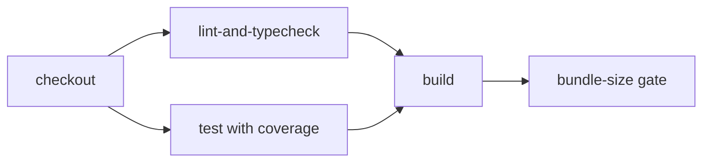

# 05 — Running Tests

> **Last verified**: 2026-05-03

## Quick reference

| Command | What it does |
|---------|--------------|
| `npx vitest run` | Run the full suite once, exit on completion |
| `npx vitest` | Watch mode (re-runs on file change) |
| `npx vitest --watch` | Same as above (explicit) |
| `npx vitest run <path>` | Run a single file or folder |
| `npx vitest run -t "pattern"` | Run only tests whose name matches the pattern |
| `npx vitest run --coverage` | Run with V8 coverage; outputs to `coverage/` |
| `npm run test:smoke` | Run only `src/__tests__/smoke/pos-smoke.test.ts` |
| `npm run test:claude` | Run the Claude API integration script (`scripts/test-claude.ts`) — not a Vitest run |

## Running the whole suite

```bash
npx vitest run
```

Expected: ~65 files, ~1438 test cases, completes in 30-60 seconds on a developer laptop. The 9 failures in `authService.test.ts` are expected — see `04-known-failures.md`.

## Running a single file

```bash
# Specific file
npx vitest run src/services/payment/__tests__/paymentService.test.ts

# All tests in a folder
npx vitest run src/services/payment

# All component tests for one feature
npx vitest run src/components/lan
```

The path is matched as a glob substring — `vitest run payment` matches every file with `payment` in its path.

## Filtering by test name

```bash
# Only tests whose name contains "split payment"
npx vitest run -t "split payment"

# Combine: only tests in payment folder named "split payment"
npx vitest run src/services/payment -t "split payment"
```

## Watch mode

```bash
npx vitest
```

Vitest stays attached, re-runs only the tests affected by file changes. Useful keys in the interactive prompt:

| Key | Action |
|-----|--------|
| `a` | Run all tests |
| `f` | Run only failed tests |
| `p` | Filter by filename pattern |
| `t` | Filter by test-name pattern |
| `q` | Quit |

## Coverage

```bash
npx vitest run --coverage
```

Outputs:

| File | Purpose |
|------|---------|
| `coverage/index.html` | Browseable HTML report (open in a browser) |
| `coverage/lcov.info` | LCOV format for CI tools |
| `coverage/coverage-final.json` | Raw V8 data |

Coverage thresholds (statements/lines 8%, branches/functions 6%) live in `vite.config.ts` lines 244-255. Falling below the floor exits non-zero. Raise the floor when reality exceeds it; never lower it.

## Smoke test

```bash
npm run test:smoke
# == npx vitest run src/__tests__/smoke/pos-smoke.test.ts
```

Covers POS critical paths: cash checkout, split payment, void, refund, offline sync. ~30 seconds. Intended for pre-deploy sanity-checking; CI runs it automatically as part of the full suite.

## Debugging a failing test

### Add `console.log`

Vitest does not suppress `console.log` by default. Drop one in your test, run with `--reporter verbose` for a clear timeline:

```bash
npx vitest run path/to/file.test.ts --reporter verbose
```

### Use Node inspector

```bash
node --inspect-brk ./node_modules/vitest/vitest.mjs run path/to/file.test.ts
```

Then open `chrome://inspect` in Chrome and attach. Set breakpoints in DevTools.

### Run only one test

Append `.only`:

```ts
it.only('reproduces the bug', () => {
  // ...
});
```

CI rejects committed `.only` blocks via ESLint (`vitest/no-focused-tests`).

### Inspect the rendered DOM

In a component test:

```ts
import { screen } from '@testing-library/react';

it('debug the tree', () => {
  render(<MyComponent />);
  screen.debug();          // print the whole document
  screen.debug(screen.getByRole('button')); // print only one element
});
```

## CI pipeline

`.github/workflows/ci.yml` runs three jobs in sequence on every push to `master` and every PR:



| Job | Steps | Failure exit code |
|-----|-------|-------------------|
| `lint-and-typecheck` | `npx tsc -b` then `npm run lint` (`eslint . --max-warnings 80`) | 1 if TypeScript or ESLint fails |
| `test` | `npx vitest run --coverage`, uploads `coverage/` artifact (14-day retention) | 1 if any new failure |
| `build` | `npm run build`, then `gzip` size check (fails if total > 2 MB) | 1 if bundle too large |

Node version: 22 (set in workflow). Local development should use Node ≥ 22.12.0 (enforced by `package.json` `engines`).

Other workflows in `.github/workflows/`:
- `breakery-platform-ci.yml` — V3 monorepo; ignores V2 paths
- `lighthouse.yml` — V3 CaissApp performance gate; not V2
- `supabase-branch.yml` — creates Supabase preview branches when `supabase/migrations/**`, `supabase/functions/**`, or `breakery-platform/**` change

## Pre-commit

The repo uses Claude Code hooks (defined in `.claude/settings.json`):

| Hook | Trigger | Action |
|------|---------|--------|
| `protect-files.sh` | Pre-edit | Blocks edits to `.env`, lock files, `database.generated.ts` |
| `auto-lint.sh` | Post-edit | Runs `eslint --fix` on saved `.ts` / `.tsx` files |

There is **no Husky / lefthook**. Tests are not run pre-commit — devs are expected to run `npx vitest run` before pushing. CI is the enforcement gate.

## Test-only scripts

| Script | Path | Purpose |
|--------|------|---------|
| `test:claude` | `scripts/test-claude.ts` | Smoke test for the Claude API proxy (`claude-proxy` Edge Function); requires `ANTHROPIC_API_KEY` |
| `test:smoke` | (see above) | Vitest run scoped to POS critical paths |

`scripts/` also contains many one-off diagnostic scripts (`check-kds.ts`, `verify_db.js`, ...) — these are not part of the test suite, see `docs/v2-reference/12-appendices/` for an inventory.

## Common errors

| Error | Cause | Fix |
|-------|-------|-----|
| `Cannot find module '@/lib/supabase'` | Path alias not picked up | Make sure `vitest` is invoked from repo root; `vite.config.ts` resolves `@` |
| `ReferenceError: window is not defined` | Test runs in Node env, not jsdom | Confirm `vite.config.ts` `test.environment: 'jsdom'`; not a per-file override |
| `Test timed out in 15000ms` | Async assertion missing `await`, or react-query retry loop | Add `await waitFor(...)`; set `retry: false` on the test QueryClient |
| Tests pass solo, fail in suite | Stateful Zustand or singleton mock | Reset state in `beforeEach`; use `vi.clearAllMocks()` |
| `act() warning` flood | Direct `setState` outside Testing Library helpers | Use `userEvent.setup()` and await its actions |

## Cross-references

- Test patterns: `02-unit-tests.md`, `03-component-tests.md`
- The 9 expected failures: `04-known-failures.md`
- CI configuration: `.github/workflows/ci.yml`
- Coverage threshold rationale: `vite.config.ts` lines 244-255
