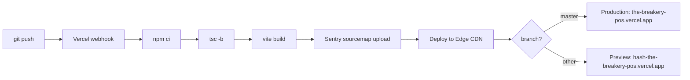

# 01 — Vercel Deployment

> **Last verified**: 2026-05-03

## Production URL

`https://the-breakery-pos.vercel.app/`

V2 is a Vite + React SPA — **not** Next.js. Ignore Next.js-specific deployment patterns (App Router, `'use client'`, edge runtime, ISR). Vercel hosts the static `dist/` output behind its CDN with the SPA-rewrite rule defined in `vercel.json`.

## Build pipeline

| Stage | Command | Source |
|-------|---------|--------|
| Install | `npm ci` (Vercel default for `package-lock.json`) | -- |
| Build | `npm run build` | `package.json` → `tsc -b && vite build` |
| Output | `dist/` | `vite.config.ts` build target |
| Node version | 22 (declared in `package.json` `engines.node`) | Vercel auto-detects |

The build runs `tsc -b` (composite TypeScript build) before `vite build`. A type error fails the deploy. The Sentry Vite plugin uploads sourcemaps to the `the-breakery / appgrav-v2` Sentry project as the very last build step, gated on `SENTRY_AUTH_TOKEN`.



## `vercel.json`

The repo file does three things:

1. **SPA rewrite** — every non-asset path falls through to `/index.html` so React Router handles routing client-side:
   ```json
   "rewrites": [{ "source": "/((?!assets/).*)", "destination": "/index.html" }]
   ```
2. **Long-cache headers** — `/assets/*.css` and `/assets/*.js` are immutable for one year (Vite hashes filenames so this is safe).
3. **Security headers** — applied to every response:
   - `X-Frame-Options: DENY`
   - `X-Content-Type-Options: nosniff`
   - `Referrer-Policy: strict-origin-when-cross-origin`
   - `Permissions-Policy: camera=(), microphone=(), geolocation=()`
   - `Strict-Transport-Security: max-age=31536000; includeSubDomains`
   - `Content-Security-Policy` (allows Supabase, Sentry, Google Fonts, Anthropic, and `localhost:3001` for the local print server)

Edit `vercel.json` for any header / CSP change; do not configure these in the Vercel dashboard (single source of truth).

## Environment variables

Set in Vercel dashboard → Project → Settings → Environment Variables. They must be present in **every** environment (Production, Preview, Development) where you expect them:

| Variable | Required | Where used | Source of value |
|----------|----------|-----------|------|
| `VITE_SUPABASE_URL` | yes | Browser bundle | Supabase dashboard → Project settings → API |
| `VITE_SUPABASE_ANON_KEY` | yes | Browser bundle | Supabase dashboard → Project settings → API |
| `VITE_SENTRY_DSN` | recommended | Browser bundle (Sentry init) | Sentry → Settings → Client Keys |
| `SENTRY_AUTH_TOKEN` | recommended | Build-time only (sourcemap upload) | Sentry → User auth tokens (org-scoped) |
| `VITE_APP_VERSION` | optional | Sentry release tag | Set automatically by CI to commit SHA |
| `VITE_APP_CONTEXT` | optional | Subdomain override (`pos`, `backoffice`, ...) | Per-deploy |

`VITE_*` variables are **inlined into the bundle at build time**. To rotate them you must redeploy; updating the Vercel UI alone does nothing.

`SENTRY_AUTH_TOKEN` is a **build-only secret** — keep it scoped to "Production" and "Preview", never to "Development" (where it would leak via local builds).

## Preview deployments

Every PR opened against `master` triggers a preview deployment at `https://<branch-hash>-the-breakery-pos.vercel.app`. The Vercel GitHub integration posts the URL as a check on the PR.

Use preview deploys for:
- Visual review of UI PRs (UAT in real Vercel infra)
- Verifying Supabase preview-branch wiring (when `supabase-branch.yml` workflow created a paired branch)
- Sharing work-in-progress with the bakery team

## Custom domain

The current production URL uses the auto-generated `*.vercel.app` subdomain. If a custom domain is added later (e.g. `pos.thebreakery.id`):
1. Vercel dashboard → Domains → Add domain.
2. Configure DNS at the registrar (CNAME to `cname.vercel-dns.com` for subdomains, A record to `76.76.21.21` for apex).
3. Update the Supabase project's allowed redirect URLs (Auth → URL configuration).
4. Update `vercel.json` CSP `connect-src` if any new origins join the mix.

## Build hooks

None configured today. If a Supabase migration deploy needs to trigger a Vercel rebuild (e.g. to refresh build-time data), create a Build Hook in Vercel → Settings → Git → Deploy Hooks and POST to it from a CI step.

## Rollback

| Method | When |
|--------|------|
| Vercel dashboard → Deployments → previous deploy → "Promote to Production" | First-line response for a bad release; no rebuild, instant DNS swap |
| `git revert <bad-commit>` then push | When you also want the source repo to reflect the rollback |
| Re-deploy a known-good commit via CLI: `vercel deploy --prod` from that commit | Rare; use only if the dashboard shortcut is unavailable |

A promoted previous deploy keeps its original assets (Vite-hashed filenames), so users mid-session won't see broken chunks. Service-worker caching may serve stale `index.html` for ~1 day to PWA-installed users — see `vite.config.ts` Workbox settings.

## Vercel CLI (optional, for ops)

```bash
npm i -g vercel
vercel login
vercel link               # link local repo to the the-breakery-pos project
vercel env pull .env.local # pull current env vars into a local file
vercel deploy --prod      # deploy current directory to production (rare; CI normally handles this)
```

## V3 helper script

`scripts/setup-vercel-projects.sh` is referenced in CLAUDE.md but it provisions the **V3** Vercel projects (CaissApp, BackOffice, Kitchen, Comptable). It does not touch the V2 project; ignore it for V2 ops.

## Health check

After every deploy, manually verify:

| Check | Command / URL |
|-------|---------------|
| Index loads | `curl -I https://the-breakery-pos.vercel.app/` → 200 |
| Headers correct | `curl -I https://the-breakery-pos.vercel.app/` → check `Content-Security-Policy` |
| Assets cacheable | `curl -I https://the-breakery-pos.vercel.app/assets/<hash>.js` → `Cache-Control: max-age=31536000` |
| Sentry release tagged | Sentry → Releases → expect new entry with commit SHA |
| Supabase reachable | Open `/pos`, log in with PIN, verify cart loads |

## Common deploy failures

| Symptom | Likely cause | Fix |
|---------|-------------|-----|
| Build fails with `tsc` error | Type drift after a migration | Run `/gen-types` locally, commit, redeploy |
| Build OK, white screen in production | CSP blocks a new origin | Add to `vercel.json` `Content-Security-Policy` `connect-src` / `script-src` |
| 404 on a deep link | SPA rewrite missing | Confirm `vercel.json` rewrites rule is intact |
| Sentry sourcemaps missing | `SENTRY_AUTH_TOKEN` env var unset for environment | Add it in Vercel dashboard, redeploy |
| Bundle > 2 MB CI failure | New dep blew the budget | Run `ANALYZE=true npm run build` locally to find the culprit |

## Cross-references

- Supabase env IDs and connection strings: `02-supabase-environments.md`
- Sentry monitoring runbook: `07-monitoring-runbook.md`
- Incident response (rollback playbook): `08-incident-response.md`
