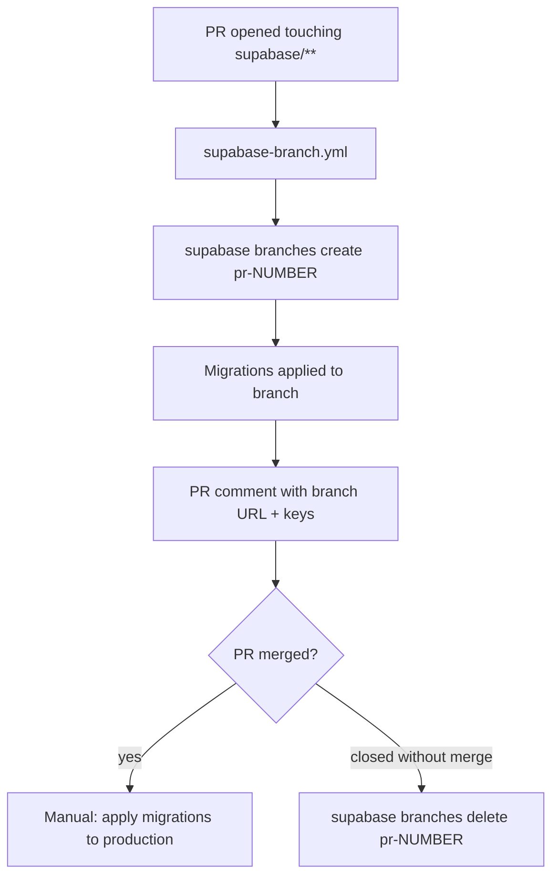

# 02 — Supabase Environments

> **Last verified**: 2026-05-03

## Production project

| Field | Value |
|-------|-------|
| Project name | `the-breakery-pos` |
| Project ID | `abjabuniwkqpfsenxljp` |
| URL | `https://abjabuniwkqpfsenxljp.supabase.co` |
| Region | `ap-southeast-1` (Singapore — geographically nearest to Lombok, Indonesia) |
| Postgres major version | 17 (declared in `supabase/config.toml` line 31) |
| Auth model | PIN-based via custom Edge Functions; Supabase Auth `verifyOtp` is the underlying primitive |
| Tier | Verify in dashboard → Settings → Subscription. Sized for ~200 tx/day, ~20 active users |

V2 uses **one** Supabase project. There is no separate staging environment — risky changes are validated via Supabase **branches** (preview environments spun up per PR by `.github/workflows/supabase-branch.yml`).

## Linking the local CLI

```bash
# One-time
supabase login                # opens browser for SSO
supabase link --project-ref abjabuniwkqpfsenxljp

# Confirm
supabase projects list        # the linked project shows a • marker
```

The CLI version is pinned to **2.90.0** in CI (`.github/workflows/supabase-branch.yml` env `SUPABASE_CLI_VERSION`). Match the same version locally:

```bash
brew install supabase/tap/supabase     # or download a pinned release from GitHub
supabase --version                     # expect 2.90.0
```

## Local development

```bash
# Start a full local Supabase stack (Postgres + Auth + Realtime + Edge Functions)
supabase start

# Stop it
supabase stop

# Reset the local DB to the migration baseline
supabase db reset
```

`supabase/config.toml` declares ports for the local stack (54321 API, 54322 DB, 54320 shadow). `supabase start` will print the local anon/service keys once the stack is up — copy them into a `.env.local` if you want the V2 dev server to talk to the local stack instead of production.

## Branches (preview environments)

`.github/workflows/supabase-branch.yml` triggers on PRs that touch `supabase/migrations/**`, `supabase/functions/**`, or `breakery-platform/**`. It:

1. Creates a Supabase branch (`supabase branches create pr-<num>`).
2. Applies all pending migrations to the branch's isolated Postgres + Storage.
3. Posts the branch's connection details as a PR comment.
4. On PR close, deletes the branch.



Use branches for any migration that:
- Adds a column to a hot table.
- Backfills data.
- Changes an enum or RLS policy.
- Touches a trigger that fires on every order.

## Backups

Supabase managed backups (configured in dashboard → Database → Backups):

| Tier-default policy | Frequency | Retention |
|---------------------|-----------|-----------|
| Daily snapshot | every 24h | 7 days (Pro) or longer (Team/Enterprise) |
| PITR (Point-in-time recovery) | continuous | 7-day window when enabled |

Verify the active retention in the dashboard; if PITR is not enabled, it is the single biggest gap in our DR posture.

**Manual backup before risky migration**:

```bash
supabase db dump --linked --schema public > backup-$(date +%Y%m%d-%H%M).sql
```

Stores the public schema (all tables + functions + RLS) to a local file. Keep these in `~/breakery-backups/`, never commit them.

## Connection limits

Postgres has a connection cap (varies by tier; ~60 direct connections for Pro). The V2 SPA uses Supabase's REST/Realtime layer which pools connections at the gateway, so the cap is a non-issue for the browser fleet. It matters when:

- Edge Functions spike concurrently (each `createClient` opens a connection).
- A migration tool (e.g. `supabase db push`) holds a long lock.
- Local devs run scripts in `scripts/` that connect directly via `psql`.

Mitigation: use the **transaction pooler** (`pooler.supabase.com:6543`) instead of the direct port for any long-running script — Supabase exposes both connection strings in the dashboard.

## Secrets and keys

| Key | Where it lives | Rotation procedure |
|-----|---------------|-------------------|
| `anon` key | `VITE_SUPABASE_ANON_KEY` (Vercel + `.env`) | Dashboard → Settings → API → "Reset anon key"; redeploy V2 |
| `service_role` key | Edge Functions only (never browser) | Dashboard → Settings → API → "Reset service role"; redeploy any Edge Function that uses it |
| `SUPABASE_ACCESS_TOKEN` | CI secret (used by `supabase-branch.yml`) | `supabase login` → re-mint via dashboard → update GitHub repo secret |
| Edge Function secrets (`ANTHROPIC_API_KEY`, etc.) | `supabase secrets set ...` | See `06-edge-functions-deploy.md` |

**Never commit any of these.** `protect-files.sh` (Claude Code hook) blocks edits to `.env`, but it does not protect against accidental `git add .env`.

## Schema management

| Concern | Tool | Reference |
|---------|------|-----------|
| Create migration | `supabase migration new <slug>` or `/create-migration` skill | `05-database-migrations-deploy.md` |
| Apply to prod | `supabase db push --linked` or dashboard SQL editor | `05-database-migrations-deploy.md` |
| Regenerate types | `supabase gen types typescript --linked > src/types/database.generated.ts` or `/gen-types` skill | -- |
| Inspect | `supabase migration list --linked` | -- |

## Realtime channels in use

V2 subscribes to several Realtime channels — keep them in mind when sizing the project:

| Channel | Source | Purpose |
|---------|--------|---------|
| `lan-hub` | `src/services/lan/lanHub.ts` | Hub broadcasts to LAN clients |
| `kds-orders` | KDS hooks | Live KDS queue updates |
| `display-orders` | Display hooks | Customer display order ready notifications |
| `pos-orders` | POS terminal listeners | Cross-terminal order sync |

Realtime quotas (concurrent connections, messages/second) are tier-bound. ~20 users with ~5 channels each = ~100 concurrent → comfortably within Pro tier.

## Health check

```bash
# Reachable?
curl -I https://abjabuniwkqpfsenxljp.supabase.co/rest/v1/

# Auth endpoint?
curl https://abjabuniwkqpfsenxljp.supabase.co/auth/v1/health

# DB query (requires service key)
psql "postgresql://postgres:<service-key>@db.abjabuniwkqpfsenxljp.supabase.co:5432/postgres" -c "SELECT NOW();"
```

## Cross-references

- Migrations workflow: `05-database-migrations-deploy.md`
- Edge Functions deploy: `06-edge-functions-deploy.md`
- Vercel env-var wiring: `01-vercel-deployment.md`
- Monitoring (Postgres logs, function logs): `07-monitoring-runbook.md`
