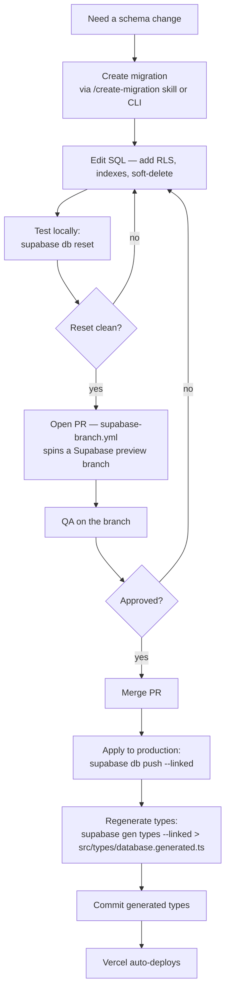

# 05 — Database Migrations Deploy

> **Last verified**: 2026-05-03

## Inventory

| Metric | Value | Source |
|--------|-------|--------|
| Migrations on disk | 223 | `ls supabase/migrations/ \| wc -l` |
| Naming convention | `YYYYMMDDHHMMSS_<slug>.sql` | Supabase CLI default |
| Project linked | `abjabuniwkqpfsenxljp` | `supabase/.temp/project-ref` after `supabase link` |
| Postgres version | 17 (set in `supabase/config.toml` line 31) | -- |
| Generated types target | `src/types/database.generated.ts` | Repo-wide convention; protected by `protect-files.sh` hook |

## End-to-end workflow



## Step 1 — Create the migration

**Preferred**: invoke the project skill which scaffolds RLS, indexes, soft-delete columns:

```
/create-migration <slug>
```

**Manual fallback**:

```bash
supabase migration new <slug>
# creates supabase/migrations/<timestamp>_<slug>.sql
```

The generated file is empty. Edit it to include:

```sql
-- 1. The schema change
CREATE TABLE public.<table_name> (
  id UUID PRIMARY KEY DEFAULT gen_random_uuid(),
  -- columns ...
  created_at TIMESTAMPTZ NOT NULL DEFAULT NOW(),
  updated_at TIMESTAMPTZ NOT NULL DEFAULT NOW(),
  deleted_at TIMESTAMPTZ NULL  -- soft delete
);

-- 2. Indexes (FK + soft-delete partial)
CREATE INDEX idx_<table>_<fk> ON public.<table_name>(<fk_column>);
CREATE INDEX idx_<table>_active ON public.<table_name>(id) WHERE deleted_at IS NULL;

-- 3. RLS — REQUIRED for every new table
ALTER TABLE public.<table_name> ENABLE ROW LEVEL SECURITY;

CREATE POLICY "Authenticated read" ON public.<table_name>
  FOR SELECT USING (public.is_authenticated());

CREATE POLICY "Permission-based write" ON public.<table_name>
  FOR INSERT WITH CHECK (public.user_has_permission(auth.uid(), '<module>.create'));

CREATE POLICY "Permission-based update" ON public.<table_name>
  FOR UPDATE USING (public.user_has_permission(auth.uid(), '<module>.update'));

-- 4. updated_at trigger
CREATE TRIGGER set_updated_at BEFORE UPDATE ON public.<table_name>
  FOR EACH ROW EXECUTE FUNCTION public.set_updated_at();
```

CLAUDE.md reiterates: **every new table MUST have RLS enabled + policies — no exceptions**.

## Step 2 — Test locally

```bash
# Boot the local Supabase stack
supabase start

# Apply ALL migrations from scratch — exposes ordering bugs
supabase db reset

# Run V2 against the local stack (point .env.local at the local URL+key)
npm run dev
```

`supabase db reset` drops the local DB, recreates it, and re-runs every migration in order. Use it as your safety check that the new migration plays nicely with the existing 222 ahead of it.

## Step 3 — Open the PR (Supabase preview branch fires)

Pushing the migration to a PR triggers `.github/workflows/supabase-branch.yml` (gated on `supabase/migrations/**` paths). It:

1. Creates a Supabase branch named `pr-<num>` against the production project.
2. Applies all pending migrations to the branch (isolated DB + storage).
3. Comments on the PR with the branch's URL and keys.

Use the branch URL to QA the change end-to-end (e.g. point a local checkout at the branch, exercise the affected feature). When the PR closes, the branch is auto-deleted.

## Step 4 — Apply to production

After PR merge:

```bash
# Option A — CLI (preferred, scriptable)
supabase db push --linked

# Option B — dashboard SQL editor (for one-off hot-fixes)
# Supabase Studio → SQL Editor → paste migration content → Run
# WARNING: this skips the migration_history table — you must also INSERT a
# row into supabase_migrations.schema_migrations or the next CLI push will
# try to re-apply it
```

`supabase db push --linked` reads the linked project ref, diffs `supabase/migrations/` against the remote `supabase_migrations.schema_migrations` table, and applies any missing files in order.

## Step 5 — Regenerate TypeScript types

```bash
# Preferred — uses the project skill
/gen-types

# Manual
supabase gen types typescript --linked > src/types/database.generated.ts
```

The generated file is **protected by `protect-files.sh`** — the hook blocks edits to it from the AI assistant. Regenerate it with the CLI, commit, push.

If you skip this step, TypeScript will start failing in CI within hours of the next person trying to consume the new schema.

## Step 6 — Verify

```bash
# What did the linked project actually run?
supabase migration list --linked

# Spot-check the table exists
psql "$(supabase status -o env SUPABASE_DB_URL)" -c "\d public.<table_name>"

# Run the V2 test suite to catch type drift
npx vitest run
```

## Rollback

There is **no built-in down migration** in Supabase. Rolling back means writing a new "inverse" migration:

```bash
supabase migration new rollback_<original_slug>
```

Inside the new file:

```sql
-- Inverse of <timestamp>_<original_slug>.sql
DROP POLICY IF EXISTS "Authenticated read" ON public.<table_name>;
ALTER TABLE public.<table_name> DISABLE ROW LEVEL SECURITY;
DROP TABLE IF EXISTS public.<table_name>;
```

Apply via `supabase db push --linked` like any other migration. The original migration file stays in the repo (do not delete it — that breaks `migration list` in the future).

For data migrations that backfill rows, the inverse is harder: usually the only safe rollback is restoring from the latest backup (Supabase dashboard → Database → Backups).

## Pitfalls (CLAUDE.md + repo lessons)

- **Never edit a migration that has already been applied to production.** The CLI keys off the filename + checksum — editing in place causes drift on the next `db push`.
- **Migration ordering matters.** Filenames are `YYYYMMDDHHMMSS_*` for a reason. If you create two migrations on different machines and the timestamps overlap, rename the later one before pushing.
- **Trigger functions returning `TRIGGER` cannot be called standalone** — Postgres rejects `PERFORM <fn>()` with "trigger functions can only be called as triggers". Smoke-test trigger registration via `SELECT 1 FROM pg_proc WHERE proname='<fn>'`. (Source: epic-016b 016b-001 retrospective, captured in CLAUDE.md.)
- **`information_schema.role_table_grants` does NOT enumerate matview privileges.** Use `has_table_privilege('<role>', '<schema>.<matview>', 'SELECT')` for any matview privilege check.
- **Run `/gen-types` after every schema change.** Skipping it accumulates `as never` casts and silent type drift.
- **Migrations that backfill data** should be split into two: (1) schema change with `NULL`-able columns, (2) backfill in a separate migration that runs after a deploy. This avoids long locks during the schema phase.

## Useful CLI commands

```bash
supabase migration list                       # local
supabase migration list --linked              # production
supabase migration repair --status applied <ver>  # mark a manually-applied migration as done
supabase db diff -f <slug>                    # generate a migration from local schema diff
supabase db dump --linked --schema public > backup.sql
```

## Cross-references

- Edge Function deploys (often paired with migrations): `06-edge-functions-deploy.md`
- Supabase environment IDs: `02-supabase-environments.md`
- Incident response (rollback): `08-incident-response.md`
- RLS pattern in CLAUDE.md → "RLS Pattern (REQUIRED for new tables)"
