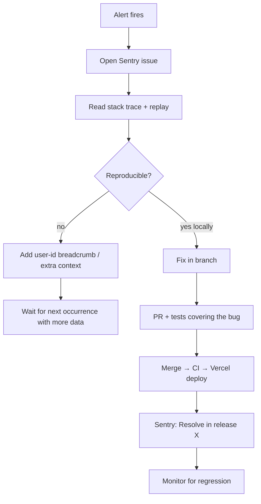

# 07 — Monitoring Runbook

> **Last verified**: 2026-05-03

## Stack

| Tool | Scope | URL / Source |
|------|-------|--------------|
| **Sentry** | Browser SPA errors, performance, session replay | `https://the-breakery.sentry.io/` (org `the-breakery`, project `appgrav-v2`) |
| **Supabase Postgres logs** | DB queries, slow queries, RLS denials | Dashboard → Logs → Postgres |
| **Supabase Edge Function logs** | Function invocations, errors, cold starts | Dashboard → Edge Functions → \<fn\> → Logs (also CLI: `supabase functions logs`) |
| **Vercel logs** | Deployment build logs, runtime is N/A (SPA is static) | Dashboard → Project → Deployments → \<deploy\> → Logs |
| **Browser DevTools** | Live debug | Chrome / Edge on the affected POS device |

There is **no APM** (Datadog, New Relic) and no centralised log aggregator. Sentry handles errors + traces; Supabase + Vercel handle their own infra logs.

## Sentry configuration (recap)

Source: `src/lib/sentry.ts`

| Setting | Value | Why |
|---------|-------|-----|
| Initialisation gate | `IS_PRODUCTION && VITE_SENTRY_DSN` set | Disabled in dev (no noise from local) |
| `tracesSampleRate` | 0.2 (20%) | Cost vs. coverage balance |
| `replaysSessionSampleRate` | 0.1 (10%) | Sample 1 in 10 sessions |
| `replaysOnErrorSampleRate` | 1.0 (100%) | Always capture replay when an error fires |
| `tracePropagationTargets` | localhost + `abjabuniwkqpfsenxljp.supabase.co` | Distributed tracing on Supabase calls |
| Privacy | `maskAllText: true`, `blockAllMedia: true` | No PII or images in replays |
| `ignoreErrors` | ResizeObserver loops, network errors, JWT expired | Filter known noise |
| Sourcemaps | `hidden` upload (`vite.config.ts` line 189) | Stack traces resolve in Sentry without exposing `.map` files publicly |
| Release tag | `appgrav-v2@<VITE_APP_VERSION>` when set | Pair errors with Vercel deploys |

## Recommended alerts

Configure in Sentry → Alerts → "Create Alert" (none are pre-set as of 2026-05-03 — start with these):

| Alert | Threshold | Action |
|-------|-----------|--------|
| New issue (any unique error) | First seen | Slack/email channel `#breakery-pos-alerts` (TBD) |
| Issue volume spike | >50 events/hour for an existing issue | Email + Slack |
| Performance regression | p95 transaction duration >2 s on `/pos` | Email |
| Replay-on-error rate | >5 replays/day with error tags | Email |
| Crash-free sessions | <99% over 24h | Page on-call (when on-call established) |

## Triage workflow



| Step | Detail |
|------|--------|
| Open issue | Sentry → Issues → click the title → "Issue Details" |
| Read stack trace | Resolved against sourcemaps; hover frame to see actual TS source |
| Read replay | "Replay" tab shows the user's clicks/keystrokes (text masked, media blocked) leading up to the error |
| Reproduce | Use the replay timeline to mimic the steps; check breadcrumbs for the failing API call |
| Assign | "Assign to" → the dev owning the touched module (per CLAUDE.md "Architecture") |
| Fix → resolve | After deploy, mark "Resolved in next release" — Sentry auto-reopens if the same fingerprint recurs |

## Sentry releases

Releases are tagged automatically when `VITE_APP_VERSION` is set at build time. The Vite plugin (`@sentry/vite-plugin` 5.2.0) creates the release and uploads sourcemaps.

To enrich a release with commit data (Suspect Commits feature):
1. Sentry → Settings → Integrations → install the GitHub integration.
2. Sentry → Project → Settings → Releases → enable "Track commits".
3. Each deploy will auto-link the commit range, attribute regressions to suspect commits.

## Supabase logs

### Postgres

Dashboard → Project → Logs → Postgres. Filter by:
- **Severity**: ERROR, WARNING
- **SQL state**: `42501` (RLS denial), `23505` (unique violation), `40P01` (deadlock)
- **Time range**: last 1h / 24h / custom

For ad-hoc queries against the logs, use the dashboard's SQL editor in the Logs tab — it exposes a `postgres_logs` view.

### Edge Functions

```bash
supabase functions logs <name> --project-ref abjabuniwkqpfsenxljp --limit 200
```

Or dashboard → Edge Functions → \<fn\> → Logs. Each log line includes:
- Timestamp
- Function name
- Status (200 / 4xx / 5xx)
- Duration (ms)
- Region

Cold starts spike to ~500-800 ms; warm invocations are 50-150 ms. A sustained pattern of cold starts means the function isn't getting traffic — keep-warm via a cron is overkill at this scale.

### Realtime

Dashboard → Logs → Realtime. Watch for:
- Connection drops > expected
- "Quota exceeded" (signals a tier upgrade is needed)
- Channel-subscription churn (LAN client misbehaving)

## Vercel logs

Static SPA → no runtime logs. The build logs are available per deployment:

Dashboard → Deployments → \<deploy\> → Build Logs / Function Logs (latter empty for V2).

If the bundle-size CI gate fires, the build log shows the offending size:
```
Total gzipped JS: 2150KB
::error::Bundle size 2150KB exceeds 2MB limit
```

## Routine health checks (manual cadence)

| Cadence | Check | How |
|---------|-------|-----|
| Daily | New Sentry issues since yesterday | Sentry → Issues → "Last 24h" |
| Daily | Crash-free sessions ≥ 99% | Sentry → Performance → Crash Free |
| Weekly | Top 10 slowest Postgres queries | Dashboard → Database → Performance Advisor |
| Weekly | Edge Function error rate per function | `supabase functions logs <name>` for each, count 5xx |
| Monthly | Bundle size trend | Compare last 4 weeks of CI build artifacts |
| Monthly | Storage growth | Dashboard → Storage → Usage |
| Quarterly | RLS denial spikes (potential security probing) | Postgres logs filtered by `42501` |

## Investigate runbook (typical case)

User reports: "the POS froze when I tried to checkout."

1. **Sentry**: search by user.id (set in `setSentryUser`) or time range.
2. **Find the replay**: Issues → filter by `tag:user.id:<id>` → open the issue with a replay attached.
3. **Reproduce**: scrub the replay timeline; note the last user action.
4. **Cross-check Supabase logs**: same time window — was an Edge Function 5xx-ing? A long-running query?
5. **Reproduce locally**: feed the same input via `npm run dev`.
6. **Fix**: write a regression test; PR; deploy.
7. **Resolve**: mark the Sentry issue resolved in the release.

## On-call (future)

Currently informal — there is no on-call rotation. When establishing one:

| Tool | Recommendation |
|------|----------------|
| Paging | PagerDuty / Opsgenie (Sentry integrates directly) |
| Schedule | One primary + one backup, weekly rotation |
| Escalation | 15 min ack → backup; 30 min → engineering lead |
| Runbook | This file + `08-incident-response.md` |

## Cross-references

- Sentry init code: `src/lib/sentry.ts`
- Sourcemap config: `vite.config.ts` line 189
- Vercel env vars (DSN, auth token): `01-vercel-deployment.md`
- Edge Function logs CLI: `06-edge-functions-deploy.md`
- Incident response: `08-incident-response.md`
