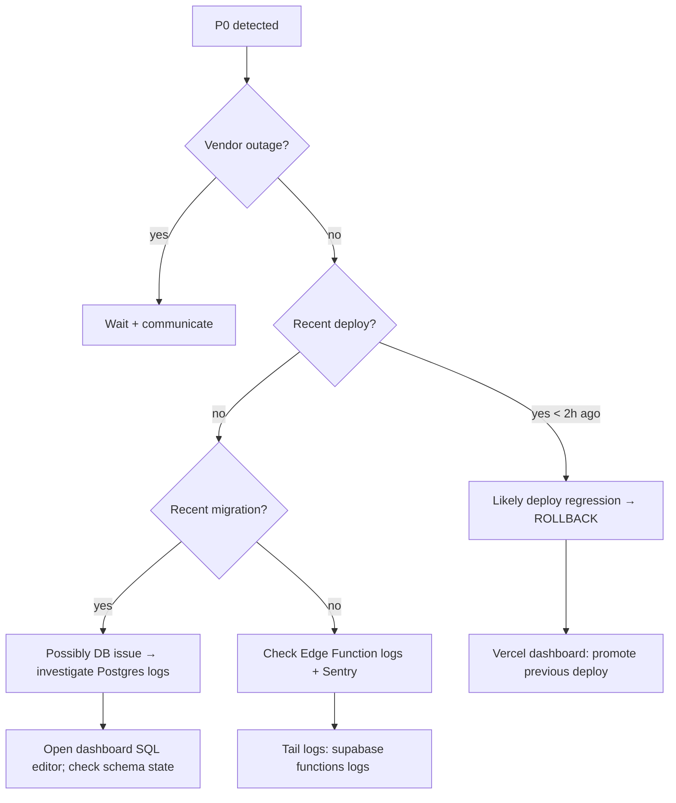

# 08 — Incident Response

> **Last verified**: 2026-05-03
> **Statut applicabilité**: Playbook préparé pour la future mise en prod de **V3** (monorepo). V2 n'a jamais été déployée — les commandes `curl`, URLs et procédures ci-dessous sont une référence pré-prod à activer le jour du go-live V3.

## Purpose

Codify how to react when production breaks. Optimised for a small team (1-3 engineers) operating a single-tenant POS for one bakery — heavy SRE process is not justified, but a written playbook is.

## Severity levels

| Level | Definition | Example | Target response | Comms |
|-------|-----------|---------|----------------|-------|
| **P0** | POS unable to accept payments; cashiers blocked | Auth Edge Function returns 500; Vercel deploy serves blank page; Supabase outage | Immediate, all hands | Notify bakery manager via WhatsApp/phone; status update every 30 min |
| **P1** | A core feature is broken but workaround exists | KDS not receiving orders (use printed receipts); reports tab errors | <2 h | Notify bakery manager; daily update |
| **P2** | Degradation, partial impairment, slow load | One report tab broken; intermittent print failures | <24 h | Logged in tracker; weekly status |
| **P3** | Non-blocking bug, cosmetic, dev-time only | Tooltip alignment off; non-critical Sentry warning | Next sprint | None |

## P0 response — "POS is down"

### Step 0 — Acknowledge

The first responder posts in the team channel: "Acknowledged P0 — investigating." This stops parallel bystanders from duplicating effort.

### Step 1 — Quick-status sweep (≤2 min)

| Service | Where to check | What you're looking for |
|---------|---------------|------------------------|
| Vercel | `https://www.vercel-status.com/` | Region-level outage in `iad1` / `sfo1`? |
| Supabase | `https://status.supabase.com/` | `ap-southeast-1` outage? |
| Sentry | `https://status.sentry.io/` | Sentry could be down — false alarm risk if alerts stopped |
| The site itself | `curl -I https://the-breakery-pos.vercel.app/` | 200 OK? Headers correct? |
| Sentry recent issues | `https://the-breakery.sentry.io/issues/?query=is:unresolved` | New error in the last hour? |

If a vendor is having a regional outage, your job becomes "communicate" not "fix" — go to Step 4.

### Step 2 — Identify the trigger



### Step 3 — Mitigate

Pick the lowest-risk action that restores service:

| Symptom | First-line mitigation |
|---------|----------------------|
| Bad Vercel deploy | **Rollback**: dashboard → Deployments → previous good → "Promote to Production" |
| Bad Edge Function deploy | Re-deploy the previous commit's function source (see `06-edge-functions-deploy.md` § Rollback) |
| Bad migration | If pre-production-deployed, no easy rollback — write inverse migration **OR** restore from backup (Supabase dashboard → Database → Backups → "Restore") |
| Supabase rate limited | Check usage dashboard; tier upgrade or kill the runaway client |
| LAN print server crashed | Restart the local print server process (`pm2 restart print-server` or equivalent on the bakery's Windows host) |
| Auth flow broken | Verify Edge Function `auth-verify-pin` logs; if function deploy is the cause, re-deploy previous |

**Vercel rollback** is the single fastest mitigation — it takes seconds and requires zero code:

1. Vercel dashboard → Project `the-breakery-pos` → Deployments.
2. Find the most recent **green** deploy from before the incident started.
3. Click the three-dot menu → "Promote to Production".
4. Confirm. The new deploy goes live in <30 s.

In-flight users on the broken deploy will see broken chunks until they refresh; the PWA service-worker may serve stale `index.html` for ~1 day so encourage hard-refresh.

### Step 4 — Communicate

Use a single thread to avoid contradictions. Template:

```
[INCIDENT P0] POS is down — investigating
- Symptom: <what users see>
- Started: <UTC timestamp>
- Current status: <rollback in progress / vendor outage / etc>
- ETA to fix: <best estimate or "investigating">
- Workaround: <e.g. accept cash only, log orders on paper>
Updates every 30 min until resolved.
```

Update the same thread; do not start new ones. When resolved:

```
[INCIDENT P0] RESOLVED at <timestamp>
- Root cause (preliminary): <one sentence>
- Mitigation: <what fixed it>
- Post-mortem to follow within 48h.
```

### Step 5 — Post-mortem

For every P0 (and discretionary P1), write a short post-mortem within 48h. Template:

```markdown
# Post-mortem: <short title>
- Date: YYYY-MM-DD
- Severity: P0
- Duration: HH:MM start → HH:MM resolved
- Detected via: <Sentry alert / user report / monitoring>
- Responders: <names>

## Impact
<who was affected, what they couldn't do, magnitude>

## Timeline (UTC)
- HH:MM — symptom first observed
- HH:MM — first responder ack
- HH:MM — root cause identified
- HH:MM — mitigation applied
- HH:MM — service confirmed healthy

## Root cause
<technical explanation>

## What went well
- ...

## What went poorly
- ...

## Action items
- [ ] <owner> — <action> — by <date>
- [ ] ...
```

Store in `docs/reference/12-appendices/post-mortems/YYYY-MM-DD-<slug>.md` (folder may need creating).

## P1 / P2 / P3 response

| Severity | Workflow |
|----------|----------|
| P1 | Open a GitHub issue tagged `bug:p1`; fix on a `hotfix/` branch; PR + merge same day |
| P2 | GitHub issue tagged `bug:p2`; queue for the active sprint |
| P3 | GitHub issue tagged `bug:p3`; backlog grooming |

## Hotfix process

When a P0/P1 fix is needed before the normal release cadence:

```bash
# 1. Branch from master
git checkout master
git pull
git checkout -b hotfix/<short-slug>

# 2. Minimum-viable change — resist scope creep
# Edit only the file(s) needed
npx vitest run <changed area>     # local sanity
npm run build                     # type/build check

# 3. PR against master
gh pr create --title "hotfix: <description>" --body "..."

# 4. Merge after review (P0 may waive review with explicit comms)
# 5. Vercel auto-deploys on merge to master

# 6. After deploy, monitor Sentry for 30 min
```

Hotfixes always go through master (no separate `release` branch). The repo is small enough that branch protection + CI + Vercel auto-deploy is sufficient gating.

## Rollback decision matrix

| Scenario | Roll back? | Notes |
|----------|-----------|-------|
| Bad UI change, no data impact | Yes (Vercel promote) | Fastest; users see previous version |
| Bad business-logic change, no DB writes since | Yes (Vercel promote) | Same as above |
| Bad DB migration, no data written under new schema | Write inverse migration | Apply via `supabase db push --linked` |
| Bad DB migration, data already written under new schema | Restore from backup | Loses data between backup and now — last resort |
| Bad Edge Function | Re-deploy previous source (`git checkout <prev> -- supabase/functions/<fn>/`) | See `06-edge-functions-deploy.md` |
| Bad client behaviour (Service Worker stuck) | Push a no-op deploy + ask users to hard-refresh | SW will fetch new `index.html` |

## Contacts

| Vendor | Support channel | Notes |
|--------|----------------|-------|
| **Supabase** | dashboard → Help → Contact (Pro+ plan) | Response SLA per plan tier |
| **Vercel** | dashboard → Help → Contact (Pro+ plan) | 24/7 support on Pro |
| **Sentry** | `support@sentry.io` or in-app | Less time-critical |
| **Anthropic (Claude API)** | https://console.anthropic.com/ → Support | For `claude-proxy` issues |

Internal:
- Bakery manager (for user-impact comms): WhatsApp / phone
- Engineering team: <add team channel name when established>

## Drills

Recommended once per quarter — schedule a 1-hour window during off-peak (the bakery is busiest 7-11am and 4-7pm Lombok local time):

| Drill | Goal |
|-------|------|
| Vercel rollback | Time how long it takes to promote a previous deploy |
| Supabase backup restore | Restore a backup to a Supabase branch (NOT prod), verify data integrity |
| Edge Function rollback | Re-deploy previous source for one function |
| End-to-end smoke after rollback | `npm run test:smoke` + manual POS checkout |

## Cross-references

- Vercel rollback steps: `01-vercel-deployment.md` § Rollback
- Supabase backup mechanics: `02-supabase-environments.md` § Backups
- Migration rollback: `05-database-migrations-deploy.md` § Rollback
- Edge Function rollback: `06-edge-functions-deploy.md` § Rollback
- Monitoring (where alerts come from): `07-monitoring-runbook.md`
