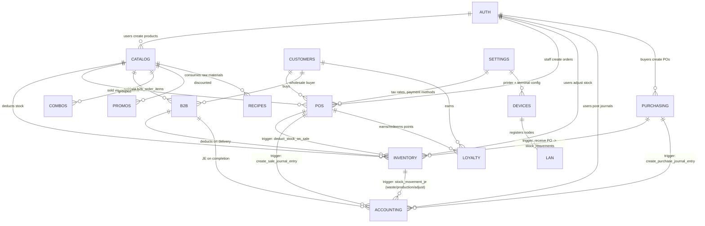
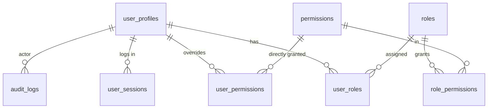

# 01 — Database Schema Overview

> **Last verified**: 2026-05-03
> **Source**: `supabase/migrations/` (223 files), `src/types/database.generated.ts` (auto-generated 2026-05-01).

This document is the high-level map of the AppGrav V2 production database (Supabase Postgres `the-breakery-pos`, project `abjabuniwkqpfsenxljp`, region `ap-southeast-1`). For the per-table column reference see [02-tables-reference.md](02-tables-reference.md). For RPCs see [03-rpc-functions.md](03-rpc-functions.md). For triggers see [04-triggers.md](04-triggers.md).

---

## 1. Conventions

| Element | Convention | Example |
|---------|------------|---------|
| Table names | `snake_case`, plural | `order_items`, `purchase_orders` |
| Column names | `snake_case` | `created_at`, `unit_price` |
| Primary keys | `UUID id` (`gen_random_uuid()` default) | `id UUID PRIMARY KEY` |
| Foreign keys | `{table_singular}_id` | `customer_id`, `product_id` |
| Audit columns | `created_at`, `updated_at`, sometimes `created_by`, `updated_by` | `TIMESTAMPTZ DEFAULT NOW()` |
| Soft delete | `deleted_at TIMESTAMPTZ` (or `is_active BOOLEAN`) — not all tables | products, customers |
| Money | `DECIMAL(12,2)` for IDR (rounded to nearest 100 in app) | `total DECIMAL(12,2)` |
| Quantity | `DECIMAL(10,3)` for stock | `quantity DECIMAL(10,3)` |
| Booleans | `is_*` prefix | `is_active`, `is_locked` |
| Enums | Postgres `CREATE TYPE … AS ENUM` (see [database.enums.ts](../../../src/types/database.enums.ts)) | `order_status`, `movement_type` |
| Timezone | All `TIMESTAMPTZ`, DB set to `Asia/Makassar` (WITA, UTC+8) | migration `001_extensions_enums.sql` line 14 |
| RLS | Mandatory on every public table; uses `is_authenticated()` STABLE helper | see migration `20260316100000_rls_performance_optimization.sql` |
| Naming for views | `v_*` (auth-filtered passthrough views) and `view_*` (analytics views) | `v_products`, `view_daily_kpis` |

### Extensions

```sql
-- supabase/migrations/001_extensions_enums.sql
CREATE EXTENSION IF NOT EXISTS "uuid-ossp";
CREATE EXTENSION IF NOT EXISTS pgcrypto;
ALTER DATABASE postgres SET timezone TO 'Asia/Makassar';
```

`pg_cron`, `pg_net`, `pgjwt`, `vault`, `supabase_vault` are also enabled by Supabase platform but are not directly used by application code.

---

## 2. Domain partitioning

The schema groups around 11 functional domains. Counts below are the number of tables (excluding views and matviews) discovered via `database.generated.ts`.

| # | Domain | Tables | Lead migration |
|---|--------|--------|----------------|
| 1 | **Auth & Users** | 8 | `008_users_permissions.sql` |
| 2 | **Catalog (Products / Recipes)** | 11 | `002_core_products.sql` |
| 3 | **Customers & Loyalty** | 6 | `003_customers_loyalty.sql` |
| 4 | **POS & Orders** | 9 | `004_sales_orders.sql` |
| 5 | **Inventory & Stock** | 11 | `005_inventory_stock.sql` |
| 6 | **Purchasing** | 5 | `005_inventory_stock.sql`, `20260204100000_fix_missing_functions_and_views.sql` |
| 7 | **B2B & Wholesale** | 7 | `007_b2b_wholesale.sql` |
| 8 | **Combos & Promotions** | 7 | `006_combos_promotions.sql` |
| 9 | **Accounting** | 11 | `20260323100200_create_accounting_tables.sql` |
| 10 | **Settings & System** | 11 | `009_system_settings.sql` |
| 11 | **LAN / Hub-Client / Devices** | 6 | `010_lan_sync_display.sql`, `20260330800000_create_device_configurations.sql` |

Total reachable tables: ~92 (plus ~30 reporting views).

---

## 3. Global ER diagram (domain view)



This is a *domain-level* view. Per-table relations are documented in [02-tables-reference.md](02-tables-reference.md).

---

## 4. Domain detail

### 4.1 Auth & Users (8 tables)

| Table | Purpose |
|-------|---------|
| `user_profiles` | Application user identity, PIN hash, employee code, optional link to `auth.users.id` via `auth_user_id` |
| `roles` | Role definitions (codes: `SUPER_ADMIN`, `ADMIN`, `MANAGER`, `CASHIER`, …) |
| `permissions` | Permission catalogue (`module.action` format, e.g. `sales.void`) |
| `role_permissions` | Many-to-many bridge |
| `user_roles` | Per-user role grant with `valid_from` / `valid_until` |
| `user_permissions` | Per-user direct grant or revoke (overrides role) |
| `user_sessions` | Active sessions, hashed tokens (since `016_integrity_fixes.sql`) |
| `audit_logs` | Append-only audit trail (`audit_action` enum) |



See module spec [docs/v2/modules/01-auth-users.md](../../v2/modules/01-auth-users.md). Flow: [08-flows-end-to-end](../08-flows-end-to-end/).

### 4.2 Catalog — Products, Recipes, Suppliers (11 tables)

| Table | Purpose |
|-------|---------|
| `categories` | Product categories (e.g. *Pastries*, *Coffee*) |
| `sections` | Physical/logical sections (`warehouse`, `production`, `sales`) |
| `products` | Master catalog (finished / semi-finished / raw material) |
| `product_sections` | Stock-per-section bridge |
| `product_modifiers` | Variants & modifier groups (size, milk type, etc.) |
| `product_uoms` | Per-product unit-of-measure conversion |
| `product_types` | Configurable product-type taxonomy |
| `product_price_history` | Audit of price changes |
| `product_category_prices` | Custom prices per `customer_categories` |
| `recipes` | BOM (raw material → finished good ratio) |
| `suppliers` | Vendor master |

### 4.3 Customers & Loyalty (6 tables)

| Table | Purpose |
|-------|---------|
| `customers` | Customer master, includes `loyalty_qr_code`, `loyalty_points`, `lifetime_points` |
| `customer_categories` | Pricing tier slugs (`retail`, `wholesale`, `vip`, …) drives `get_customer_product_price()` |
| `loyalty_tiers` | Bronze / Silver / Gold / Platinum thresholds |
| `loyalty_transactions` | Earn / redeem / expire / adjust ledger |
| `loyalty_rewards` | Catalogue of redeemable items |
| `loyalty_redemptions` | Per-redeem history |

### 4.4 POS & Orders (9 tables)

| Table | Purpose |
|-------|---------|
| `pos_terminals` | Registered terminals (hub flag, default printer/KDS) |
| `pos_sessions` | Cash drawer sessions (open / close, cash counts) |
| `shift_snapshots` | Point-in-time snapshots for end-of-shift report |
| `orders` | Order header, totals, `payment_status`, `tax_amount` |
| `order_items` | Line items, `selected_variants` JSONB, KDS state |
| `order_payments` | Split payment lines (one row per method) |
| `order_payment_items` | Item-level payment allocation (split-by-item) |
| `order_activity_log` | User actions audit (void, discount, refund, send-to-kitchen) |
| `floor_plan_items` | Tables for dine-in seat plan |

### 4.5 Inventory & Stock (11 tables)

| Table | Purpose |
|-------|---------|
| `stock_locations` | Warehouse / kitchen / storage locations |
| `stock_movements` | Append-only movements ledger (typed by `movement_type` enum) |
| `section_stock` | Per-(product, section) stock cache |
| `production_records` | Production batches (`production_date`, qty, ingredients) |
| `inventory_counts` | Stock-take headers (status: draft → in_progress → finalized → validated) |
| `inventory_count_items` | Per-product physical vs system qty |
| `internal_transfers` | Inter-section moves |
| `transfer_items` | Lines per transfer |
| `pos_live_stock` | Realtime cafe-section stock (consumed by `/pos/live-stock`) |
| `payment_incidents` | Logged payment incidents (since 2026-04-28) |
| `sequence_tracker` | Daily counter for receipt / PO / transfer numbers |

### 4.6 Purchasing (5 tables)

| Table | Purpose |
|-------|---------|
| `purchase_orders` | PO header (status: draft → sent → confirmed → partial → received) |
| `purchase_order_items` | PO lines (qty ordered vs received, unit_cost) |
| `purchase_order_history` | Status changelog (uses `po_history_action` enum) |
| `purchase_order_returns` | Returned items and reasons |
| `po_attachments` | File attachments (Supabase Storage refs) |

### 4.7 B2B & Wholesale (7 tables)

| Table | Purpose |
|-------|---------|
| `b2b_orders` | B2B order header (`b2b_status` enum, payment_terms) |
| `b2b_order_items` | Lines |
| `b2b_payments` | Receipts against B2B orders |
| `b2b_deliveries` | Delivery slips (`b2b_delivery_status`) |
| `b2b_price_lists` | Named price lists |
| `b2b_price_list_items` | Per-product overrides per list |
| `b2b_customer_price_lists` | Customer ↔ price list bridge |

### 4.8 Combos & Promotions (7 tables)

| Table | Purpose |
|-------|---------|
| `product_combos` | Combo header (e.g. Breakfast set) |
| `product_combo_groups` | Selection groups within a combo |
| `product_combo_group_items` | Eligible products per group |
| `product_combo_items` | Fixed items in the combo |
| `promotions` | Promotion master (`promotion_type` enum: `percentage`/`fixed_amount`/`buy_x_get_y`/`free_product`) |
| `promotion_products` | Eligibility rules |
| `promotion_free_products` | Auto-included free items |
| `promotion_usage` | Per-order usage log |

### 4.9 Accounting (11 tables)

| Table | Purpose |
|-------|---------|
| `accounts` | Chart of Accounts (`account_class`, `account_type`, `is_postable`, `parent_id`) |
| `accounting_mappings` | Logical key → account_code (e.g. `WASTE_EXPENSE` → 5300) |
| `journal_entries` | JE headers (status: draft → posted → locked) |
| `journal_entry_lines` | Debit / credit pairs |
| `general_ledger` | Materialised ledger view (regenerated by trigger) |
| `vat_filings` | Monthly PB1 / VAT filing status |
| `fiscal_periods` | Year/month with status (open / closed / locked) |
| `expenses` | Expense entries |
| `expense_categories` | Expense taxonomy linked to an `account_id` |
| `bank_statements` | Imported bank statement headers |
| `bank_statement_lines` | Imported lines, reconciled flag |
| `reconciliation_adjustments` | Manual adjustments during bank reconciliation |

### 4.10 Settings & System (11 tables)

| Table | Purpose |
|-------|---------|
| `settings` | Key-value system settings (typed JSON value) |
| `settings_categories` | Logical grouping for the Settings UI |
| `settings_history` | Append-only change log of every setting update |
| `business_config` | Company info (name, NPWP, tax rate, currency) |
| `business_hours` | Open / close hours per day |
| `tax_rates` | Active and historical tax rate definitions |
| `payment_methods` | Configured payment methods + accounting accounts |
| `pos_config` | POS-specific behavioural flags (session timeout, display timeout) |
| `printer_configurations` | Printer endpoints (LAN IP, type) |
| `terminal_settings` (legacy) | Terminal-scoped overrides — being migrated into `device_configurations` |
| `sound_assets` | Notification sounds |

### 4.11 LAN / Hub-Client / Devices (6 tables)

| Table | Purpose |
|-------|---------|
| `lan_nodes` | Runtime registry of online nodes (heartbeat last seen) |
| `device_configurations` | Persistent device config (per-device key-value) |
| `pos_terminals` | (also Domain 4) device hardware |
| `printer_configurations` | Printer endpoints |
| `kds_stations` | Kitchen display stations and their dispatch routing |
| `floor_plan_items` | (also Domain 4) drives "table view" on POS |

See LAN architecture: [06-lan-architecture](../06-lan-architecture/).

---

## 5. Reporting views

About 30 read-only views are exposed for the reports module. They are *not* tables but read like tables in `database.generated.ts`. Naming `view_*` (analytics) and `v_*` (auth-filtered passthrough). Notable:

| View | Source migration | Used by |
|------|------------------|---------|
| `view_daily_kpis` | `013_views_reporting.sql` | Dashboard |
| `view_hourly_sales` | `013_views_reporting.sql` | Hourly sales report |
| `view_payment_method_stats` | `20260406100000_fix_payment_method_stats_use_order_payments.sql` | Payment methods report |
| `view_pos_outstanding`, `view_pos_outstanding_history` | `20260407200000_pos_outstanding.sql` | Outstanding orders report |
| `view_inventory_valuation`, `view_stock_alerts`, `view_stock_warning`, `view_stock_waste`, `view_expired_stock` | `013_views_reporting.sql`, `20260206120000_create_missing_report_views.sql` | Inventory reports |
| `view_session_cash_balance`, `view_session_discrepancies`, `view_session_summary` | `013_views_reporting.sql` | Cash register reports |
| `view_profit_loss`, `view_ar_aging` | `20260206120000_create_missing_report_views.sql`, `20260430010000_add_accounting_constraints_and_views.sql` | Accounting reports |
| `view_kds_queue_status` | `013_views_reporting.sql` | KDS analytics |
| `view_customer_insights`, `view_sales_by_customer` | `013_views_reporting.sql` | Customer reports |
| `view_product_sales`, `view_unsold_products`, `view_category_sales` | `013_views_reporting.sql` | Product reports |
| `view_production_summary` | `013_views_reporting.sql` | Production report |
| `view_order_type_distribution` | `013_views_reporting.sql` | Order analytics |
| `order_search_view` | `20260501000000_create_order_search_view.sql` | Global order search |
| `v_products`, `v_categories`, `v_customers`, `v_orders`, `v_pos_sessions`, `v_purchase_orders`, `v_roles`, `v_sections`, `v_suppliers`, `v_user_profiles`, `v_product_modifiers`, `v_product_uoms` | `017_add_missing_fk.sql` & later RLS hardening | All UI list pages |

Views inherit RLS from underlying tables (Postgres 15+ default). Any `v_*` view also requires `is_authenticated()` for SELECT.

---

## 6. Migrations history pointers

223 migration files (as of 2026-05-03). Naming convention since 2026-02-03: `YYYYMMDDHHMMSS_short_description.sql`.

| Phase | Range | Notes |
|-------|-------|-------|
| Consolidation | `001_…` to `017_…` | Bootstrapped from 113 prior migrations on 2026-02-03 (see header of `001_extensions_enums.sql`) |
| Section stock & internal transfers | `20260203…` to `20260205…` | New stock model |
| Hardening (auth, RLS, search_path) | `20260210…` to `20260222…` | Removed plaintext PIN, secured tokens, fixed VOLATILE→STABLE on permission helpers |
| Accounting bootstrap | `20260216…` to `20260330…` | Created `accounts`, `journal_entries*`, sale + purchase JE triggers, fiscal periods |
| RLS performance | `20260316100000_rls_performance_optimization.sql` | Introduced `is_authenticated()` STABLE helper |
| Atomic RPCs | `20260322100000…`, `20260323100100…` | `complete_order_with_payments`, `approve_expense_with_journal`, `update_role_permissions` |
| P3 audit fixes | `20260330600300_p3_accounting_audit_fixes.sql` | Status-transition triggers (journal_entries, fiscal_periods) |
| Stock & accounting cohesion | `20260402…`, `20260413…`, `20260414…` | Unified triggers, COGS, void reversal correctness |
| Caissapp | `20260430180000_caissapp_shift_snapshots_and_close_rpc.sql` | Shift snapshots, atomic close |
| Production | `20260502061925_create_production_record_rpc.sql` | Atomic production record creation |
| Receiving | `20260503002703_create_receive_purchase_order_rpc.sql` | Atomic PO receive |

---

## 7. RLS pattern (mandatory for new tables)

```sql
ALTER TABLE public.{table_name} ENABLE ROW LEVEL SECURITY;

CREATE POLICY "Authenticated read" ON public.{table_name}
    FOR SELECT USING (public.is_authenticated());

CREATE POLICY "Permission-based write" ON public.{table_name}
    FOR INSERT WITH CHECK (
      public.user_has_permission(auth.uid(), '{module}.create')
    );

CREATE POLICY "Permission-based update" ON public.{table_name}
    FOR UPDATE USING (
      public.user_has_permission(auth.uid(), '{module}.update')
    );
```

`is_authenticated()` is `STABLE SECURITY DEFINER` (cached per-transaction), `user_has_permission()` is also `STABLE SECURITY DEFINER` and considers both role grants and direct user overrides.

See `docs/v2/RLS_AUDIT_REPORT.md` for the most recent coverage audit.

---

## 8. Cross-references

- Per-table column reference: [02-tables-reference.md](02-tables-reference.md)
- All RPC functions: [03-rpc-functions.md](03-rpc-functions.md)
- All triggers and trigger-driven flows: [04-triggers.md](04-triggers.md)
- Module specs (V2): [../../v2/modules/](../../v2/modules/)
- End-to-end flows (POS sale, refund, PO receive, etc.): [../08-flows-end-to-end/](../08-flows-end-to-end/)
- LAN topology: [../06-lan-architecture/](../06-lan-architecture/)
- Security & RLS report: [../07-security/](../07-security/) and `docs/v2/RLS_AUDIT_REPORT.md`
