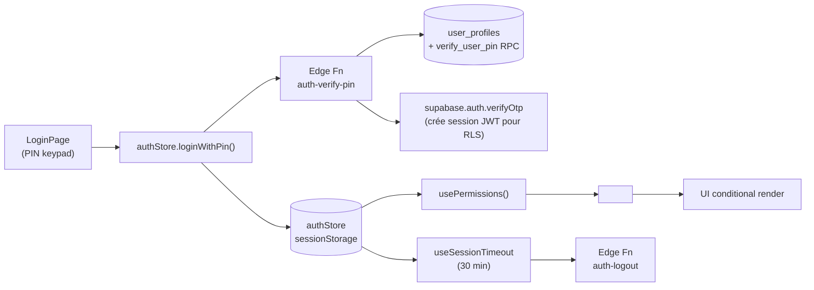

# 01 — Auth & Permissions

> **Last verified**: 2026-05-03
> **Related E2E flows**: [01-pos-sale-cash](../08-flows-end-to-end/01-pos-sale-cash.md), [03-void-refund](../08-flows-end-to-end/03-void-refund.md) (PIN manager), [00-login](../08-flows-end-to-end/00-login.md)
> **Related backlog**: travail/01-auth-hardening.md (à créer)

## Vue d'ensemble

Authentification PIN à 4-6 chiffres adossée à Supabase Auth. RBAC fin (modules + actions) servi côté Postgres via fonctions STABLE et côté React via hooks et guards. Sessions persistées en `sessionStorage` (tab-scoped), validées server-side à chaque refresh. Timeout d'inactivité 30 min (configurable via `pos_config`).

## Diagramme de responsabilité



## Tables DB impliquées

| Table | Rôle | Lien |
|---|---|---|
| `user_profiles` | Profil utilisateur, `pin_hash`, `failed_login_attempts`, `locked_until`, `auth_user_id` | [details](../03-database/02-tables-reference.md#user_profiles) (à créer) |
| `roles` | Rôles avec `code` (SUPER_ADMIN, OWNER, ADMIN, MANAGER, …) et `hierarchy_level` (10-100) | [details](../03-database/02-tables-reference.md#roles) |
| `permissions` | Catalogue des permissions `module.action` + flag `is_sensitive` | [details](../03-database/02-tables-reference.md#permissions) |
| `role_permissions` | M:M roles ↔ permissions | [details](../03-database/02-tables-reference.md#role_permissions) |
| `user_roles` | M:M users ↔ rôles, flag `is_primary` | [details](../03-database/02-tables-reference.md#user_roles) |
| `user_permissions` | Overrides directs user-level (grant/revoke) | [details](../03-database/02-tables-reference.md#user_permissions) |
| `user_sessions` | Sessions actives (`device_type`, `started_at`, token) | [details](../03-database/02-tables-reference.md#user_sessions) |
| `audit_logs` | Journal d'audit immuable (login, PIN reset, override, logout) | [details](../03-database/02-tables-reference.md#audit_logs) |

## Hooks principaux

| Hook | Chemin | Rôle |
|---|---|---|
| `useAuthStore` (Zustand) | `src/stores/authStore.ts` | State + actions auth (`loginWithPin`, `logout`, `refreshSession`) |
| `usePermissions` | `src/hooks/usePermissions.ts` | `hasPermission`, `hasAnyPermission`, `canAccessModule`, `isAdmin`, `isManagerOrAbove` |
| `useSessionTimeout` | `src/hooks/auth/useSessionTimeout.ts` | Activity tracking + warning + auto-logout (30 min) |
| `useAuthService` | `src/hooks/auth/useAuthService.ts` | Wrapper service auth (helpers PIN/email) |
| `useMobileAuth` | `src/hooks/auth/useMobileAuth.ts` | Spécifique Capacitor (biometric optional) |
| `useUsers` | `src/hooks/useUsers.ts` | Liste users (UserSelector du PIN keypad) |
| `usePermissionsData` | `src/hooks/usePermissionsData.ts` | Catalogue permissions + roles (RBAC admin UI) |

## Services principaux

| Service | Chemin | Rôle |
|---|---|---|
| `authService` | `src/services/authService.ts` | `loginWithPin` (Edge Fn + fallback RPC client-side, ligne 192-296), `logout`, `validateSession`, `changePin`, `setSessionTokenGetter` |
| `userManagementService` | `src/services/userManagementService.ts` | CRUD users, assignation rôles, gestion `permissions` |

Le fallback client-side (`_loginWithPinFallback`) déclenche `verify_user_pin` RPC + lockout 15 min après 5 tentatives, exactement comme l'Edge Function.

## Composants UI principaux

| Composant | Chemin | Rôle |
|---|---|---|
| `PermissionGuard` | `src/components/auth/PermissionGuard.tsx:54` | Conditional render avec props `permission` / `permissions` / `requireAll` / `role` / `roles` |
| `RouteGuard` | `src/components/auth/PermissionGuard.tsx:102` | Variante full-page (renvoie `<AccessDeniedPage>`) |
| `AdminOnly` / `ManagerOnly` | `src/components/auth/PermissionGuard.tsx:167-188` | Shortcuts pour rendus admin/manager |
| `POSAccessGuard` | `src/components/auth/ModuleAccessGuard.tsx:25` | Guard route POS — exige `pos.access`, redirige vers `/` si user a `backoffice.access` |
| `BackOfficeAccessGuard` | `src/components/auth/ModuleAccessGuard.tsx:51` | Guard route BackOffice — exige `backoffice.access` |
| `LoginPage` | `src/pages/auth/LoginPage.tsx` | PIN keypad (clavier numérique tactile) |
| `EmailLoginPage` | `src/pages/auth/EmailLoginPage.tsx` | Login email (admin uniquement) |
| `PinVerificationModal` | `src/components/pos/modals/PinVerificationModal.tsx` | Re-vérification PIN manager (void, refund, locked items) |

## Stores Zustand utilisés

`authStore` est le store le plus critique. Persisté en **sessionStorage** sous la clé `'breakery-auth'` (tab-scoped, vidé à la fermeture). Voir [`01-architecture/03-state-management.md`](../01-architecture/03-state-management.md) (à créer).

State shape :
```ts
{
  user: UserProfile | null,
  roles: IRole[],            // [{ id, code, hierarchy_level }, ...]
  permissions: IEffectivePermission[],  // [{ permission_code, permission_module, is_granted, is_sensitive, source }]
  isAuthenticated: boolean,
  isLoading: boolean,
  sessionId: string | null,
  sessionToken: string | null,
}
```

Actions clés (toutes async) :
- `loginWithPin(userId, pin)` — `authStore.ts:49-91`
- `logout()` — `authStore.ts:96-126` (invoque `resetAllStoresOnLogout` pour purger cart, payment, terminal, …)
- `refreshSession()` — `authStore.ts:131-188` (préserve la session sur erreur transitoire réseau)
- `initializeAuth()` (export module) — `authStore.ts:229-296` (recovery PIN session sans token via fetch direct DB)

Selectors exportés : `selectIsAdmin`, `selectIsSuperAdmin`, `selectIsManager`, `selectPrimaryRole`, `selectHasPermission(code)`.

## RPCs / Edge Functions utilisées

| Type | Nom | Rôle |
|---|---|---|
| Edge Function | `auth-verify-pin` | Vérifie PIN, mint session token + Supabase Auth via `verifyOtp` magiclink (`verify_jwt: false` — bootstrap) |
| Edge Function | `auth-get-session` | Valide token, renvoie user + roles + permissions |
| Edge Function | `auth-change-pin` | Change le PIN courant (manager / self) |
| Edge Function | `auth-logout` | Termine la session côté serveur (`user_sessions.ended_at`) |
| Edge Function | `set-user-pin` | Définit/reset PIN (admin only) |
| Edge Function | `auth-user-management` | CRUD users (super-admin) |
| Edge Function | `create-admin-user` | Bootstrap initial admin |
| Edge Function | `list-auth-users` | Liste users Supabase Auth (debug admin) |
| RPC | `verify_user_pin(p_user_id, p_pin)` | Bcrypt-compare PIN (utilisé par fallback client-side) |
| RPC | `get_user_permissions(p_user_id)` | Renvoie tableau `IEffectivePermission` agrégé (rôles + overrides) |
| RPC fn STABLE | `is_authenticated()` | Renvoie `auth.uid() IS NOT NULL`, cached per-transaction |
| RPC fn STABLE | `user_has_permission(uid, code)` | Vérifie permission via SECURITY DEFINER |
| RPC fn STABLE | `is_admin(uid)` | True si user a SUPER_ADMIN/OWNER/ADMIN |

Voir [`05-integrations/02-edge-functions.md`](../05-integrations/02-edge-functions.md) (à créer) et [`03-database/03-rpc-functions.md`](../03-database/03-rpc-functions.md) (à créer).

## RLS & Permissions

Toutes les tables auth sont en RLS strict. Pattern :

```sql
ALTER TABLE public.user_profiles ENABLE ROW LEVEL SECURITY;

-- Lecture : authentifié
CREATE POLICY "Authenticated read" ON public.user_profiles
    FOR SELECT USING (public.is_authenticated());

-- Écriture : permission users.update OU self
CREATE POLICY "Permission-based update" ON public.user_profiles
    FOR UPDATE USING (
        public.user_has_permission(auth.uid(), 'users.update')
        OR id = auth.uid()
    );
```

**Permission codes du module :**

| Code | Description |
|---|---|
| `pos.access` | Accès route `/pos` (vérifié par `POSAccessGuard`) |
| `backoffice.access` | Accès BackOffice (vérifié par `BackOfficeAccessGuard`) |
| `users.view` | Liste users |
| `users.create` | Créer un user |
| `users.update` | Modifier user |
| `users.delete` | Soft-delete user |
| `users.roles` | Assigner rôles |
| `audit.view` | Lire `audit_logs` |
| `settings.view` / `settings.update` | Lire/modifier settings |

**Permissions sensibles** (`is_sensitive=true`, requièrent une re-confirmation PIN dans l'UI) : `sales.void`, `sales.refund`, `accounting.journal.update`, `users.delete`, `users.roles`, `accounting.vat.manage`.

## Routes

| Route | Page component | Guard |
|---|---|---|
| `/login` | `src/pages/auth/LoginPage.tsx` | Public |
| `/login/email` | `src/pages/auth/EmailLoginPage.tsx` | Public |
| `/auth/reset` | `src/pages/auth/PasswordResetPage.tsx` | Public |
| `/auth/update-password` | `src/pages/auth/UpdatePasswordPage.tsx` | Auth (Supabase recovery token) |
| `/users` | (BackOffice user management) | `BackOfficeAccessGuard` + `users.view` |
| `/users/permissions` | RBAC admin | `BackOfficeAccessGuard` + `users.roles` |

Routes définies dans `src/routes/adminRoutes.tsx`.

## Flows E2E associés

- [00-login](../08-flows-end-to-end/00-login.md) (à créer) — Bootstrap session PIN, fallback client-side
- [01-pos-sale-cash](../08-flows-end-to-end/01-pos-sale-cash.md) (à créer) — Vente nominale (auth check préalable)
- [03-void-refund](../08-flows-end-to-end/03-void-refund.md) (à créer) — Re-vérif PIN manager via `<PinVerificationModal>`
- [04-session-timeout](../08-flows-end-to-end/04-session-timeout.md) (à créer) — Logout auto + warning toast

## Pitfalls spécifiques

- **Session token stocké en sessionStorage**, pas localStorage — exposition limitée au tab. Documenté en commentaire de `authStore.ts:9-13`.
- **Fallback client-side critique** : si `auth-verify-pin` Edge Fn est down (500 / réseau), `_loginWithPinFallback` exécute `verify_user_pin` RPC directement. Lockout 15 min après 5 tentatives ratées géré côté client (`authService.ts:233-262`) — alignement strict requis avec la logique Edge Fn.
- **`refreshSession` distingue erreur transitoire et vraie invalidation** : sur `Network error` ou `Server error`, garde la session active (`authStore.ts:144-151`). Sinon logout. Sans cette logique, un Wi-Fi flaky log out tout le monde.
- **`initializeAuth` recovery PIN** : si l'utilisateur est persisté mais sans `sessionToken` (cas d'un PIN login avec edge fn KO), recharge `roles`+`permissions` directement via `supabase.from('user_roles')` (`authStore.ts:244-293`). Sans ça les guards renvoient false même si user présent.
- **Magiclink Supabase Auth** : `loginWithPin` consomme le `data.auth.token` retourné par l'Edge Fn pour appeler `supabase.auth.verifyOtp({ type: 'magiclink' })` et **créer une vraie session JWT** — sans elle les writes RLS échouent (`authService.ts:147-163`).
- **Default deny dans `PermissionGuard`** : si ni `permission` ni `role` n'est passé, `hasAccess = false` (`PermissionGuard.tsx:83-85`). Ne jamais utiliser `<PermissionGuard>` sans prop.
- **`useSessionTimeout` clear le manager PIN avant logout** : si `verifiedUser` (override manager actif) existe, l'inactivité clear seulement l'override puis reset le timer (`useSessionTimeout.ts:67-75`). Logout user complet seulement au cycle suivant.
- **`setSessionTokenGetter`** : `authService` ne peut pas importer `authStore` (cycle), donc `authStore.ts:219` enregistre un getter au boot. Si oublié, tous les Edge Fn calls partent sans `x-session-token`.
