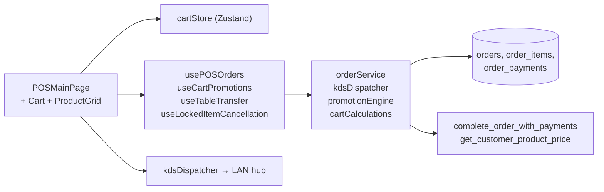

# 02 — POS Cart & Orders

> **Last verified**: 2026-05-03
> **Related E2E flows**: [01-pos-sale-cash](../08-flows-end-to-end/01-pos-sale-cash.md), [02-pos-sale-split-payment](../08-flows-end-to-end/02-pos-sale-split-payment.md), [05-table-transfer](../08-flows-end-to-end/05-table-transfer.md), [06-held-orders](../08-flows-end-to-end/06-held-orders.md)
> **Related backlog**: travail/02-pos-tablet-merge.md (à créer)

## Vue d'ensemble

Terminal POS fullscreen (`/pos`) opéré au tactile, basé sur `cartStore` Zustand. Gère cart multi-types (`product` + `combo`), modifiers, variants, lockedItems (PIN cuisine), orderType (`dine_in`/`takeaway`/`delivery`), discounts, pricing customer-specific et promotion engine auto-évalué. Send-to-kitchen sépare hold (state local) d'un dispatch KDS multi-stations. Checkout délègue à `<PaymentModal>`.

## Diagramme de responsabilité



## Tables DB impliquées

| Table | Rôle | Lien |
|---|---|---|
| `orders` | Commande (status, type, totals, customer, staff, session, discount) | [details](../03-database/02-tables-reference.md#orders) |
| `order_items` | Lignes de commande (quantity, modifiers JSONB, variants JSONB, combo_selections JSONB, item_status, dispatch_station, is_dispatch_copy) | [details](../03-database/02-tables-reference.md#order_items) |
| `order_payments` | Paiements multi-lignes (method, amount, cash_received, change_given, reference) | [details](../03-database/02-tables-reference.md#order_payments) |
| `order_activity_log` | Trace toutes les interactions cart (item_added, quantity_changed, table_changed, …) | [details](../03-database/02-tables-reference.md#order_activity_log) |
| `pos_sessions` | Session caisse ouverte (shift) — FK `orders.pos_session_id` | [details](../03-database/02-tables-reference.md#pos_sessions) |
| `pos_terminals` | Identifiant terminal POS (LAN hub registration) | [details](../03-database/02-tables-reference.md#pos_terminals) |

## Hooks principaux

26 hooks dans `src/hooks/pos/`. Sélection critique :

| Hook | Chemin | Rôle |
|---|---|---|
| `usePOSOrders` | `src/hooks/pos/usePOSOrders.ts` | `handleSendToKitchen` (dispatch KDS + held order + lock items), `handleRestoreHeldOrder` |
| `usePOSShift` | `src/hooks/pos/usePOSShift.ts` | Session caisse ouverte (open/close shift, manager PIN override `verifiedUser`) |
| `usePOSModals` | `src/hooks/pos/usePOSModals.ts` | UI state machine des modals POS (payment, discount, customer, …) |
| `usePOSAlerts` | `src/hooks/pos/usePOSAlerts.ts` | Toasts shift, locked items, network |
| `usePOSKeyboard` | `src/hooks/pos/usePOSKeyboard.ts` | Hotkeys POS (F1–F12) |
| `usePOSOutstanding` | `src/hooks/pos/usePOSOutstanding.ts` | Liste commandes en crédit (B2B + customers) |
| `useCartPromotions` | `src/hooks/pos/useCartPromotions.ts` | Auto-évaluation promotions sur change cart, feed `cartStore.setPromotionResult` |
| `useCafeStock` / `useCafeStockRealtime` / `useCafeStockReception` | `src/hooks/pos/useCafeStock*.ts` | Stock café temps réel (live-stock screen + reception flow) |
| `useTableTransfer` | `src/hooks/pos/useTableTransfer.ts` | Transfert items entre tables (RPC) |
| `useLockedItemCancellation` | `src/hooks/pos/useLockedItemCancellation.ts` | PIN manager pour cancel item kitchen-sent |
| `useOrderStatusSubscription` | `src/hooks/pos/useOrderStatusSubscription.ts` | Realtime subscription `orders` (KDS feedback) |
| `useKdsStatusListener` | `src/hooks/pos/useKdsStatusListener.ts` | Écoute LAN messages KDS (item ready, etc.) |
| `useDisplayBroadcast` | `src/hooks/pos/useDisplayBroadcast.ts` | Push cart vers `<CustomerDisplayPage>` via BroadcastChannel |
| `usePOSAlerts` / `useFloorPlan` / `useProductAvailability` / `usePromoProductIds` / `useRestoreHeldOrders` / `useTabletOrderReceiver` / `useAllOpenSessions` / `useCafeStockSettings` | `src/hooks/pos/*` | Hooks spécialisés (alerts, floor plan, dispo, promos, restore, tablet, sessions) |

## Services principaux

11 fichiers dans `src/services/pos/` :

| Service | Chemin | Rôle |
|---|---|---|
| `orderService` | `src/services/pos/orderService.ts` | `createOrder` (ligne 96), `completeOrderWithPayments` RPC (ligne 374), `savePayment`, `completeOrderAsOutstanding`, `calculateTaxAmount` (PB1 10/110, ligne 55) |
| `cartCalculations` | `src/services/pos/cartCalculations.ts` | `calculateTotals`, `calculateModifiersTotal`, `calculateItemTotalPrice` (pure) |
| `promotionEngine` | `src/services/pos/promotionEngine.ts` | Évaluation des règles → `IPromotionEvaluationResult` (itemDiscounts + appliedPromotions) |
| `promotionMatchers` | `src/services/pos/promotionMatchers.ts` | Matchers (BOGO, percent, fixed, bundle) |
| `promotionCalculators` | `src/services/pos/promotionCalculators.ts` | Calcul des montants par règle |
| `dispatchStationResolver` | `src/services/pos/dispatchStationResolver.ts` | `batchGetDispatchStationsMulti` (résout station par item depuis `categories.dispatch_station` + overrides) |
| `kdsDispatcher` | `src/services/pos/kdsDispatcher.ts` | `dispatchOrderToKds(orderId, items)` — split par station + LAN broadcast |
| `orderActivityService` | `src/services/pos/orderActivityService.ts` | `logOrderActivity` (utilisé par `cartStore` à chaque mutation) |
| `refundService` | `src/services/pos/refundService.ts` | Refund flow (manager PIN + audit) |
| `tabletOrderService` | `src/services/pos/tabletOrderService.ts` | Réception commandes tablette serveur |
| `posReportsService` / `shiftZReportExport` | `src/services/pos/*` | Reports caisse + export Z-report PDF |

## Composants UI principaux

50+ composants dans `src/components/pos/`. Sélection :

| Composant | Chemin | Rôle |
|---|---|---|
| `Cart` | `src/components/pos/Cart.tsx:79` | Panneau cart principal (réducer UI lignes 53-67) — orchestre PIN, table, discount, customer modals |
| `ProductGrid` | `src/components/pos/ProductGrid.tsx` | Grille produits filtrés par catégorie (avec stock badge) |
| `ComboGrid` | `src/components/pos/ComboGrid.tsx` | Grille combos disponibles |
| `CategoryNav` | `src/components/pos/CategoryNav.tsx` | Onglets catégories en haut de POS |
| `POSMenu` | `src/components/pos/POSMenu.tsx` | Container ProductGrid + ComboGrid |
| `LoyaltyBadge` | `src/components/pos/LoyaltyBadge.tsx` | Affichage points client sélectionné |
| `StockBadge` | `src/components/pos/StockBadge.tsx` | Badge stock (warning <10, critical <5) |
| `POSCheckoutWrapper` | `src/components/pos/POSCheckoutWrapper.tsx` | Wrapper checkout (provider settings) |
| `POSTerminalWrapper` | `src/components/pos/POSTerminalWrapper.tsx` | Wrapper terminal (config terminal_id) |
| Cart sub-components | `src/components/pos/cart-components/` | `CartHeader`, `CartItemRow`, `CartTotals`, `CartActions`, `CartOrderNotes` |
| Modals | `src/components/pos/modals/` | 30+ modals (PIN, Table, Customer, Discount, Variant, Modifier, Combo, HeldOrders, LiveSessions, TransactionHistory, Refund, Void, …) |
| Cafe stock | `src/components/pos/cafe-stock/` | `CafeStockProductCard`, `CafeStockSettingsModal` |
| Shift | `src/components/pos/shift/` | Open/Close/Reconciliation/History/Stats modals |
| `VirtualKeypad` | `src/components/pos/virtual-keypad/VirtualKeypad.tsx` | Clavier virtuel tactile (numpad + qwerty) |
| `VirtualKeypadProvider` | `src/components/pos/virtual-keypad/VirtualKeypadProvider.tsx` | Context provider obligatoire au-dessus de `<POSMainPage>` (`posRoutes.tsx:41`) |

## Stores Zustand utilisés

| Store | Rôle |
|---|---|
| `cartStore` | **Le** store du module — items, locked, discount, customer, promotions, totals (cf. `src/stores/cartStore.ts`) |
| `orderStore` | Held orders (avant kitchen send), restore, removal |
| `paymentStore` | State paiement (utilisé par PaymentModal seulement) |
| `displayStore` | Push vers customer display |
| `terminalStore` | Identifiant terminal POS local |
| `posLocalSettingsStore` | Préférences locales (autoPrintReceipt, default orderType) |
| `splitItemStore` | Split-by-item flow |
| `tabletOrderStore` | Réception commandes tablette |

Voir [`01-architecture/03-state-management.md`](../01-architecture/03-state-management.md) (à créer).

**`cartStore` notable** :
- Persisté en `sessionStorage` (`'breakery-cart-session'`) avec **TTL 2h** (`cartStore.ts:602-608`)
- `merge` whitelist explicite (`PERSISTED_KEYS`, `cartStore.ts:611-619`) — empêche réhydratation de keys inconnues
- Guards locked items dans `updateItem`, `updateItemQuantity`, `removeItem`, `clearCart` (`cartStore.ts:213-308`)
- `forceClearCart()` doit être appelé APRÈS PIN manager
- `addItemWithPricing()` route customer-specific pricing (Story 6.2)
- `setPromotionResult()` injecté par `useCartPromotions`, recompute totals (`cartStore.ts:561-571`)

## RPCs / Edge Functions utilisées

| Type | Nom | Rôle |
|---|---|---|
| RPC | `complete_order_with_payments(p_order_id, p_payments[], p_staff_id, p_session_id)` | **Atomique** : insert payments + update `orders.status='completed'` + trigger journal entry. Voir [03-payments-split](./03-payments-split.md). |
| RPC | `complete_order_as_outstanding(p_order_id, p_staff_id, p_session_id, ...)` | Commande à crédit client B2B/loyalty |
| RPC | `get_customer_product_price(product_id, category_slug)` | Pricing customer-specific (retail/wholesale/discount/custom) |
| RPC | `transfer_table_items(...)` | Transfert items entre tables |
| Edge Function | `send-to-printer` | Print receipt après payment |
| Edge Function | `generate-invoice` | PDF invoice (B2B / refund) |

Voir [`03-database/03-rpc-functions.md`](../03-database/03-rpc-functions.md) (à créer) et [`05-integrations/02-edge-functions.md`](../05-integrations/02-edge-functions.md) (à créer).

## RLS & Permissions

Permission codes : `pos.access`, `sales.view`, `sales.create`, `sales.void`, `sales.refund`, `sales.discount`, `sales.hold`, `sales.outstanding`.

Pattern RLS :
```sql
ALTER TABLE public.orders ENABLE ROW LEVEL SECURITY;
CREATE POLICY "Authenticated read" ON public.orders FOR SELECT USING (public.is_authenticated());
CREATE POLICY "Sales create" ON public.orders FOR INSERT WITH CHECK (public.user_has_permission(auth.uid(), 'sales.create'));
CREATE POLICY "Sales void" ON public.orders FOR UPDATE USING (
  public.user_has_permission(auth.uid(), 'sales.void')
  AND status IN ('completed', 'preparing')
);
```

Le **manager PIN override** (`<PinVerificationModal>`) déverrouille temporairement `sales.void`, `sales.discount`, `sales.refund` pour un caissier sans permission native — tracé dans `audit_logs`.

## Routes

| Route | Page component | Guard |
|---|---|---|
| `/pos` | `src/pages/pos/POSMainPage.tsx` | `POSAccessGuard` + `VirtualKeypadProvider` (`src/routes/posRoutes.tsx:35-48`) |
| `/pos/live-stock` | `src/pages/pos/CafeStockReceptionPage.tsx` | `POSAccessGuard` |
| `/pos/cafe` | (alias `/pos/live-stock`) | `POSAccessGuard` |
| `/pos/outstanding` | `src/pages/pos/POSOutstandingPage.tsx` | `POSAccessGuard` |

Toutes les routes POS sont wrappées dans `<ModuleErrorBoundary moduleName="POS">`.

## Flows E2E associés

- [01-pos-sale-cash](../08-flows-end-to-end/01-pos-sale-cash.md) (à créer) — vente nominale cash
- [02-pos-sale-split-payment](../08-flows-end-to-end/02-pos-sale-split-payment.md) (à créer) — split cash + card
- [05-table-transfer](../08-flows-end-to-end/05-table-transfer.md) (à créer) — transfert items entre tables
- [06-held-orders](../08-flows-end-to-end/06-held-orders.md) (à créer) — hold + restore
- [07-locked-item-cancel](../08-flows-end-to-end/07-locked-item-cancel.md) (à créer) — PIN manager pour cancel item kitchen-sent

## Pitfalls spécifiques

- **`clearCart()` retourne `false` si lockedItems** (`cartStore.ts:301-308`). Toujours capturer la valeur de retour ; sinon utiliser `forceClearCart()` après PIN manager.
- **`addCombo` met `modifiersTotal=0`** (`cartStore.ts:179`) car le prix combo inclut déjà les ajustements ; sinon `updateItemQuantity` double-comptabilise.
- **TTL cart 2h en sessionStorage** : un cart inactif >2h est jeté à la réhydratation (`cartStore.ts:602-608`). Les commandes en cours doivent être hold via `orderStore`.
- **Guards lockedItems déclarés DANS le `set()`** (race condition) : `updateItemQuantity` re-vérifie `lockedItemIds` à l'intérieur du closure (`cartStore.ts:244-251`), pas avant.
- **`recalculateAllPrices` utilise un snapshot pour itérer** mais merge dans le state CURRENT (`cartStore.ts:519-555`) — sinon race avec ajout d'items pendant le recalcul async.
- **Send to kitchen ≠ checkout** : `handleSendToKitchen` crée un held order + dispatch KDS + lock items, mais ne ferme pas la commande. Checkout via `<PaymentModal>` ↔ `complete_order_with_payments`.
- **VirtualKeypadProvider obligatoire** au-dessus de `<POSMainPage>` ; sans lui, `useVirtualKeypad` throw.
- **Tax PB1 10% included** : `calculateTaxAmount(total) = round(total * 10/110)` (`orderService.ts:55-57`). Ne pas appliquer 10% sur subtotal.
- **`logOrderActivity` non-bloquant** : appelé par `cartStore` à chaque mutation pour tracer (`cartStore.ts:166-173, 264-272, 290-298, …`). Si l'utilisateur n'a pas d'`activeOrderId`, no-op.
- **`useCartPromotions` doit être monté UNE FOIS** dans la page POS — sinon double évaluation et incohérences `promotionTotalDiscount`.
- **`isProcessing` guard checkout** : `cartStore.setProcessing(true)` avant le call RPC, `false` après. PaymentModal lit pour disable le submit.
- **`source: 'pos' | 'mobile' | 'web' | 'lan'`** distingue l'origine d'une commande pour le KDS (`useKdsOrderQueue.ts:40`). Les commandes tablette arrivent via `useTabletOrderReceiver`.
