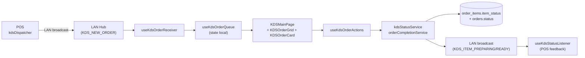
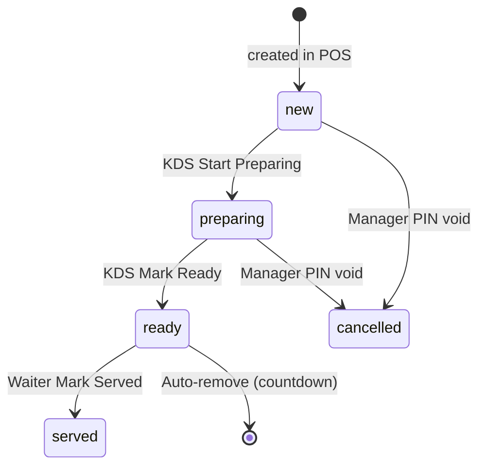

# 04 — KDS Kitchen

> **Last verified**: 2026-05-03
> **Related E2E flows**: [11-kds-station-flow](../08-flows-end-to-end/11-kds-station-flow.md), [12-kds-multi-station-dispatch](../08-flows-end-to-end/12-kds-multi-station-dispatch.md)
> **Related backlog**: travail/04-kds-recall.md (à créer)

## Vue d'ensemble

Kitchen Display System multi-stations (Hot Kitchen, Barista, Display, Waiter) avec dispatch automatique selon `categories.dispatch_station` et overrides produit. Les commandes sont propagées via LAN hub (BroadcastChannel + Supabase Realtime) puis statuées (`new` → `preparing` → `ready` → `served`) item par item. Auto-remove après countdown configurable. Sound alerts pour nouvelles commandes urgentes (>10 min).

## Diagramme de responsabilité



## Tables DB impliquées

| Table | Rôle | Lien |
|---|---|---|
| `order_items` | Champs `item_status` (`new`/`preparing`/`ready`/`served`/`cancelled`), `dispatch_station`, `is_dispatch_copy`, `is_held`, `sent_to_kitchen_at`, `prepared_at`, `prepared_by` | [details](../03-database/02-tables-reference.md#order_items) |
| `orders` | `status` (`new`/`preparing`/`ready`/`completed`/`voided`), `completed_at` | [details](../03-database/02-tables-reference.md#orders) |
| `kds_stations` | Stations enregistrées (`station_type`, `device_id`, `is_active`) — déclarée dans [`010_lan_sync_display.sql:158-172`](../../../supabase/migrations/010_lan_sync_display.sql) | [details](../03-database/02-tables-reference.md#kds_stations) |
| `categories` | Champ `dispatch_station` (résolution route KDS par défaut) | [details](../03-database/02-tables-reference.md#categories) |
| `lan_nodes` | Stations KDS visibles dans le hub (heartbeat) | [details](../03-database/02-tables-reference.md#lan_nodes) |
| `device_configurations` | Config persistante des stations (sound, layout) | [details](../03-database/02-tables-reference.md#device_configurations) |

## Hooks principaux

5 hooks dans `src/hooks/kds/` :

| Hook | Chemin | Rôle |
|---|---|---|
| `useKdsOrderQueue` | `src/hooks/kds/useKdsOrderQueue.ts` | State local de la queue : ajout/update/remove, séparation urgent vs normal (FIFO sort par `created_at`, threshold default 600s) |
| `useKdsOrderReceiver` | `src/hooks/kds/useKdsOrderReceiver.ts` | Subscribe aux messages `KDS_NEW_ORDER` / `KDS_ITEM_HOLD_TOGGLE` du LAN hub, ingest dans la queue |
| `useKdsOrderActions` | `src/hooks/kds/useKdsOrderActions.ts` | Handlers `handleStartPreparing`, `handleMarkReady`, `handleMarkServed`, `handleToggleHold`, `handleOrderComplete` — optimistic update + rollback on error |
| `useKdsUrgentAlertLoop` | `src/hooks/kds/useKdsUrgentAlertLoop.ts` | Joue le son urgent en boucle tant qu'au moins une commande dépasse le seuil |
| `useOrderAutoRemove` | `src/hooks/kds/useOrderAutoRemove.ts` | Countdown post-`ready` puis suppression automatique de la queue + `completeOrder` |

## Services principaux

3 fichiers dans `src/services/kds/` + `KdsSoundService` racine :

| Service | Chemin | Rôle |
|---|---|---|
| `kdsStatusService.markItemsPreparing` | `src/services/kds/kdsStatusService.ts:32-94` | Update `order_items.item_status='preparing'` + check si tous items en preparing → bump `orders.status='preparing'` + LAN broadcast |
| `kdsStatusService.markItemsReady` | `src/services/kds/kdsStatusService.ts` | Idem pour `'ready'` + broadcast `KDS_ITEM_READY` |
| `orderCompletionService.completeOrder` | `src/services/kds/orderCompletionService.ts:33-90` | Update `orders.status='ready'` + `completed_at` + LAN broadcast `ORDER_COMPLETE` |
| `KdsSoundService` | `src/services/KdsSoundService.ts` | Singleton son (new order chime, urgent loop, mute toggle) |

Côté POS (dispatch en amont) :
- `dispatchStationResolver.batchGetDispatchStationsMulti()` — `src/services/pos/dispatchStationResolver.ts` — résout la station finale par item (catégorie + override produit + multi-dispatch via migration `20260324100000_product_multi_dispatch_stations.sql`)
- `kdsDispatcher.dispatchOrderToKds()` — `src/services/pos/kdsDispatcher.ts` — split l'order par station, broadcast `KDS_NEW_ORDER` distinct par station

## Composants UI principaux

6 composants dans `src/components/kds/` :

| Composant | Chemin | Rôle |
|---|---|---|
| `KDSHeader` | `src/components/kds/KDSHeader.tsx` | Header station (nom, icon, sound toggle, all-day count toggle, time, refresh) |
| `KDSOrderGrid` | `src/components/kds/KDSOrderGrid.tsx` | Grille responsive (1/2/4/5/6 colonnes selon viewport, ligne 17), urgent en haut, normal ensuite |
| `KDSOrderCard` | `src/components/kds/KDSOrderCard.tsx` | Carte commande — items individuellement statuables, hold toggle, source badge (pos/mobile/web/lan) |
| `KDSCountdownBar` | `src/components/kds/KDSCountdownBar.tsx` | Barre countdown pré-auto-remove |
| `KDSAllDayCount` | `src/components/kds/KDSAllDayCount.tsx` | Vue agrégée par produit (overlay) |
| `OrderProgressBar` | `src/components/kds/OrderProgressBar.tsx` | Barre progression (n items ready / total) |

## Stores Zustand utilisés

KDS n'a **pas de store dédié** — l'état est local au composant `KDSMainPage` via `useKdsOrderQueue`. Cette décision tient au fait qu'une station = un device, donc pas besoin de partage cross-tab.

Lectures externes :
- `useLanClient` (`src/hooks/lan/`) — connexion au hub LAN
- `useKDSConfigSettings` (`src/hooks/settings/useModuleConfigSettings`) — config (urgent threshold, auto-remove delay, sound volume)

Voir [`01-architecture/03-state-management.md`](../01-architecture/03-state-management.md) (à créer).

## RPCs / Edge Functions utilisées

| Type | Nom | Rôle |
|---|---|---|
| Direct table update | `order_items.update({ item_status })` | `markItemsPreparing` / `markItemsReady` (`kdsStatusService.ts:42-49`) |
| Direct table update | `orders.update({ status, completed_at })` | `completeOrder` (`orderCompletionService.ts:42-49`) |
| LAN message | `KDS_NEW_ORDER` | Push commande vers stations |
| LAN message | `KDS_ITEM_PREPARING` | Feedback POS qu'un item est en cours |
| LAN message | `KDS_ITEM_READY` | Feedback POS qu'un item est prêt |
| LAN message | `KDS_ITEM_HOLD_TOGGLE` | Hold/unhold item |
| LAN message | `ORDER_COMPLETE` | Fin de commande (déclenche customer display, print receipt si configuré) |

Pas d'Edge Function dédiée — KDS ne fait que des updates directes (RLS + permissions au niveau DB suffisent).

Voir [`05-integrations/02-edge-functions.md`](../05-integrations/02-edge-functions.md) (à créer) et [`06-lan-architecture/02-protocol.md`](../06-lan-architecture/02-protocol.md) (à créer) — protocole LAN défini dans `src/services/lan/lanProtocol.ts`.

## RLS & Permissions

Permission codes : `kitchen.view`, `kitchen.update`, `pos.access`.

Pattern RLS sur `kds_stations` (extrait `012_rls_policies.sql:82+`) :
```sql
ALTER TABLE public.kds_stations ENABLE ROW LEVEL SECURITY;
CREATE POLICY "Authenticated read" ON public.kds_stations
    FOR SELECT USING (public.is_authenticated());
```

`order_items.update` (status change) est gardé par :
```sql
CREATE POLICY "Kitchen update item status" ON public.order_items
    FOR UPDATE USING (
        public.user_has_permission(auth.uid(), 'kitchen.update')
        OR public.user_has_permission(auth.uid(), 'sales.update')
    );
```

## Routes

| Route | Page component | Guard |
|---|---|---|
| `/kds` | `src/pages/kds/KDSStationSelector.tsx` | `POSAccessGuard` (`posRoutes.tsx:76-86`) |
| `/kds/:station` | `src/pages/kds/KDSMainPage.tsx` (param: `hot_kitchen`/`barista`/`display`/`waiter`) | `POSAccessGuard` (`posRoutes.tsx:87-100`) |

Le param `:station` est mappé dans `STATION_CONFIG` (`KDSMainPage.tsx:20-45`) qui définit le `dbStation` (`kitchen`/`barista`/`display`/`all` pour waiter) — ce dernier filtre les `order_items.dispatch_station` à afficher.

## Status flow



Ordre des updates côté DB :
1. `markItemsPreparing(itemIds, station)` → `order_items.item_status='preparing'`
2. Si tous les items primary du `order` sont != `'new'` → `orders.status='preparing'` (`kdsStatusService.ts:51-68`)
3. `markItemsReady(itemIds, station)` → `order_items.item_status='ready'`
4. `completeOrder(orderId, station)` → `orders.status='ready'` + `completed_at`
5. Auto-remove → suppression de la queue locale + ORDER_COMPLETE LAN

## Drag & drop

Le repo a `@dnd-kit` listé dans `package.json` (utilisé par d'autres modules — accounting, products), **mais le KDS V2 actuel ne l'utilise pas**. Les actions station sont déclenchées par tap/click (status badges interactifs sur `KDSOrderCard`). Réordonnancement par drag est dans le backlog (cf. travail/04-kds-recall.md).

## Real-time via lanHub

KDS est un client typique du LAN hub :
- Subscribe au boot via `useLanClient` (auto-reconnect)
- Filtre les messages destinés à sa station (`payload.station === dbStation` ou `'all'`)
- Push ses propres status updates via `lanClient.send(LAN_MESSAGE_TYPES.KDS_ITEM_PREPARING, payload)` (`kdsStatusService.ts:71-82`)

Voir [`06-lan-architecture/01-overview.md`](../06-lan-architecture/01-overview.md) (à créer) et `src/services/lan/lanClient.ts`, `src/services/lan/lanHub.ts`, `src/services/lan/lanProtocol.ts`.

## Flows E2E associés

- [11-kds-station-flow](../08-flows-end-to-end/11-kds-station-flow.md) (à créer) — start → preparing → ready → served
- [12-kds-multi-station-dispatch](../08-flows-end-to-end/12-kds-multi-station-dispatch.md) (à créer) — un order avec items kitchen + barista, dispatch parallèle

## Pitfalls spécifiques

- **`is_dispatch_copy` exclu du calcul `allPreparing`** : `kdsStatusService.ts:55-57` filtre `is_dispatch_copy=false` pour ne pas inclure les copies multi-station dans le check de bump `orders.status`. Sinon une commande à 2 stations ne bumperait jamais.
- **Optimistic update + rollback** : `useKdsOrderActions.handleStartPreparing` (`useKdsOrderActions.ts:32-53`) update la queue locale d'abord, puis rollback (`previousStatuses`) si le service échoue. Toast d'erreur visible.
- **Station `'all'` (waiter)** : `STATION_CONFIG.waiter.dbStation = 'all'` (`KDSMainPage.tsx:42`) — affiche TOUS les items, pour vue serveur. Cas spécial à filtrer dans receiver.
- **Sound urgent loop** : `useKdsUrgentAlertLoop` joue en continu tant qu'`urgentOrders.length > 0`. Mute toggle dans le header — persisté localement (`posLocalSettingsStore` ou `device_configurations`).
- **Auto-remove ≠ DB delete** : la commande `ready` est retirée de la queue locale mais reste en DB avec `status='ready'`. Le passage à `'completed'` ne survient qu'au paiement final.
- **Kdp threshold default 600s = 10 min** : configurable via `useKDSConfigSettings`. Si modifié runtime, `useKdsOrderQueue` re-évalue les urgent au prochain tick.
- **Pas de Realtime Supabase** sur les `order_items` côté KDS — tout passe par LAN. Si le hub est down (Wi-Fi), les nouvelles commandes n'arrivent pas. Fallback : refresh périodique manuel via `fetchOrders` dans `KDSMainPage`.
- **Source badge** : un order peut venir de `pos`, `mobile`, `web` ou `lan`. Le KDS peut filtrer / colorer selon la source pour distinguer un order tablette vs caisse.
- **Trigger functions returning TRIGGER** : si on ajoute un trigger custom sur `order_items` (ex. notifier KDS), Postgres ne permet pas `PERFORM trigger_fn()` standalone. Smoke test via `SELECT 1 FROM pg_proc WHERE proname='...'` (cf. CLAUDE.md pitfall epic-016b).
