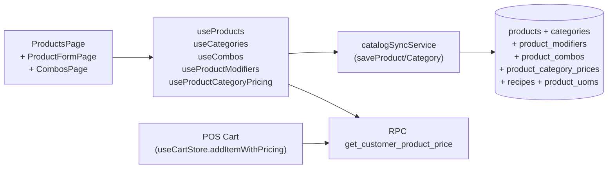

# 05 — Products & Categories

> **Last verified**: 2026-05-03
> **Related E2E flows**: [13-product-create](../08-flows-end-to-end/13-product-create.md), [14-customer-pricing](../08-flows-end-to-end/14-customer-pricing.md), [15-combo-build](../08-flows-end-to-end/15-combo-build.md)
> **Related backlog**: travail/05-products-variants-tab.md (à créer)

## Vue d'ensemble

Catalogue produits + catégories avec dispatch station KDS, modifiers (taille, lait, extras), combos multi-groupes (groups + items configurables), pricing tiers customer-spécifique (retail / wholesale / discount / custom), recipes (BOM) et UOMs multiples. Soft delete via `deleted_at`. Le pricing customer est résolu par RPC `get_customer_product_price()` à chaque ajout au cart.

## Diagramme de responsabilité



## Tables DB impliquées

| Table | Rôle | Lien |
|---|---|---|
| `products` | Catalogue (`sku`, `name`, `retail_price`, `wholesale_price`, `cost_price`, `category_id`, `product_type` (finished/semi_finished/raw_material), `current_stock`, `pos_visible`, `available_for_sale`, `track_inventory`, `is_made_to_order`, `deduct_ingredients`, `section_id`, `deleted_at`) | [details](../03-database/02-tables-reference.md#products) |
| `categories` | Catégorie (`name`, `slug`, `icon`, `color`, `dispatch_station`, `sort_order`, `is_raw_material`, `show_in_pos`, `deleted_at`) | [details](../03-database/02-tables-reference.md#categories) |
| `product_modifiers` | Modifiers product-level OU category-level (`group_name`, `group_type`, `group_required`, `option_label`, `price_adjustment`, `is_default`, `materials` JSONB pour variants matières) | [details](../03-database/02-tables-reference.md#product_modifiers) |
| `product_combos` | Combos / menus (header) | [details](../03-database/02-tables-reference.md#product_combos) |
| `product_combo_groups` | Groupes au sein d'un combo (`group_name`, `is_required`, `min_selections`, `max_selections`) | [details](../03-database/02-tables-reference.md#product_combo_groups) |
| `product_combo_group_items` | Items éligibles dans un groupe (`product_id`, `price_adjustment`, `is_default`) | [details](../03-database/02-tables-reference.md#product_combo_group_items) |
| `product_category_prices` | Pricing custom par customer category (`product_id`, `customer_category_id`, `price`) | [details](../03-database/02-tables-reference.md#product_category_prices) |
| `product_uoms` | Unités multiples (`uom_name`, `conversion_factor`, `is_sale_uom`, `is_purchase_uom`, `barcode`, `price_override`) | [details](../03-database/02-tables-reference.md#product_uoms) |
| `recipes` | BOM produit fini ↔ ingrédients (`product_id`, `material_id`, `quantity`, `unit`) | [details](../03-database/02-tables-reference.md#recipes) |
| `customer_categories` | Catégories clients (`slug` : `retail`, `wholesale`, …) — input pricing | [details](../03-database/02-tables-reference.md#customer_categories) |

## Hooks principaux

14 hooks dans `src/hooks/products/` :

| Hook | Chemin | Rôle |
|---|---|---|
| `useProducts` / `useProductList` | `src/hooks/products/useProductList.ts:11` | Query products POS-visible (`pos_visible=true` AND `available_for_sale=true` AND `is_active=true`), filtre catégorie optionnel, jointure catégorie inline |
| `useProductListSimple` | `src/hooks/products/useProductList.ts:52` | Liste lightweight `{id, name, sku}` pour dropdowns |
| `useProductDetail` | `src/hooks/products/useProductDetail.ts` | Detail full avec recipes + uoms + modifiers (3 queries parallèles) |
| `useCategories` | `src/hooks/products/useCategories.ts` | Liste catégories (POS + admin) |
| `useCombos` | `src/hooks/products/useCombos.ts` | CRUD combos avec groups + items (3 tables jointes en transaction logique côté client) |
| `useProductModifiers` | `src/hooks/products/useProductModifiers.ts` | CRUD modifiers product/category-level + auto-cleanup |
| `useProductCategoryPricing` | `src/hooks/products/useProductCategoryPricing.ts` | CRUD `product_category_prices` (pricing custom par catégorie client) |
| `useProductForm` | `src/hooks/products/useProductForm.ts` | State machine du form produit (validation + draft save) |
| `useProductSearch` | `src/hooks/products/useProductSearch.ts` | Recherche full-text products (POS quick search) |
| `useProductSettings` | `src/hooks/products/useProductSettings.ts` | Préférences catalogue (display, sort) |
| `useProductPerformance` | `src/hooks/products/useProductPerformance.ts` | Métriques ventes par produit (report card) |
| `useProductPriceHistory` | `src/hooks/products/useProductPriceHistory.ts` | Historique changements prix (audit trail) |
| `useProductVariants` | `src/hooks/products/useProductVariants.ts` | Variants matières (lait amande, etc.) — branché sur `product_modifiers.materials` JSONB |
| `usePromotionForm` | `src/hooks/products/usePromotionForm.ts` | Form promotion (lié module Promotions, mais hébergé ici) |

## Services principaux

4 fichiers dans `src/services/products/` :

| Service | Chemin | Rôle |
|---|---|---|
| `catalogSyncService` | `src/services/products/catalogSyncService.ts` | `saveProduct` (ligne 13), `saveCategory` (ligne 37), `saveProductCategoryPrice` (ligne 61) — upsert direct Supabase |
| `productImportExport` | `src/services/products/productImportExport.ts` | Import/export XLSX (catalog + recipes), bulk update |
| `productSettingsService` | `src/services/products/productSettingsService.ts` | Gestion settings catalogue (sort orders, displays) |
| `recipeImportExport` | `src/services/products/recipeImportExport.ts` | Import/export recettes XLSX |

## Composants UI principaux

| Composant | Chemin | Rôle |
|---|---|---|
| `ProductImportModal` | `src/components/products/ProductImportModal.tsx` | UI import XLSX produits (validation + preview) |
| `RecipeImportModal` | `src/components/products/RecipeImportModal.tsx` | UI import recettes |
| `recipe-import/*` | `src/components/products/recipe-import/` | Sous-composants recipe import (mapping, errors, progress) |

Pages (`src/pages/products/`) :

| Page | Chemin | Rôle |
|---|---|---|
| `ProductsLayout` | `src/pages/products/ProductsLayout.tsx` | Layout shell (tabs Products / Combos / Promotions) |
| `ProductsPage` | `src/pages/products/ProductsPage.tsx` | Liste produits (filter par catégorie, search, bulk actions) |
| `ProductFormPage` | `src/pages/products/ProductFormPage.tsx` | Form create/edit produit (delegate à `product-form/` sub-components) |
| `product-form/*` | `src/pages/products/product-form/` | Sections form (general, pricing, stock, recipes, modifiers, uoms) |
| `ProductCategoryPricingPage` | `src/pages/products/ProductCategoryPricingPage.tsx` | Grille `product_category_prices` (matrice produit × catégorie client) |
| `category-pricing/*` | `src/pages/products/category-pricing/` | Sous-composants matrice |
| `CombosPage` | `src/pages/products/CombosPage.tsx` | Liste combos |
| `ComboFormPage` | `src/pages/products/ComboFormPage.tsx` | Form combo (groups + items) |
| `combo-form/*` | `src/pages/products/combo-form/` | Sub-components form combo |
| `combos-list/*` | `src/pages/products/combos-list/` | Sub-components liste |
| `PromotionsPage` | `src/pages/products/PromotionsPage.tsx` | Liste promotions (module séparé mais routé ici) |
| `PromotionFormPage` | `src/pages/products/PromotionFormPage.tsx` | Form promotion |
| `promotions-list/*` | `src/pages/products/promotions-list/` | Sub-components |
| `PromotionConstraintsSection` | `src/pages/products/PromotionConstraintsSection.tsx` | UI règles promotion |
| `PromotionProductSearch` | `src/pages/products/PromotionProductSearch.tsx` | Picker produits éligibles promo |

Composants modifier consommés par POS (vivent dans `src/components/pos/modals/`) :
- `ModifierModal`, `ModifierGroupSection`, `VariantModal`, `modifierConfig.ts`

## Stores Zustand utilisés

Le module **n'a pas de store Zustand dédié** — toutes les données passent par react-query (`useProducts`, `useCategories`, `useCombos`, …) et sont consommées par `cartStore` au moment de l'ajout (`addItem` / `addItemWithPricing` / `addCombo`).

Voir [`01-architecture/03-state-management.md`](../01-architecture/03-state-management.md) (à créer).

## RPCs / Edge Functions utilisées

| Type | Nom | Rôle |
|---|---|---|
| RPC | `get_customer_product_price(product_id, category_slug)` → DECIMAL | Résout le prix selon le tier customer (retail / wholesale / discount % / custom override). Implémentation dans `database.generated.ts:12044`. |
| RPC | (insertion via `useCombos.create`) | Pas de RPC dédié — combo create fait 3 inserts séquentiels (combo + groups + items) côté client (`useCombos.ts:85-115`) |
| Direct upsert | `products`, `categories`, `product_modifiers`, `product_combos`, `product_combo_groups`, `product_combo_group_items`, `product_category_prices`, `recipes`, `product_uoms` | Via `catalogSyncService` ou hooks directs |

Pas d'Edge Function métier products — module purement DB.

Voir [`03-database/03-rpc-functions.md`](../03-database/03-rpc-functions.md) (à créer).

## RLS & Permissions

Permission codes : `products.view`, `products.create`, `products.update`, `products.delete`, `products.pricing`, `products.import`, `products.export`.

Pattern RLS sur `products` :
```sql
ALTER TABLE public.products ENABLE ROW LEVEL SECURITY;
CREATE POLICY "Authenticated read" ON public.products
    FOR SELECT USING (public.is_authenticated() AND deleted_at IS NULL);
CREATE POLICY "Products create" ON public.products
    FOR INSERT WITH CHECK (public.user_has_permission(auth.uid(), 'products.create'));
CREATE POLICY "Products update" ON public.products
    FOR UPDATE USING (public.user_has_permission(auth.uid(), 'products.update'));
```

`products.pricing` est requis pour `/products/:id/pricing` (matrice) — protégé par `<RouteGuard permission="products.pricing">` (`productRoutes.tsx:39`).

## Routes

Toutes définies dans `src/routes/productRoutes.tsx` :

| Route | Page component | Guard |
|---|---|---|
| `/products` | `<ProductsLayout>` → `<ProductsPage>` (index) | `products.view` |
| `/products/combos` | `<CombosPage>` (dans layout) | `products.view` |
| `/products/promotions` | `<PromotionsPage>` (dans layout) | `products.view` |
| `/products/new` | `<ProductFormPage>` | `products.create` |
| `/products/:id` | `<ProductDetailPage>` (réutilise inventory page) | `products.view` |
| `/products/:id/edit` | `<ProductFormPage>` | `products.update` |
| `/products/:id/pricing` | `<ProductCategoryPricingPage>` | `products.pricing` |
| `/products/combos/new` | `<ComboFormPage>` | `products.create` |
| `/products/combos/:id` | `<ComboFormPage>` | `products.view` |
| `/products/combos/:id/edit` | `<ComboFormPage>` | `products.update` |
| `/products/promotions/new` | `<PromotionFormPage>` | `products.create` |
| `/products/promotions/:id` | `<PromotionFormPage>` | `products.view` |
| `/products/promotions/:id/edit` | `<PromotionFormPage>` | `products.update` |

Toutes wrappées dans `<ModuleErrorBoundary moduleName="Products">`.

## Pricing tiers

| Tier | Slug `customer_categories.slug` | Source de prix |
|---|---|---|
| Retail | `retail` | `products.retail_price` (default) |
| Wholesale | `wholesale` | `products.wholesale_price` |
| Discount % | `discount` | `products.retail_price * (1 - customer_categories.discount_percentage/100)` |
| Custom | (any custom slug) | `product_category_prices.price` lookup, fallback retail si absent |

Côté cart : `useCartStore.addItemWithPricing(product, qty, modifiers, notes, customerPrice, priceType, savings, variants)` — `priceType` est `'retail' | 'wholesale' | 'discount' | 'custom'` (`src/types/cart.ts:15`).

Recalcul global cart sur changement de customer : `useCartStore.recalculateAllPrices(priceCalculator)` (`cartStore.ts:519-555`) — itère sur snapshot, écrit dans state actuel pour éviter race avec ajouts simultanés.

## Soft delete

Tous les hooks de lecture filtrent implicitement via la RLS policy `deleted_at IS NULL`. Les hooks d'écriture mettent `deleted_at = now()` plutôt qu'un vrai `DELETE`. Les `useCombos` font une exception : `delete()` direct (`useCombos.ts:132`) car les combos ne sont pas FK-référencés ailleurs (ils sont stockés en JSONB dans `order_items.combo_selections`).

## Flows E2E associés

- [13-product-create](../08-flows-end-to-end/13-product-create.md) (à créer) — création produit + recipe + modifiers
- [14-customer-pricing](../08-flows-end-to-end/14-customer-pricing.md) (à créer) — résolution `get_customer_product_price` + recalc cart
- [15-combo-build](../08-flows-end-to-end/15-combo-build.md) (à créer) — build combo multi-groupes + ajout cart
- [16-product-import-xlsx](../08-flows-end-to-end/16-product-import-xlsx.md) (à créer) — import XLSX bulk

## Pitfalls spécifiques

- **`UI_SENTINELS` à filtrer** : `useProducts(categoryId)` rejette `'__combos__'` et `'favorites'` (`useProductList.ts:9-12`) car ce sont des onglets UI, pas des FK. Sans ce filtre, Supabase renvoie 400.
- **Pas de table `product_variants`** : le concept "variant" est implémenté via `product_modifiers.materials` JSONB (`useProductModifiers.ts:122`) — un modifier d'un produit peut consommer une matière différente (ex. lait amande au lieu de lait entier déduit du stock).
- **Combos non-soft-delete** : `useCombos.delete()` fait un vrai `DELETE` — un combo référencé dans un `order_items.combo_selections` JSONB historique ne casse pas (FK-less).
- **Pricing custom fallback** : `get_customer_product_price` renvoie `retail_price` si aucune entrée `product_category_prices` n'existe pour la catégorie demandée. Ne jamais supposer qu'un customer wholesale a forcément un prix custom.
- **`pos_visible` ≠ `is_active`** : un produit peut être actif (visible BackOffice) mais pas POS (kitchen prep only). Le filtre POS exige les TROIS flags `pos_visible AND available_for_sale AND is_active` (`useProductList.ts:19-21`).
- **`is_made_to_order` + `deduct_ingredients`** : produit BOM, déduit le stock des matières via `recipes` au moment de la production (cf. module Production). Pas déduit à la vente seule.
- **`section_id` orphelin** : champ optionnel sur `products` pour grouper visuellement dans le POS (sections du menu). Pas de table `sections` distincte — c'est un libre arbitre catalogue.
- **`product_modifiers` peut être product-level OU category-level** : si `product_id` est NULL, le modifier s'applique à tous les produits de la `category_id` ; si `product_id` est rempli, il override pour ce produit (`useProductModifiers.ts:121-130`).
- **Modifiers persistés via JSONB dans `order_items.modifiers`** : pas de FK, donc supprimer un `product_modifiers` ne casse pas l'historique commandes.
- **Imports XLSX** : `productImportExport.ts` valide colonne par colonne, crée les catégories manquantes si auto-detect activé. SKU duplicate déclenche update plutôt qu'insert.
- **Combo upsert "transaction"** : `useCombos.update` fait combo + delete groups + delete items + re-insert (3-4 round-trips). Pas atomique au niveau DB — si le client coupe, on peut se retrouver avec un combo orphelin de groupes. Backlog : encapsuler dans une RPC.
