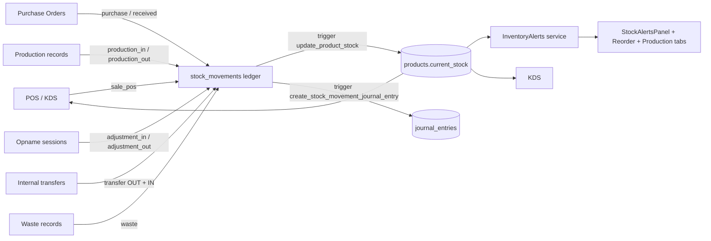

# 06 — Inventory & Stock

> **Last verified**: 2026-05-03
> **Related E2E flows**: [05-stock-opname](../08-flows-end-to-end/05-stock-opname.md), [12-production-stock-impact](../08-flows-end-to-end/12-production-stock-impact.md)
> **Related backlog**: [travail/06-inventory-followups.md](../travail/06-inventory-followups.md)

## Vue d'ensemble

Le module Inventory gère le stock physique multi-sections (warehouse, production, sales),
les mouvements ledger immutable (`stock_movements`), les transferts internes, l'inventaire
physique (opname), les alertes seuils, et les suggestions de réapprovisionnement / production.
Il est la source de vérité pour les valeurs `products.current_stock` qui pilotent les alertes
POS, KDS et purchasing. Le module est append-only sur le ledger et toutes les corrections
passent par des mouvements compensatoires, ce qui garantit la traçabilité comptable.

## Architecture conceptuelle

Le stock est modélisé sur **3 niveaux** :

1. **Sections** (`sections` table — 5 seedées : Main Warehouse, Production Kitchen, Pastry,
   Cafe Storage, Front Sales) — la zone physique de l'établissement.
2. **Stock locations** (`stock_locations` table) — emplacements hiérarchiques sous une section
   (étagère, frigo, sous-section).
3. **Movements** (`stock_movements` ledger) — chaque variation de stock est inscrite avec
   `from_section_id` / `to_section_id`, `quantity` (signée), `unit`, `movement_type`,
   `reference_type` + `reference_id` (lien vers la transaction métier source).

La colonne `products.current_stock` est un **cache dénormalisé** maintenu par triggers DB ;
toute lecture autoritaire passe par `SUM(stock_movements.quantity)` filtré par produit
(et optionnellement par section).

## Diagramme de responsabilité



## Tables DB impliquées

| Table | Rôle |
|---|---|
| `products` | Carte produit + colonne `current_stock`, `min_stock_level`, `cost_price`, `unit`, `section_id` |
| `sections` | Zones physiques (warehouse, production, sales), 5 seedées |
| `stock_locations` | Emplacements hiérarchiques sous une section |
| `stock_movements` | Ledger immutable de TOUS les mouvements (sale, purchase, transfer, waste, adjustment, production, opname) — append-only |
| `inventory_counts` | Sessions d'inventaire physique (opname) |
| `inventory_count_items` | Lignes par produit dans une session opname (qty théorique vs réelle) |
| `internal_transfers` | En-tête transfert inter-sections (status: draft / pending / in_transit / received / cancelled) |
| `transfer_items` | Lignes de transfert (`quantity_requested` vs `quantity_received`) |
| `stock_reservations` | Réservations de stock pour commandes B2B (`active`, `fulfilled`, `cancelled`, `expired`) |
| `waste_records` | Enregistrements de gaspillage (lié à `stock_movements.movement_type='waste'`) |
| `recipes` + `recipe_ingredients` | Formules production (consommation matières premières) |
| `production_records` | Sessions production (output produit fini) |

## Hooks principaux

| Hook | Chemin | Rôle |
|---|---|---|
| `useStockMovements` | `src/hooks/inventory/useStockMovements.ts` | Lecture filtrée du ledger (par type, date, produit) |
| `useProductStockMovements` | `src/hooks/inventory/useStockMovements.ts` | Historique d'un produit unique |
| `useInternalTransfers` | `src/hooks/inventory/useInternalTransfers.ts` | Liste + filtres transferts |
| `useTransfer` | `src/hooks/inventory/useInternalTransfers.ts` | Détail transfert + items |
| `useCreateTransfer` | `src/hooks/inventory/useInternalTransfers.ts` | Création (avec option `sendDirectly` qui auto-réceptionne) |
| `useReceiveTransfer` | `src/hooks/inventory/useInternalTransfers.ts` | Réception : update items qty + création des stock_movements OUT/IN avec garde idempotence |
| `useStockOpname` | `src/hooks/inventory/useStockOpname.ts` | Cycle opname : create session → count items → finalize → adjustments JE |
| `useStockAdjustment` | `src/hooks/inventory/useStockAdjustment.ts` | Ajustement manuel (adjustment_in / adjustment_out) |
| `useInventoryAlerts` | `src/hooks/inventory/useInventoryAlerts.ts` | Wrap `inventoryAlerts.ts` (low stock, reorder, production suggestions) |
| `useInventoryItems` | `src/hooks/inventory/useInventoryItems.ts` | Liste agrégée pour `StockPage` avec filtre catégorie |
| `useStockByLocation` | `src/hooks/inventory/useStockByLocation.ts` | Vue stock par section/location |
| `useLocations` | `src/hooks/inventory/useLocations.ts` | CRUD sections + locations |
| `useSections` | `src/hooks/inventory/useSections.ts` | Liste sections (5 seedées) |
| `useIncomingStock` | `src/hooks/inventory/useIncomingStock.ts` | Réception cafés / produits sans PO |
| `useWasteRecords` | `src/hooks/inventory/useWasteRecords.ts` | CRUD waste — déclenche `STOCK_WASTE_FOOD` JE |
| `useStockReservations` | `src/hooks/inventory/useStockReservations.ts` | Réservations B2B (Story 10.3) |
| `useProduction` | `src/hooks/inventory/useProduction.ts` | Cycle production (consommation ingrédients + output produit fini) |
| `useProductRecipe` | `src/hooks/inventory/useProductRecipe.ts` | Lecture recette d'un produit + ingrédients |
| `useProductInventoryDashboard` | `src/hooks/inventory/useProductInventoryDashboard.ts` | Données enrichies pour le dashboard produit (KPIs + charts) |
| `useStockProduction` | `src/pages/inventory/useStockProduction.ts` | Wrapper page-level pour production sessions |

## Services principaux

| Service | Chemin | Rôle |
|---|---|---|
| `inventoryAlerts.ts` | `src/services/inventory/inventoryAlerts.ts` | `getLowStockItems`, `getReorderSuggestions`, `getProductionSuggestions` (RPCs `get_reorder_suggestions_data`, `get_production_suggestions_data`) — calcule sévérité `critical` / `warning` selon settings `inventory_config.stock_percentage_*` |
| `opnameImportService.ts` | `src/services/inventory/opnameImportService.ts` | Import CSV/XLSX comptage opname avec validation et preview |
| `stockReservation.ts` | `src/services/inventory/stockReservation.ts` | `getActiveReservations`, `getAvailableStock` (RPC `get_available_stock` avec fallback manuel) |
| `stockProductionService.ts` | `src/pages/inventory/stockProductionService.ts` | Logique page production : aggregation des recipes + quantités suggérées |

## Composants UI principaux

| Composant | Chemin | Rôle |
|---|---|---|
| `InventoryTable` | `src/components/inventory/InventoryTable.tsx` | Liste paginée des produits avec stock, severity badge, action quick-adjust |
| `StockAdjustmentModal` | `src/components/inventory/StockAdjustmentModal.tsx` | Modal saisie ajustement (avec raison + JE auto via accountingEngine) |
| `StockAlertsPanel` | `src/components/inventory/StockAlertsPanel.tsx` | Panel agrégé alertes accessible depuis topbar |
| `StockAlertsBadge` | `src/components/inventory/StockAlertsBadge.tsx` | Badge notif (rouge si critique, orange si warning) |
| `InventoryAlertsPanel` | `src/components/inventory/InventoryAlertsPanel.tsx` | Panel détaillé avec onglets `LowStockTab`, `ReorderTab`, `ProductionTab` (`src/components/inventory/alerts/`) |
| `RecipeViewerModal` | `src/components/inventory/RecipeViewerModal.tsx` | Vue read-only d'une recette + ingrédients dispo |
| `OpnameCountTable` | `src/pages/inventory/components/OpnameCountTable.tsx` | Tableau saisie comptage opname avec écart théo/réel |
| `ProductionForm` | `src/pages/inventory/components/ProductionForm.tsx` | Formulaire production (recette + qty batches) |
| `MovementBreakdownChart` | `src/pages/inventory/dashboard/MovementBreakdownChart.tsx` | Recharts pie/bar mouvements par type (sales / purchase / production…) |
| `StockTimelineChart` | `src/pages/inventory/dashboard/StockTimelineChart.tsx` | Évolution stock sur 30/90j |
| `RecipeUsageTable` | `src/pages/inventory/dashboard/RecipeUsageTable.tsx` | Top recettes consommatrices d'un ingrédient |

## Stores Zustand utilisés

- `useCoreSettingsStore` — lit `inventory_config.stock_percentage_critical` (défaut 25%), `stock_percentage_warning` (défaut 50%), `reorder_lookback_days`, `max_stock_multiplier`, `production_lookback_days`, `production_priority_high_threshold`, `po_lead_time_days`.
- `useAuthStore` — résout `user.id` pour les colonnes audit `staff_id`, `approved_by`, `created_by`.

Pas de store dédié inventory : la state vit dans React Query (cache 30s pour les transferts, 60s pour le ledger).

## RPCs / Edge Functions

### RPCs PostgreSQL

| RPC | Rôle |
|---|---|
| `get_reorder_suggestions_data(p_lookback_days, p_max_multiplier)` | Batch unique remplaçant 1+2N queries — retourne `current_stock`, `avg_daily_usage`, `last_purchase_price`, `days_until_stockout`, `suggested_quantity` |
| `get_production_suggestions_data(p_lookback_days, p_priority_high_threshold, p_priority_medium_threshold)` | Batch unique pour production avec `priority` calculée |
| `get_available_stock(p_product_id)` | `current_stock` − somme reservations actives non-expirées |
| `check_fiscal_period_open(p_entry_date)` | Garde anti-modification quand JE auto déclenchée par mouvement |

### Edge Functions

| Function | Rôle |
|---|---|
| `intersection_stock_movements` | Calcule l'intersection des mouvements pour audit / réconciliation cross-section (POST avec date range) — appelée par les pages dashboard et reports |

## RLS & Permissions

Toutes les tables (`stock_movements`, `inventory_counts`, `internal_transfers`, `transfer_items`, `sections`, `stock_locations`, `stock_reservations`, `waste_records`, `production_records`) ont RLS activé.

| Action | Permission requise |
|---|---|
| Lecture | `is_authenticated()` |
| INSERT mouvements | `inventory.create` (sauf triggers SECURITY DEFINER) |
| Ajustement | `inventory.adjust` |
| UPDATE / DELETE locations | `inventory.update` / `inventory.delete` |

`stock_movements` est **append-only** : aucune policy UPDATE/DELETE n'est définie côté code applicatif (les triggers DB peuvent insérer, jamais modifier les lignes existantes).

## Routes

```
/inventory                         — StockPage (liste + alerts badge)
/inventory/incoming                — IncomingStockPage (réception sans PO)
/inventory/wasted                  — WastedPage
/inventory/production              — StockProductionPage
/inventory/opname                  — StockOpnameList
/inventory/stock-opname/:id        — StockOpnameForm (saisie + finalisation)
/inventory/movements               — StockMovementsPage (ledger filtrable)
/inventory/transfers               — InternalTransfersPage
/inventory/transfers/new           — TransferFormPage
/inventory/transfers/:id           — TransferDetailPage
/inventory/transfers/:id/edit      — TransferFormPage (edit)
/inventory/stock-by-location       — StockByLocationPage
/inventory/product/:id             — ProductDetailPage
/inventory/product/:id/dashboard   — ProductInventoryDashboard (KPIs + charts)
```

Routes legacy redirigées : `/stock` → `/inventory`, `/production` → `/inventory/production`, `/inventory/suppliers` → `/purchasing/suppliers`, `/internal-moves` → `/inventory/transfers`.

Toutes les routes sont gardées par `RouteGuard permission="inventory.view"` (ou `.create`, `.update`) + `ModuleErrorBoundary moduleName="Inventory"`.

## Movement types détaillés

| Type | Quantité | Source | JE déclenchée |
|---|---|---|---|
| `sale_pos` | négative | trigger orders.completed | par `create_sale_journal_entry` (Cr Inventory n'est pas créé — POS direct) |
| `sale_b2b` | négative | trigger b2b_orders.delivered (`deduct_b2b_stock`) | par engine B2B sale (cf. module 09) |
| `purchase` | positive | trigger purchase_orders.received | `create_purchase_journal_entry` (Dr Inventory) |
| `transfer` | OUT négative + IN positive (deux lignes) | hook `useReceiveTransfer` | aucune (mouvement neutre) |
| `adjustment_in` / `adjustment_out` | positive / négative | hook `useStockAdjustment` ou opname finalize | `create_stock_movement_journal_entry` |
| `waste` | négative | hook `useWasteRecords` | `create_stock_movement_journal_entry` (Dr `STOCK_WASTE_FOOD`) |
| `production_in` | positive (produit fini) | hook `useProduction` | `postProductionJournalEntry` |
| `production_out` | négative (ingrédients) | hook `useProduction` | (regroupée dans le JE production) |
| `opname` | calculée par session | finalisation `useStockOpname` | identique à adjustment_in/out |

## Workflow : Internal Transfer

Le hook `useCreateTransfer` supporte deux modes :

1. **Standard** (default) : crée le transfer en status `draft` ou `pending`, attend une étape
   séparée `useReceiveTransfer` qui va matérialiser les `stock_movements`.
2. **Send directly** (`sendDirectly: true`) : status passe immédiatement à `received`,
   les mouvements OUT/IN sont créés dans la même mutation, `approved_by` rempli avec
   `auth.user.id`. Utile pour transferts express entre sections du même bâtiment.

Le `useReceiveTransfer` applique un **optimistic lock** via
`.in('status', ['pending', 'in_transit'])` pour empêcher deux utilisateurs de réceptionner
le même transfer simultanément. Si le verrou échoue, l'erreur "Transfer has already been
received or cancelled by another user. Please refresh the page." est levée.

## Workflow : Stock Opname

1. Créer une session `inventory_counts` (status `draft`) avec section ciblée (ou globale).
2. Inscrire les `inventory_count_items` : `expected_quantity` (lecture cache) +
   `counted_quantity` (saisie utilisateur). Status `in_progress`.
3. Review des écarts (composant `OpnameCountTable`) — chaque écart > 0 deviendra
   `adjustment_in`, chaque écart < 0 deviendra `adjustment_out`.
4. Finalize : status passe à `finalized`, génération atomique des `stock_movements` +
   triggers JE comptables.
5. Validation manager (status `validated`) — verrouille définitivement la session.

Import CSV/XLSX possible via `opnameImportService.ts` avec preview et validation per-row
avant injection.

## Flows E2E associés

- **05 — Stock Opname** : création session → comptage par section → review écarts → finalisation (génère `adjustment_in`/`adjustment_out` movements + JE `STOCK_ADJUSTMENT_INCOME`/`STOCK_ADJUSTMENT_EXPENSE`).
- **12 — Production stock impact** : production_record déclenche déduction ingrédients (production_out, multi-lignes) + création produit fini (production_in) + JE `PRODUCTION_COGS` ↔ `INVENTORY_GENERAL`.
- **04 — Purchase Order cycle** (cf. module 07) : impact direct sur stock à la réception PO via mouvement `purchase`.

## Pitfalls spécifiques

- **`stock_movements` n'a pas de policy UPDATE/DELETE** — c'est un ledger immutable. Toute correction se fait par mouvement compensatoire (`adjustment_in` ou `adjustment_out`), JAMAIS par UPDATE direct.
- **`useReceiveTransfer` n'est PAS atomique** (Supabase ne supporte pas de transactions client-side). L'ordre est : 1) update status `received` (optimistic lock via `.in('status', ['pending', 'in_transit'])`), 2) update items qty, 3) check idempotency via `existingMovements` query, 4) insert stock_movements. Si l'étape 4 échoue, le transfert est marqué `received` mais sans mouvements — un log `CRITICAL` est émis et l'utilisateur voit un message d'erreur explicite.
- **Garde idempotence transferts** : avant d'insérer les `stock_movements` à la réception, le hook query `WHERE reference_type='transfer' AND reference_id=...` — si des mouvements existent déjà, skip l'insertion (récupération d'une tentative précédente).
- **`current_stock` peut diverger** du `SUM(stock_movements.quantity)` si un trigger a échoué. Le job d'audit `db-schema-audit` peut détecter ces écarts ; un `stock-opname` complet recale les valeurs.
- **`unit` est OBLIGATOIRE sur stock_movements** depuis le UNIT-FIX : ne jamais insérer sans `unit` (fallback : `product.unit ?? 'pcs'`).
- **Sections vs locations** : `stock_movements` utilise `from_section_id`/`to_section_id` (NOUVEAU modèle), pas `from_location_id`. Le hook `useCreateTransfer` accepte les deux pour compat mais préfère sections.
- **Trigger waste/adjustment crée le JE automatiquement** via `create_stock_movement_journal_entry` — ne pas appeler `accountingEngine` côté client si le mouvement est déjà inséré (double JE).
- **`InventoryAlerts` filtre côté client** car PostgreSQL ne permet pas la comparaison `current_stock < min_stock_level` directement dans une `WHERE` Supabase REST sans RPC. Pour large catalogues (>500 produits actifs), envisager une view matérialisée.
- **Réservations expirent silencieusement** : la query `getActiveReservations` filtre `gt('reserved_until', NOW())`. Aucun job nettoie les `expired` automatiquement — la table grossit. À surveiller.
- **`current_stock` n'est pas RLS-filtré** par section : un utilisateur voit le stock global même si physiquement il opère dans une seule section. Pour multi-tenant strict (futur V3), revoir.
- **Settings dynamiques pour les seuils alertes** : `stock_percentage_critical` (défaut 25%) et `stock_percentage_warning` (défaut 50%) lus depuis `useCoreSettingsStore`. Un changement de settings par un admin n'invalide PAS automatiquement le cache react-query — l'utilisateur doit refresh ou la query stale-time (60s sur alerts) finit par re-fetch.
- **Recettes : `is_active=true` requis** — `getProductionSuggestions` filtre `eq('is_active', true)`. Une recette désactivée ne propose plus de production. Pour archiver sans désactiver, utiliser un flag séparé.
- **Stock par section non-géré nativement** : la query `useStockByLocation` agrège côté client en sommant les `stock_movements` filtrés par `to_section_id` − `from_section_id`. C'est lent pour un catalogue large ; envisager une view matérialisée `mv_stock_by_section` rafraîchie périodiquement.
- **Production : `recipe.output_quantity` est central** — un changement de `output_quantity` après création de recettes peut casser le calcul `batches_needed = ceil(suggested_qty / output_quantity)`. Toujours review les recettes existantes avant migration.
- **Pas de batch / lot tracking natif** : le module ne gère pas les batch numbers ou expirations FEFO (First Expired First Out). Pour produits à DLC courte (croissants, viennoiseries), c'est une limite — workaround : produire en petite qty et synchroniser KDS pour vendre en priorité les anciens.
- **Cleanup réservations expirées** : aucun job auto. La table `stock_reservations` peut grossir indéfiniment. Créer un cron Vercel ou Supabase pg_cron pour cleanup quotidien des `expired`.
- **Mouvements `transfer` en double** : chaque transfer génère DEUX `stock_movements` (OUT + IN). Quand on agrège par produit, attention à ne pas compter doublement — filter par `from_section_id IS NOT NULL` pour OUT only OU faire un `SUM` propre sur la quantité signée.
- **Section `is_active=false` non-bloquant** : on peut encore créer des transfers vers/depuis une section désactivée (juste un warning UI). Pour bloquer, ajouter une CHECK ou un trigger.
- **Edge `intersection_stock_movements` lent** : pour audit cross-section sur >30j et catalogue large, peut prendre 10-30s. Caching côté client ou pagination conseillé.
- **`useInventoryItems` agrège le total stock** côté client (somme des `stock_movements` par produit) si pas de `current_stock` à jour. Pour large catalogue, ce calcul est lent — préférer `current_stock` cache + audit nightly de cohérence.
- **Audit drift cache vs ledger** : recommandé `db-schema-audit` skill périodique pour détecter les produits où `current_stock != SUM(stock_movements.quantity)`. Un drift signale un trigger raté ou un cleanup manuel non-loggé.
