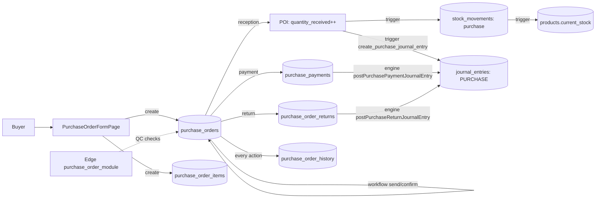

# 07 — Purchasing & Suppliers

> **Last verified**: 2026-05-03
> **Related E2E flows**: [04-purchase-order-cycle](../08-flows-end-to-end/04-purchase-order-cycle.md)
> **Related backlog**: [travail/07-purchasing-followups.md](../travail/07-purchasing-followups.md)

## Vue d'ensemble

Le module Purchasing gère le répertoire fournisseurs, le cycle complet des bons de commande
(draft → sent → confirmed → partially_received → received), le QC à réception, les retours
fournisseur, et l'historique d'activité immutable. À la réception, il déclenche un mouvement
de stock `purchase` et un Journal Entry `PURCHASE` via le trigger
`create_purchase_journal_entry`. Le module est étroitement couplé à Inventory (création
de mouvements stock) et Accounting (génération JE pour Inventory + VAT Input + AP).

## Architecture conceptuelle

Un Purchase Order (PO) suit un cycle de vie strict modélisé par une **state machine**
(cf. `usePurchaseOrderWorkflow.getValidTransitions`). À chaque transition, une ligne
est insérée dans `purchase_order_history` (append-only). À la réception (`received`),
le trigger SQL `create_purchase_journal_entry` génère automatiquement le JE comptable :
**Dr Inventory + Dr VAT Input / Cr Accounts Payable**. Le paiement ultérieur du PO
(`purchase_payments`) génère un second JE via `postPurchasePaymentJournalEntry` :
**Dr Accounts Payable / Cr Cash ou Bank**. Ainsi le cycle "from order to cash" est
entièrement traçable comptablement.

## State machine PO

```
draft ─send──▶ sent ─confirm──▶ confirmed ─receive (partial)──▶ partially_received
  │              │                  │                                    │
  │              │                  └─receive (full)──▶ received         │
  │              │                                                        │
  │              ▼                  ▼                                    ▼
  └────────▶ cancelled       receive (full)──▶ received          receive (more)──▶ received

modified ─confirm──▶ confirmed (re-soumission après édition d'un PO déjà sent)
```

`received` et `cancelled` sont **terminaux** (aucune transition sortante).
Helper `getValidTransitions(status)` retourne les actions UI disponibles.

## Diagramme de responsabilité



## Tables DB impliquées

| Table | Rôle |
|---|---|
| `suppliers` | Répertoire fournisseurs (nom, contact, NPWP, payment_terms, category) |
| `supplier_categories` | Catégorisation fournisseurs (alimentation, boissons, packaging…) |
| `purchase_orders` | En-tête PO (PO number `PO-YYYYMMDD-XXXX`, status, dates, totaux, payment_status) |
| `purchase_order_items` | Lignes PO (`quantity`, `quantity_received`, `quantity_returned`, `unit_price`, `tax_rate`, `qc_passed` tri-state) |
| `purchase_order_returns` | Retours fournisseur (lié à un item, raison, qty, refund) |
| `purchase_order_history` | Journal d'activité PO immutable (created, sent, confirmed, partially_received, received, cancelled, modified, payment_made, item_returned) |
| `purchase_order_attachments` | Pièces jointes (factures, BL) stockées dans Supabase Storage |
| `supplier_pricing` | Prix négociés par fournisseur×produit (auto-fill PO form) |

## Hooks principaux

| Hook | Chemin | Rôle |
|---|---|---|
| `usePurchaseOrders` | `src/hooks/purchasing/usePurchaseOrders.ts` | Liste PO paginée + filtres (`status`, `paymentStatus`, `supplierId`, dates) — types `TPOStatus`, `TPaymentStatus` exportés |
| `useCreatePurchaseOrder` | `src/hooks/purchasing/usePurchaseOrders.ts` | Crée header + items + log history `created` |
| `useUpdatePurchaseOrder` | `src/hooks/purchasing/usePurchaseOrders.ts` | Modification (status optionnel — passe en `modified` si déjà sent) |
| `usePurchaseOrderDetail` | `src/hooks/purchasing/usePurchaseOrderDetail.ts` | Détail PO + items + supplier + history (jointure complète) |
| `usePurchaseOrderActions` | `src/hooks/purchasing/usePurchaseOrderActions.ts` | Actions ponctuelles : duplicate, archive, restore |
| `usePurchaseOrderWorkflow` | `src/hooks/purchasing/usePurchaseOrderWorkflow.ts` | State machine : `getValidTransitions`, `isValidTransition`, mutations `useSendPurchaseOrder`, `useConfirmPurchaseOrder`, `useCancelPurchaseOrder` + `logPOHistory` helper |
| `usePurchaseOrderReception` | `src/hooks/purchasing/usePurchaseOrderReception.ts` | Réception items (qty + QC pass/fail) → update items, statut, déclenche stock_movement + JE |
| `usePOActivityLog` | `src/hooks/purchasing/usePOActivityLog.ts` | Lecture timeline `purchase_order_history` enrichie avec user info |
| `usePOAttachments` | `src/hooks/purchasing/usePOAttachments.ts` | Upload/list/delete attachments (Supabase Storage bucket `po-attachments`) |
| `useSuppliers` | `src/hooks/purchasing/useSuppliers.ts` | Liste fournisseurs paginée + filtres |
| `useSuppliersCrud` | `src/hooks/purchasing/useSuppliersCrud.ts` | Mutations create / update / soft-delete fournisseur |
| `useSupplierDetail` | `src/hooks/purchasing/useSupplierDetail.ts` | Détail fournisseur + KPIs (total dépensé, dernier PO, top produits) |
| `useRawMaterials` | `src/hooks/purchasing/useRawMaterials.ts` | Liste produits filtrés par `product_type='raw_material'` pour les combobox PO |

## Services principaux

| Service | Chemin | Rôle |
|---|---|---|
| `poImportExportService.ts` | `src/services/purchasing/poImportExportService.ts` | Import / export PO depuis CSV/XLSX (validation lignes + upsert) |
| `supplierImportExportService.ts` | `src/services/purchasing/supplierImportExportService.ts` | Import bulk fournisseurs avec normalisation NPWP + dédup par phone |

Pas de service `accountingEngine`-spécifique pour purchasing : les wrappers (`postPurchasePaymentJournalEntry`, `postPurchaseReturnJournalEntry`) vivent dans `src/services/accounting/accountingEngine.ts`.

## Composants UI principaux

| Composant | Chemin | Rôle |
|---|---|---|
| `PODetailHeader` | `src/components/purchasing/PODetailHeader.tsx` | En-tête détail PO : status badge, actions workflow, supplier link |
| `POItemsTable` | `src/components/purchasing/POItemsTable.tsx` | Table items éditable (réception qty + QC checkbox) |
| `POSummarySidebar` | `src/components/purchasing/POSummarySidebar.tsx` | Sidebar totaux (subtotal, discount, tax, shipping, total) + paiement |
| `POInfoCard` | `src/components/purchasing/POInfoCard.tsx` | Card métadonnées (dates, supplier, PO number) |
| `POHistoryTimeline` | `src/components/purchasing/POHistoryTimeline.tsx` | Timeline chronologique des actions (purchase_order_history) |
| `POReturnModal` | `src/components/purchasing/POReturnModal.tsx` | Modal retour fournisseur (sélection items, qty, raison) |
| `POReturnsSection` | `src/components/purchasing/POReturnsSection.tsx` | Section liste retours d'un PO |
| `POCancelModal` | `src/components/purchasing/POCancelModal.tsx` | Modal annulation avec raison (loggée dans history) |
| `POAttachmentsSection` | `src/components/purchasing/POAttachmentsSection.tsx` | Drop-zone upload + liste pièces jointes |
| `POFormHeader` | `src/pages/purchasing/po-form/POFormHeader.tsx` | En-tête formulaire création/edit PO |
| `POFormItems` | `src/pages/purchasing/po-form/POFormItems.tsx` | Lignes éditables avec `POProductCombobox` |
| `POFormSummary` | `src/pages/purchasing/po-form/POFormSummary.tsx` | Récapitulatif live + boutons sauvegarder / envoyer |
| `PODiscountModal` | `src/pages/purchasing/po-form/PODiscountModal.tsx` | Modal application discount global (montant ou %) |
| `SupplierFormModal` | `src/pages/purchasing/suppliers/SupplierFormModal.tsx` | Modal CRUD fournisseur |
| `SupplierImportModal` | `src/pages/purchasing/suppliers/SupplierImportModal.tsx` | Import CSV/XLSX fournisseurs |

## Stores Zustand utilisés

- `useAuthStore` — résout `user.id` pour `created_by`, `confirmed_by`, `received_by`, audit history.
- `useCoreSettingsStore` — lit `inventory_config.po_lead_time_days` (utilisé par `inventoryAlerts.createPoFromLowStock` pour pré-remplir `expected_date`).

Pas de store dédié purchasing — react-query gère tout (stale 30s sur la liste).

## RPCs / Edge Functions

### Edge Function

| Function | Rôle |
|---|---|
| `purchase_order_module` | Endpoint Deno avec `verify_jwt: true` qui centralise les opérations PO sensibles : validation QC batch, calcul totaux server-side (anti-tampering), vérification permissions par action. Sert de fallback / sanity-check pour les mutations critiques. Les hooks privilégient l'écriture directe via Supabase client mais peuvent appeler cette function pour les opérations multi-tables atomiques. |

### Triggers SQL

| Trigger | Rôle |
|---|---|
| `create_purchase_journal_entry()` | Sur `purchase_orders` UPDATE, quand `NEW.status = 'received'` (et `OLD.status != 'received'`) → crée JE balanced : Dr `INVENTORY_GENERAL` (subtotal) + Dr `PURCHASE_VAT_INPUT` (tax) / Cr `PURCHASE_PAYABLE` (total). Avec garde fiscal period via `check_fiscal_period_open`. Idempotency via clé `(reference_type='purchase', reference_id=PO.id)`. |
| `update_po_payment_status` | Recalcule `purchase_orders.payment_status` quand un `purchase_payment` est inséré (unpaid → partially_paid → paid). |
| `log_po_history_on_status_change` | Insère automatiquement une ligne `purchase_order_history` à chaque changement de status. |

### RPCs PostgreSQL

| RPC | Rôle |
|---|---|
| `next_journal_entry_number(p_prefix)` | Génère `PO-YYYYMMDD-NNNN` séquentiel pour les JE de purchasing |
| `check_fiscal_period_open(p_entry_date)` | Garde côté trigger : refuse réception si la période fiscale est closed/locked |

## RLS & Permissions

Toutes les tables (`suppliers`, `purchase_orders`, `purchase_order_items`, `purchase_order_returns`, `purchase_order_history`, `purchase_order_attachments`) ont RLS activé.

| Action | Permission requise |
|---|---|
| Lecture | `is_authenticated()` (toutes les tables) |
| INSERT supplier / PO / item / return | `inventory.create` (alias historique pour le module purchasing) |
| UPDATE PO / supplier | `inventory.update` |
| DELETE supplier (soft) | `inventory.delete` |
| Modification status workflow | Validée par `usePurchaseOrderWorkflow.isValidTransition` côté client + check trigger côté DB |

`purchase_order_history` est append-only (aucune policy UPDATE/DELETE).

## Routes

```
/purchasing/suppliers                      — SuppliersPage
/purchasing/suppliers/:id                  — SupplierDetailPage
/purchasing/purchase-orders                — PurchaseOrdersPage
/purchasing/purchase-orders/new            — PurchaseOrderFormPage (création)
/purchasing/purchase-orders/:id            — PurchaseOrderDetailPage
/purchasing/purchase-orders/:id/edit       — PurchaseOrderFormPage (édition)
```

Routes legacy : `/purchases` → `/purchasing/purchase-orders`, `/inventory/suppliers` → `/purchasing/suppliers`.

Toutes les routes sont gardées par `RouteGuard permission="inventory.view"` (ou `.create`, `.update`).

## Workflow détaillé : QC à la réception

À la réception d'un PO, chaque `purchase_order_item` doit être inspecté :

- `qc_passed = NULL` (initial) — en attente d'inspection.
- `qc_passed = TRUE` — accepté, `quantity_received` peut être incrémenté.
- `qc_passed = FALSE` — rejeté, déclenche obligatoirement un `purchase_order_returns`
  pour la quantité refusée. Le PO peut quand même passer en `partially_received` ou
  `received` selon la qty restante.

Le composant `POItemsTable` permet la saisie batch (cocher tous, qc_pass tous, set qty
all-to-ordered) et appelle `usePurchaseOrderReception.receivePO()` qui fait un single
batch upsert + transition status (validée par state machine).

## Workflow détaillé : retours fournisseur

Un retour (`purchase_order_returns`) est créé via `POReturnModal` :

1. Sélection items + qty à retourner (≤ `quantity_received`).
2. Choix raison (defective, wrong_item, expired, overstock).
3. Insert `purchase_order_returns` lié au PO + items concernés.
4. `quantity_returned` incrémenté sur `purchase_order_items`.
5. Wrapper `postPurchaseReturnJournalEntry` génère JE :
   **Dr Accounts Payable / Cr Inventory General** (réduction de la dette + sortie de stock).
6. Ligne `purchase_order_history` `item_returned` avec metadata.

Si retour AVANT paiement, le `payment_status` reste cohérent (`amount_due` recalculé).
Si retour APRÈS paiement intégral, génère un avoir fournisseur à la prochaine facture
(géré manuellement, pas d'avoir comptable auto).

## Flows E2E associés

- **04 — Purchase Order cycle** : create → send (status `sent`) → confirm (`confirmed`) → reception partielle (`partially_received`) → reception complète (`received`) → JE auto via trigger → payment (`partially_paid` puis `paid`) → JE payment via `postPurchasePaymentJournalEntry`. Chaque étape log dans `purchase_order_history`. Inclut variants : retour fournisseur (`item_returned`) avec JE `postPurchaseReturnJournalEntry`, annulation (`cancelled`).

## Pitfalls spécifiques

- **State machine stricte** : `getValidTransitions(status)` empêche les transitions invalides (ex: `received` n'a aucune transition possible — figé). Toute UI de bouton doit consulter ce helper avant d'afficher l'action.
- **`qc_passed` est tri-state** (`NULL` / `TRUE` / `FALSE`) — ne pas typer en `boolean` strict côté TS. Un item `NULL` reste en attente d'inspection ; `FALSE` bloque la réception complète et impose un retour fournisseur.
- **JE créée par trigger** quand status passe à `received` — ne pas appeler `accountingEngine.postPurchaseJournalEntry()` côté client (n'existe pas d'ailleurs : seuls `postPurchasePaymentJournalEntry` et `postPurchaseReturnJournalEntry` sont exposés). Doublonner causerait deux JE.
- **`PRODUCTION_COGS` mapping cassé** historiquement (cf. `docs/audit/02-accounting-business-audit.md` Phase 2) — pointait vers code `5100` qui est un GROUP non-postable. Vérifier après chaque migration accounting que les mappings purchasing pointent bien vers des comptes `is_postable=true`.
- **Réception partielle sans rollback** : si on saisit qty reçue > qty commandée, le trigger acceptera mais `payment_status` peut sembler incohérent. Le composant `POItemsTable` doit valider `quantityReceived <= quantityOrdered + tolerance`.
- **Suppliers soft-delete** (colonne `deleted_at`) — toutes les queries doivent filtrer `is_null('deleted_at')` ou utiliser la view `v_active_suppliers`.
- **Edge Function `purchase_order_module`** doit avoir `verify_jwt: true` et appeler `user_has_permission(auth.uid(), 'inventory.create')` au début de chaque endpoint (pattern AppGrav strict).
- **Attachments dans Supabase Storage** : le bucket `po-attachments` doit avoir des policies RLS qui filtrent par `purchase_order_id` dans le path. Vérifier que les uploads passent bien le check authent.
- **PO modifiable après envoi** : transition `sent` → `modified` autorisée, mais le trigger n'envoie PAS de notif au fournisseur — c'est manuel. À surveiller dans les workflows automatisés.
- **`tax_rate` constant 10% côté code** (cf. `inventoryAlerts.createPoFromLowStock` ligne 433) — la valeur n'est PAS lue depuis settings dynamiques. Si l'établissement bascule sur un taux différent (ex: 11% futur), refactor requis.
- **Total PO calculé côté client** par défaut : `subtotal + tax_amount + shipping_cost − discount_amount`. L'Edge Function `purchase_order_module` recalcule server-side comme contre-vérification (anti-tampering). Toute incohérence devrait alerter.
- **`supplier_pricing` non-utilisée systématiquement** : le combobox `POProductCombobox` peut pré-remplir le `unit_price` depuis `supplier_pricing` si présent, sinon fallback sur `cost_price`. Activer cette feature pour assurer cohérence des prix négociés.
- **Réception sans PO** : pour les achats spontanés (cash & carry, dépannage), passer par `IncomingStockPage` du module Inventory qui crée directement un `stock_movement` `purchase` sans PO. Le JE peut être créé manuellement via `accounting/journal-entries`.
- **Logs `purchase_order_history` cumulés** : pour PO long ou souvent modifié, la timeline peut devenir volumineuse. Pas de mécanisme de cleanup — à surveiller si l'on dépasse 100 actions par PO.
- **Permissions purchasing alignées sur inventory** : historiquement le code utilise `inventory.create` / `inventory.update` / `inventory.view` même pour purchasing. Si on veut séparer `purchasing.*` permissions à l'avenir, refactor requis (currently confusing pour les RH qui paramètrent les rôles).
- **PO depuis low stock alerts** : `inventoryAlerts.createPoFromLowStock(supplierId, items)` permet de générer un PO draft depuis les suggestions reorder. Le PO est en `draft` — il faut explicitement le `send` ensuite. Le supplier_id est manuel (pas d'auto-lookup par produit).
- **Import PO CSV/XLSX** : `poImportExportService.importFromFile` permet de remonter en bulk des PO historiques (migration de données). Validation per-line, preview, puis insert. Pas idempotent : un re-import crée des doublons (vérifier `po_number` UK avant).
- **JE auto à la réception bloquée par fiscal period** : si la période contenant `received_date` est `closed` ou `locked`, le trigger `create_purchase_journal_entry` lève une exception (via `check_fiscal_period_open`). Le PO ne peut PAS être marqué `received` → blocage workflow. Solution : déverrouiller la période ou backdater.
- **Suppliers avec NPWP** : la colonne `npwp` (Nomor Pokok Wajib Pajak — ID fiscal indonésien) est optionnelle mais nécessaire pour les achats avec PB1 / PPN déductible. Si manquant, le système ne calcule pas la VAT Input — perte de déductibilité.
- **Liens Supplier ↔ Product** : un fournisseur n'a pas de FK directe vers `products`. La liaison se fait via `purchase_order_items` historiques + table optionnelle `supplier_pricing`. Pour identifier le fournisseur principal d'un produit, agrégation custom requise (top supplier par fréquence sur 90j).
- **Affichage `total_amount` de la liste** : la liste PO pagine 30 par défaut sans subtotal global. Pour un total période, utiliser `useReports` ou agrégation manuelle. À industrialiser dans une view `v_po_period_summary`.
- **Quantités décimales** : `quantity` et `quantity_received` sont DECIMAL — supportent les unités fractionnées (kg, L, mL). Attention aux conversions d'unité non-faites côté DB : le PO en kg, le mouvement de stock en g requiert un facteur multiplicateur côté client (à industrialiser via `unit_conversions` table — pas seedée).
- **Activity log riche** : `purchase_order_history` contient une colonne `metadata` JSONB qui peut stocker des contextes additionnels (ex: nouveau total après modif, items modifiés). L'UI `POHistoryTimeline` ne déserialise pas tous les cas — auditer pour voir si certains événements perdent du contexte.
- **Email send PO au fournisseur** : pas d'intégration native. Le bouton "Send to Supplier" change juste le status `draft → sent`. Pour envoyer effectivement, exporter PO en PDF (à implémenter, pas encore en V2) ou copier-coller le PO number dans un email manuel.
- **PO reception : staff_id** : le `staff_id` qui réceptionne est résolu via `useAuthStore.user.id` côté client. Si plusieurs staff manipulent la même session navigateur, attribution incorrecte. Pour rigueur, demander un PIN au moment de réceptionner (pattern POS).
- **Reports purchasing** : 3-4 rapports dédiés purchasing existent dans `/reports` (Top Suppliers, PO Aging, Spend by Category, On-time Delivery Rate). Cf. module Reports — utilisent les vues SQL et les RPCs.
- **Suppliers soft-delete et FK** : un supplier soft-deleted (`deleted_at IS NOT NULL`) reste référencé par les PO historiques (FK protégée par ON DELETE RESTRICT). Le combobox doit filtrer les soft-deleted dans les nouveaux PO mais les afficher dans l'historique.
- **Discount global vs par-ligne** : le PO supporte un discount global (`discount_amount` ou `discount_percentage` au header) ET un discount par ligne. Le total final est la somme des line_totals (post-discount par-ligne) MOINS le discount global. Attention à ne pas double-discounter dans la prévisualisation UI.
- **Shipping cost ajouté au total mais non-réparti** : `shipping_cost` au header gonfle le total mais n'est PAS réparti pro-rata sur les lignes (pas de "landed cost" automatique). Le `cost_price` du produit reste inchangé. Pour intégrer le shipping dans le COGS, ajustement manuel ou trigger custom requis.
- **Multi-currency** : pas supporté nativement — tout est en IDR. Pour fournisseurs étrangers (importation), saisir manuellement le taux de change dans `notes` et convertir avant saisie. Limite connue, refactor envisagé V3.
