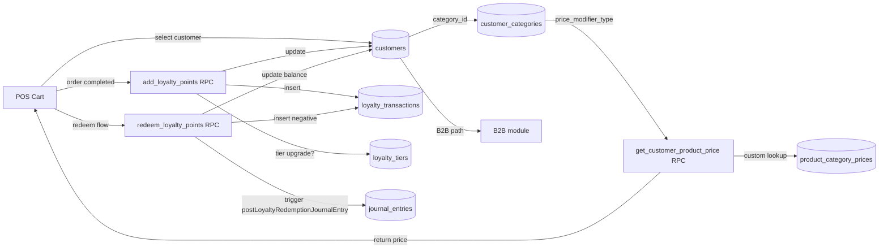

# 08 — Customers & Loyalty

> **Last verified**: 2026-05-03
> **Related E2E flows**: [07-loyalty-earn-redeem](../08-flows-end-to-end/07-loyalty-earn-redeem.md)
> **Related backlog**: [travail/08-customers-followups.md](../travail/08-customers-followups.md)

## Vue d'ensemble

Le module Customers gère le fichier client unifié (retail + B2B), les catégories pricing
(retail / wholesale / discount_percentage / custom), le programme de fidélité 4 paliers
(Bronze → Platinum) avec ledger immutable des points, et les prix custom par produit×catégorie.
Il fournit la fonction `get_customer_product_price` consommée par POS, B2B et Display.
Il est étroitement lié au module B2B (qui consomme `customers.customer_type='b2b'` +
`credit_balance`) et au module Accounting (loyalty redemption → JE `LOYALTY_LIABILITY`).

## Architecture conceptuelle

Un client est représenté par UNE ligne `customers` quel que soit son type (retail ou b2b).
La distinction se fait par la colonne `customer_type` (enum `retail` / `b2b`) et par
l'appartenance à une `customer_categories` qui définit la **logique de pricing** appliquée :

- `retail` (default) : `product.retail_price` brut.
- `wholesale` : `product.wholesale_price` (fallback retail si null).
- `discount_percentage` : `retail_price × (1 − discount_pct/100)`, arrondi 100 IDR.
- `custom` : lookup `product_category_prices` par produit (fallback retail).

Le programme de fidélité fonctionne en parallèle :
- Chaque order completed → `add_loyalty_points(customer_id, points, desc, order_id)`
  insère une ligne `loyalty_transactions` (type=earn) et update `customers.loyalty_points`,
  `lifetime_points`, `loyalty_tier`.
- Chaque redemption → `redeem_loyalty_points(...)` insère une ligne négative et le
  wrapper `postLoyaltyRedemptionJournalEntry` génère le JE comptable.

## Tiers fidélité (seedés)

| Tier | Min lifetime points | Discount | Multiplier earn | Free delivery | Birthday bonus |
|---|---|---|---|---|---|
| Bronze | 0 | 0% | 1.0x | non | 50 pts |
| Silver | 500 | 5% | 1.05x | non | 100 pts |
| Gold | 2 000 | 8% | 1.1x | oui | 200 pts |
| Platinum | 5 000 | 10% | 1.2x | oui | 500 pts |

Earning rate de base : **1 point / 1 000 IDR dépensés**, multiplié par
`category.points_multiplier × tier.points_multiplier`. Tier upgrader auto quand
`lifetime_points` franchit le seuil suivant. `loyalty_qr_code` UNIQUE auto-généré
au format `BRK-{6 HEX}-{YYMM}` pour scan rapide en POS.

## Diagramme de responsabilité



## Tables DB impliquées

| Table | Rôle |
|---|---|
| `customers` | Fichier clients unifié (retail + b2b). Colonnes loyalty (`loyalty_points`, `lifetime_points`, `loyalty_tier`, `loyalty_qr_code` UK, `membership_number` UK), B2B (`company_name`, `payment_terms`, `credit_limit`, `credit_balance`, `credit_status`), métriques (`total_visits`, `total_spent`, `last_visit_at`), soft-delete (`deleted_at`) |
| `customer_categories` | Catégories pricing (slug, color, icon, `price_modifier_type`, `discount_percentage`, `loyalty_enabled`, `points_per_amount`, `points_multiplier`, `is_default`) — 5 seedées |
| `loyalty_tiers` | Paliers (`min_lifetime_points`, `discount_percentage`, `points_multiplier`, `free_delivery`, `birthday_bonus_points`) — 4 seedés (Bronze, Silver, Gold, Platinum) |
| `loyalty_transactions` | Ledger immutable points (type: earn / redeem / expire / adjust / bonus / refund, `points`, `points_balance_after`, `order_amount`, `discount_applied`) |
| `product_category_prices` | Prix custom par produit×catégorie pour `price_modifier_type='custom'` |
| `customer_addresses` | Adresses additionnelles (livraison) liées à un customer |
| `customer_audit_log` | Audit trail pour modifications sensibles (credit_limit change, tier override, points_adjust) |

## Hooks principaux

| Hook | Chemin | Rôle |
|---|---|---|
| `useCustomers` | `src/hooks/customers/useCustomers.ts` | Liste paginée customers avec filtres (search nom/phone/email/membership, category, tier) + sort (last_visit / name / points / total_spent). Joint `customer_categories`. |
| `useCustomerDetail` | `src/hooks/customers/useCustomers.ts` | Détail un customer + KPIs |
| `useCreateCustomer` / `useUpdateCustomer` / `useDeleteCustomer` | `src/hooks/customers/useCustomers.ts` | Mutations CRUD avec invalidation react-query |
| `useCustomerCategories` | `src/hooks/customers/useCustomerCategories.ts` | CRUD catégories pricing |
| `useCustomerAnalytics` | `src/hooks/customers/useCustomerAnalytics.ts` | Stats agrégées (CAC, CLV, frequency, top spenders) pour dashboard |
| `useB2BCustomerData` | `src/hooks/customers/useB2BCustomerData.ts` | Données enrichies pour les onglets B2B (commandes, paiements, AR, top produits) |
| `useLoyalty` | `src/hooks/useLoyalty.ts` (legacy) | Ajout/retrait points via RPCs `add_loyalty_points` / `redeem_loyalty_points` |

## Services principaux

Le module n'a pas de répertoire `src/services/customers/` dédié (tous les hooks utilisent les RPCs PostgreSQL directement). Quelques helpers vivent dans :

| Service | Chemin | Rôle |
|---|---|---|
| `loyaltyService` (intégré aux hooks) | `src/hooks/useLoyalty.ts` | Wrappers TypeScript autour des RPCs loyalty + invalidation react-query |
| `customerImport` (intégré aux composants) | `src/components/customers/CustomerImportModal.tsx` | Logique d'import CSV/XLSX avec preview et résultat |

## Composants UI principaux

| Composant | Chemin | Rôle |
|---|---|---|
| `CustomerCard` | `src/components/customers/CustomerCard.tsx` | Card client avec avatar, tier badge, points, total dépensé |
| `CustomerTableRow` | `src/components/customers/CustomerTableRow.tsx` | Ligne table liste customers |
| `CustomersFilters` | `src/components/customers/CustomersFilters.tsx` | Filtres (search, category dropdown, tier dropdown) |
| `CustomersHeader` | `src/components/customers/CustomersHeader.tsx` | Header page + bouton import + bouton create |
| `CustomersStats` | `src/components/customers/CustomersStats.tsx` | KPIs top (total customers, B2B, actifs 30j, CA total) |
| `CustomerBasicForm` | `src/components/customers/CustomerBasicForm.tsx` | Form fields infos basiques (nom, contact, type, category) |
| `CustomerCategoryForm` | `src/components/customers/CustomerCategoryForm.tsx` | Form CRUD catégorie pricing |
| `CustomerLoyaltyCard` | `src/components/customers/CustomerLoyaltyCard.tsx` | Card programme fidélité (tier actuel, points, progression vers prochain tier) |
| `CustomerPointsModal` | `src/components/customers/CustomerPointsModal.tsx` | Modal manuel d'ajout/retrait points (réservé manager — `customers.loyalty`) |
| `CustomerDetailHeader` | `src/components/customers/CustomerDetailHeader.tsx` | Header détail client (nom, tier, actions edit/delete) |
| `CustomerDetailTabs` | `src/components/customers/CustomerDetailTabs.tsx` | Onglets : Overview / Orders / Loyalty / Analytics / B2B (si type=b2b) |
| `CategoryCard` / `CategoryFormModal` | `src/components/customers/CategoryCard.tsx`, `CategoryFormModal.tsx` | Gestion catégories pricing |
| `CustomerImportModal` | `src/components/customers/CustomerImportModal.tsx` | Wizard import 3 étapes (`ImportUploadStep`, `ImportPreviewStep`, `ImportResultStep`) |
| `B2BCustomerHeader` | `src/components/customers/b2b/B2BCustomerHeader.tsx` | Header spécifique B2B (NPWP, payment terms, credit) |
| `B2BLoyaltyStatusCard` | `src/components/customers/b2b/B2BLoyaltyStatusCard.tsx` | Loyalty status card (B2B peut aussi gagner des points) |
| `B2BMonthlySpendingChart` | `src/components/customers/b2b/B2BMonthlySpendingChart.tsx` | Recharts dépenses mensuelles client B2B |
| `B2BOutstandingOrders` | `src/components/customers/b2b/B2BOutstandingOrders.tsx` | Commandes B2B impayées du client |
| `B2BTopProducts` | `src/components/customers/b2b/B2BTopProducts.tsx` | Top produits achetés par ce client |

## Stores Zustand utilisés

- `useCartStore` — stocke `customer` selectionné dans le cart POS, conditionne le pricing.
- `useAuthStore` — résout `user.id` pour audit log (modifications sensibles).
- `useCoreSettingsStore` — lit `loyalty_config.points_per_idr` (défaut 1/1000), `loyalty_config.tier_*` (overrides seuils tiers si custom).

Pas de store dédié customers : react-query gère tout (stale 60s sur la liste, infinite cache sur les catégories).

## RPCs / Edge Functions

### RPCs PostgreSQL

| RPC | Rôle |
|---|---|
| `get_customer_product_price(p_product_id, p_category_slug)` | Retourne le prix d'un produit pour une catégorie client. Switch sur `price_modifier_type` : `retail` → `retail_price`, `wholesale` → `wholesale_price` (fallback retail), `discount_percentage` → `retail_price × (1 - discount/100)` arrondi 100 IDR, `custom` → lookup `product_category_prices` (fallback retail) |
| `add_loyalty_points(p_customer_id, p_points, p_description, p_order_id)` | Insère ligne `loyalty_transactions` (type=earn), update `customers.loyalty_points`, `lifetime_points`, recalcule `loyalty_tier` automatiquement si seuil franchi |
| `redeem_loyalty_points(p_customer_id, p_points, p_description)` | Insère ligne négative dans `loyalty_transactions`, vérifie `loyalty_points >= p_points` (retourne `false` sinon), met à jour le solde |
| `expire_loyalty_points()` | Job batch : expire les points selon politique (ex: 365 jours d'inactivité) — non appelé automatiquement |
| `birthday_bonus_grant()` | Job mensuel : crédite `birthday_bonus_points` aux clients ayant leur anniv ce mois |

### Edge Functions

Aucune Edge Function spécifique customers — toutes les opérations passent par le client Supabase ou les RPCs.

### Triggers SQL

| Trigger | Rôle |
|---|---|
| `auto_generate_loyalty_qr_code` | À INSERT customer : génère `loyalty_qr_code = 'BRK-{6 HEX}-{YYMM}'` unique |
| `auto_assign_membership_number` | Génère `membership_number` séquentiel `M-NNNNNN` |
| `update_customer_metrics` | À chaque order completed : update `total_spent`, `total_visits`, `last_visit_at` |

## RLS & Permissions

| Table | Action | Permission |
|---|---|---|
| `customers` | SELECT | `is_authenticated()` |
| `customers` | INSERT | `customers.create` |
| `customers` | UPDATE | `customers.update` |
| `customers` | DELETE (soft) | `customers.delete` |
| `customer_categories` | INSERT/UPDATE/DELETE | `customers.create` / `update` / `delete` |
| `loyalty_transactions` | SELECT | `is_authenticated()` |
| `loyalty_transactions` | INSERT | `customers.loyalty` (réservé caissiers + managers) |
| `loyalty_transactions` | UPDATE / DELETE | **AUCUNE policy** — ledger immutable |
| `product_category_prices` | INSERT/UPDATE/DELETE | `products.pricing` (cohérence avec module Products) |
| `customer_addresses` | INSERT/UPDATE/DELETE | `customers.update` |
| `customer_audit_log` | INSERT | trigger only | UPDATE/DELETE | aucune |

## Routes

```
/customers                — CustomersPage (liste + filtres + stats)
/customers/new            — CustomerFormPage
/customers/categories     — CustomerCategoriesPage (CRUD catégories pricing)
/customers/:id            — CustomerDetailPage (avec tabs)
/customers/:id/edit       — CustomerFormPage (édition)
```

Tabs internes du `CustomerDetailPage` : `tabs/CustomerAnalyticsTab.tsx`, `tabs/CustomerLoyaltyTab.tsx`, `tabs/CustomerOrdersTab.tsx`.

Toutes les routes sont gardées par `RouteGuard permission="customers.view"` (ou `.create`, `.update`) + `ModuleErrorBoundary moduleName="Customers"`.

## Workflow : enregistrement d'un nouveau client

1. `CustomersPage` → "New Customer" → `CustomerFormPage`.
2. Form steps (`CustomerBasicForm`) : nom, phone, email, type (retail/b2b), category.
3. Si type=b2b, fields supplémentaires : `company_name`, `payment_terms`,
   `credit_limit` (manager only — `customers.update` + `accounting.manage` requis).
4. Submit → `useCreateCustomer` → INSERT customer → trigger `auto_generate_loyalty_qr_code`
   + `auto_assign_membership_number`.
5. Optional : ajouter adresses dans `customer_addresses` après création.
6. Audit log dans `customer_audit_log` si modifications sensibles (credit, tier).

## Workflow : earning des points

À chaque order completed (status = `completed`) avec un customer rattaché :

1. Le service POS calcule `points_to_earn = floor(order_total / 1000) × category_multiplier × tier_multiplier`.
2. Si `customers.category.loyalty_enabled = false` → skip earning (override total).
3. RPC `add_loyalty_points(customer_id, points, description, order_id)` :
   - Insert ligne `loyalty_transactions` (type=earn, balance_after = current + points).
   - Update `customers.loyalty_points`, `lifetime_points`.
   - Recalcule `loyalty_tier` si `lifetime_points` franchit un seuil.
   - Update `total_spent`, `total_visits`, `last_visit_at` (peut être fait par autre trigger).
4. Toast user-facing : "X points earned, you're now Y points away from {next_tier}".

## Workflow : redemption des points

1. Au checkout POS, le caissier propose la redemption si `loyalty_points >= 100` (seuil minimum).
2. Sélection du nombre de points à redeem (multiples de 100, 1pt = 100 IDR de discount).
3. RPC `redeem_loyalty_points(customer_id, points, description)` :
   - Vérifie `loyalty_points >= points` → retourne `false` sinon.
   - Insert ligne négative dans `loyalty_transactions` (type=redeem).
   - Update `customers.loyalty_points`.
4. Le wrapper `postLoyaltyRedemptionJournalEntry` est appelé côté client :
   **Dr `LOYALTY_LIABILITY` (compte `2210`) / Cr `SALE_DISCOUNT` (compte `4131`)**.
5. Le discount est appliqué sur le total order avant calcul PB1.

## Flows E2E associés

- **07 — Loyalty earn / redeem** : flux complet sélection client en cart POS → calcul pricing via `get_customer_product_price` → completion order → `add_loyalty_points` (avec multiplicateur catégorie × tier) → check tier upgrade → option redeem (modal `CustomerPointsModal` ou flow checkout) → `redeem_loyalty_points` → JE auto via `postLoyaltyRedemptionJournalEntry` (`LOYALTY_LIABILITY` ↔ `SALE_DISCOUNT`).

## Pitfalls spécifiques

- **`loyalty_transactions` est un ledger IMMUTABLE** — pas de policy UPDATE/DELETE. Toute correction se fait par ligne compensatoire (type=`adjust` avec montant inverse), JAMAIS par UPDATE direct.
- **Tier auto-calculé par RPC** : ne JAMAIS modifier `customers.loyalty_tier` directement — passer par `add_loyalty_points` qui recalcule `lifetime_points` puis tier. Override manuel requiert `customers.loyalty` + log explicite dans `customer_audit_log`.
- **`get_customer_product_price` retourne `retail_price` si catégorie absente** : ne pas s'appuyer sur erreur — toujours vérifier que la catégorie existe avant de l'utiliser comme paramètre.
- **`points_multiplier` se compose** : multiplier catégorie × multiplier tier (ex: catégorie `vip` 1.5x × tier `Gold` 1.1x = 1.65x). Le calcul se fait dans le RPC `add_loyalty_points`, pas côté client.
- **`loyalty_qr_code` est UNIQUE et auto-généré** — ne jamais le set manuellement à l'insert. Pour régénérer, soft-delete + recreate.
- **Soft-delete customers** : `deleted_at` non NULL = client supprimé, mais ses orders historiques restent visibles. Toutes les queries customers doivent filtrer `is_null('deleted_at')` (le hook `useCustomers` le fait implicitement via une view `v_active_customers` ou un default filter).
- **`credit_balance` ≠ outstanding orders** : `credit_balance` est la dette courante consolidée (incrémentée via `addToCustomerBalance` du `creditService`), tandis que la somme des `b2b_orders.amount_due` est la vue détaillée. Une discrepance signale un bug de réconciliation — utiliser `accounting-audit` skill pour diagnostiquer.
- **Recherche full-text** : `useCustomers` utilise `or()` Supabase sur 5 colonnes (name, company_name, phone, email, membership_number). Pas d'index trigram dédié → lent au-delà de 5000 customers. Migrer vers `pg_trgm` + index GIN si volumétrie augmente.
- **B2B customers ont 2 tiers de pricing** : la catégorie `price_modifier_type='wholesale'` (auto via colonne) ET le price_list spécifique B2B (`b2b_price_lists`, cf. module 09). Le price_list a priorité quand il existe.
- **`loyalty_enabled` au niveau catégorie** : si une catégorie a `loyalty_enabled=false`, AUCUN point n'est attribué (override total). Cas d'usage : catégorie "staff" ou "wholesale" qui ne doit pas accumuler.
- **Birthday bonus** : `birthday_bonus_points` (col `loyalty_tiers`) est crédité par `birthday_bonus_grant()` job — ce job n'est PAS automatique côté Supabase pg_cron. À déclencher manuellement ou via Vercel Cron.
- **`points_per_amount` au niveau catégorie** : permet d'override le ratio par défaut (1pt/1000 IDR) par catégorie. Si on veut p.ex. 1pt/500 IDR pour catégorie "VIP", configurer ce champ. Le RPC `add_loyalty_points` lit ce champ avant le multiplier.
- **Adresses multiples** : `customer_addresses` lié 1-N à `customers` permet de stocker plusieurs adresses (livraison, facturation). Le POS / B2B utilise typiquement la première active. La feature est partiellement implémentée — `CustomerDetailPage` affiche mais l'édition est limitée.
- **Recherche full-text** : `useCustomers` utilise un OR Supabase sur 5 colonnes — pas optimal au-delà de 5 000 customers. Migration vers `pg_trgm` + index GIN documentée dans `travail/08-customers-followups.md`.
- **Customer audit trail** : `customer_audit_log` capture les changements sensibles (credit_limit, tier, points_adjust) avec `changed_by`, `field`, `old_value`, `new_value`. Lecture restreinte à `customers.update` + admin. Pas d'UI dédiée pour le moment — accès via SQL ou skill `/security-review`.
- **Categories `is_default=true` unique** : une seule catégorie peut être `is_default=true`. Si un nouveau customer est créé sans catégorie, on lui assigne celle par défaut. Vérifier qu'il y en a TOUJOURS une (constraint à ajouter en V3).
- **`loyalty_tier` est un text, PAS une FK** vers `loyalty_tiers` — historiquement choisi pour simplicité. Risque d'incohérence si un tier slug change. Refactor en FK envisagé dans `travail/08-customers-followups.md`.
- **B2B credit_status `suspended` n'empêche pas les ventes POS retail** — uniquement les nouvelles commandes B2B (cf. module 09). Bug ou feature ? À clarifier avec le métier.
- **Loyalty redemption rate fixed 1pt = 100 IDR** : pas configurable côté UI. Hardcoded dans le service POS (cf. `useLoyalty`). Pour ajuster, modifier la constante + ajouter une setting dynamique.
- **Tier downgrade** : si un client perd des points (expire ou refund), `lifetime_points` n'est PAS décrémenté (lifetime = cumul historique). Donc un Gold reste Gold même s'il perd tous ses points actifs. Pour un downgrade après inactivité, prévoir une logique d'expiration `lifetime_points` (non-implémentée).
