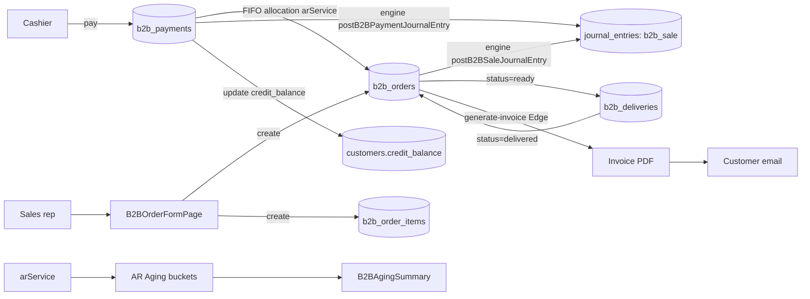

# 09 — B2B / Wholesale

> **Last verified**: 2026-05-03
> **Related E2E flows**: [06-b2b-order-to-invoice](../08-flows-end-to-end/06-b2b-order-to-invoice.md)
> **Related backlog**: [travail/09-b2b-followups.md](../travail/09-b2b-followups.md)

## Vue d'ensemble

Le module B2B gère le cycle complet des commandes wholesale : création, livraison, facturation
PDF (jsPDF via Edge Function), paiements multi-méthode avec allocation FIFO, suivi des créances
(AR aging par buckets 0-30 / 31-60 / 61-90 / 90+), et invoicing automatique. Il s'appuie sur
`customers.customer_type='b2b'` (cf. module 08) et utilise le pricing wholesale ou des
`b2b_price_lists` dédiées. Le module produit deux types de Journal Entries via l'engine :
JE `b2b_sale` à la confirmation et JE `b2b_payment` à la réception du paiement.

## State machine commande B2B

```
draft ─▶ confirmed ─▶ processing ─▶ ready ─▶ partially_delivered ─▶ delivered ─▶ completed
  │
  └─▶ cancelled
```

Transitions clés et déclencheurs :
- **`draft → confirmed`** : `postB2BSaleJournalEntry` génère le JE comptable.
- **`processing → ready` ou `ready → delivered`** : trigger `deduct_b2b_stock`
  matérialise les `stock_movements` `sale_b2b` (idempotent via flag `stock_deducted`).
- **`delivered → completed`** : marque la commande comme finalisée (peut déclencher email satisfaction).
- **`* → cancelled`** : annulation manuelle, requiert raison loggée dans `b2b_order_history`.
  Si stock déjà déduit, mouvement compensatoire `adjustment_in` à créer manuellement.

## Pricing B2B : ordre de priorité

Quand `useB2BOrderForm` calcule le prix d'un produit pour un client B2B, il applique
l'ordre suivant :

1. **`b2b_price_list_items`** — si le client est rattaché à une `b2b_price_lists` active
   ET le produit y est listé.
2. **`customer_categories.price_modifier_type='wholesale'`** — utilise `product.wholesale_price`
   (la catégorie B2B par défaut a typiquement ce modifier).
3. **`product.wholesale_price`** direct — fallback si la catégorie est `custom` mais aucun
   prix custom n'existe.
4. **`product.retail_price`** — fallback final.

L'agent saisit en général le prix manuellement (override possible) — le système ne fait
que pré-remplir.

## Diagramme de responsabilité



## Tables DB impliquées

| Table | Rôle |
|---|---|
| `b2b_orders` | En-tête commande B2B (`order_number` `B2B-NNNNN-XXX`, `status`, `order_date`, `delivery_date`, `total`, `paid_amount`, `amount_due` calculé, `payment_status`, `stock_deducted`, `invoice_number`, `notes`) |
| `b2b_order_items` | Lignes commande (`product_id`, `product_name` figé, `quantity`, `unit_price` figé au moment commande, `total`) |
| `b2b_payments` | Paiements (`payment_number`, `payment_method`: cash/transfer/qris/edc/credit, `amount`, `status`) — un paiement peut couvrir plusieurs orders via FIFO |
| `b2b_deliveries` | Livraisons (`delivery_status`: pending/scheduled/in_transit/delivered/failed/cancelled, `delivery_date`, `driver`, `vehicle`) |
| `b2b_order_history` | Journal d'activité immutable (created, status_changed, payment_received, delivered, cancelled) |
| `b2b_price_lists` | Listes de prix nommées (ex: "Hotel Senggigi 2026") liées à des customers B2B |
| `b2b_price_list_items` | Prix produits dans une liste (`product_id`, `unit_price`) — priorité sur `wholesale_price` |
| `customers` (col `credit_balance`, `credit_limit`, `credit_status`) | État crédit fournisseur (cf. module 08) |

### Views

| View | Rôle |
|---|---|
| `v_b2b_orders` | B2B orders sans soft-deleted |
| `view_ar_aging` | Rapport aging avec buckets 0-30 / 31-60 / 61-90 / 90+ |
| `view_b2b_receivables` | Résumé créances par client |
| `view_b2b_performance` | Métriques performance clients B2B (CA, fréquence, LTV) |

## Hooks principaux

| Hook | Chemin | Rôle |
|---|---|---|
| `useB2BOrderForm` | `src/hooks/b2b/useB2BOrderForm.ts` | State form + validation + mutations create/update commande B2B |
| `useB2BOrderDetail` | `src/pages/b2b/useB2BOrderDetail.ts` | Détail commande + items + payments + deliveries + history (jointure complète) |

Le module B2B a relativement peu de hooks dédiés — beaucoup de logique vit dans les services et les composants page-level (`src/pages/b2b/`).

## Services principaux

| Service | Chemin | Rôle |
|---|---|---|
| `arService.ts` | `src/services/b2b/arService.ts` | `getOutstandingOrders`, `getAgingReport` (buckets 0-30 / 31-60 / 61-90 / 90+), allocation FIFO de paiement (`allocateFIFO`), export CSV aging |
| `creditService.ts` | `src/services/b2b/creditService.ts` | `getCustomerCredit`, `updateCustomerCreditTerms`, `addToCustomerBalance` (incrément `credit_balance`), `subtractFromCustomerBalance`, `getOverdueInvoices` |
| `b2bPosOrderService.ts` | `src/services/b2b/b2bPosOrderService.ts` | Bridge POS → B2B : convertit une vente POS payée en `store_credit` en commande B2B + JE B2B sale + update credit balance. Évite double-counting via `posOrderId` |

## Composants UI principaux

Le module B2B a 37 fichiers dans `src/pages/b2b/` (pas de répertoire `src/components/b2b/` — les pages sont auto-suffisantes). Les composants principaux :

| Composant | Chemin | Rôle |
|---|---|---|
| `B2BHeader` | `src/pages/b2b/B2BHeader.tsx` | Header avec navigation onglets + KPIs |
| `B2BStats` | `src/pages/b2b/B2BStats.tsx` | KPIs dashboard (total CA, outstanding, overdue, top clients) |
| `B2BKpiCard` | `src/pages/b2b/B2BKpiCard.tsx` | Card metric réutilisable |
| `B2BQuickActions` | `src/pages/b2b/B2BQuickActions.tsx` | Boutons rapides (new order, new payment, view aging) |
| `B2BRecentOrders` | `src/pages/b2b/B2BRecentOrders.tsx` | Liste 10 dernières commandes |
| `B2BDashboardClientCard` | `src/pages/b2b/B2BDashboardClientCard.tsx` | Card client (CA, outstanding, last order) |
| `B2BClientsList` | `src/pages/b2b/B2BClientsList.tsx` | Liste clients B2B avec filtres |
| `B2BClientDetailPage` | `src/pages/b2b/B2BClientDetailPage.tsx` | Détail client B2B avec onglets |
| `B2BOrderFormPage` | `src/pages/b2b/B2BOrderFormPage.tsx` | Page formulaire commande (orchestre `B2BOrderFormCustomer`, `B2BOrderFormItems`, `B2BOrderFormDelivery`, `B2BOrderFormNotes`, `B2BOrderFormSidebar`) |
| `B2BOrderDetailPage` | `src/pages/b2b/B2BOrderDetailPage.tsx` | Détail commande avec tabs (`B2BOrderItemsTab`, `B2BOrderDeliveriesTab`, `B2BOrderPaymentsTab`, `B2BOrderHistoryTab`) |
| `B2BOrderInfoCards` | `src/pages/b2b/B2BOrderInfoCards.tsx` | Cards info commande (statut, dates, totaux, payment status) |
| `B2BOrderSummary` | `src/pages/b2b/B2BOrderSummary.tsx` | Sidebar récapitulatif commande |
| `B2BDetailOrderRow` | `src/pages/b2b/B2BDetailOrderRow.tsx` | Ligne item dans détail commande |
| `B2BDetailSidePanels` | `src/pages/b2b/B2BDetailSidePanels.tsx` | Side-panels (timeline, contact, actions) |
| `B2BPaymentModal` | `src/pages/b2b/B2BPaymentModal.tsx` | Modal saisie paiement (montant, méthode, allocation simple) |
| `B2BFIFOPaymentModal` | `src/pages/b2b/B2BFIFOPaymentModal.tsx` | Modal paiement avec allocation FIFO automatique sur plusieurs orders |
| `B2BPaymentsPage` | `src/pages/b2b/B2BPaymentsPage.tsx` | Page paiements avec onglets (`B2BPaymentsAgingTab`, `B2BPaymentsOutstandingTab`, `B2BPaymentsReceivedTab`) |
| `B2BAgingSummary` | `src/pages/b2b/B2BAgingSummary.tsx` | Tableau AR aging par bucket avec drill-down |
| `b2bOrderPrint.ts` | `src/pages/b2b/b2bOrderPrint.ts` | Helper print receipt B2B (impression locale 80mm) |

## Stores Zustand utilisés

- `useAuthStore` — `user.id` pour `created_by`, `confirmed_by`, audit history.
- `useCartStore` — quand bridge POS → B2B (paiement `store_credit`), stocke le customer + items pour passage à `b2bPosOrderService.createB2BOrderFromPOS`.
- `useCoreSettingsStore` — `b2b_config.default_payment_terms` (défaut net_30), `b2b_config.invoice_prefix` (défaut INV), `b2b_config.aging_buckets` (configurable).

Pas de store dédié b2b — react-query gère tout (stale 30s).

## RPCs / Edge Functions

### Edge Functions

| Function | Rôle |
|---|---|
| `generate-invoice` | Génère un PDF invoice via jsPDF (pdf header + table autotable + totaux + footer NPWP). Stocke dans Supabase Storage `invoices/`. Retourne signed URL. Accepte body `{ orderId, customerId, includeQR }`. `verify_jwt: true`, check `sales.view`. |

### Wrappers `accountingEngine` utilisés par B2B

| Wrapper | Rôle | JE produit |
|---|---|---|
| `postB2BSaleJournalEntry` | À création b2b_orders confirmé | Dr `SALE_RECEIVABLE` (total) / Cr `SALE_B2B_REVENUE` (net) + Cr `SALE_PB1_TAX` (tax) |
| `postB2BPaymentJournalEntry` | À insertion b2b_payments | Dr `SALE_CASH_IN` ou `SALE_BANK_IN` / Cr `SALE_RECEIVABLE` |

### Triggers SQL

| Trigger | Rôle |
|---|---|
| `update_b2b_payment_status` | Recalcule `b2b_orders.payment_status` à chaque insertion `b2b_payments` (unpaid → partial → paid) |
| `recalc_b2b_amount_due` | Recalcule `amount_due = total - paid_amount` |
| `log_b2b_history_on_status_change` | Insère dans `b2b_order_history` à chaque transition |
| `deduct_b2b_stock` | Quand `b2b_orders.status` passe à `ready` ou `delivered` ET `stock_deducted=false` → crée stock_movements `sale_b2b` puis met `stock_deducted=true` (idempotent) |

## RLS & Permissions

| Table | Action | Permission |
|---|---|---|
| `b2b_orders`, `b2b_order_items`, `b2b_payments`, `b2b_deliveries`, `b2b_price_lists`, `b2b_price_list_items` | SELECT | `is_authenticated()` |
| `b2b_orders` | INSERT | `sales.create` |
| `b2b_orders` | UPDATE | `sales.update` ou `sales.create` (transitions de status) |
| `b2b_payments` | INSERT | `sales.create` |
| `b2b_deliveries` | INSERT/UPDATE | `sales.update` |
| `b2b_price_lists` | INSERT/UPDATE/DELETE | `products.pricing` |
| `b2b_order_history` | INSERT | trigger only / SELECT auth | UPDATE/DELETE | aucune |

## Routes

```
/b2b                           — B2BPage (dashboard avec stats + recent orders + clients cards)
/b2b/orders                    — B2BOrdersPage (liste + filtres)
/b2b/orders/new                — B2BOrderFormPage (création)
/b2b/orders/:id                — B2BOrderDetailPage (détail avec tabs)
/b2b/orders/:id/edit           — B2BOrderFormPage (édition)
/b2b/payments                  — B2BPaymentsPage (avec tabs aging / outstanding / received)
/b2b/clients/:id               — B2BClientDetailPage
```

Toutes les routes sont gardées par `RouteGuard permission="sales.view"` (ou `.create`) + `ModuleErrorBoundary moduleName="B2B"`.

## Workflow : allocation FIFO d'un paiement

L'allocation FIFO permet d'appliquer un paiement reçu sur plusieurs commandes B2B
outstanding du même client, en commençant par la plus ancienne.

1. Modal `B2BFIFOPaymentModal` ouvert depuis le client ou depuis la liste paiements.
2. Sélection client + saisie montant total reçu + méthode + date.
3. `arService.getOutstandingOrders(customerId)` retourne les commandes non-payées
   triées `order_date ASC`.
4. `arService.allocateFIFO(amount, outstandingOrders)` parcourt la liste :
   - Pour chaque order, calcule `allocatable = min(amount_remaining, order.amount_due)`.
   - Allouer `allocatable` à l'order (insert dans une table d'allocation OU update
     `paid_amount` directement avec link `payment_id`).
   - Si `amount_remaining` > 0 et plus d'orders : reste excédentaire → crédit client
     (incrément `customers.credit_balance` négatif = avoir).
5. Pour CHAQUE allocation, insert un `b2b_payments` (ou un single `b2b_payments` avec
   métadonnées `allocations` JSON selon implementation).
6. Trigger `update_b2b_payment_status` recalcule `payment_status` de chaque order touchée.
7. Wrapper `postB2BPaymentJournalEntry` génère un JE total pour le paiement reçu.

## Workflow : génération invoice PDF

1. Bouton "Generate Invoice" sur `B2BOrderDetailPage` (visible si status >= `ready`).
2. Appel Edge Function `generate-invoice` avec `{ orderId, customerId, includeQR }`.
3. Edge Function (Deno) :
   - Vérifie JWT + permission `sales.view`.
   - Fetch order + items + customer + business settings (logo, NPWP, address).
   - Construit PDF via jsPDF (header logo + adresse, table autotable items, totaux, footer).
   - Si `includeQR=true` : ajoute QR code de validation (lien vers détail public read-only).
   - Upload dans bucket Supabase Storage `invoices/`.
   - Génère signed URL (TTL 1h) + persiste dans `b2b_orders.invoice_url` + `invoice_number`.
4. UI redirige vers le PDF ou propose download.

## Flows E2E associés

- **06 — B2B Order to Invoice** : sélection client B2B → création commande → confirmation (status `confirmed`, déclenche JE `b2b_sale`) → préparation (`processing` → `ready`) → déduction stock automatique via trigger `deduct_b2b_stock` → livraison (`delivered`) → génération invoice PDF via Edge Function → envoi email → réception paiement (`B2BFIFOPaymentModal` allocation FIFO) → JE payment → update `credit_balance` customer.

## Pitfalls spécifiques

- **State machine B2B large** : 8 statuses (draft, confirmed, processing, ready, partially_delivered, delivered, completed, cancelled) — pas de helper centralisé `getValidTransitions` côté client (contrairement à PO). Risque d'incohérence : valider via tests E2E.
- **`stock_deducted` flag idempotency** : le trigger `deduct_b2b_stock` ne déduit qu'une seule fois grâce à ce flag. Si on annule une commande après deduction, il faut RE-créer un mouvement compensatoire `adjustment_in` manuellement (pas de rollback auto).
- **FIFO allocation côté CLIENT** : l'allocation se fait dans `arService.allocateFIFO` JS, pas en SQL. Si deux paiements sont saisis simultanément sur le même client, race condition possible — utiliser optimistic lock (`.eq('paid_amount', currentPaidAmount)`) avant l'update.
- **Pricing B2B priorité** : `b2b_price_list_items` → `customers.category.price_modifier_type='wholesale'` (`wholesale_price`) → `retail_price` (fallback). Le hook `useB2BOrderForm` doit checker dans cet ordre.
- **`amount_due` est calculé** dans le trigger `recalc_b2b_amount_due` — ne JAMAIS le set manuellement au INSERT/UPDATE. Le passer en `null` ou laisser le default.
- **Invoice PDF stocké dans Storage `invoices/`** : le signed URL expire (TTL configurable, défaut 1h). Pour archivage long terme, persister `invoice_url` dans `b2b_orders.invoice_url` AVEC date d'expiration ou utiliser un signed URL ré-généré à la demande.
- **Bridge POS → B2B** : quand un client paie en `store_credit` au POS, `b2bPosOrderService.createB2BOrderFromPOS` crée une commande B2B avec `posOrderId` lié — IMPORTANT : les rapports doivent dédupliquer (pas double-compter le CA POS + B2B sur la même vente). Filtre standard : `WHERE posOrderId IS NULL` pour les rapports B2B purs.
- **`credit_balance` ≠ AR aging** : `credit_balance` est consolidé live, AR aging recalcule à partir des `b2b_orders.amount_due`. Les deux doivent matcher — si discrepance, le job d'audit (`/accounting-audit`) la détecte.
- **Edge Function `generate-invoice`** doit avoir `verify_jwt: true` ET vérifier que `auth.uid()` a le droit `sales.view` AVANT de générer (sinon fuite d'invoices).
- **`b2b_order_history` est append-only** — ne pas patcher rétroactivement, créer une nouvelle ligne (`type='correction'`).
- **Customer en `credit_status='suspended'`** : doit BLOQUER la création d'une nouvelle b2b_order. La validation se fait dans `useB2BOrderForm` (pas en trigger SQL — à durcir).
- **`order_number` racy** : la fonction `getNextOrderNumber` (cf. `b2bPosOrderService.ts`) lit le dernier B2B order, incrémente, suffixe random `XXX` 3 chars uppercase. Le suffix random réduit le risque de collision entre terminaux concurrent mais ne le supprime pas — ajouter `UNIQUE` constraint sur `order_number` (déjà fait) garantit qu'au pire, l'INSERT échoue et l'utilisateur retry.
- **Pricing au moment de la commande figé** : `b2b_order_items.unit_price` est un snapshot — un changement ultérieur de `wholesale_price` ne se répercute PAS sur les commandes existantes (souhaitable pour traçabilité légale).
- **`b2b_price_lists` versioning** : pas de versioning natif. Pour mémoriser un prix historique appliqué pendant une période, dupliquer la liste avec date de validité dans le nom (ex: "Hotel X 2026-Q1"). À industrialiser en V3.
- **Multi-deliveries par order** : une commande peut être splittée en plusieurs `b2b_deliveries` (livraisons partielles). Le composant `B2BOrderDeliveriesTab` doit gérer les status `partially_delivered` correctement et update `b2b_orders.delivery_date` à la dernière livraison effectuée.
- **AR aging buckets configurables** : par défaut 0-30 / 31-60 / 61-90 / 90+. Modifier dans `arService.AGING_BUCKETS` constant. À terme, lire depuis `useCoreSettingsStore.b2b_config.aging_buckets`.
- **Allocation FIFO peut "oublier" un client** : si l'ordre des outstanding orders n'est pas strict (ex: deux orders même date), le tri secondaire par `created_at` doit être garanti. Bug observé en prod si deux commandes même `order_date` — toujours grouper par customer_id puis trier `order_date ASC, created_at ASC`.
- **Edge `generate-invoice` lent** : génération PDF jsPDF + upload Storage = ~3-5s. UX : afficher un spinner explicite. Pour batch (100+ invoices), passer par un job background plutôt qu'appel direct.
- **Email envoi externe** : actuellement pas d'intégration native — l'invoice URL est copiée et envoyée manuellement. Edge `send-test-email` est utilisée pour les tests SMTP — pour automatiser, créer une nouvelle Edge `send-invoice-email` qui consomme le signed URL.
- **Synchronization stock B2B vs POS** : un produit vendu en POS et réservé pour B2B simultanément peut générer un négatif transitoire. `stock_reservations` aide mais n'est PAS bloquant côté POS — le caissier peut quand même vendre. Le KDS / display peut alerter "stock insuffisant" si la qty descend sous 0.
- **Bridge POS → B2B et reporting** : dans `b2bPosOrderService.createB2BOrderFromPOS`, le `posOrderId` est crucial pour éviter de double-compter le CA dans les rapports (le POS rapport l'a déjà comptée comme retail, le B2B l'a comme B2B). Filter strict `posOrderId IS NULL` pour rapports B2B "nouveaux" et `posOrderId IS NOT NULL` pour rapports "POS to B2B credit conversion".
- **Pas de notification fournisseur** : aucune intégration native pour alerter le fournisseur ou la cuisine quand une commande B2B passe en `processing` ou `ready`. Workaround : print receipt B2B via `b2bOrderPrint.ts` ou intégrer Slack / WhatsApp via webhook custom.
