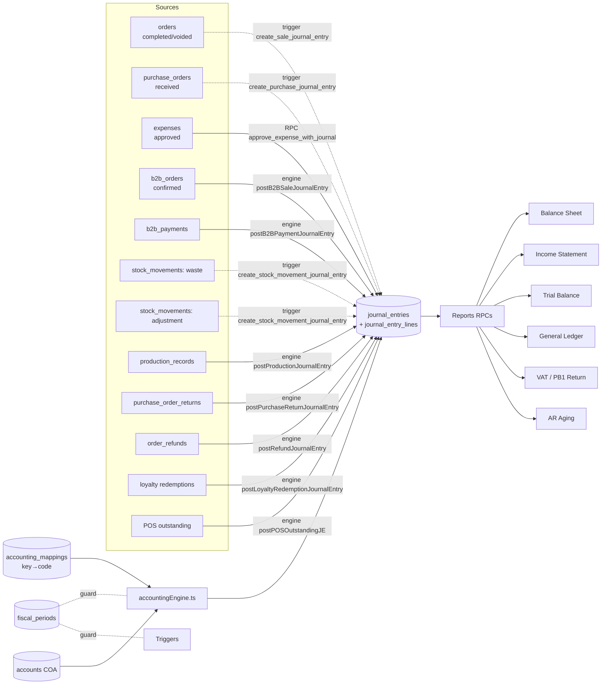

# 10 — Accounting (Double-Entry)

> **Last verified**: 2026-05-03
> **Related E2E flows**: [04-purchase-order-cycle](../08-flows-end-to-end/04-purchase-order-cycle.md), [05-stock-opname](../08-flows-end-to-end/05-stock-opname.md), [06-b2b-order-to-invoice](../08-flows-end-to-end/06-b2b-order-to-invoice.md), [12-production-stock-impact](../08-flows-end-to-end/12-production-stock-impact.md), [13-expense-approval-je](../08-flows-end-to-end/13-expense-approval-je.md), [14-loyalty-redemption-je](../08-flows-end-to-end/14-loyalty-redemption-je.md)
> **Related backlog**: [travail/10-accounting-followups.md](../travail/10-accounting-followups.md), [docs/audit/02-accounting-business-audit.md](../../audit/02-accounting-business-audit.md)
> **Audit skill**: [`/accounting-audit`](../../../.claude/skills/accounting-audit/) (lance un audit complet conformité SAK EMKM + double-entry integrity)

## Vue d'ensemble

Le module Accounting implémente une **double-entry accounting** stricte conforme aux normes
indonésiennes **SAK EMKM** (Standar Akuntansi Keuangan Entitas Mikro, Kecil dan Menengah —
norme PME) et **SAK ETAP** (norme intermédiaire). Il génère **automatiquement** les écritures
comptables (Journal Entries, JE) pour 14 types de transactions via deux mécanismes
complémentaires : (1) **triggers PostgreSQL** sur les tables métier (sale, purchase) et
(2) **engine TypeScript** (`accountingEngine.ts`) avec mapping keys → account codes pour les
transactions complexes (expense, b2b, refund, production, waste, adjustment, loyalty redemption,
POS outstanding). L'engine garantit **idempotency** (anti-double-JE), **balance validation**
(débit = crédit), et **fiscal period guard** (refus de poster sur période closed/locked).
Les rapports financiers (Balance Sheet, Income Statement, Trial Balance, General Ledger,
AR Aging, VAT/PB1) sont calculés via RPCs PostgreSQL pour performance.

**PB1 vs PPN** : The Breakery applique **PB1 (Pajak Pembangunan / Pajak Restoran)** à 10%
**incluse** dans les prix, perçue localement (Bali / Lombok) par le gouvernement régional —
ce n'est PAS la PPN nationale (DJP). Aucun reporting DJP requis. Formule : `tax = total × 10/110`.

## Diagramme de responsabilité



## Tables DB impliquées

| Table | Rôle |
|---|---|
| `accounts` | Chart of Accounts (`code` UK, `name`, `account_type` ∈ asset/liability/equity/revenue/expense, `account_class` 1-7, `parent_id`, `balance_type` debit/credit, `node_type` HEADER/GROUP/ACCOUNT, `is_postable` bool, `is_system` bool) |
| `journal_entries` | En-tête JE (`entry_number` UK ex: `SL-20260503-0042`, `entry_date`, `description`, `reference_type`, `reference_id`, `status` draft/posted/locked, `total_debit`, `total_credit`, `attachment_url`, `memo`, `created_by`) |
| `journal_entry_lines` | Lignes JE (`journal_entry_id`, `account_id`, `debit`, `credit`, `description`) — somme(debit) = somme(credit) toujours |
| `accounting_mappings` | Maps `mapping_key` (ex `SALE_CASH_IN`) → `account_code` (ex `1113`). Permet de changer la COA sans toucher au code JS. |
| `fiscal_periods` | Périodes fiscales (`year`, `month`, `start_date`, `end_date`, `status` open/closed/locked, `locked_at`, `locked_by`, `vat_declaration_date`, `vat_declaration_ref`, `vat_payable`) |
| `vat_filings` | Déclarations PB1 mensuelles (`period_year`, `period_month`, `vat_collected`, `vat_deductible`, `vat_payable`, `status` draft/not_filed/filed/amended, `filed_at`, `filed_by`, `djp_reference`) |
| `bank_statements` + `bank_statement_lines` | Imports relevés bancaires pour réconciliation (`bank_account_id`, `transaction_date`, `amount`, `description`, `matched_journal_entry_line_id`) |

## Chart of Accounts (COA)

Schéma 4 chiffres avec hiérarchie HEADER → GROUP → ACCOUNT (seul `is_postable=true` peut recevoir des JE lines). Cf. [03-database/08-seed-data.md](../03-database/08-seed-data.md) pour la liste complète seedée.

| Class | Type | Range | Comptes critiques |
|---|---|---|---|
| 1 | Asset | 1xxx | `1111` Petty Cash · `1112` Bank · `1113` Cash Register · `1114` Card Receivable · `1115` QRIS Receivable · `1116` EDC Receivable · `1121` Accounts Receivable B2B · `1123` AR POS Outstanding · `1131` Inventory General · `1151` VAT Input |
| 2 | Liability | 2xxx | `2111` Accounts Payable · `2143` PB1 Tax Payable (10% restaurant) · `2200` Store Credit Liability · `2210` Loyalty Points Liability |
| 3 | Equity | 3xxx | `3100` Owner Capital · `3200` Retained Earnings · `3300` Current Year Earnings (manquant historiquement, à seed) |
| 4 | Revenue | 4xxx | `4111` POS Sales Revenue · `4131` Sales Discount (contra-revenue) · `4200` B2B Revenue |
| 5 | COGS | 5xxx | `5100` COGS - Direct (GROUP, non-postable) · `5111` Food Waste / Shrinkage |
| 6 | Operating Expense | 6xxx | `6900` Stock Adjustment Expense + comptes OpEx (rent, utilities, salaries, marketing — seedés via `20260413200100`) |
| 7 | Other Income | 7xxx | `7104` Stock Adjustment Income |

**Hiérarchie validée** : tous les parent-child relationships, `is_postable=false` correctement sur HEADER/GROUP. Le tree est construit par `accountingService.buildAccountTree()`.

## Account mappings (`accounting_mappings`)

Le tableau ci-dessous récapitule les **25+ mapping keys** seedées (cf. migrations `20260330600000`, `20260330600100`, `20260330600200`, `20260407200000`, `20260413200200`) :

| Mapping key | Account code | Utilisé par |
|---|---|---|
| `SALE_CASH_IN` | `1113` | B2B Payment, Refund (cash), POS Outstanding Payment |
| `SALE_BANK_IN` | `1112` | B2B Payment, Refund (transfer/qris/edc), POS Outstanding Payment |
| `SALE_RECEIVABLE` | `1121` | B2B Sale, B2B Payment |
| `SALE_B2B_REVENUE` | `4200` | B2B Sale |
| `SALE_PB1_TAX` | `2143` | B2B Sale, Refund, POS Outstanding |
| `SALE_POS_REVENUE` | `4111` | Refund, year-end close |
| `SALE_REVENUE` | `4111` | POS Outstanding (alias historique) |
| `SALE_DISCOUNT` | `4131` | Sale trigger, Loyalty Redemption (contra-revenue) |
| `SALE_PAYMENT_CASH/TRANSFER/QRIS/EDC/CARD` | `1113`/`1112`/`1115`/`1116`/`1114` | Sale trigger (par méthode paiement) |
| `PURCHASE_PAYABLE` | `2111` | PO Payment, Purchase Return |
| `PURCHASE_CASH_OUT` | `1111` | PO Payment (cash) |
| `PURCHASE_BANK_OUT` | `1112` | PO Payment (transfer) |
| `PURCHASE_VAT_INPUT` | `1151` | Expense (avec tax) |
| `EXPENSE_PETTY_CASH` | `1111` | Expense (paid cash) |
| `EXPENSE_BANK` | `1112` | Expense (paid bank) |
| `STOCK_WASTE_FOOD` | `5111` | Stock Waste |
| `INVENTORY_GENERAL` | `1131` | Waste, Adjustment, Production, Purchase Return |
| `STOCK_ADJUSTMENT_INCOME` | `7104` | Stock Adjustment In |
| `STOCK_ADJUSTMENT_EXPENSE` | `6900` | Stock Adjustment Out |
| `PRODUCTION_COGS` | `5100`* | Production (⚠ historiquement broken — voir Pitfalls) |
| `STORE_CREDIT_LIABILITY` | `2200` | Refund (méthode store_credit) |
| `POS_RECEIVABLE` | `1123` | POS Outstanding (sale + payment) |
| `LOYALTY_LIABILITY` | `2210` | Loyalty Redemption |

## Hooks principaux

| Hook | Chemin | Rôle |
|---|---|---|
| `useAccounts` | `src/hooks/accounting/useAccounts.ts` | CRUD COA + tree construction (`accountTree` dérive de `buildAccountTree`) |
| `useJournalEntries` | `src/hooks/accounting/useJournalEntries.ts` | Liste paginée JE + filtres (date, reference_type, status, search), création JE manuelle |
| `useJournalEntryDetail` | `src/hooks/accounting/useJournalEntries.ts` | Détail JE + lines avec compte joint |
| `useGeneralLedger` | `src/hooks/accounting/useGeneralLedger.ts` | Mouvements par compte (RPC `get_general_ledger_data`) avec running balance |
| `useTrialBalance` | `src/hooks/accounting/useTrialBalance.ts` | RPC `get_trial_balance_data(p_end_date)` — debit/credit par compte |
| `useBalanceSheet` | `src/hooks/accounting/useBalanceSheet.ts` | RPC `get_balance_sheet_data(p_end_date)` — assets/liabilities/equity hierarchique |
| `useIncomeStatement` | `src/hooks/accounting/useIncomeStatement.ts` | RPC `get_income_statement_data(p_start_date, p_end_date)` — P&L |
| `useFiscalPeriods` | `src/hooks/accounting/useFiscalPeriods.ts` | CRUD périodes + `lockPeriod` / `unlockPeriod` mutations |
| `useVATManagement` | `src/hooks/accounting/useVATManagement.ts` | RPCs `calculate_vat_payable(p_year, p_month)`, `get_vat_by_category` |
| `useVatFilings` | `src/hooks/accounting/useVatFilings.ts` | CRUD `vat_filings` + workflow filed/amended (note: PB1 ne nécessite pas filing DJP) |
| `useARManagement` | `src/hooks/accounting/useARManagement.ts` | AR aging via `arService` (cf. module 09) |
| `useBankReconciliation` | `src/hooks/accounting/useBankReconciliation.ts` | Upload statement, parser, matching auto/manuel JE lines |
| `useCALK` | `src/hooks/accounting/useCALK.ts` | Génération Catatan Atas Laporan Keuangan (notes annexes SAK EMKM) |

## Services principaux

| Service | Chemin | Rôle |
|---|---|---|
| `accountingEngine.ts` | `src/services/accounting/accountingEngine.ts` | **Cœur du module**. `createJournalEntry({entryDate, description, referenceType, referenceId, lines})` avec : (1) fiscal period guard via RPC `check_fiscal_period_open`, (2) idempotency check (`reference_type` + `reference_id`), (3) résolution `mappingKey → account_code → UUID` via cache 5min, (4) balance validation via `isBalanced()`, (5) génération `entry_number` séquentiel via RPC `next_journal_entry_number`, (6) insert header + lines + compensating delete sur erreur. **9 wrappers** : `postExpenseJournalEntry`, `postB2BSaleJournalEntry`, `postB2BPaymentJournalEntry`, `postPurchasePaymentJournalEntry`, `postStockWasteJournalEntry`, `postStockAdjustmentJournalEntry`, `postRefundJournalEntry`, `postProductionJournalEntry`, `postPurchaseReturnJournalEntry`, `postPOSOutstandingJE`, `postPOSOutstandingPaymentJE`, `postLoyaltyRedemptionJournalEntry`. |
| `accountingService.ts` | `src/services/accounting/accountingService.ts` | Helpers purs : `buildAccountTree`, `groupAccountsByClass`, `flattenAccountTree`, `formatIDR` (arrondi 100), `suggestNextCode`, `isBalanced`, `calculateLineTotals` |
| `journalEntryValidation.ts` | `src/services/accounting/journalEntryValidation.ts` | Validation JE manuelle pré-soumission (entry_date required, lines ≥2, balanced, period open, account_id valid) |
| `vatService.ts` | `src/services/accounting/vatService.ts` | `calculateVATFromInclusive` (10/110), `formatVATSummary`, `generateDJPExport` (CSV format DJP — utilisé si bascule vers PPN nationale future) |
| `calkService.ts` | `src/services/accounting/calkService.ts` | Génère Catatan Atas Laporan Keuangan (notes annexes SAK EMKM) — sections fixed (entité, période, accounting policies, breakdown comptes critiques) |
| `bankStatementParser.ts` | `src/services/accounting/bankStatementParser.ts` | Parser CSV/OFX relevés bancaires — extract date/amount/description, tente matching auto avec JE existants par montant + date ±3j |

## Composants UI principaux

| Composant | Chemin | Rôle |
|---|---|---|
| `AccountTree` | `src/components/accounting/AccountTree.tsx` | Tree view récursif COA avec expand/collapse, badges type, balances |
| `AccountModal` | `src/components/accounting/AccountModal.tsx` | Modal CRUD compte (avec parent_id picker, suggest_next_code, is_postable toggle) |
| `AccountPicker` | `src/components/accounting/AccountPicker.tsx` | Combobox réutilisable (search par code/name, filtre is_postable=true) |
| `JournalEntryForm` | `src/components/accounting/JournalEntryForm.tsx` | Formulaire création JE manuelle (date, description, lignes dynamiques) |
| `JournalLineTable` | `src/components/accounting/JournalLineTable.tsx` | Table lignes JE éditable avec totaux debit/credit live et indicateur balanced |
| `FinancialStatementTable` | `src/components/accounting/FinancialStatementTable.tsx` | Table récursive pour Balance Sheet / Income Statement avec subtotals par groupe |
| `FiscalPeriodModal` | `src/components/accounting/FiscalPeriodModal.tsx` | Modal CRUD période + lock/unlock |
| `VATSummaryCard` | `src/components/accounting/VATSummaryCard.tsx` | Card récap PB1 par mois (collected, deductible, payable) |
| `BankStatementUpload` | `src/components/accounting/BankStatementUpload.tsx` | Drop-zone upload CSV/OFX avec preview lignes parsées |
| `ManualMatchModal` | `src/components/accounting/ManualMatchModal.tsx` | Modal matching manuel ligne bancaire ↔ JE line |
| `AdjustmentForm` | `src/components/accounting/AdjustmentForm.tsx` | Form ajustement comptable manuel (réservé manager) |

## Stores Zustand utilisés

- `useAuthStore` — résout `user.id` pour `created_by`, `locked_by`, `filed_by`. Permissions vérifiées via `usePermissions(['accounting.view', 'accounting.manage', 'accounting.journal.create', 'accounting.journal.update', 'accounting.vat.manage'])`.
- `useCoreSettingsStore` — `accounting_config.tax_rate` (défaut 10), `accounting_config.tax_inclusive` (défaut true), `accounting_config.fiscal_year_start_month` (défaut 1), `accounting_config.idr_rounding` (défaut 100).

Pas de store dédié accounting — react-query gère tout (stale infinite sur COA et mappings, 30s sur JE list, 60s sur statements).

## RPCs / Edge Functions

### RPCs PostgreSQL (~20 fonctions)

| RPC | Rôle |
|---|---|
| `next_journal_entry_number(p_prefix)` | Génère `{PREFIX}-YYYYMMDD-NNNN` (ex `SL-20260503-0042`) en comptant les JE du jour |
| `check_fiscal_period_open(p_entry_date)` | Returns BOOLEAN — vérifie que la période contenant `p_entry_date` n'est ni `closed` ni `locked`. Utilisé par engine ET triggers. |
| `get_account_balance(p_account_id, p_end_date)` | Returns DECIMAL — somme(debit−credit) ou (credit−debit) selon balance_type, jusqu'à `p_end_date` |
| `get_balance_sheet_data(p_end_date)` | Returns TABLE (account_id, code, name, level, parent_id, account_type, balance) — hierarchique pour Balance Sheet |
| `get_income_statement_data(p_start_date, p_end_date)` | Returns TABLE — P&L par compte sur la période |
| `get_trial_balance_data(p_end_date)` | Returns TABLE — debit/credit totaux par compte, équilibré obligatoirement |
| `get_general_ledger_data(p_account_id, p_start_date, p_end_date)` | Returns TABLE des JE lines + running_balance pour un compte |
| `calculate_vat_payable(p_year, p_month)` | Returns TABLE (vat_collected, vat_deductible, vat_payable) — sum 2143 (collected) − sum 1151 (deductible) sur le mois. ⚠ historiquement référençait `2110`/`1400` (codes non-seedés) — fix dans migration `20260322100200_fix_vat_account_alignment.sql`. |
| `get_vat_by_category(p_year, p_month)` | Breakdown PB1 par catégorie produit |
| `approve_expense_with_journal(p_expense_id, p_approved_by)` | **Atomique** : update expense.status='approved' + crée JE via wrapper `postExpenseJournalEntry`. Migration `20260323100100`. |
| `update_role_permissions(p_role_id, p_permission_ids)` | Atomique replace permissions d'un rôle (transactionnel) |
| `lock_fiscal_period(p_period_id, p_locked_by)` | Lock période + scelle status |
| `complete_order_with_payments(p_order_id, p_payments_jsonb, p_user_id, p_terminal_id)` | RPC POS atomique split payments — inclut le déclenchement implicite du trigger `create_sale_journal_entry` |

### Edge Functions

| Function | Rôle |
|---|---|
| `calculate-daily-report` | Calcule end-of-day summary (CA, payments par méthode, breakdown PB1, top products). Lit `journal_entries` + `orders` + agrège. |
| `claude-proxy` | Proxy LLM pour analyse comptable assistée (ex: explication d'écritures, détection d'anomalies) — `verify_jwt: true`, check `accounting.view`. |

### Triggers SQL critiques

| Trigger / Function | Source migration | Rôle |
|---|---|---|
| `create_sale_journal_entry()` | `20260216100200` (puis fixes `20260319030000`, `20260330600100`, `20260330600300`, `20260409180000_fix_accounting_p0_restore_unified_triggers`) | Sur `orders` UPDATE (status → completed/voided) — Dr (méthode payment) + Dr discount / Cr revenue + Cr PB1 payable. Reverse complet sur `voided`. Utilise mapping keys depuis migration `20260330600100`. |
| `create_purchase_journal_entry()` | `20260216100400` (fixes `20260322100200_fix_vat_account_alignment`, `20260330600100`) | Sur `purchase_orders` UPDATE (status → received) — Dr Inventory + Dr VAT Input / Cr Accounts Payable. |
| `create_stock_movement_journal_entry()` | `20260402110000` | Sur `stock_movements` INSERT — déclenche JE pour types `waste`, `adjustment_in`, `adjustment_out` (skippe sale_pos / purchase déjà gérés par leur trigger respectif). |
| `add_fiscal_period_guard_to_journal_triggers()` | `20260402120000` | Wrap les triggers ci-dessus avec `check_fiscal_period_open` — refuse insertion JE si période closed/locked. |
| `enforce_je_balance_constraint` (CHECK) | `20260430010000_add_accounting_constraints_and_views.sql` | Constraint DB-level qui refuse JE non-balanced (`total_debit = total_credit ± 0.01`). |
| `prevent_posted_je_modification` | `20260430010000` | Trigger BEFORE UPDATE/DELETE sur `journal_entries` qui refuse toute modification si `status='posted'` ou `'locked'`. |

## RLS & Permissions

| Table | Action | Permission |
|---|---|---|
| `accounts` | SELECT | `is_authenticated()` |
| `accounts` | INSERT/UPDATE/DELETE | `accounting.manage` |
| `journal_entries` | SELECT | `is_authenticated()` |
| `journal_entries` | INSERT (status='draft') | `accounting.journal.create` |
| `journal_entries` | UPDATE (draft only) | `accounting.journal.update` |
| `journal_entries` | UPDATE (post/lock) | `accounting.manage` |
| `journal_entry_lines` | SELECT | `is_authenticated()` |
| `journal_entry_lines` | INSERT (via parent JE) | parent JE policies + cascade |
| `journal_entry_lines` | UPDATE / DELETE | aucune (lignes immutables une fois posted, modif via reverse + nouveau JE) |
| `accounting_mappings` | SELECT | `is_authenticated()` |
| `accounting_mappings` | INSERT/UPDATE | `accounting.manage` |
| `fiscal_periods` | SELECT | `is_authenticated()` |
| `fiscal_periods` | INSERT/UPDATE | `accounting.manage` |
| `vat_filings` | SELECT | `is_authenticated()` |
| `vat_filings` | INSERT/UPDATE | `accounting.vat.manage` |
| `bank_statements`, `bank_statement_lines` | INSERT/UPDATE | `accounting.manage` |

Tous les triggers DB sont en `SECURITY DEFINER` — ils peuvent insérer dans `journal_entries` même quand l'utilisateur métier n'a pas `accounting.journal.create` (cas normal : un caissier complète une vente, le trigger crée le JE en son nom).

## Routes

```
/accounting                          — index → ChartOfAccountsPage
/accounting/chart-of-accounts        — ChartOfAccountsPage (tree COA)
/accounting/journal-entries          — JournalEntriesPage (liste + filtres + create modal)
/accounting/general-ledger           — GeneralLedgerPage (par compte avec running balance)
/accounting/trial-balance            — TrialBalancePage
/accounting/balance-sheet            — BalanceSheetPage
/accounting/income-statement         — IncomeStatementPage
/accounting/vat                      — VATManagementPage (PB1 par mois)
/accounting/ar-aging                 — ARAgingPage (cf. module 09)
/accounting/bank-reconciliation      — BankReconciliationPage
/accounting/bank-reconciliation/:id  — ReconciliationDetailPage
/accounting/notes                    — CALKPage (Catatan Atas Laporan Keuangan)
```

Toutes les routes sont gardées par `RouteGuard permission="accounting.view"` + `ModuleErrorBoundary moduleName="Accounting"`. Mutations sur fiscal_periods, COA, accounting_mappings exigent `accounting.manage`.

## Flows E2E associés

- **04 — Purchase Order cycle** : réception PO → trigger `create_purchase_journal_entry` → Dr Inventory + Dr VAT Input / Cr AP. Paiement PO → wrapper `postPurchasePaymentJournalEntry`.
- **05 — Stock Opname** : finalisation session → multiples `adjustment_in`/`adjustment_out` movements → trigger `create_stock_movement_journal_entry` → JE par mouvement (`STOCK_ADJUSTMENT_INCOME` ou `STOCK_ADJUSTMENT_EXPENSE`).
- **06 — B2B Order to Invoice** : confirmation order → `postB2BSaleJournalEntry` (Dr AR / Cr B2B Revenue + PB1) ; paiement → `postB2BPaymentJournalEntry` (Dr Cash / Cr AR).
- **12 — Production stock impact** : production_record → `postProductionJournalEntry` (Dr COGS / Cr Inventory).
- **13 — Expense approval & JE** : RPC atomique `approve_expense_with_journal` → update expense + JE Dr Expense + Dr VAT Input / Cr Cash ou Bank.
- **14 — Loyalty redemption JE** : redeem points → `postLoyaltyRedemptionJournalEntry` (Dr Loyalty Liability / Cr Sales Discount).

## Pitfalls spécifiques

- **JE postées NON modifiables** : trigger `prevent_posted_je_modification` (migration `20260430010000`) refuse UPDATE/DELETE si `status='posted'` ou `'locked'`. Pour corriger une erreur, créer un **JE inverse** (reverse entry) avec `referenceType='manual'` et description explicite. JAMAIS de UPDATE direct.
- **Période fiscale verrouillée** : `fiscal_periods.status='locked'` empêche TOUT JE sur la période, y compris triggers (via `check_fiscal_period_open`). Une vente postée AVANT lock reste, mais une nouvelle vente avec entry_date dans la période bloque l'opération côté Edge Function `complete_order_with_payments` (raise exception).
- **Mapping key non-résolue → JE skippé silencieusement** : si `accountingEngine.resolveAccountId(key)` retourne `null` (mapping absent ou compte non-postable), `createJournalEntry` retourne `{success: false, error: 'Unresolved account: ...'}` — l'appelant DOIT logger / alerter. Cas connus historiques : `SALE_REVENUE` manquant (P0 audit), `PRODUCTION_COGS` → `5100` GROUP non-postable (P0 audit). Vérifier après chaque migration accounting que tous les `mapping_key` actifs résolvent vers un `is_postable=true`.
- **Trigger version conflict** historique (audit 2026-04-09) : migration `20260402120000` overwrote la version mapping-based de `create_sale_journal_entry` avec une version hardcoded codes (`1110`, `4100`, `2110`) qui n'existaient pas dans la COA seedée. Restauration via `20260409180000_fix_accounting_p0_restore_unified_triggers.sql`. Toujours valider l'ordre d'application des migrations qui touchent les triggers JE.
- **Idempotency engine** : `createJournalEntry` query `WHERE reference_type=X AND reference_id=Y LIMIT 1` AVANT insert. Si un JE existe déjà, retourne `{success: true, skipped: true}`. Mais cette garde marche mal si on a deux types `reference_type` différents pour la même `reference_id` (ex: une order qui aurait une JE `sale` ET une JE `void` — c'est OK dans ce cas car types distincts). Attention aux `reference_type` qui changent : un PO `received` puis `cancelled` puis `received` à nouveau peut générer des doublons si on n'utilise pas un type intermédiaire `reverse`.
- **PB1 ≠ PPN** : ne pas appeler le module "VAT" en parlant de la fiscalité The Breakery. PB1 (Pajak Pembangunan / Pajak Restoran) à 10% incluse. Pas de filing DJP. La fonction `generateDJPExport` existe pour compatibilité future si l'établissement bascule en PPN national. Compte `2143` PB1 Payable, PAS `2110` (qui n'existe que dans certaines migrations historiques cassées).
- **Cache mappings 5 min** : `accountingEngine` cache `accounting_mappings` + `accounts` 5 minutes. Après création/édition d'un mapping ou d'un compte, **appeler `clearAccountingCache()`** ou attendre 5 min. Bug fréquent : nouveau mapping ajouté ne prend pas effet immédiatement.
- **`PRODUCTION_COGS` historiquement broken** : pointe vers `5100` qui est un GROUP avec `is_postable=false`. Le cache filtre `is_postable=true` donc résolution NULL. Solution : seeder un compte enfant `5101` postable et changer le mapping. Vérifier dans `docs/audit/02-accounting-business-audit.md`.
- **Engine NON transactionnel cross-table** : `createJournalEntry` insère header puis lines. Si insert lines échoue, compensating delete du header (lignes 217-219). Mais entre les deux opérations, un crash réseau peut laisser un header orphelin. Le job de réconciliation nightly devrait détecter ces cas (`SELECT * FROM journal_entries WHERE id NOT IN (SELECT DISTINCT journal_entry_id FROM journal_entry_lines)`).
- **Float precision** : `isBalanced` tolère `< 0.01` IDR. Tous les montants sont arrondis 100 IDR via `formatIDR` à l'affichage, mais le STORAGE est `DECIMAL(15,2)`. Ne pas utiliser des `Number` JS sans rounding pour éviter le drift cumulatif.
- **Year-end closing manuel** : aucun job auto pour basculer Income Statement → Retained Earnings au début de l'exercice fiscal suivant. Le compte `3300` Current Year Earnings n'est PAS seedé (cf. audit phase 1). Process manuel via JE `referenceType='manual'` Dr Revenue / Cr Retained Earnings + Dr Retained Earnings / Cr Expenses.
- **Audit régulier obligatoire** : invoke `/accounting-audit` skill après TOUT changement structurant (nouveau type de transaction, nouveau mapping, migration COA). Le skill audit 7 phases : COA completeness, mapping completeness, JE completeness par type, double-entry integrity, fiscal period integrity, RPCs financial statements, SAK EMKM compliance.
- **CALK manuel** : `useCALK` génère du contenu boilerplate. Pour SAK EMKM compliance complète, le comptable doit éditer/valider les notes annexes avant publication des états financiers.
- **Bank reconciliation matching imprécis** : le parser `bankStatementParser` matche par montant exact + date ±3j. Faux positifs possibles si plusieurs JE de même montant. Toujours review manuel avant valider un match.
- **Permissions séparées** : `accounting.view` (lecture rapports) vs `accounting.journal.create` (création JE manuelle) vs `accounting.journal.update` (édition JE draft) vs `accounting.manage` (COA, mappings, fiscal periods, lock) vs `accounting.vat.manage` (filing PB1). Bien différencier dans les guards UI.
- **`check_fiscal_period_open` retourne `true` par défaut** si aucune période n'existe pour la date — risque de poster sans guard si les périodes ne sont pas créées d'avance. Process : créer les `fiscal_periods` 12 mois en avance au début de chaque année.
