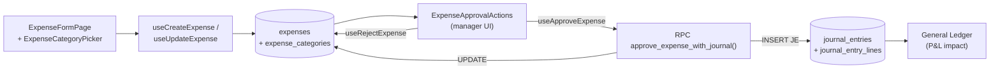
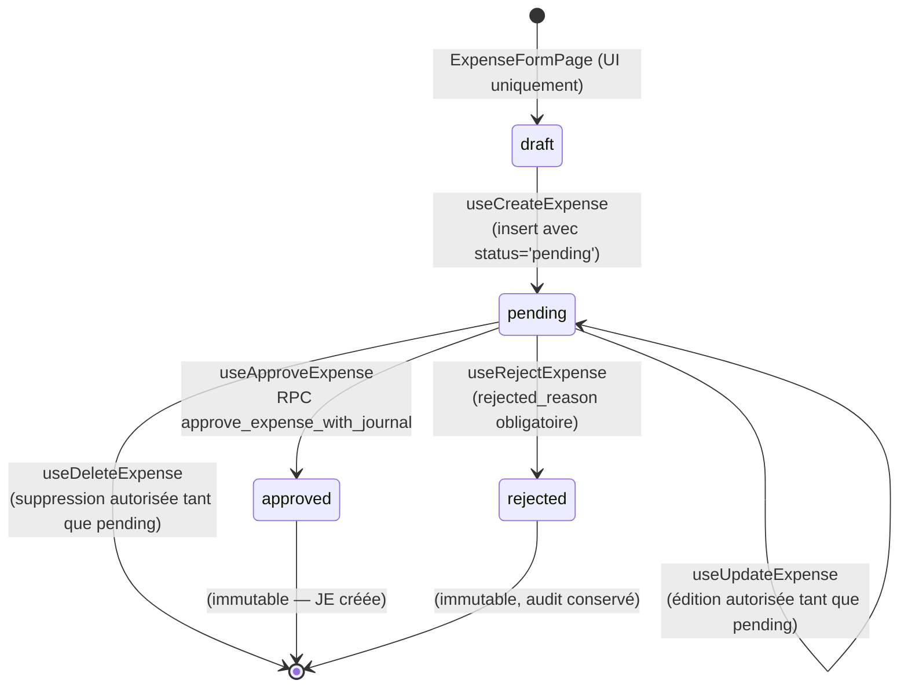

# 11 — Expenses

> **Last verified**: 2026-05-03
> **Statut** : ✅ Implémenté · workflow d'approbation atomique avec création automatique de l'écriture comptable
> **Prérequis** : [10 — Accounting (Double-entry)](10-accounting-double-entry.md), [03 — Database / RPCs](../03-database/03-rpc-functions.md)

Module de saisie et d'approbation des dépenses opérationnelles de The Breakery (loyer, électricité, fournitures, services). Tout `expense` validé déclenche une écriture comptable double-entry via le RPC atomique `approve_expense_with_journal`. La catégorisation hiérarchique permet le mapping automatique vers le compte du PCG (`expense_categories.account_id`).

---

## Vue d'ensemble



Trois rôles interagissent : (1) le **créateur** saisit la dépense (status `pending`), (2) le **manager / admin** approuve ou rejette (status `approved` / `rejected`), (3) à l'approbation la **comptabilité** est posée automatiquement dans la même transaction PostgreSQL — pas d'incohérence possible entre journal et expense.

---

## Tables DB

| Table | Rôle | RLS | Réf. |
|---|---|---|---|
| `expense_categories` | Catégories hiérarchiques (parent/enfant via `parent_id`), liées à un compte du PCG | ✅ `is_authenticated()` SELECT, permission writes | `src/types/expenses.ts:38` |
| `expenses` | Une ligne par dépense, FK vers catégorie, fournisseur, créateur, approbateur, JE | ✅ pareil | `src/types/expenses.ts:54` |
| `expense_attachments` | Pièces jointes (justificatifs scannés / photos), URL Supabase Storage | ✅ pareil | bucket `expense-receipts/` |

Colonnes clés de `expenses` :

| Colonne | Type | Notes |
|---|---|---|
| `expense_number` | `TEXT` UNIQUE | Format `EXP-YYYYMMDD-NNN` généré par RPC `next_expense_number()` |
| `category_id` | `UUID` FK | Détermine le compte du débit (via `expense_categories.account_id`) |
| `description` | `TEXT NOT NULL` | Libellé court |
| `amount` | `DECIMAL(12,2)` | Net hors taxe |
| `tax_amount` | `DECIMAL(12,2)` DEFAULT 0 | TVA / PB1 le cas échéant — généralement 0 pour les charges (tax-exempt) |
| `total_amount` | `DECIMAL(12,2)` | `amount + tax_amount` (calculé au create) |
| `expense_date` | `DATE` | Date d'engagement (utilisée comme `date` du JE) |
| `payment_method` | `TEXT` | `cash` / `transfer` / `card` / `qris` / `edc` — sélectionne le compte de crédit (1110 si cash, sinon 1120) |
| `receipt_url` | `TEXT` | URL Supabase Storage du justificatif |
| `supplier_id` | `UUID` FK NULL | Optionnel — lien avec `suppliers` |
| `status` | `TEXT` enum app-level | `pending` / `approved` / `rejected` (cf. `TExpenseStatus`) |
| `payment_status` | `TEXT` enum SQL `expense_payment_status` | `paid` / `unpaid` (gère les dettes en attente de paiement) |
| `payment_date` | `DATE` NULL | Date effective de paiement (peut différer de `expense_date`) |
| `approved_by` / `approved_at` | `UUID` / `TIMESTAMPTZ` | Renseignés par le RPC d'approbation |
| `rejected_reason` | `TEXT` | Motif de rejet (obligatoire en UI quand `useRejectExpense`) |
| `journal_entry_id` | `UUID` FK | Le JE créé par le RPC, NULL avant approbation |
| `created_by` | `UUID` FK `user_profiles` | Auditabilité |

Voir [03-database/02-tables-reference.md](../03-database/02-tables-reference.md) pour les autres colonnes auto.

---

## Workflow d'approbation



**Règle** : `useUpdateExpense` et `useDeleteExpense` ajoutent `.eq('status', 'pending')` dans la clause WHERE. Une fois la dépense `approved` ou `rejected`, elle est **figée** côté UI ; toute modification doit passer par un JE manuel d'annulation (cf. flow [10 — End of Day](../08-flows-end-to-end/10-end-of-day.md)).

`payment_status` est orthogonal au workflow : une dépense peut être `approved` + `unpaid` (dette fournisseur) puis `approved` + `paid` une fois le règlement effectué (édition du `payment_date`).

---

## RPC `approve_expense_with_journal`

**Source** : `supabase/migrations/20260323100100_atomic_expense_approval_and_role_permissions.sql`

```sql
SELECT public.approve_expense_with_journal(
    p_expense_id := 'uuid-expense',
    p_approved_by := 'uuid-manager'
) -- Returns JSON expense record
```

Étapes exécutées atomiquement (transaction unique, rollback total sur erreur) :

1. `UPDATE expenses SET status = 'approved', approved_by, approved_at = NOW() WHERE id = $1 AND status = 'pending'` — lock optimiste qui échoue si la dépense n'est plus `pending` (race condition entre managers).
2. `SELECT account_id FROM expense_categories WHERE id = expense.category_id` — résolution du compte de débit. Erreur si la catégorie n'a pas de compte mappé.
3. Détermination du compte de crédit selon `payment_method` :
   - `cash` → compte code `1110` (Petty Cash / Cash)
   - tout autre (`transfer` / `card` / `qris` / `edc`) → code `1120` (Bank)
4. Si `tax_amount > 0` : ligne supplémentaire débit sur compte `1180` (Prepaid VAT) — pas utilisé en pratique pour The Breakery.
5. Création de l'en-tête `journal_entries` + 2 lignes `journal_entry_lines` (debit catégorie / credit cash ou bank).
6. `UPDATE expenses SET journal_entry_id = $new_je_id`.
7. Retourne le record `expenses` complet en JSON.

Échec → exception PostgreSQL → React Query toast d'erreur via `useApproveExpense.onError`. Aucune écriture partielle n'est persistée.

**RPC complémentaire** : `next_expense_number()` génère la chaîne `EXP-YYYYMMDD-NNN` (séquence quotidienne).

---

## Hooks (`src/hooks/expenses/`)

| Hook | Fichier | Rôle |
|---|---|---|
| `useExpenses(filters)` | `useExpenses.ts:15` | Liste paginée (200 max) avec joins catégorie/fournisseur/créateur/approbateur. Filtres : `status`, `category_id`, `payment_method`, `from`, `to`, `search` |
| `useExpense(id)` | `useExpenses.ts:65` | Détail single avec mêmes joins |
| `useCreateExpense()` | `useExpenses.ts:97` | Mutation insert. Génère `expense_number` via RPC, calcule `total_amount`, force `status='pending'` |
| `useUpdateExpense()` | `useExpenses.ts:137` | Mutation update **uniquement si `status='pending'`** |
| `useDeleteExpense()` | `useExpenses.ts:165` | Mutation delete **uniquement si `status='pending'`** |
| `useApproveExpense()` | `useExpenses.ts:187` | Appelle `approve_expense_with_journal`. Invalide aussi les caches `journal-entries` et `accounting.journal-entries` |
| `useRejectExpense()` | `useExpenses.ts:213` | Update `status='rejected'` + `rejected_reason` (uniquement si `pending`) |
| `useExpenseCategories()` | `useExpenseCategories.ts:14` | Liste des catégories + arbre hiérarchique (`buildCategoryTree`) + version flat (`flattenCategoryTree`) pour dropdown |
| `useCreateExpenseCategory()` / `useUpdate*` / `useDelete*` | idem | CRUD catégories |
| `useExpenseSummary(from, to)` | `useExpenseSummary.ts:5` | Agrégats sur `approved` : total, count, avg, par catégorie, par méthode de paiement, count `pending` |

Tous les hooks utilisent `react-query` avec invalidation `['expenses']` + toasts Sonner pour les feedbacks utilisateur.

---

## Service (`src/services/expenses/expenseService.ts`)

Logique métier pure (pas d'IO Supabase) :

| Fonction | Rôle |
|---|---|
| `buildCategoryTree(categories, parentId?)` | Récursion : transforme la liste plate en arbre `IExpenseCategoryWithChildren[]` trié par `sort_order` |
| `flattenCategoryTree(tree, depth?)` | Inverse : ré-applatit l'arbre avec une colonne `depth` pour rendu indenté dans un `<select>` |
| `validateExpense(input)` | Validation pré-submit : `category_id`, `description`, `amount > 0`, `expense_date`, et si `payment_status='paid'` exige `payment_method` + `payment_date` |
| `calculateExpenseTotals(expenses)` | Agrégats locaux : total / count / avg / `byCategory` / `byPaymentMethod` (utilisé pour les KPIs de la liste) |

---

## Composants UI (`src/components/expenses/`)

| Composant | Rôle |
|---|---|
| `ExpenseApprovalActions.tsx` | Bouton "Approve" + bouton "Reject" (avec dialog motif), gardé par `permissions.expenses.approve`. Affiché uniquement si `status === 'pending'` |
| `ExpenseCategoryPicker.tsx` | Combobox indenté (utilise `flattenCategoryTree`) avec recherche, affiche le code compte mappé (`account_code — Account Name`) |
| `ExpenseStatusBadge.tsx` | Badge coloré (amber `pending` / emerald `approved` / red `rejected`) + tooltip avec `approved_by` / `rejected_reason` |

---

## Pages (`src/pages/expenses/`)

| Page | Route | Garde |
|---|---|---|
| `ExpensesLayout.tsx` | `/expenses` | `ModuleErrorBoundary` + `RouteGuard permission="expenses.view"` |
| `ExpensesListPage.tsx` | `/expenses` (index) | `expenses.view` — Table paginée avec filtres + `<ExpenseApprovalActions>` inline pour les `pending` |
| `ExpenseFormPage.tsx` | `/expenses/new` et `/expenses/:id/edit` | `expenses.create` / `expenses.update` |
| `ExpenseDetailPage.tsx` | `/expenses/:id` | `expenses.view` — Affiche dépense + JE associé (lien vers `/accounting/journals/:journal_entry_id`) |
| `ExpenseCategoriesPage.tsx` | `/expenses/categories` | `expenses.update` — CRUD catégories + arbre drag-drop |
| `ExpensesListComponents.tsx` | helpers internes |  |

Routes définies dans `src/routes/salesRoutes.tsx` lignes 9–35.

---

## RLS & permissions

Pattern standard `is_authenticated()` SELECT + permission code pour les writes.

| Permission | Action UI |
|---|---|
| `expenses.view` | Accès au module + voir la liste |
| `expenses.create` | Saisie d'une nouvelle dépense |
| `expenses.update` | Édition tant que `status='pending'` |
| `expenses.delete` | Suppression tant que `status='pending'` |
| `expenses.approve` | Approbation / rejet (généralement réservé aux rôles `manager` / `admin`) |

Le RPC `approve_expense_with_journal` est `SECURITY DEFINER` mais son appel passe par RLS d'écriture sur `expenses` et `journal_entries` — le caller doit avoir `expenses.approve` **et** `accounting.journal.create`.

---

## Exemple complet d'écriture comptable générée

Saisie d'une dépense d'électricité PLN 850 000 IDR payée par virement bancaire, catégorie "Utilities — Electricity" mappée au compte 5210 :

```sql
-- Avant approbation
expenses { id: 'exp-1', amount: 850000, payment_method: 'transfer',
           category_id: 'cat-utilities-electricity', status: 'pending' }

-- Après useApproveExpense (RPC approve_expense_with_journal)
expenses { id: 'exp-1', status: 'approved', approved_by: 'user-2',
           approved_at: '2026-05-03T10:23:00+08', journal_entry_id: 'je-7' }

journal_entries { id: 'je-7', entry_number: 'JE-2026-0457',
                  date: '2026-05-03', description: 'Expense EXP-20260503-007 — Electricity' }

journal_entry_lines [
  { je_id: 'je-7', account_id: 'acc-5210', debit: 850000, credit: 0 },   -- Utilities (charge)
  { je_id: 'je-7', account_id: 'acc-1120', debit: 0, credit: 850000 },   -- Bank
]
```

Si la même dépense avait été payée en cash, le `credit` serait posté sur le compte 1110 (Petty Cash) à la place du 1120 (Bank). Le mapping est codé en dur dans le RPC : `cash → 1110`, autre → 1120.

---

## Agrégation `useExpenseSummary`

Le hook (`useExpenseSummary.ts:5`) prend un `from`/`to` et retourne un agrégat utilisé par `ExpensesListPage` en haut de la table :

```ts
{
  total: number,         // Σ amount des status='approved'
  count: number,         // nb d'expenses approved
  avg: number,           // total / count
  pending_count: number, // nb d'expenses encore en pending (KPI alerte)
  byCategory: Array<{ name, total, count }>,    // ranked
  byPaymentMethod: Array<{ method, total, count }>, // ranked
}
```

Les expenses `rejected` sont **exclues** de tous les agrégats. Les `pending` ne sont comptées que dans `pending_count`.

---

## Flow E2E lié

Voir [08-flows-end-to-end/10-end-of-day.md](../08-flows-end-to-end/10-end-of-day.md) qui inclut la check-list d'approbation des dépenses du jour, et [04-modules/10-accounting-double-entry.md](10-accounting-double-entry.md) §"Expense JE" pour le détail comptable et la matrice account_code par catégorie.

## Cross-references

- Module [10 — Accounting (Double-entry)](10-accounting-double-entry.md) — JE structure, COA, account 1110/1120/5xxx
- Module [14 — Reports & Analytics](14-reports-analytics.md) — rapport `expenses` (catégorie Finance) + `getExpensesByDate` service
- [03-database/03-rpc-functions.md](../03-database/03-rpc-functions.md) — signature complète `approve_expense_with_journal`
- [07-security/03-rbac-permissions.md](../07-security/03-rbac-permissions.md) — codes `expenses.*`
- Migration source : `supabase/migrations/20260317150000_add_expense_payment_fields.sql` (payment fields)
- Migration source : `supabase/migrations/20260323100100_atomic_expense_approval_and_role_permissions.sql` (RPC d'approbation atomique)

---

## Pitfalls

- ⚠️ **Catégorie sans compte mappé** : si `expense_categories.account_id` est NULL, le RPC lève `Expense category has no linked account`. Toujours mapper un compte 5xxx (charges) au seed initial des catégories.
- ⚠️ **Édition après approbation** : `useUpdateExpense` filtre sur `status='pending'`, donc tente silencieusement un UPDATE qui retourne 0 ligne — pas d'erreur visible mais aucune modification persistée. Le bouton Edit doit être désactivé en UI quand `status !== 'pending'`.
- ⚠️ **Race d'approbation double** : deux managers cliquent simultanément → le second reçoit l'exception `Expense not found or not in pending status` (lock par `WHERE status='pending'`). Comportement attendu, l'UI affiche toast "Failed to approve".
- ⚠️ **`payment_status` ≠ `status`** : une dépense `approved` peut rester `unpaid` (dette). Bien distinguer les deux dans les rapports — `useExpenseSummary` agrège uniquement `status='approved'` mais sans filtrer `payment_status`.
- ⚠️ **`tax_amount` non utilisé** : The Breakery ne reverse pas de TVA sur ses charges (PB1 est un impôt sur les ventes restaurant uniquement). Le champ existe pour compatibilité multi-pays mais reste à 0 en production.
- ⚠️ **Suppression du JE associé** : ne jamais supprimer manuellement la `journal_entries` row liée — la FK `journal_entry_id` est SET NULL mais le déséquilibre comptable reste. Préférer une écriture d'annulation.
