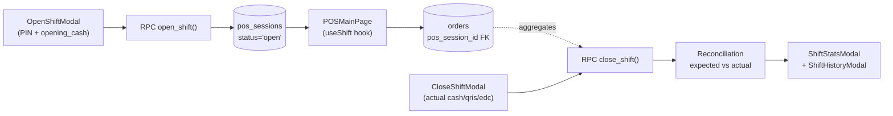
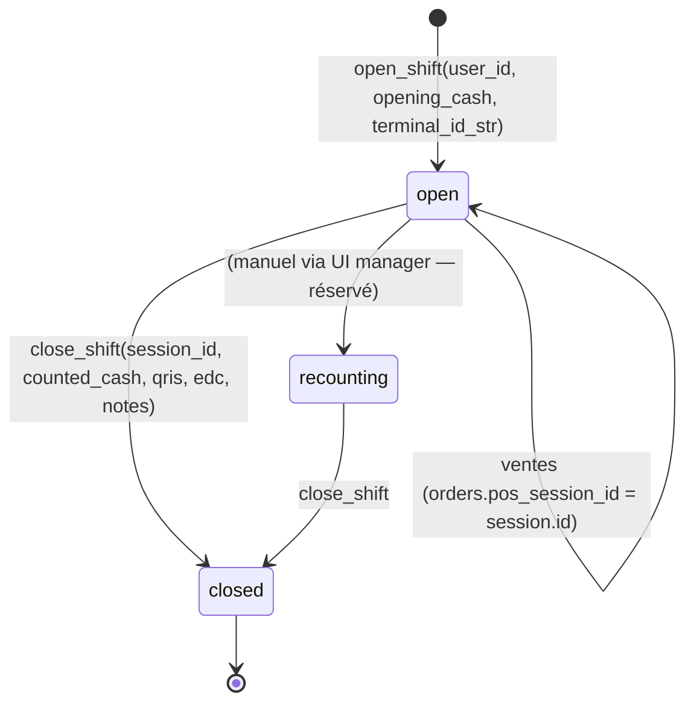

# 12 — Cash Register & Shift

> **Last verified**: 2026-05-03
> **Statut** : ✅ Implémenté · multi-utilisateur sur un même terminal, réconciliation 3-way (cash + QRIS + EDC)
> **Prérequis** : [02 — POS Cart & Orders](02-pos-cart-orders.md), [03 — Payments & Split](03-payments-split.md), [10 — Accounting](10-accounting-double-entry.md)

Module de gestion des sessions de caisse (shifts). Chaque session matérialise une période d'ouverture du terminal POS pour un caissier donné, avec compte d'ouverture (fond de caisse), enregistrement de toutes les transactions de la période, et réconciliation à la fermeture (compté physique vs attendu théorique). Toute commande POS est rattachée à `pos_sessions.id` via `orders.pos_session_id`, ce qui sert de pivot pour les rapports de fin de journée.

---

## Vue d'ensemble



**Cas d'usage clé** : The Breakery a 1–2 terminaux POS et 3–5 caissiers qui se relaient. Le terminal lui-même est partagé ; chaque caissier ouvre **sa propre** session via PIN. Plusieurs sessions peuvent coexister sur un même terminal — le hook `useShift` gère le switching via `activeShiftUserId` persisté en `localStorage`.

---

## Tables DB

| Table | Rôle | RLS |
|---|---|---|
| `pos_sessions` | Une ligne par session (open + close), une session par caissier × terminal | ✅ permission-based |
| `pos_terminals` | Référentiel des terminaux physiques (nom, MAC, paramètres) — voir [19 — Settings](19-settings-configuration.md) | ✅ |

Colonnes clés de `pos_sessions` (cf. `src/hooks/useShift.ts:9` pour la forme TS) :

| Colonne | Type | Notes |
|---|---|---|
| `session_number` | `TEXT` UNIQUE | Format `SHF-YYYYMMDD-NN`, généré par `open_shift` |
| `terminal_id` | `UUID` FK NULL | Lien vers `pos_terminals` (référentiel persistant) |
| `terminal_id_str` | `TEXT` | Identifiant volatile généré côté browser : `TERM-{base36 timestamp}` (stocké en `localStorage.pos_terminal_id`) |
| `user_id` | `UUID` FK | Caissier qui ouvre la session |
| `status` | enum `session_status` | `open` / `recounting` / `closed` |
| `opened_at` / `opened_by` | `TIMESTAMPTZ` / `UUID` | Audit ouverture |
| `opening_cash` | `DECIMAL(12,2)` | Fond de caisse initial |
| `opening_cash_details` | `JSONB` | Détail billets/coins (optionnel) |
| `closed_at` / `closed_by` | `TIMESTAMPTZ` / `UUID` | Audit clôture |
| `expected_cash` / `expected_qris` / `expected_edc` | `DECIMAL(12,2)` | Calculés par `close_shift` à partir de `orders.payment_method` |
| `actual_cash` / `actual_qris` / `actual_edc` | `DECIMAL(12,2)` | Saisis par le caissier à la fermeture |
| `cash_difference` / `qris_difference` / `edc_difference` | `DECIMAL(12,2)` | `actual − expected`, peut être négatif (manque) ou positif (excédent) |
| `total_sales` / `transaction_count` | `DECIMAL(12,2)` / `INTEGER` | Snapshot agrégé à la clôture |
| `manager_id` / `manager_validated` | `UUID` / `BOOLEAN` | Validation manager si écart > seuil |
| `notes` | `TEXT` | Commentaires de réconciliation |

**Pas de table `cash_movements` séparée** — les mouvements de cash sont déduits de `orders.payment_method = 'cash'` dans la fenêtre `[opened_at, closed_at]`. Pour les sorties cash hors-ventes (paiement fournisseur en espèces), on passe par le module [11 — Expenses](11-expenses.md) avec `payment_method='cash'`, qui débite le compte 1110 dans le JE.

---

## Workflow shift



`open_shift` refuse l'ouverture si le **caissier** a déjà une session `status='open'` ailleurs (un caissier = max une session active à la fois). Plusieurs sessions de **caissiers différents** peuvent en revanche coexister sur le même terminal.

`close_shift` calcule `expected_cash`, `expected_qris`, `expected_edc`, `total_sales`, `transaction_count` en agrégeant les `orders` `status='completed'` rattachés. Toute écriture comptable de fin de journée (gestion du fond de caisse, dépôt en banque) est gérée séparément côté [10 — Accounting](10-accounting-double-entry.md).

---

## Variance calculation

Variance = compté physique − attendu théorique. Calculé pour chaque méthode de paiement :

| Méthode | Expected | Actual | Difference |
|---|---|---|---|
| Cash | `opening_cash + Σ(orders cash payments) − Σ(cash refunds)` | Compté billets + coins par le caissier | `actual − expected` |
| QRIS | `Σ(orders qris payments)` | Solde QRIS rapporté par l'agrégateur | idem |
| EDC | `Σ(orders card or edc payments)` | Total ticket EDC | idem |

Sévérité (cf. `view_session_discrepancies` pour les seuils) :

- `info` : variance ≤ 5 000 IDR (acceptable, perte/gain mineur)
- `warning` : 5 000 < variance ≤ 50 000 IDR — alerte rapport
- `critical` : variance > 50 000 IDR — `manager_validated = false` requis pour clôturer définitivement

`close_shift` retourne un `ReconciliationData` (`{ cash, qris, edc: { expected, actual, difference } }`) consommé par `ShiftReconciliationModal`.

---

## RPCs Supabase

| RPC | Signature | Effet |
|---|---|---|
| `open_shift(p_user_id, p_opening_cash, p_terminal_id_str)` | Returns JSON | Crée la session si aucune `open` existante pour ce user. Génère `session_number` |
| `close_shift(p_session_id, p_user_id, p_counted_cash, p_closing_cash_details, p_notes)` | Returns `CloseShiftResult` JSON | Calcule expected_*, snapshot total_sales, set status='closed' |
| `get_user_open_shift(p_user_id)` | Returns `pos_sessions[]` | Bypass RLS pour récupération de la session courante d'un user (utilisé par `useShift` au mount) |
| `get_terminal_open_shifts(p_terminal_id)` | Returns `pos_sessions[]` | Bypass RLS pour lister toutes les sessions ouvertes sur un terminal donné (multi-caissier) |

Source : `supabase/migrations/20260205070000_add_missing_shift_lan_functions.sql` + corrections `20260210110003_db008_fix_open_shift.sql`, `20260210100004_fix_close_shift_status_filter.sql`, `20260222080244_fix_terminal_open_shifts_overload_ambiguity.sql`, `20260430180000_caissapp_shift_snapshots_and_close_rpc.sql`.

---

## Hook (`src/hooks/shift/`)

Le module n'expose qu'un unique hook composite (`src/hooks/useShift.ts`, 507 lignes) qui agrège tout l'état nécessaire pour le POS :

```ts
const {
  // State
  currentSession,        // PosSession | null — session active du caissier sélectionné
  hasOpenShift,          // boolean
  isLoadingSession,
  terminalSessions,      // PosSession[] — toutes les sessions open sur ce terminal
  terminalId,            // 'TERM-XXX' (localStorage)
  activeShiftUserId,     // user_id sélectionné (multi-caissier sur un terminal)
  sessionTransactions,   // ShiftTransaction[] — orders complétées de la session
  sessionStats,          // { totalSales, transactionCount, cashTotal, qrisTotal, edcTotal, duration }
  recentSessions,        // PosSession[] — historique récent (10 dernières fermées)
  reconciliationData,    // ReconciliationData | null — affiché après close

  // Actions
  openShift, closeShift, switchToShift, recoverShift, clearReconciliation,
  refetchSession, refetchTransactions, refetchTerminalSessions,

  // Mutation flags
  isOpeningShift, isClosingShift,
} = useShift()
```

Comportements remarquables :

- **Auto-recovery** : `useEffect` au mount cherche les sessions `open` pour le user loggé via `get_user_open_shift` (bypass RLS) et restaure le state `activeShiftUserId`. Permet la reprise après reload du navigateur ou crash.
- **Multi-user switching** : `switchToShift(userId)` change le caissier actif sans fermer aucune session. Persisté en `localStorage.pos_active_shift_user_id`.
- **Fallback gracieux** : si les RPCs `get_user_open_shift` / `get_terminal_open_shifts` ne sont pas déployés (erreur `42883` ou `PGRST202`), le hook retombe sur des `SELECT` directs sur `pos_sessions` (tolérance lors des migrations).
- **Snapshot post-close** : `closedShiftStats` mémorise les totaux à la fermeture pour que `ShiftReconciliationModal` puisse les afficher même après que `currentSession` soit redevenu `null`.

---

## Composants UI (`src/components/pos/shift/`)

| Composant | Rôle |
|---|---|
| `OpenShiftModal.tsx` | Sélection du caissier (PIN gate via `useShiftAuth`) + saisie `opening_cash` + bouton "Open Shift" |
| `CloseShiftModal.tsx` | Saisie 3-way (`actual_cash`, `actual_qris`, `actual_edc`) + `notes`. Affiche les attendus en preview |
| `ShiftReconciliationModal.tsx` | Récapitulatif post-close : variances par méthode + couleur sévérité + bouton "Print receipt" |
| `ShiftStatsModal.tsx` | KPIs en cours de session (CA temps réel, nb tx, panier moyen, durée) |
| `ShiftHistoryModal.tsx` | Historique des 10 dernières sessions du terminal avec `cash_difference` |
| `index.ts` | Re-export barrel |

Trigger d'affichage centralisé : `src/pages/pos/POSShiftModals.tsx` orchestre l'ouverture/fermeture et passe les callbacks au hook `useShift`.

---

## Composants POS Reports liés (`src/components/pos/reports/`)

À l'intérieur du POS fullscreen, un modal de rapport caisse en temps réel agrège les données de la session active :

- `POSReportsModal.tsx` — Container avec onglets
- `POSReportsOverviewTab.tsx` — KPIs vue d'ensemble (CA, panier moyen)
- `POSReportsTransactionsTab.tsx` — Liste des `sessionTransactions` triées
- `POSReportsProductsTab.tsx` — Top produits vendus dans la session
- `POSReportsActivityTab.tsx` — Timeline horaire
- `POSReportsCancellationsTab.tsx` — Voids/refunds de la session
- `POSReportsSessionsTab.tsx` — Historique des sessions du terminal (`recentSessions`)

Ces tabs sont des vues "session-scoped" qui se distinguent du module `/reports` global ([14 — Reports & Analytics](14-reports-analytics.md)) qui agrège sur toutes les sessions/dates.

---

## Pages

| Route | Composant | Garde |
|---|---|---|
| `/pos` | `POSMainPage` qui mounte `useShift` + `POSShiftModals` | `POSAccessGuard` |
| `/pos/outstanding` | `POSOutstandingPage` (commandes non payées de la session) | `POSAccessGuard` |
| `/pos/cafe` | `CafeStockReceptionPage` (réception stock cafétéria, hors shift) | `POSAccessGuard` |

Le bouton "Open shift" / "Close shift" / "Stats" est dans la barre haute du POSMain (cf. `POSTerminalWrapper`).

---

## RLS & permissions

| Permission | Action |
|---|---|
| `pos.open_session` | Ouvrir une session (bouton OpenShiftModal + RPC) |
| `pos.close_session` | Fermer une session (RPC `close_shift`) |
| `pos.view_sessions` | Voir l'historique (`ShiftHistoryModal`, `POSReportsSessionsTab`) |
| `pos.recount` | Passer une session en `recounting` (réservé manager — workflow rare) |

Policies (cf. migration `027_orders_pos_rls_policies` et seed) :

- SELECT : `is_authenticated()`
- INSERT : `user_has_permission(auth.uid(), 'pos.open_session')`
- UPDATE : `user_has_permission(auth.uid(), 'pos.open_session') OR user_has_permission(auth.uid(), 'pos.close_session')`
- DELETE : `is_admin(auth.uid())`

---

## Vues analytics liées

- `view_session_summary` — résumé complet par session (durée, totaux par méthode, nb tx, écarts)
- `view_session_cash_balance` — balance cash par session (utilisé par rapport `cash_balance`)
- `view_session_discrepancies` — sessions avec écart > 0 + sévérité (`info` ≤5k IDR / `warning` 5–50k / `critical` >50k)

Ces vues sont consommées par les rapports [Cash Variance Trend](14-reports-analytics.md) (catégorie Logs & Audit) et [Sales Cash Balance](14-reports-analytics.md) (catégorie Finance).

---

## Exemple de payload `close_shift`

Cas typique : caissier ferme sa session avec écart cash mineur :

```ts
// Input UI (CloseShiftModal)
closeShift(
  /* actualCash */ 2_485_000,   // compté physique
  /* actualQris */ 1_200_000,   // total QRIS rapporté
  /* actualEdc  */   850_000,   // total ticket EDC
  /* closedBy   */ 'user-3',
  /* notes      */ 'Petite caisse — écart 2k IDR sur monnaie',
)

// RPC close_shift retourne
{
  session_id: 'sess-9',
  status: 'closed',
  total_sales: 4_530_000,        // Σ orders.total où status='completed'
  transaction_count: 27,
  reconciliation: {
    cash: { expected: 2_487_000, actual: 2_485_000, difference: -2_000 },
    qris: { expected: 1_200_000, actual: 1_200_000, difference: 0 },
    edc:  { expected:   850_000, actual:   850_000, difference: 0 },
  }
}
```

`expected_cash = opening_cash (500k) + Σ(cash payments dans la session) − Σ(cash refunds) = 500k + 2,037k − 50k = 2,487k`. L'écart de -2 000 IDR est `info` (sévérité minimale).

---

## Flow E2E lié

Voir [08-flows-end-to-end/11-shift-cash-reconciliation.md](../08-flows-end-to-end/11-shift-cash-reconciliation.md) pour le déroulé pas-à-pas (open → ventes → split payments → void → close → variance) avec captures d'écran et checklist manager.

## Cross-references

- Module [02 — POS Cart & Orders](02-pos-cart-orders.md) — `orders.pos_session_id` est la FK qui rattache toute commande à sa session
- Module [03 — Payments & Split](03-payments-split.md) — méthodes de paiement consolidées par `expected_*`
- Module [10 — Accounting](10-accounting-double-entry.md) — JE manuel à passer après close pour dépôt cash en banque
- Module [14 — Reports & Analytics](14-reports-analytics.md) — rapports `cash_balance`, `cash_variance_trend`, `payment_by_method`
- [03-database/03-rpc-functions.md](../03-database/03-rpc-functions.md) — signatures `open_shift`, `close_shift`, `get_*_open_shift*`
- Migrations sources : `045_pos_sessions_table` (création), `20260205070000_add_missing_shift_lan_functions.sql` (RPCs), `20260430180000_caissapp_shift_snapshots_and_close_rpc.sql` (split QRIS/EDC)

---

## Pitfalls

- ⚠️ **`terminal_id_str` vs `terminal_id`** : la colonne `terminal_id_str` (VARCHAR généré navigateur, ex. `TERM-XXX`) est utilisée pour le matching multi-caissier sur un même terminal physique, **pas** la FK `terminal_id` (UUID lié à `pos_terminals`). Confondre les deux casse la recovery auto.
- ⚠️ **Une session par user** : `open_shift` lève `Shift already open for this user` si le caissier a déjà une session `open`. Le hook `useShift.openShiftMutation` capture cette erreur et tente une recovery silencieuse via `get_user_open_shift`.
- ⚠️ **`expected_qris` / `expected_edc` séparés** : la migration tardive (2026-04-30) `caissapp_shift_snapshots_and_close_rpc` a séparé QRIS et EDC du champ historique unique. Les sessions antérieures ont `expected_qris=0` et `expected_edc` qui contient les deux — bien filtrer par `opened_at >= '2026-04-30'` dans les rapports historiques de variance.
- ⚠️ **Pas de JE auto à la close** : `close_shift` ne crée **pas** d'écriture comptable. Le dépôt cash en banque (mouvement 1110 → 1120) doit être saisi manuellement dans `/accounting/journals`. Idem pour les manques (compte 5xxx Loss on cash variance).
- ⚠️ **Recovery agressive** : si deux navigateurs sur le même terminal physique partagent le `localStorage.pos_terminal_id`, ils se voient mutuellement et peuvent switcher entre les sessions. C'est voulu pour le multi-caissier, mais cela signifie qu'**un terminal = un identifiant `terminal_id_str`** — ne pas réutiliser le même terminal_id_str sur deux machines distinctes.
- ⚠️ **`status='recounting'`** : intermédiaire prévu pour un re-comptage sans fermeture, peu utilisé en production. Ne pas confondre avec `closed`. Les rapports filtrent souvent `status != 'open'` plutôt que `status = 'closed'` pour inclure ce cas.
