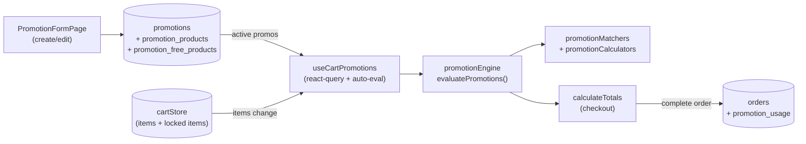

# 13 — Promotions & Discounts

> **Last verified**: 2026-05-03
> **Statut** : ✅ Implémenté · moteur connecté au cart POS, évaluation auto à chaque mutation
> **Prérequis** : [02 — POS Cart & Orders](02-pos-cart-orders.md), [05 — Products & Categories](05-products-categories.md)

Module de définition et d'application automatique des promotions sur le cart POS. Quatre types supportés (percentage, fixed_amount, buy_x_get_y, free_product), conditions temporelles fines (jours/heures/dates), restrictions par produit ou catégorie, gestion du stacking. Le moteur tourne **côté client** dans le hook `useCartPromotions` qui réagit aux mutations du `cartStore` et alimente `calculateTotals` — pas d'aller-retour serveur, latence nulle.

---

## Vue d'ensemble



**Règle d'or** : les **combos** ([05 — Products](05-products-categories.md)) ne sont **pas** éligibles aux promotions — ils ont leur propre logique de pricing (prix fixe + ajustements). Le moteur les filtre via `if (item.type === 'combo') continue;`.

---

## Tables DB

| Table | Rôle | RLS |
|---|---|---|
| `promotions` | Une ligne par règle promotionnelle (header) | ✅ permission-based |
| `promotion_products` | Cibles d'une promo : un `product_id` **ou** un `category_id` (CHECK XOR). Vide = promo globale (tous produits) | ✅ |
| `promotion_free_products` | Produits offerts pour types `buy_x_get_y` ou `free_product` | ✅ |
| `promotion_usage` | Audit log : chaque application de promo sur une `orders` | ✅ |

Colonnes clés de `promotions` :

| Colonne | Type | Notes |
|---|---|---|
| `code` | `TEXT` UNIQUE | Code court ex. `WEEKEND10`, `BOGO` — saisi à la main au POS pour `validatePromotionCode` |
| `name` / `description` | `TEXT` | Affichage UI |
| `promotion_type` | enum `promotion_type` | `percentage` / `fixed_amount` / `buy_x_get_y` / `free_product` |
| `discount_percentage` | `DECIMAL(5,2)` | Si `percentage` (ex. 10.00 = 10%) |
| `discount_amount` | `DECIMAL(12,2)` | Si `fixed_amount` (IDR) |
| `buy_quantity` / `get_quantity` | `INTEGER` | Si `buy_x_get_y` (ex. 2/1 = 2 achetés, 1 offert) |
| `min_purchase_amount` | `DECIMAL(12,2)` NULL | Seuil panier minimum |
| `max_discount_amount` | `DECIMAL(12,2)` NULL | Cap absolu du discount (utile pour `percentage`) |
| `min_quantity` | `INTEGER` NULL | Quantité min de l'item pour activer |
| `start_date` / `end_date` | `TIMESTAMPTZ` | Fenêtre validité (NULL = pas de borne) |
| `days_of_week` | `INTEGER[]` NULL | Jours actifs (0=Dimanche, 6=Samedi) |
| `time_start` / `time_end` | `TIME` NULL | Plage horaire (HH:MM, ex. happy hour) |
| `max_uses_total` | `INTEGER` NULL | Plafond global de redemptions |
| `max_uses_per_customer` | `INTEGER` NULL | Plafond par client (nécessite `customer_id` au checkout) |
| `current_uses` | `INTEGER` DEFAULT 0 | Compteur incrémenté par `record_promotion_usage()` |
| `priority` | `INTEGER` DEFAULT 0 | Plus élevé = évalué en premier |
| `is_stackable` | `BOOLEAN` DEFAULT FALSE | Cumul autorisé avec d'autres promos stackables |
| `is_active` | `BOOLEAN` DEFAULT TRUE | Désactivation sans suppression |

`promotion_products` : exactement un de `product_id` ou `category_id` (CHECK constraint). Pas de ligne = promo s'applique à **tous** les produits.

`promotion_free_products` : `(promotion_id, free_product_id, quantity)` — produits offerts.

`promotion_usage` : `(promotion_id, customer_id, order_id, discount_amount, used_at)` — alimenté par RPC `record_promotion_usage()` après checkout.

---

## Types de promotions

| Type | Champs requis | Formule de discount |
|---|---|---|
| `percentage` | `discount_percentage` | `Σ(applicable_items.total_price) × discount_percentage / 100`, capé par `max_discount_amount` |
| `fixed_amount` | `discount_amount` | `discount_amount` (constante IDR), réparti au prorata sur les items éligibles |
| `buy_x_get_y` | `buy_quantity`, `get_quantity` (+ optionnel `promotion_free_products`) | `floor(Σ(qty éligibles) / buy_quantity) × get_quantity × prix_item_le_moins_cher` |
| `free_product` | `promotion_free_products` (1+ entrées) | Ajoute les items en cadeau (`free_products` array dans le résultat), pas de discount cash |

Exemples concrets The Breakery :

- "Croissant Mardi" : `percentage` 20% sur catégorie "Viennoiseries", `days_of_week=[2]`, sans `min_purchase_amount`, `priority=10`, `is_stackable=false`
- "Coffee Hour" : `percentage` 15% sur catégorie "Boissons chaudes", `time_start='14:00'`, `time_end='17:00'`
- "BOGO Pain de mie" : `buy_x_get_y` `buy_quantity=2`, `get_quantity=1`, target via `promotion_products(product_id=pain_mie_id)`
- "Welcome 25k" : `fixed_amount` 25000 IDR, `min_purchase_amount=100000`, sans cibles (global)

---

## Conditions évaluées par `isPromotionValid()`

Source : `src/services/promotionService.ts:34`. Une promotion est `valid` si **toutes** les conditions sont vraies :

1. `is_active = true`
2. `start_date IS NULL OR now() >= start_date`
3. `end_date IS NULL OR now() <= end_date`
4. `days_of_week IS NULL OR currentDayIndex IN days_of_week`
5. `time_start IS NULL OR currentTime BETWEEN time_start AND time_end`
6. `max_uses_total IS NULL OR current_uses < max_uses_total`

Conditions cart-level vérifiées en plus par `evaluatePromotions()` :

7. `min_purchase_amount IS NULL OR cartSubtotal >= min_purchase_amount`
8. `min_quantity IS NULL OR item.quantity >= min_quantity` (par item)
9. La cible (produit/catégorie) matche au moins un item (sauf si `promotion_products` vide → global)

---

## Stacking rules

Source : `src/services/promotionService.ts:262` (`applyBestPromotions`).

```mermaid
flowchart TD
    A[Promotions valides triées par discount_amount DESC] --> B{Y a-t-il une promo<br/>is_stackable=false ?}
    B -->|Oui| C[Appliquer UNIQUEMENT<br/>celle avec le plus gros discount]
    B -->|Non| D[Toutes les promos sont stackables]
    D --> E[Appliquer toutes<br/>(pas de plafond explicite)]
```

Implications :

- Une seule promo `is_stackable=false` "gagne" et exclut toutes les autres (même stackables).
- `priority` n'intervient **pas** dans le stacking final ; il sert pour l'ordre d'évaluation au moment du fetch (`ORDER BY priority DESC`).
- Le moteur sélectionne par item le **meilleur** discount disponible (cf. `selectBestDiscounts` dans `src/services/pos/promotionCalculators.ts`) — un même item ne reçoit pas deux discounts cumulés sauf si toutes les promos l'attaquant sont stackables.

---

## Hooks (`src/hooks/promotions/` + `src/hooks/pos/`)

| Hook | Fichier | Rôle |
|---|---|---|
| `usePromotions(filters?)` | `src/hooks/promotions/usePromotions.ts:53` | CRUD complet : `list`, `activePromotions` (côté admin), `getById`, `create`, `update`, `toggleActive`, `remove`, `addProduct`, `removeProduct`, `setFreeProducts`. Realtime via `supabase.channel('promotions-changes')` |
| `useCartPromotions()` | `src/hooks/pos/useCartPromotions.ts` | **Hook critique côté POS** : fetch toutes les promos actives (cache 5 min) + leurs `promotion_products` et `promotion_free_products`, écoute le `cartStore`, ré-évalue à chaque mutation, retourne `{ itemDiscounts, totalDiscount, appliedPromotions }` consommé par `calculateTotals` |

Le hook `useCartPromotions` est instancié dans `Cart.tsx` (parent POS) et son résultat circule via le `cartStore` pour synchroniser le `PaymentModal`.

---

## Service moteur (`src/services/pos/`)

3 fichiers découpés pour respecter la limite des 300 lignes :

| Fichier | Rôle |
|---|---|
| `promotionEngine.ts` | Entrée publique `evaluatePromotions(cartItems, promotions, promotionProducts, freeProducts)` — orchestre matchers + calculators et retourne `IPromotionEvaluationResult` |
| `promotionMatchers.ts` | `buildPromoProductMap`, `buildFreeProductMap`, `getGlobalPromotions`, `findApplicablePromotions(productId, categoryId, ...)` — index O(1) sur les cibles |
| `promotionCalculators.ts` | `calculateDiscount` (4 cas selon `promotion_type`), `selectBestDiscounts` (meilleur par item), `buildAppliedPromotionsSummary` (regroupement par `promotion_id`) |

Service legacy `src/services/promotionService.ts` (390 lignes) : ancien moteur côté serveur (`getApplicablePromotions`, `calculatePromotionDiscount`, `applyBestPromotions`, `validatePromotionCode`, `recordPromotionUsage`) — toujours utilisé pour la validation manuelle de code promo et l'enregistrement d'usage post-checkout. La nouvelle architecture sépare évaluation cart (client, `pos/promotionEngine`) et persistance/validation (serveur, `promotionService`).

Tests : `src/services/pos/__tests__/promotionEngine.test.ts`.

---

## Composants UI

### Côté admin (`src/pages/products/`)

| Composant / Page | Rôle |
|---|---|
| `PromotionsPage.tsx` | Liste + filtres + cards (via `promotions-list/`) |
| `promotions-list/PromotionsHeader.tsx` | Toolbar (search, filter active/all, type) |
| `promotions-list/PromotionsStats.tsx` | KPIs : total promos, actives, redemptions du jour |
| `promotions-list/PromotionCard.tsx` | Card individuelle avec toggle `is_active`, badge type, dates |
| `PromotionFormPage.tsx` | Formulaire create/edit |
| `PromotionConstraintsSection.tsx` | Sous-formulaire : dates, jours, heures, plafonds |
| `PromotionProductSearch.tsx` | Picker produits/catégories pour `promotion_products` |
| `promotionFormConstants.ts` | Options enum/labels |

### Côté POS

Aucun composant dédié — l'affichage des promos appliquées se fait dans `Cart.tsx` (lignes "Promotion: -X IDR" sous le subtotal) et `PaymentModal.tsx` (récap final). Le caissier ne voit jamais de modal de sélection promo : tout est automatique. Pour entrer un code promo manuel, un input "Promo code" appelle `validatePromotionCode()`.

---

## RPCs Supabase

| RPC | Rôle |
|---|---|
| `record_promotion_usage(p_promotion_id, p_customer_id, p_order_id, p_discount_amount)` | Insert dans `promotion_usage` + `UPDATE promotions SET current_uses = current_uses + 1`. Appelé après chaque order completed |

Pas de RPC d'évaluation : le moteur est 100% client pour zéro latence sur le cart POS.

---

## Pages (routes)

| Route | Composant | Garde |
|---|---|---|
| `/products/promotions` | `PromotionsPage` (sous `ProductsLayout`) | `products.view` |
| `/products/promotions/new` | `PromotionFormPage` | `products.create` |
| `/products/promotions/:id` | `PromotionFormPage` (read-only display) | `products.view` |
| `/products/promotions/:id/edit` | `PromotionFormPage` | `products.update` |

Routes définies dans `src/routes/productRoutes.tsx` lignes 18, 32–34.

---

## RLS & permissions

| Permission | Action |
|---|---|
| `products.view` | Voir la liste des promotions (héritée du module produits) |
| `products.create` | Créer une promotion |
| `products.update` | Modifier / activer / désactiver |
| `products.pricing` | Réservé aux changements de prix sensibles (utilisé pour audit, pas pour gating UI promotions) |

Pattern RLS standard : SELECT `is_authenticated()`, INSERT/UPDATE/DELETE `user_has_permission(auth.uid(), 'products.update')`.

`promotion_usage` : lecture par tous les authentifiés (sert aux rapports de redemption, cf. [14 — Reports](14-reports-analytics.md)), écriture par RPC `record_promotion_usage` `SECURITY DEFINER`.

---

## Exemple d'évaluation cart

Cart : 3 croissants à 25 000 IDR + 1 café à 35 000 IDR. Subtotal = 110 000.

Promotions actives :

| Code | Type | Cible | Conditions |
|---|---|---|---|
| `WEEKEND10` | percentage 10% | catégorie "Viennoiseries" | `days_of_week=[6,0]`, `is_stackable=true` |
| `BOGO_CROISSANT` | buy_x_get_y 2/1 | product_id=croissant | `is_stackable=false`, `priority=20` |
| `WELCOME25K` | fixed_amount 25 000 | global | `min_purchase_amount=100000`, `is_stackable=true` |

Évaluation un samedi à 10h :

1. **Filtrage validité** : les 3 sont valides (samedi pour `WEEKEND10`, panier ≥ 100k pour `WELCOME25K`).
2. **Calcul par promotion** :
   - `WEEKEND10` : 10% × 75 000 (3 croissants) = 7 500 IDR
   - `BOGO_CROISSANT` : floor(3/2)=1 set × 1 croissant gratuit × 25 000 = 25 000 IDR
   - `WELCOME25K` : 25 000 IDR
3. **Stacking** : `BOGO_CROISSANT` n'est pas stackable → exclut tout le reste.
4. **Résultat** : `appliedPromotions = [{ promotionCode: 'BOGO_CROISSANT', discount: 25000 }]`. Total final = 85 000 IDR.

Si `BOGO_CROISSANT` était stackable : les 3 cumuleraient → 7 500 + 25 000 + 25 000 = 57 500 IDR de discount, total final 52 500 IDR. Comportement très différent — le drapeau `is_stackable` est critique.

---

## Audit `promotion_usage`

Insertion typique post-checkout (via RPC `record_promotion_usage`) :

```sql
INSERT INTO promotion_usage (promotion_id, customer_id, order_id, discount_amount, used_at)
VALUES ('promo-bogo', 'cust-12', 'order-2026-0571', 25000, NOW());

UPDATE promotions SET current_uses = current_uses + 1 WHERE id = 'promo-bogo';
```

Lecture analytics : agrégat consommé par les rapports `loyalty_report` (corrélation promo × tier client) et `discount_details` (catégorie Finance) — voir [14 — Reports](14-reports-analytics.md).

---

## Flow E2E lié

Voir [08-flows-end-to-end/09-promotion-evaluation.md](../08-flows-end-to-end/09-promotion-evaluation.md) pour le déroulé complet : cart event → fetch promotions → match cibles → calcul par item → sélection meilleure → stacking → totaux → record usage post-checkout.

## Cross-references

- Module [02 — POS Cart & Orders](02-pos-cart-orders.md) — `cartStore.appliedPromotions[]` + `calculateTotals` qui consomme le résultat du moteur
- Module [05 — Products & Categories](05-products-categories.md) — combos exclus, FK `category_id` des cibles
- Module [08 — Customers & Loyalty](08-customers-loyalty.md) — `customer_id` requis pour `max_uses_per_customer`
- Module [14 — Reports & Analytics](14-reports-analytics.md) — rapports `discounts_voids`, `discount_details`, `loyalty_report`
- [03-database/03-rpc-functions.md](../03-database/03-rpc-functions.md) — `record_promotion_usage`
- Migration source : `006_combos_promotions.sql` (tables historiques) + correctifs `055`, `056`, `057`
- Migration source : `supabase/migrations/20260222030033_add_missing_policies_promotion_usage_loyalty.sql` (RLS)

---

## Pitfalls

- ⚠️ **Promo globale = `promotion_products` vide**, pas une ligne avec `product_id=NULL`. La CHECK constraint impose XOR : exactement un de `product_id` ou `category_id`. Pour cibler "tout", **n'insérer aucune ligne** dans `promotion_products` — `getGlobalPromotions()` détecte ce cas.
- ⚠️ **Combos exclus** : `evaluatePromotions()` skip les `cartItem.type === 'combo'`. Les combos ont leur propre pricing (`combo_price + Σ price_adjustments`). Une promo qui cible un produit utilisé dans un combo ne s'applique **pas** quand le produit est consommé via le combo.
- ⚠️ **`time_start`/`time_end` en local time** : la comparaison se fait sur `now().toTimeString().slice(0, 5)`, c'est-à-dire l'heure du **navigateur**. Pour The Breakery (Lombok, WITA UTC+8) c'est cohérent avec la DB. Tester en cas de déploiement multi-timezone.
- ⚠️ **`max_uses_total` race** : `current_uses` est incrémenté **après** checkout via `record_promotion_usage`. Deux checkouts simultanés peuvent dépasser temporairement le plafond. Acceptable pour les volumes The Breakery (~200 tx/jour). Pour des promos très rares à plafond bas, ajouter un trigger `BEFORE UPDATE` qui revalide.
- ⚠️ **`max_uses_per_customer` nécessite un client identifié** : sans `customer_id` au checkout (vente anonyme), cette contrainte est ignorée. Bien afficher l'avertissement en UI si `customer_id IS NULL` au moment où une promo `max_uses_per_customer` est candidate.
- ⚠️ **Stacking imprévisible avec `is_stackable` mixé** : si 3 promos sont candidates et qu'une seule a `is_stackable=false`, **seule celle-ci** est appliquée (même si les 2 autres stackables auraient cumulé un plus gros total). Algorithme volontaire mais à expliquer aux utilisateurs métier.
- ⚠️ **`buy_x_get_y` avec items différents** : le calcul prend l'item **le moins cher** parmi les éligibles comme produit "offert". Si on veut forcer "achète 2 croissants, reçois 1 baguette", utiliser le type `free_product` avec `promotion_free_products` qui pointe explicitement vers la baguette.
- ⚠️ **`days_of_week` indexé 0=Sunday** : compatible JS `Date.getDay()`. Si on inverse, les promos s'activent le mauvais jour. Tester avec `[1, 2, 3, 4, 5]` pour "weekdays".
- ⚠️ **Hook `usePromotions.create`** : la création d'une promotion via le hook ne crée que la row `promotions`. Il faut séparément appeler `addProduct` ou `setFreeProducts` pour les cibles. `PromotionFormPage` gère cette séquence via `Promise.all`.
