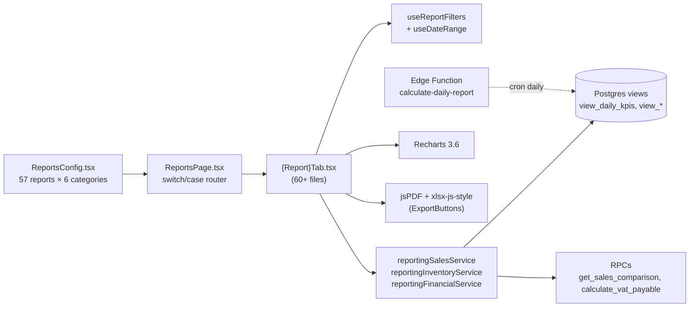

# 14 — Reports & Analytics

> **Last verified**: 2026-05-03
> **Statut** : ✅ Implémenté · 57 rapports déclarés (53 visibles + 4 cachés en attente), 6 catégories
> **Prérequis** : [03 — Database / Views & Matviews](../03-database/05-views-and-matviews.md), [11 — Conventions](../11-conventions/01-coding-conventions.md), [skill `/report-audit`](../../../.claude/skills/report-audit/SKILL.md)

Module d'agrégation et de visualisation analytics multi-axes (sales, inventory, finance, purchasing, operations, audit). Le système est **config-driven** : un fichier unique `ReportsConfig.tsx` déclare tous les rapports, et `ReportsPage.tsx` joue le rôle de routeur via un switch/case sur `report.id`. Cette architecture facilite l'ajout d'un rapport sans toucher à la nav, et permet l'audit automatisé via le skill `/report-audit`.

Audit complet le plus récent : [`docs/audit/04-reports-testing-audit.md`](../../audit/04-reports-testing-audit.md) (2026-04-09, Quinn QA).

---

## Vue d'ensemble



**Principe** : tout rapport consomme **soit** une view Postgres dédiée (préférence : agrégat pré-calculé, perf O(1) sur petite période) **soit** un RPC paramétré (ex. `get_sales_comparison(start1, end1, start2, end2)`). Le client ne fait jamais de gros `SELECT` brut sur `orders`.

---

## Inventaire des 57 rapports (`src/pages/reports/ReportsConfig.tsx`)

### 1. Overview (1 rapport)

| ID | Titre | Composant | Source |
|---|---|---|---|
| `dashboard` | General Dashboard | `OverviewTab` | `getSalesComparison` + `getDashboardSummary` + `getUniqueCustomerCount` |

### 2. Sales (14 rapports)

| ID | Titre | Composant | Source principale |
|---|---|---|---|
| `sales_dashboard` | All in 1 Sales Summary | `SalesTab` | view_daily_kpis |
| `daily_sales` | Daily Sales | `DailySalesTab` (+ `DailySalesDrillDown`) | view_daily_kpis |
| `sales_by_date` | Sales By Date | `SalesByDateTab` | orders |
| `sales_items_by_date` | Sales Items By Date | `SalesItemsByDateTab` | order_items + orders |
| `daily_items_sold_detail` | Daily Items Sold Detail | `DailyItemsSoldDetailTab` | order_items + KDS dispatched_at |
| `product_performance` | Product Sales By SKU | `ProductPerformanceTab` (+ drill-down) | view_product_sales |
| `sales_by_category` | Product Sales By Category | `SalesByCategoryTab` (+ `SalesByCategoryDrillDown`) | view_category_sales |
| `sales_by_customer` | Sales By Customer | `SalesByCustomerTab` | view_sales_by_customer |
| `sales_by_hour` | Sales Details By Hours | `SalesByHourTab` (+ `SalesByHourTable`) | view_sales_by_hour, HourlyHeatmap |
| `sales_cancellation` | Sales Cancellation Details | `SalesCancellationTab` | orders WHERE status IN ('cancelled', 'voided') |
| `profit_loss` | Profit Loss | `ProfitLossTab` (+ `profit-loss/` chart, kpis, table) | view_profit_loss |
| `order_type_distribution` | Order Type Distribution | `OrderTypeDistributionTab` | view_order_type_distribution |
| `loyalty_report` | Loyalty & Retention | `LoyaltyReportTab` | customers + loyalty_transactions |
| `gross_margin_by_product` | Gross Margin by Product | `GrossMarginByProductTab` | view_product_sales (revenue − cost) |
| `abc_analysis` | ABC Product Analysis | `AbcAnalysisTab` | view_product_sales (Pareto) |
| `customer_lifetime_value` | Customer Lifetime Value | `CustomerLifetimeValueTab` | view_customer_insights |

### 3. Inventory (10 rapports + 1 hidden)

| ID | Titre | Composant | Source |
|---|---|---|---|
| `inventory_dashboard` | Product Stock Balance | `InventoryTab` (+ `inventory/` cards, table) | view_inventory_valuation |
| `stock_movement` | Stock Movement | `StockMovementTab` (+ `stock-movement/` kpis, table) | stock_movements |
| `stock_analytics` | Stock Movement Analytics | `StockMovementAnalyticsTab` (+ `stock-analytics/` charts) | stock_movements aggregated |
| `wastage_report` | Wastage & Spoilage | `WastageReportTab` | view_stock_waste |
| `incoming_stock` | Incoming Raw Materials | `IncomingStocksTab` | stock_movements WHERE type IN ('purchase', 'stock_in') |
| `stock_transfer` | Stock Transfer | `StockTransferTab` | stock_movements WHERE type='transfer' |
| `stock_warning` | Product Stock Warning | `StockWarningTab` | view_stock_warning |
| `unsold_products` | Product Unsold | `UnsoldProductsTab` | view_unsold_products |
| `expired_stock` | Expired Stock | `ExpiredStockTab` | view_expired_stock |
| `product_materials` | Product Materials | `ProductMaterialsTab` | recipes + products (cost) |
| `outgoing_stock` | Outgoing Stocks | (hidden, placeholder) | future release |

### 4. Purchases (5 rapports + 1 hidden)

| ID | Titre | Composant | Source |
|---|---|---|---|
| `purchase_items` | Purchase Items | `PurchaseItemsTab` | purchase_order_items |
| `purchase_details` | Purchase Details | `PurchaseDetailsTab` | purchase_orders |
| `purchase_by_date` | Purchase By Date | `PurchaseByDateTab` | purchase_orders |
| `purchase_by_supplier` | Purchase By Supplier | `PurchaseBySupplierTab` | purchase_orders + suppliers |
| `outstanding_purchase_payment` | Outstanding Payment | `OutstandingPurchasePaymentTab` (+ `purchasing/`) | purchase_orders WHERE payment_status != 'paid' |
| `purchase_returns` | Purchase Returns | (hidden) | future release |

### 5. Finance & Payments (12 rapports)

| ID | Titre | Composant | Source |
|---|---|---|---|
| `payment_by_method` | Payment By Method | `PaymentMethodTab` | view_payment_method_stats |
| `cash_balance` | Sales Cash Balance | `SessionCashBalanceTab` | view_session_cash_balance |
| `receivables` | Receivables | `B2BReceivablesTab` | view_b2b_receivables |
| `b2b_aging` | B2B Receivables Aging | `B2BAgingTab` | view_b2b_receivables (bucketed) |
| `pos_outstanding` | POS Outstanding | `POSOutstandingTab` | view_pos_outstanding |
| `pos_outstanding_history` | POS Outstanding History | `POSOutstandingHistoryTab` | view_pos_outstanding_history |
| `revenue_forecast` | Revenue Forecast | `RevenueForecastTab` | view_daily_kpis (90d → moving avg + projection) |
| `pl_monthly_trend` | P&L Monthly Trend | `PLMonthlyTrendTab` | view_profit_loss (12 mois) |
| `expenses` | Expenses by Date | `ExpensesTab` (+ `expenses/` charts/kpis/table) | expenses + expense_categories |
| `discounts_voids` | Discounts & Voids | `DiscountsVoidsTab` (+ `discounts-voids/`) | orders WHERE discount_total > 0 OR status='voided' |
| `discount_details` | Discount Details | `DiscountDetailsTab` | orders + audit_logs |
| `vat_report` | VAT / Tax Report | `VATReportTab` | RPCs `calculate_vat_payable` + `get_vat_by_category` (month/year selectors) |

### 6. Operations (4 rapports + 1 hidden)

| ID | Titre | Composant | Source |
|---|---|---|---|
| `staff_performance` | Staff Performance | `StaffPerformanceTab` | view_staff_performance |
| `production_report` | Production Report | `ProductionReportTab` | RPC `get_production_report` |
| `production_efficiency` | Production Efficiency | `ProductionEfficiencyTab` | production_records + waste |
| `cogs_production` | COGS Production Report | `COGSProductionTab` | recipes + production_records + cost_price |
| `service_speed` | KDS Service Speed | (hidden) | RPC `get_kds_service_speed_stats` (migration pending) |

### 7. Logs & Audit (10 rapports)

| ID | Titre | Composant | Source |
|---|---|---|---|
| `price_changes` | Price Changes | `PriceChangesTab` (+ `price-changes/` kpis, table) | audit_logs WHERE action='update' AND table_name='products' |
| `deleted_products` | Product Deleted | `DeletedProductsTab` | products WHERE deleted_at IS NOT NULL |
| `audit_log` | General Audit Log | `AuditTab` (+ `audit/AuditLogRow`) | audit_logs (`useAuditLogReport` hook) |
| `alerts_dashboard` | Alerts Dashboard | `AlertsDashboardTab` (+ `alerts/`) | `anomalyAlerts` service |
| `void_discount_by_staff` | Void & Discount Abuse | `VoidDiscountByStaffTab` | orders + audit_logs grouped by staff |
| `cash_variance_trend` | Cash Variance Trend | `CashVarianceTrendTab` | view_session_discrepancies |
| `loyalty_adjustments_audit` | Loyalty Adjustments Audit | `LoyaltyAdjustmentsAuditTab` | loyalty_transactions WHERE type='adjust' |
| `duplicate_transactions` | Duplicate Transactions | `DuplicateTransactionsTab` | orders self-join window detection |
| `ghost_stock_movements` | Ghost Stock Movements | `GhostStockMovementsTab` | stock_movements WHERE notes IS NULL OR after-hours |
| `permission_change_log` | Permission Change Log | `PermissionChangeLogTab` | audit_logs WHERE action LIKE 'permission_%' |

**Total : 57 = 53 visibles + 4 cachés**.

---

## Architecture des composants (`src/pages/reports/`)

```
src/pages/reports/
├── ReportsPage.tsx          # Container + router switch/case
├── ReportsConfig.tsx        # 57 reports × 6 categories declaration
└── components/              # 87 .tsx files total
    ├── {Report}Tab.tsx       # 60+ tabs, un par report (lazy-loaded)
    ├── {Drill}DrillDown.tsx  # 2 drill-downs : DailySales, SalesByCategory
    ├── alerts/               # AlertKpiCards, AlertListItem, AlertResolveDialog
    ├── audit/                # AuditLogRow
    ├── discounts-voids/      # Chart, Kpis, Table
    ├── expenses/             # Charts, Kpis, Table
    ├── inventory/            # ValuationCards, StockTable, WasteSection
    ├── price-changes/        # Kpis, Table
    ├── product-performance/  # DrillDownChart, DrillDownKpis, DrillDownTable, ProductTable
    ├── profit-loss/          # Chart, Kpis, Table
    ├── purchasing/           # OutstandingPaymentTable
    ├── stock-analytics/      # AnalyticsKpis, AnalyticsTable, StockQuantityChart, StockValueChart
    └── stock-movement/       # MovementKpis, MovementTable
```

Chaque `{Report}Tab.tsx` suit le pattern :

```tsx
export function FooTab() {
  const { dateRange } = useDateRange()
  const { data, isLoading, error } = useQuery({
    queryKey: ['report-foo', dateRange],
    queryFn: () => reportingSalesService.getFoo(dateRange.start, dateRange.end),
  })
  if (isLoading) return <ReportSkeleton />
  if (error) return <ReportPlaceholder error={error} />
  return (
    <>
      <ReportFilters />
      <FooKpis data={data} />
      <FooChart data={data} />
      <FooTable data={data} />
      <ExportButtons data={data} filename="foo-report" />
    </>
  )
}
```

---

## Composants partagés (`src/components/reports/`)

17 fichiers/dossiers réutilisables :

| Composant | Rôle |
|---|---|
| `ComparisonKpiCard.tsx` | Card KPI avec valeur courante + δ vs période précédente (couleur émeraude/rouge) |
| `ComparisonToggle.tsx` | Switch "Compare to previous period" — déclenche un fetch double |
| `DateRangePicker/` | Composé : presets (Today, 7d, 30d, MTD, YTD, Custom) + calendar (date-fns) |
| `DualSeriesLineChart.tsx` | Recharts LineChart avec 2 séries (revenue + COGS, ou current vs previous) |
| `ExportButtons/` | Bouton "Export PDF" (jsPDF + autotable) + "Export Excel" (`xlsx-js-style`) + "Export CSV" (`csvExport.ts`) |
| `HourlyHeatmap.tsx` | Heatmap 7×24 (jour × heure) pour `sales_by_hour`, intensité = revenue |
| `ReportBreadcrumb.tsx` | Fil d'Ariane Catégorie > Rapport |
| `ReportFilters/` | Container des filtres communs (date range, terminal, staff, customer, payment method) |
| `ReportPlaceholder.tsx` | Affiché pour les rapports `hidden` ou `placeholder` |
| `ReportSkeleton.tsx` | Loading skeleton standard (kpis + chart + table) |
| `__tests__/` | Tests unitaires des helpers de date et formatters |

---

## Hooks (`src/hooks/reports/`)

| Hook | Rôle |
|---|---|
| `useDateRange()` | State partagé via Zustand-like context : `{ start, end, preset, setPreset, setRange }`. Persiste dans sessionStorage |
| `useReportFilters()` | Combine date range + autres filtres (staff_id, customer_id, payment_method, category_id) |
| `useReportPermissions()` | Helper pour gating UI : retourne `{ canViewSales, canViewInventory, canViewFinancial, ... }` selon `user_has_permission` |
| `useDrillDown()` | State + navigation pour les rapports avec drill-down (Daily Sales → DailySalesDrillDown, Sales by Category → SalesByCategoryDrillDown) |
| `useAuditLogReport(filters)` | Fetch paginé `audit_logs` avec joins (`actor`, `target_table`) |
| `index.ts` | Barrel export |

---

## Services (`src/services/reporting/` + `src/services/reports/`)

### `reporting/` — services de fetch DB

| Service | Fonctions clés | Sources |
|---|---|---|
| `reportingSalesService.ts` | `getSalesComparison`, `getDailySales`, `getProductPerformance`, `getSalesByCategory`, `getDashboardSummary`, `getProfitLoss`, `getSalesByCustomer`, `getSalesByHour`, `getCancellations` | view_daily_kpis, view_product_sales, view_section_stock_details, view_hourly_sales, view_profit_loss, orders, order_items |
| `reportingInventoryService.ts` | `getStockValuation`, `getStockMovements`, `getWaste`, `getStockWarning`, `getExpiredStock`, `getUnsoldProducts`, `getProductMaterials` | view_inventory_valuation, view_stock_warning, view_expired_stock, view_unsold_products, view_stock_waste, stock_movements, products |
| `reportingFinancialService.ts` | `getPaymentMethodStats`, `getCashBalance`, `getB2BReceivables`, `getPOSOutstanding`, `getKDSServiceSpeed`, `getVATPayable`, `getVATByCategory` | view_payment_method_stats, view_session_cash_balance, view_b2b_receivables, view_pos_outstanding, RPCs `get_kds_service_speed_stats`, `calculate_vat_payable`, `get_vat_by_category` |

Convention : timezone via helper `toLocalDateStr(date)` (préserve TZ locale `Asia/Makassar`, évite le shift UTC à minuit). Voir [audit reports §Phase 2](../../audit/04-reports-testing-audit.md) pour la liste exhaustive.

### `reports/` — services d'export et anomalies

| Service | Rôle |
|---|---|
| `pdfExport.ts` | Wrapper jsPDF + autoTable. Format A4, header avec logo, footer avec date génération |
| `csvExport.ts` | Sérialisation CSV avec échappement RFC 4180 |
| `anomalyAlerts.ts` | Détection règles : variance cash > seuil, void rate > 5%, ghost stock movements, duplicate transactions. Alimente `AlertsDashboardTab` |

Export Excel non listé : utilise directement `xlsx-js-style` (style cellules) dans `ExportButtons.tsx`.

---

## RPCs Supabase utilisés

| RPC | Rôle |
|---|---|
| `get_sales_comparison(start1, end1, start2, end2)` | TABLE période current + previous (revenue, orders, avg_basket) |
| `get_reporting_dashboard_summary(start, end)` | JSON résumé (period_sales, period_orders, top_product, low_stock_alerts, active_sessions) |
| `get_kds_service_speed_stats(start, end, station?)` | Stats vitesse KDS — non déployé (rapport `service_speed` masqué) |
| `calculate_vat_payable(year, month)` | TABLE PB1 collectée / déductible / nette à payer |
| `get_vat_by_category(year, month)` | Décomposition PB1 par catégorie produit |
| `get_production_report(start, end)` | TABLE production aggregated par produit (qty, cost, waste) |

Voir [03-rpc-functions.md](../03-database/03-rpc-functions.md) pour les signatures complètes.

---

## Vues & matviews consommées

22 vues métier déclarées dans `supabase/migrations/058–061_reporting_*.sql`. Liste détaillée et fenêtres de fraîcheur dans [03-database/05-views-and-matviews.md](../03-database/05-views-and-matviews.md). Catégories :

- **Core KPIs & Sales** : `view_daily_kpis` (90j), `view_payment_method_stats` (30j), `view_product_sales` (30j), `view_category_sales` (30j), `view_profit_loss` (90j), `view_sales_by_hour` (30j), `view_hourly_sales` (7j legacy), `view_sales_by_customer` (all-time), `view_order_type_distribution` (30j)
- **Sessions & Cash** : `view_session_summary`, `view_session_cash_balance`, `view_session_discrepancies`
- **Inventory & Stock** : `view_inventory_valuation`, `view_stock_warning`, `view_stock_alerts` (legacy), `view_expired_stock`, `view_unsold_products`, `view_stock_waste`
- **Staff & Operations** : `view_staff_performance`, `view_customer_insights`, `view_production_summary` (30j), `view_kds_queue_status`, `view_kds_service_speed`

Aucune **matview** rafraîchie par cron pour l'instant — tout est en `VIEW` standard, suffisant pour les volumes The Breakery (~200 tx/jour). Migration future possible vers `MATERIALIZED VIEW` + `pg_cron` si la latence dégrade.

---

## Edge Function `calculate-daily-report`

**Source** : `supabase/functions/calculate-daily-report/index.ts`

Fonction Deno qui agrège toutes les données du jour (orders, payments, top products, hourly breakdown, staff perf) dans une structure `DailyReport` unique. Appelée :

- Soit par un planificateur externe (cron-style, comportement "service-role schedule" — `verify_jwt: true` suffit puisque le caller est trusted)
- Soit manuellement depuis un futur écran "Generate End-of-Day Report"

Le format de sortie est documenté dans le fichier source (interface `DailyReport`). Utile pour exports historiques en JSON ou alimentation d'un BI externe.

Voir [05-integrations/02-edge-functions.md](../05-integrations/02-edge-functions.md) pour la matrice complète des Edge Functions.

---

## Charting (Recharts 3.6)

44 fichiers utilisent Recharts dans `src/pages/reports/components/`. Conventions :

| Type | Usage typique | Composants Recharts |
|---|---|---|
| LineChart | Tendances temporelles (revenue par jour, P&L 12 mois) | `LineChart`, `Line`, `XAxis`, `YAxis`, `CartesianGrid`, `Tooltip`, `Legend` |
| AreaChart | P&L stacké, variance trend | `AreaChart`, `Area`, `defs/linearGradient` (Luxe Dark gradient) |
| BarChart | Comparatifs (sales by category, payment methods) | `BarChart`, `Bar`, `Cell` (couleurs custom) |
| PieChart | Order type distribution, payment split | `PieChart`, `Pie`, `Cell` |
| HeatmapGrid (custom) | `HourlyHeatmap.tsx` — pas un composant Recharts natif, grille SVG manuelle |

Couleurs alignées sur le design system Luxe Dark — voir [02-design-system/02-tokens.md](../02-design-system/02-tokens.md) pour la palette chart (`--chart-1` à `--chart-5`).

---

## Export PDF + Excel + CSV

Stack :

| Format | Lib | Usage |
|---|---|---|
| PDF | `jsPDF` 2.x + `jspdf-autotable` | Layout A4, header logo Breakery, footer date+pagination, tableaux avec colspan/rowspan |
| Excel | `xlsx-js-style` | Cellules stylées (header gras, totaux fond gris), formules sommes |
| CSV | `csvExport.ts` (custom, sans dépendance) | Échappement RFC 4180, BOM UTF-8 pour Excel |

Le composant `ExportButtons` reçoit `{ data, columns, filename, orientation? }` et instancie le bon exporter au clic. Voir [05-integrations/07-pdf-excel-export.md](../05-integrations/07-pdf-excel-export.md) pour les snippets de référence.

---

## Pages (route)

| Route | Composant | Garde |
|---|---|---|
| `/reports` | `ReportsPage` | `RouteGuard permission="reports.sales"` (gate de base) + `ModuleErrorBoundary` |

Routes définies dans `src/routes/adminRoutes.tsx`. La granularité fine se fait à l'intérieur via `useReportPermissions` (chaque catégorie testée contre `reports.sales` / `reports.inventory` / `reports.financial` / `reports.audit`).

---

## RLS & permissions

| Permission | Rapports débloqués |
|---|---|
| `reports.sales` | Catégories Overview + Sales (15 rapports) |
| `reports.inventory` | Catégorie Inventory (10 rapports) |
| `reports.financial` | Catégories Finance (12) + Purchases (5) |
| `reports.audit` | Catégorie Logs & Audit (10 rapports) |

Le code de permission `reports.audit` a été ajouté par `supabase/migrations/20260315110000_p0_security_fixes.sql` pour gater les rapports sensibles (void abuse, cash variance, ghost movements, permission changes).

Pas de RLS spécifique sur les vues — elles héritent des RLS des tables sous-jacentes (`is_authenticated()` SELECT).

---

## Skill `/report-audit`

Skill Claude Code dédié : `.claude/skills/report-audit/SKILL.md`. Trigger sur "report bug", "broken report", "missing report", "chart issue", "audit reports", etc. Capacités :

- Scan des 57 entries de `ReportsConfig.tsx` vs imports lazy dans `ReportsPage.tsx` (détection orphelins)
- Vérification que chaque service appelé existe dans les modules `reporting/`
- Audit cross-référencé view ↔ migration (s'assurer que toute view utilisée a sa migration)
- Détection de `select('*')` interdits
- Vérification timezone (`toISOString` vs `toLocalDateStr`)
- Génération d'un rapport priorisé P0/P1/P2/P3
- Mode interactif : propose des fixes au fil de l'eau

Le dernier passage du skill a produit [`docs/audit/04-reports-testing-audit.md`](../../audit/04-reports-testing-audit.md) (0 P0, 3 P1, 6 P2, 5 P3).

---

## Flow E2E lié

Voir [08-flows-end-to-end/10-end-of-day.md](../08-flows-end-to-end/10-end-of-day.md) pour la routine de fin de journée qui combine close shift + génération du rapport quotidien + export PDF + envoi email.

---

## Pitfalls

- ⚠️ **`hidden: true` ne masque pas le routing** : un rapport caché reste résolu par le switch/case (vers `<ReportPlaceholder>`). Vérifier à la fois `hidden` (UI nav) et `placeholder` (component) lors d'un refactor.
- ⚠️ **`toISOString()` en filtre date** : 4 fonctions de `reportingSalesService` utilisent encore `toISOString()` sur `created_at` (P2 dans l'audit). Risque d'orders perdus pour les transactions juste après minuit local. Préférer `toLocalDateStr()` partout.
- ⚠️ **Pas de cache long sur `useDateRange`** : le state est sessionStorage, donc reload navigateur = retour à "Today". Ne pas s'attendre à de la persistence cross-session.
- ⚠️ **`view_daily_kpis` plafonné à 90j** : pour des analyses > 90 jours, créer un agrégat dédié ou paginer manuellement. Le bouton "Year" du `DateRangePicker` peut retourner des trous au-delà.
- ⚠️ **Recharts re-rendering coûteux** : avec >5000 points la perf chute. Pour le `RevenueForecast` (90j × hourly), pré-agréger côté service et passer max 1500 points au chart.
- ⚠️ **Export PDF gros datasets** : `jspdf-autotable` ne paginera pas un tableau de 10000 lignes — limite à ~2000 lignes pratiques. Pour plus, exporter Excel.
- ⚠️ **`vat_report` utilise `month/year`, pas `dateRange`** : seul rapport avec UI custom — ne pas tenter de réutiliser `<ReportFilters>` standard, il a son propre `MonthYearPicker`.
- ⚠️ **`production_report` court-circuite le service barrel** : appelle directement le RPC `get_production_report` au lieu de passer par `reportingSalesService`. Mineur mais incohérent — à harmoniser quand le module Production sera étendu.
- ⚠️ **`xlsx-js-style` vs `xlsx`** : la lib supporte les styles cellules (couleurs, gras, bordures), mais elle est forkée et peut diverger. Pas d'upgrade automatique — checker le changelog avant tout bump.
- ⚠️ **9 rapports d'audit/sécurité (catégorie Logs)** : impact RGPD/audit. Ne pas exposer en self-service à un caissier — toujours gater via `reports.audit` qui n'est attribuée qu'aux rôles `admin` et `manager`.
- ⚠️ **`anomalyAlerts.ts` faux-positifs** : la détection "ghost stock movements" (notes vides + after-hours) signale les imports en masse légitimes. Filtrer par `created_by IS NOT 'system'` côté client.
- ⚠️ **Tests components manquants** : 0 test de composant report (audit P3). Les services sont couverts (~131 it blocks) mais les Tabs n'ont pas de tests Testing Library — régressions visuelles non détectées.
- ⚠️ **`calculate-daily-report` Edge Function non schedulée** : la function existe mais aucun cron Supabase ne l'appelle. À configurer manuellement via `pg_cron` si on veut un snapshot quotidien automatique.
