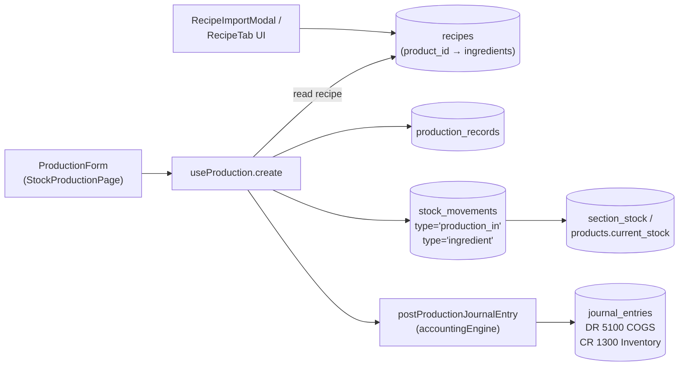
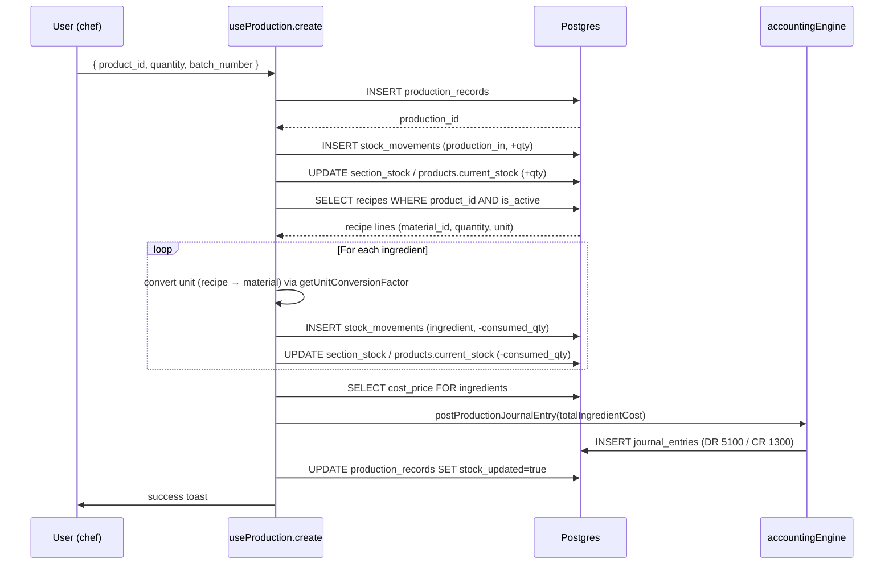

# 15 — Production & Recipes

> **Last verified**: 2026-05-03
> **Statut** : ✅ Implémenté · workflow production complet avec déduction ingrédients + ajout produit fini + écriture comptable COGS
> **Prérequis** : [05 — Products & Categories](05-products-categories.md), [06 — Inventory & Stock](06-inventory-stock.md), [10 — Accounting](10-accounting-double-entry.md)

Module de gestion des recettes (BoM — Bill of Materials) et des **records de production** (fournées de pâtisserie). Cœur métier The Breakery : chaque fournée déduit automatiquement les matières premières via la recette, ajoute le produit fini en stock, et passe une écriture comptable COGS (DR 5100 / CR 1300).

---

## Vue d'ensemble



**Cas d'usage clé** : la production matinale du chef pâtissier. Sélection du produit fini (croissant, baguette), saisie de la quantité produite, validation. Le système :

1. Insère le `production_record`
2. Lit la `recipe` active du produit
3. Crée un `stock_movement type='production_in'` (+qty produit fini)
4. Crée N `stock_movements type='ingredient'` (-qty matières premières)
5. Met à jour `section_stock` ou `products.current_stock` pour chaque mouvement
6. Calcule le coût total ingrédients (Σ `cost_price × consumed_qty`)
7. Pose le JE comptable DR 5100 / CR 1300 du montant calculé
8. Met `production_records.stock_updated = true`, `materials_consumed = true`

---

## Tables DB

| Table | Rôle | RLS |
|---|---|---|
| `recipes` | Bill of Materials : un produit fini → N ingrédients (M:M via `material_id` lui-même un `products.id`) | ✅ permission-based |
| `production_records` | Une ligne par fournée produite, lien vers le produit fini + section + staff | ✅ |

`recipes` :

| Colonne | Type | Notes |
|---|---|---|
| `product_id` | `UUID` FK products | Le produit fini |
| `material_id` | `UUID` FK products | L'ingrédient — peut être `raw_material` ou `semi_finished` |
| `quantity` | `DECIMAL(10,3)` | Quantité par 1 unité de produit fini |
| `unit` | `TEXT` | Unité de la recette (ex. `g`, `ml`) — converti via `getUnitConversionFactor` vers l'unité du `material` |
| `is_active` | `BOOLEAN` DEFAULT TRUE | Désactivation sans suppression (versions de recette) |

`production_records` :

| Colonne | Type | Notes |
|---|---|---|
| `production_id` | `TEXT` UNIQUE | Format `PROD-YYYYMMDD-XXXX` (généré client-side) |
| `product_id` | `UUID` FK | Produit fini fabriqué |
| `quantity_produced` | `DECIMAL(10,3)` | Quantité de produit fini |
| `quantity_waste` | `DECIMAL(10,3)` DEFAULT 0 | Pertes (rebut, raté) |
| `production_date` | `DATE` | Date de la fournée (par défaut today) |
| `staff_id` / `staff_name` | `UUID` / `TEXT` | Pâtissier responsable |
| `section_id` | `UUID` FK sections | Section de production (cuisine, labo) |
| `status` | `TEXT` | Pour workflow étendu (draft → in_progress → completed) — peu utilisé en prod |
| `materials_consumed` | `BOOLEAN` DEFAULT FALSE | Flag qui passe à TRUE après la déduction des ingrédients |
| `stock_updated` | `BOOLEAN` DEFAULT FALSE | Flag qui passe à TRUE une fois les `stock_movements` créés |
| `estimated_completion` | `TIMESTAMPTZ` NULL | Pour les productions planifiées |
| `notes` | `TEXT` | Commentaires |
| `created_by` / `updated_by` | `UUID` FK user_profiles | Audit |

Le statut "stock_updated" / "materials_consumed" sert de protection idempotente : on ne re-déduit pas les ingrédients si le record est déjà flagué.

---

## Workflow production



Toutes les étapes sont séquentielles dans un même `useMutation.mutationFn` — pas de transaction PostgreSQL globale (une RPC atomique `create_production_record` existe en parallèle, cf. `supabase/migrations/20260502061925_create_production_record_rpc.sql`, mais le hook fait actuellement les inserts séparément pour faciliter le debug).

---

## Triggers SQL & stock movement automatique

Historiquement, un trigger `tr_update_product_stock` mettait à jour `products.current_stock` à chaque insert dans `stock_movements`. Il a été **désactivé** car il causait des deadlocks et des incohérences avec `section_stock`. Désormais le hook `useProduction.create` met à jour le stock **lui-même** après chaque insert de mouvement.

Triggers actifs liés :

- `production_records` n'a pas de trigger AFTER INSERT — toute la logique est côté hook
- Les `stock_movements` insérés par production sont consommés par les vues analytics `view_stock_waste`, `view_inventory_valuation`, etc.
- Le JE est posé via la fonction de service `postProductionJournalEntry` (pas via trigger DB) — voir [10 — Accounting](10-accounting-double-entry.md)

Migration de référence pour la création des tables : `supabase/migrations/045_recipes_production_tables.sql`. Migrations correctives :
- `20260203100000_import_recipes.sql` — seed initial des recettes
- `20260204110000_fix_recipes_rls.sql` — correction RLS
- `20260222025747_secure_recipes_permissions.sql` — gating fin
- `20260222080054_add_production_record_status_columns.sql` — ajout `status`, `estimated_completion`
- `20260330300000_p2_fix_production_view.sql` — correction `view_production_summary`
- `20260502061925_create_production_record_rpc.sql` — RPC atomique alternative

---

## Hooks

### Production (`src/hooks/inventory/useProduction.ts`)

Hook composite (544 lignes) :

| Méthode | Rôle |
|---|---|
| `list` | useQuery — `production_records` filtrés par produit, date range, staff. Joins product + user |
| `todayProduction` | useQuery — productions du jour |
| `summary` | useQuery — agrégat par produit (total_quantity, record_count, last_production) |
| `getById(id)` | useQuery factory — détail single |
| `create` | useMutation — orchestration complète (cf. workflow ci-dessus) |
| `update` | useMutation — édite uniquement `notes` et `batch_number` (pas de réversion stock) |
| `remove` | useMutation — **réverse les `stock_movements`** (production_in → -qty, ingredient → +qty) puis delete |

Realtime via `supabase.channel('production-changes')` qui invalide `['production']` sur tout INSERT/UPDATE/DELETE.

**Invalidations onSuccess** : `['production']`, `['stock-movements']`, `['inventory']`, `['products']`, `['product-full-detail']`, `['product-dashboard']` — la production touche large.

### Recipe (`src/hooks/inventory/useProductRecipe.ts`)

Hook simple pour récupérer la recette active d'un produit :

```ts
const { recipe, isLoading } = useProductRecipe(productId)
// recipe = Array<{ material_id, quantity, unit, material: { name, unit, cost_price } }>
```

Utilisé dans `RecipeViewerModal` (lecture seule), `RecipeTab` (édition inline).

### Stock production hook auxiliaire (`src/pages/inventory/useStockProduction.ts`)

Hook spécifique à la page `StockProductionPage` qui combine `useProduction` + `useProducts(filters: type='finished')` + helpers de validation. Pas exposé hors de la page.

---

## Services

### `src/pages/inventory/stockProductionService.ts`

Service local de la page (pas dans `src/services/`) :

| Fonction | Rôle |
|---|---|
| `validateProductionInput(data)` | Vérifie qty > 0, product_id présent, stock ingrédients suffisant |
| `calculateIngredientCost(recipe, productionQty)` | Multiplie chaque ingrédient par qty produite × cost_price avec conversion d'unité |
| `formatProductionId(date)` | Génère `PROD-YYYYMMDD-XXXX` |

### `src/services/products/recipeImportExport.ts`

Import/export des recettes en CSV/JSON pour migration entre environnements. Format pivoté : 1 ligne = 1 (produit, ingrédient, quantité, unité).

### `src/services/accounting/accountingEngine.ts` — `postProductionJournalEntry`

Fonction qui crée le JE comptable :

```ts
await postProductionJournalEntry({
  productionId,           // FK source
  productionDate,         // = JE date
  productionNumber,       // PROD-XXX dans la description
  productName,
  totalIngredientCost,    // Σ cost_price × qty
  createdBy,
})
// → JE: DR 5100 (COGS Production) / CR 1300 (Inventory)
```

Retourne `{ success, skipped?, error? }`. Le hook `useProduction.create` log mais n'échoue pas si le JE échoue (la production reste enregistrée — réconciliation manuelle possible).

### `src/utils/unitConversion.ts` — `getUnitConversionFactor`

Helper critique : convertit la quantité recette dans l'unité du matériau. Exemple : recette en `g`, matériau stocké en `kg` → factor 0.001. Voir `src/types/units.ts` pour la matrice complète.

---

## Pages (`src/pages/inventory/`)

| Page | Route | Garde |
|---|---|---|
| `StockProductionPage.tsx` | `/inventory/production` (et redirect `/production`) | `inventory.view` |
| `components/ProductionForm.tsx` | (sous-composant page) | sélection produit fini + qty + batch + notes |
| `components/ProductionSummary.tsx` | (sous-composant) | KPIs du jour : total fournées, top produit |
| `components/ProductionHistory.tsx` | (sous-composant) | Table des `production_records` récents avec actions |
| `tabs/RecipeTab.tsx` | sous-onglet de `ProductDetailPage` | Édition de la recette d'un produit |
| `dashboard/ProductionSection.tsx` | sous-composant `ProductInventoryDashboard` | Section production du dashboard global |
| `dashboard/RecipeUsageTable.tsx` | sous-composant dashboard | Top recettes utilisées |

Routes définies dans `src/routes/inventoryRoutes.tsx` (sous le `<Route path="/inventory">` parent).

---

## Composants UI

| Composant | Localisation | Rôle |
|---|---|---|
| `RecipeViewerModal.tsx` | `src/components/inventory/` | Modal lecture seule pour visualiser la recette d'un produit fini |
| `RecipeImportModal.tsx` | `src/components/products/` | Import CSV/JSON de recettes en masse |
| `recipe-import/` | `src/components/products/` | Sous-composants de l'assistant d'import (mapping colonnes, preview, validation) |
| `alerts/ProductionTab.tsx` | `src/components/inventory/` | Onglet alerts spécifique production (recettes orphelines, ingrédients manquants) |

---

## Vue analytics

`view_production_summary` (cf. migration `045` + correction `20260330300000_p2_fix_production_view.sql`) — agrégat 30 jours utilisé par `ProductionSection` et le rapport [`production_report` du module 14](14-reports-analytics.md).

Rapports liés (catégorie Operations) :

- `production_report` — quantités, valeurs, coûts
- `production_efficiency` — taux de waste par produit, tendance journalière
- `cogs_production` — coût matières premières via production + ventes
- `product_materials` — recettes ingrédients × cost (catégorie Inventory)

---

## RLS & permissions

| Permission | Action |
|---|---|
| `inventory.view` | Voir les productions et recettes |
| `inventory.create` | Créer un `production_record` |
| `inventory.update` | Éditer (notes, batch_number) |
| `inventory.delete` | Supprimer (avec réversion stock) |
| `inventory.adjust` | Ajustements manuels orthogonaux à la production |
| `products.update` | Modifier les recettes (BoM) |

Pattern RLS standard `is_authenticated()` SELECT + `user_has_permission()` writes. La table `recipes` a une policy spécifique `secure_recipes_permissions` (migration 2026-02-22) qui restreint l'édition aux rôles `admin` et `production_manager`.

---

## Flow E2E lié

Voir [08-flows-end-to-end/12-production-stock-impact.md](../08-flows-end-to-end/12-production-stock-impact.md) pour le déroulé complet (sélection produit → calcul théorique ingrédients consommés → validation → impact stock multi-section → JE comptable → mise à jour des dashboards) avec captures et requêtes SQL de vérification.

---

## Pitfalls

- ⚠️ **Triggers stock désactivés** : `tr_update_product_stock` n'est plus actif sur `stock_movements`. Toute insertion via SQL direct (hors `useProduction`) **ne mettra pas à jour** `products.current_stock` ou `section_stock`. Toujours passer par les hooks ou par la RPC `create_production_record_rpc` (atomique).
- ⚠️ **Conversion d'unité obligatoire** : la recette peut être en `g` et le matériau stocké en `kg`. Le hook applique `getUnitConversionFactor(recipeUnit, materialUnit)` — si la matrice ne couvre pas une paire, le factor par défaut est 1 (silencieux), ce qui causera une déduction massive ou nulle. Compléter `src/types/units.ts` avant d'utiliser de nouvelles unités.
- ⚠️ **`section_stock` vs `products.current_stock`** : si le produit a une `section_id`, le hook met à jour `section_stock`, sinon il met à jour `products.current_stock`. La fallback existe en cas d'erreur upsert. Pour un dashboard cohérent, **toujours** lire le stock via la vue agrégée (`view_inventory_valuation`) qui combine les deux.
- ⚠️ **JE non-bloquant** : si `postProductionJournalEntry` échoue (compte 5100 ou 1300 manquant), la production reste enregistrée et le stock est mis à jour, mais aucun JE n'est créé. Le `console.error('Production JE failed')` est silencieux côté UI. Surveiller le logger Sentry pour détecter ces cas.
- ⚠️ **Récursion produits semi-finis** : si un `material` est lui-même un `semi_finished` avec sa propre recette, **la déduction n'est pas récursive** — le hook déduit uniquement le `semi_finished` de son stock (qui doit avoir été produit en amont). Pas de cascade automatique. Pour les pâtes-mères (levain, beurre tourné), produire d'abord le semi-fini puis le produit final.
- ⚠️ **Reverse delete partiel** : `useProduction.remove` réverse les `stock_movements` mais **ne réverse pas le JE comptable**. Pour annuler proprement, créer un JE manuel de contre-passation après la suppression.
- ⚠️ **`materials_consumed` jamais flag** : le hook met `stock_updated = true` mais oublie souvent `materials_consumed = true` (champ historique non systématique). Ne pas s'appuyer dessus pour des invariants — préférer `stock_updated` ou la présence de `stock_movements` liés via `reference_id`.
- ⚠️ **`production_id` collision** : le format `PROD-YYYYMMDD-XXXX` avec 4 chars base36 random a ~1.7M combinaisons par jour. Pour les volumes The Breakery (~50 productions/jour) c'est sans risque, mais valider l'unicité côté DB via UNIQUE constraint.
- ⚠️ **`quantity_waste` ne déduit rien** : le champ existe sur `production_records` pour le reporting, mais `useProduction.create` **n'en tient pas compte** dans la quantité ajoutée au stock. Pour soustraire les pertes, soit saisir manuellement un `stock_movement type='waste'` après, soit étendre la mutation. Le rapport `production_efficiency` utilise `quantity_waste` pour calculer le taux de gâche.
- ⚠️ **Recettes inactives invisibles** : `useProductRecipe` filtre `is_active = true`. Pour voir les anciennes versions (audit), passer un flag `includeInactive`. Le `RecipeImportModal` désactive l'ancienne et active la nouvelle automatiquement.
- ⚠️ **Coût ingrédient = `cost_price`** : si un produit ingrédient n'a pas de `cost_price` renseigné, son coût est traité comme 0 dans le JE. Le total COGS sera sous-évalué. Vérifier régulièrement via le rapport `product_materials` que tous les ingrédients ont un coût.
