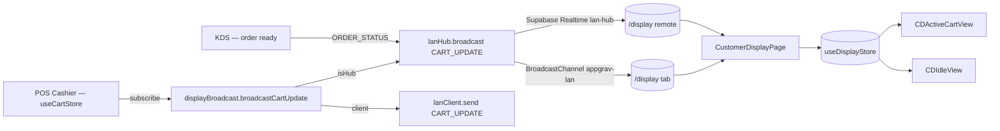

# Module 16 — Customer Display

> Public-facing customer display device showing live cart, totals, order queue and rotating promotions. Mirrors the cashier's POS in real-time over LAN.

---

## Vue d'ensemble

The Customer Display is a passive, fullscreen client surface served at `/display`. It is intended for a screen physically mounted on the customer side of the counter (small TV, tablet in landscape, second monitor). It has **no authentication guard** (route is public) because the device only consumes broadcast data and never mutates anything server-side.

Three surfaces are composited on the same page based on activity state:

| Surface          | Trigger                                                       | Visual                                                         |
| ---------------- | ------------------------------------------------------------- | -------------------------------------------------------------- |
| **Active cart**  | `cart.items.length > 0`                                       | Branded header + line items + totals + order type / table info |
| **Idle promos**  | `cart.items.length === 0` AND `idle > idleTimeoutSeconds`     | Rotating promo cards loaded from `display_promotions`          |
| **Ready orders** | One or more orders broadcast `status: 'ready'` (last 5 min)   | Toast-style banner with order number + chime audio cue         |

Updates flow exclusively from the POS hub through the LAN layer (BroadcastChannel + Supabase Realtime fallback) — see `06-lan-architecture/`.

---

## Diagramme



---

## Tables DB

| Table                | Rôle                                                        | Migration                |
| -------------------- | ----------------------------------------------------------- | ------------------------ |
| `display_promotions` | Promo cards rotated in idle mode (image, title, dates)      | `010_lan_sync_display`   |
| `display_content`    | Auxiliary content blocks (announcements, menu spotlights)   | `010_lan_sync_display`   |
| `lan_nodes`          | Runtime presence of the display device (heartbeat 30 s)     | `010_lan_sync_display`   |

Key columns of `display_promotions`:

| Column             | Type      | Notes                                |
| ------------------ | --------- | ------------------------------------ |
| `title`            | TEXT      | Headline                             |
| `subtitle`         | TEXT      | Secondary line                       |
| `image_url`        | TEXT      | CDN/Storage URL                      |
| `start_date`       | DATE      | Nullable — open-ended start          |
| `end_date`         | DATE      | Nullable — open-ended end            |
| `is_active`        | BOOLEAN   | Filter at fetch                      |
| `priority`         | INT       | DESC sort                            |
| `background_color` | TEXT      | Hex (idle theming)                   |
| `text_color`       | TEXT      | Hex                                  |

---

## Hooks

| Hook                           | Path                                          | Rôle                                                    |
| ------------------------------ | --------------------------------------------- | ------------------------------------------------------- |
| `useDisplayStore`              | `src/stores/displayStore.ts`                  | State store (cart mirror, queues, idle, promos)         |
| `useDisplayBroadcast`          | `src/hooks/pos/useDisplayBroadcast.ts`        | Cross-tab fallback via `BroadcastChannel('appgrav-pos')` — used by POS Cart, PaymentModal, SplitByItemModal |
| `useDisplaySettings`           | `src/hooks/settings/useModuleConfigSettings` | Reads `display.*` keys (`idleTimeoutSeconds`, `promoRotationIntervalSeconds`) |
| `useLanClient` (indirect)      | `src/hooks/lan/useLanClient.ts`               | Connection to hub (heartbeat, status)                   |

---

## Services

| Service                                       | Rôle                                                                                                                                                 |
| --------------------------------------------- | ---------------------------------------------------------------------------------------------------------------------------------------------------- |
| `src/services/display/displayBroadcast.ts`    | Public API: `broadcastCartUpdate()`, `broadcastOrderStatus(orderId, orderNumber, status)`, `clearDisplay()`, `startCartBroadcast()`, `stopCartBroadcast()` |
| `src/services/lan/lanHub.ts`                  | Hub-side broadcast (`LAN_MESSAGE_TYPES.CART_UPDATE`, `ORDER_STATUS`)                                                                                |
| `src/services/lan/lanClient.ts`               | Client-side subscription on the display device                                                                                                       |

`broadcastCartUpdate()` is debounced by the cart store subscription (only re-emits when `items`, `total`, `customerName` or `tableNumber` actually changed) to avoid render storms during quantity stepper spam.

---

## Composants UI

| Composant                       | Path                                              | Rôle                                                                |
| ------------------------------- | ------------------------------------------------- | ------------------------------------------------------------------- |
| `CustomerDisplayPage`           | `src/pages/display/CustomerDisplayPage.tsx`       | Root page — wires LAN client, subscriptions, idle timer, promo loop |
| `CDActiveCartView`              | `src/pages/display/CDActiveCartView.tsx`          | Live cart layout (items list, totals card, customer/table chip)     |
| `CDIdleView`                    | `src/pages/display/CDIdleView.tsx`                | Promo rotation, brand showcase, "ready order" banners               |
| `customerDisplayStyles.ts`      | `src/pages/display/customerDisplayStyles.ts`      | Inline style tokens (oversized typography, dark/light contrast)     |
| `BreakeryLogo`                  | `src/components/ui/BreakeryLogo.tsx`              | Branding lockup (hero in idle, header in active)                    |

UI principles:

- Oversized typography — line items must be readable from 2 m.
- High contrast — Luxe Dark palette inverted for promos when `background_color` provided.
- No interactive controls — page is **read-only by design**, ignore taps.
- Auto-dim after 30 idle minutes (CSS opacity 0.5) to protect screens.

---

## Stores

### `useDisplayStore` (`src/stores/displayStore.ts`)

Shape (excerpt):

```ts
{
  cart: { items, subtotal, discountAmount, total, itemCount, customerName, orderType, tableNumber },
  lastCartUpdate: string | null,
  orderQueue: IQueuedOrder[],     // status === 'preparing'
  readyOrders: IQueuedOrder[],    // status === 'ready' or 'called'
  isIdle: boolean,
  idleTimeout: number,            // seconds — from settings
  lastActivity: string,
  currentPromoIndex: number,
  promoRotationInterval: number,  // seconds
  isConnected: boolean,
}
```

Key actions:

- `updateCart(payload)` — replaces full cart snapshot, resets `isIdle` if items present
- `updateOrderStatus({ orderId, status })` — moves order across `orderQueue → readyOrders` and schedules a 5-minute auto-removal `setTimeout` per ready order (timeouts tracked in a module-level `Map` to allow cleanup on unmount via `clearAllTimeouts()`)
- `removeReadyOrder(orderId)` — manual dismissal + clears the pending timeout
- `clearCart()` — full reset incl. all pending timeouts (called on POS order completion)
- `checkIdle()` — invoked by interval; switches `isIdle` true once `now - lastActivity > idleTimeout`

The store does **not** persist (display devices are stateless on reload).

---

## RPCs / Edge Functions

None. The display is a pure consumer — no Edge Functions, no RPCs. All data arrives via LAN messages or a one-shot Supabase select on `display_promotions` at mount.

---

## RLS / Permissions

| Table                | Policy                                     | Notes                                              |
| -------------------- | ------------------------------------------ | -------------------------------------------------- |
| `display_promotions` | `SELECT` for `is_authenticated()`          | Anonymous reads not allowed — display device must be logged in (kiosk session) |
| `display_content`    | `SELECT` for `is_authenticated()`          | Same as above                                      |

> The `/display` route has no React `RouteGuard` — it is publicly *navigable*, but Supabase calls require an authenticated session. In production, the display device is provisioned with a dedicated kiosk user. If session expires, the page silently fails to refresh promos but continues to show whatever is in `useDisplayStore`.

---

## Routes

| Route      | Component             | Guard              | Layout |
| ---------- | --------------------- | ------------------ | ------ |
| `/display` | `CustomerDisplayPage` | None (public path) | None — fullscreen |

Registered in `src/routes/posRoutes.tsx`:

```tsx
<Route path="/display" element={<CustomerDisplayPage />} />
```

---

## Flows E2E

### Flow A — Cashier adds an item

1. Cashier taps a product on POS → `useCartStore.addItem()`
2. `startCartBroadcast()` subscriber fires → `broadcastCartUpdate()`
3. Hub broadcasts `CART_UPDATE` via `BroadcastChannel('appgrav-lan')` + Supabase Realtime
4. `CustomerDisplayPage` receives the message via `lanClient.on(LAN_MESSAGE_TYPES.CART_UPDATE, …)`
5. `useDisplayStore.updateCart(payload)` mutates state
6. `CDActiveCartView` re-renders with the new line item
7. **Latency target**: < 300 ms on LAN, < 800 ms via Realtime fallback

### Flow B — Order ready (KDS chime)

1. Barista taps "Ready" on KDS → KDS calls `broadcastOrderStatus(orderId, orderNumber, 'ready')`
2. Hub forwards `ORDER_STATUS` payload to all clients
3. Display receives → `updateOrderStatus()` moves the order from `orderQueue` to `readyOrders`
4. `CDIdleView` (or active overlay) shows the order number + plays `audioRef` chime once
5. After 5 min, `setTimeout` auto-removes the order from `readyOrders`

### Flow C — Idle promo rotation

1. After `idleTimeoutSeconds` (default 30) of zero cart activity, `checkIdle()` flips `isIdle = true`
2. `CDIdleView` mounts; `useEffect` sets a `setInterval(promoRotationInterval * 1000)` calling `nextPromo()`
3. `currentPromoIndex` increments modulo `promotions.length`
4. New promo image fades in (CSS transition)
5. Any `CART_UPDATE` with items > 0 instantly resets to `CDActiveCartView`

---

## Pitfalls

- **Memory leaks via setTimeout**: `useDisplayStore` schedules a `setTimeout` per ready order (auto-removal at 5 min). The page MUST call `clearAllTimeouts()` on unmount, otherwise hot-reload during dev or fast route changes leak handles. The store exposes this action explicitly — `CustomerDisplayPage` uses it in a `useEffect` cleanup.
- **Promo SQL filter pitfall**: the `display_promotions` query uses two `.or()` clauses chained — Supabase combines them with AND, so a promo with `start_date IS NULL` AND `end_date < today` is correctly excluded only because of the second `.or()`. Do not refactor without testing edge dates.
- **Public route, authenticated query**: visiting `/display` without an active Supabase session returns `data: []` for promos with no error toast (silent fail). Ensure the kiosk session is provisioned and refreshed (use a service-account user with auto-refresh tokens).
- **Audio autoplay blocked**: the chime `audioRef.current?.play()` may be blocked by browser autoplay policies until the page receives a user gesture. On a dedicated kiosk device, perform a one-time tap during setup to "unlock" audio for the session.
- **Cross-tab vs cross-device**: if POS and `/display` run in the same browser, the cross-tab `BroadcastChannel('appgrav-pos')` (used by `useDisplayBroadcast`) is the fast path. Cross-device (separate tablets) requires the LAN hub path (`'appgrav-lan'` + Realtime).
- **Do not add interactive controls**: the display is read-only. Any on-screen button (e.g. "Dismiss") must be guarded by a long-press + PIN to prevent customers from interfering.
- **Idle dimming threshold**: hard-coded to 30 minutes (`isDimmed = idleMinutes >= 30`). If the bakery wants a different value, expose via `display.dimAfterMinutes` setting key, do not edit the page constant.

---

## Voir aussi

- `06-lan-architecture/` — Hub/client protocol, message types, heartbeat
- `04-modules/14-kds-kitchen.md` — Source of `ORDER_STATUS` events
- `04-modules/19-settings-configuration.md` — `display.*` settings keys
