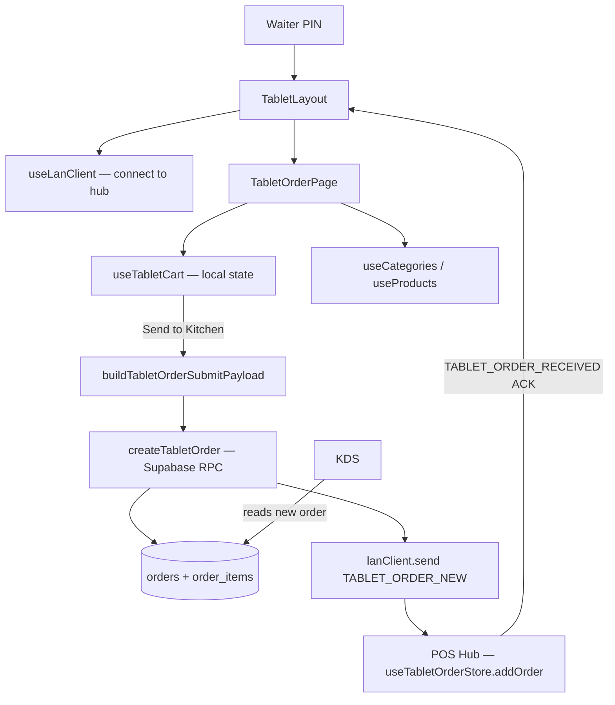

# Module 17 — Tablet Ordering (Waiter Tablets)

> Touch-optimised order capture for floor staff. Each tablet runs as a LAN client connected to the POS hub, drafts orders independently, and pushes them to the kitchen via the hub.

---

## Vue d'ensemble

The Tablet module gives waiters a dedicated, lightweight order-taking surface that complements the main POS:

- Lives at `/tablet/order` and `/tablet/orders`, behind a layout (`TabletLayout`) that handles PIN auth + LAN connection.
- Uses a **separate cart implementation** (`useTabletCart`) — *not* the full `useCartStore`. No locked items, no promotions engine, no customer pricing tiers, no split payments — just product + quantity + modifiers + notes.
- Sends finalised orders to the cashier (`POS hub`) via Supabase RPC + a LAN `TABLET_ORDER_NEW` notification — the cashier collects payment.
- Tracks the order lifecycle locally (`tabletOrderStore`) so multiple tablets don't double-fire the same table.

Designed for landscape Android tablets (10–12") in kiosk mode (Capacitor), but works in any modern browser on tablet-class devices.

---

## Diagramme



---

## Tables DB

The tablet module reuses the standard sales tables — no dedicated schema:

| Table              | Rôle                                                    | Tablet-specific columns                              |
| ------------------ | ------------------------------------------------------- | ---------------------------------------------------- |
| `orders`           | Header row — created with `status='pending_payment'`    | `created_via='tablet'`, `waiter_id`, `table_number`  |
| `order_items`      | Line items                                              | Standard                                             |
| `lan_nodes`        | Tablet device presence (heartbeat 30 s)                 | `device_type='tablet'`                               |
| `device_configurations` | Persistent per-tablet config (name, station map)   | Optional                                             |

Order is **not paid at tablet time** — payment occurs at the cashier when the customer is ready.

---

## Hooks

| Hook                  | Path                                          | Rôle                                                    |
| --------------------- | --------------------------------------------- | ------------------------------------------------------- |
| `useTabletCart`       | `src/hooks/tablet/useTabletCart.ts`           | Local cart state — items, quantity, table, order type   |
| `useLanClient`        | `src/hooks/lan/useLanClient.ts`               | LAN connection (auto-connect, status, reconnect)        |
| `useProducts`         | `src/hooks/products/useProducts.ts`           | Product catalogue (filtered by category)                |
| `useCategories`       | `src/hooks/products/useCategories.ts`         | Category list                                           |
| `useAuthStore`        | `src/stores/authStore.ts`                     | Waiter identity (display_name, id)                      |
| `useTabletOrderStore` | `src/stores/tabletOrderStore.ts`              | **Hub-side** — incoming-order tracker for the cashier   |

`useTabletCart` returns: `{ items, tableNumber, orderType, itemCount, subtotal, total, addItem, removeItem, updateQuantity, setTableNumber, setOrderType, clearCart }`. Designed for ≤ 50 line items (no virtualization). Item dedup keys on `productId` if no modifiers/notes are present.

---

## Services

| Service                                        | Rôle                                                                            |
| ---------------------------------------------- | ------------------------------------------------------------------------------- |
| `src/services/pos/tabletOrderService.ts`       | `buildTabletOrderSubmitPayload(cart, waiter, device)` + `createTabletOrder()` (Supabase insert into `orders` + `order_items`) |
| `src/services/pos/dispatchStationResolver.ts`  | `batchGetDispatchStationsForProductIds(ids)` — maps each product to its KDS station so the kitchen can route correctly |
| `src/services/lan/lanClient.ts`                | Sends `TABLET_ORDER_NEW`, listens for `TABLET_ORDER_RECEIVED` ACK               |
| `src/services/lan/lanProtocol.ts`              | `LAN_MESSAGE_TYPES.TABLET_ORDER_NEW` / `.TABLET_ORDER_RECEIVED`                 |

---

## Composants UI

| Composant            | Path                                       | Rôle                                                           |
| -------------------- | ------------------------------------------ | -------------------------------------------------------------- |
| `TabletLayout`       | `src/pages/tablet/TabletLayout.tsx`        | PIN gate, LAN connection, header (Wifi indicator), bottom tabs |
| `TabletOrderPage`    | `src/pages/tablet/TabletOrderPage.tsx`     | Main order capture: category nav + product grid + cart panel   |
| `TabletOrdersPage`   | `src/pages/tablet/TabletOrdersPage.tsx`    | Sent-orders history with status (pending_payment / paid)       |
| `PinVerificationModal` | `src/components/pos/modals/PinVerificationModal.tsx` | Reused for waiter PIN entry                                |

Layout pattern (TabletOrderPage):

- **Left rail** — category list (vertical, scrollable, large touch targets ≥ 56 px)
- **Center** — product grid (3–4 columns), search bar at top
- **Right panel** — cart, table selector, order-type toggle (`dine_in` | `takeaway`), "Send to Kitchen" CTA

No `tablet/` directory under `src/components/` — all layout lives in the page file. Reused primitives come from `src/components/ui/` (Button, Card, Skeleton).

---

## Stores

### `useTabletCart` — local hook state, *not* a Zustand store

Per-page React state (created at page mount, destroyed on navigation). Intentional: the waiter's cart is ephemeral and tied to a single in-progress order.

### `useTabletOrderStore` — POS-hub side (`src/stores/tabletOrderStore.ts`)

Lives on the **cashier's POS**, not on the tablet. Tracks incoming orders coming from any tablet so the cashier knows what's pending payment.

Shape:

```ts
{
  incomingOrders: ITabletOrderEntry[],   // capped at 50
  unreadCount: number,
  addOrder(entry): void,                 // dedup by orderId
  markPaid(orderId): void,
  markCancelled(orderId): void,
  clearUnread(): void,
  removeOrder(orderId): void,
}
```

Populated by:

1. Supabase Realtime subscription on `orders` (filter `created_via='tablet' AND status='pending_payment'`)
2. LAN `TABLET_ORDER_NEW` message (faster path on LAN)

The dedup in `addOrder()` ensures both paths arriving for the same order don't double-list.

---

## RPCs / Edge Functions

No dedicated Edge Function for tablet. Order creation goes through standard channels:

- `createTabletOrder()` performs `INSERT INTO orders + order_items` in a single Supabase request (auto-numbered via DB trigger).
- Permissions enforced by RLS on `orders` (`sales.create`).
- The `complete_order_with_payments` RPC is called later by the **cashier** (not the tablet) when the customer pays.

---

## RLS / Permissions

| Table          | Tablet operation         | Required permission |
| -------------- | ------------------------ | ------------------- |
| `orders`       | INSERT (draft order)     | `sales.create`      |
| `order_items`  | INSERT                   | `sales.create`      |
| `products`     | SELECT (catalogue)       | `is_authenticated()` |
| `categories`   | SELECT                   | `is_authenticated()` |

The tablet user is typically a `waiter` role that has `sales.create` and `sales.view` but not `sales.void`, `sales.discount`, or `payments.process`. PINs are stored in `user_profiles.pin_hash` (bcrypt) and verified through the standard `auth-verify-pin` Edge Function.

---

## Routes

| Route             | Component          | Guard            |
| ----------------- | ------------------ | ---------------- |
| `/tablet`         | `TabletLayout`     | `POSAccessGuard` + in-layout PIN gate |
| `/tablet/order`   | `TabletOrderPage`  | (inherited)      |
| `/tablet/orders`  | `TabletOrdersPage` | (inherited)      |

Defined in `src/routes/posRoutes.tsx`. Wrapped in `ModuleErrorBoundary moduleName="Tablet"`. The layout itself enforces PIN-on-mount via `PinVerificationModal`.

---

## Flows E2E

### Flow A — Take an order

1. Waiter opens `/tablet/order` on the tablet
2. `TabletLayout` mounts → `useLanClient({ deviceType: 'tablet', autoConnect: true })` connects to hub
3. PIN modal appears → waiter enters PIN → `auth-verify-pin` Edge Function validates → `setIsAuthenticated(true)`
4. Waiter selects table number + order type (`dine_in`)
5. Waiter taps products → `useTabletCart.addItem()` accumulates lines
6. Waiter taps "Send to Kitchen":
   - `buildTabletOrderSubmitPayload()` assembles the payload (waiter id, items, dispatch station per item)
   - `createTabletOrder()` inserts `orders` + `order_items` rows in Supabase
   - `lanClient.send(TABLET_ORDER_NEW, { orderId, orderNumber, ... })` notifies the hub
7. Hub-side `useTabletOrderStore.addOrder()` puts the order in the cashier's "incoming" panel
8. Cashier sees badge increment, can preview order, marks as paid when customer pays
9. Hub sends `TABLET_ORDER_RECEIVED` ACK → tablet shows toast "Order #123 confirmed by POS"
10. KDS polls/subscribes to `orders` and starts preparing line items routed to its station

### Flow B — Hub disconnect during send

1. Tablet attempts `createTabletOrder()` while LAN hub is offline
2. Supabase insert succeeds (cloud reachable independently of LAN)
3. `lanClient.send()` throws → caught, toast "POS unreachable, order saved to cloud"
4. Hub-side Realtime subscription on `orders` fires when reachable → `addOrder()` reconciles
5. No duplicate (dedup by `orderId`)

### Flow C — Status follow-up

1. KDS marks an item ready → `broadcastOrderStatus(orderId, 'ready')`
2. Tablet's `lanClient.on(ORDER_STATUS, …)` triggers a toast "Table 5 — order ready"
3. Waiter retrieves the dish

---

## Pitfalls

- **Two cart implementations**: `useTabletCart` (tablet) and `useCartStore` (POS) are intentionally distinct. Do not import `cartStore` into the tablet pages — its locked-item / promotion / split-payment logic does not apply and will pull in heavy dependencies.
- **Hub vs cloud separation**: order creation goes to **Supabase first**, LAN message is *informational*. If you reverse the order ("send via LAN, then DB"), you risk losing orders when the hub is offline. Keep the current order: DB insert, then notify.
- **`waiterName` on `TabletLayout` mount**: derived from `useAuthStore().user`. If a different waiter wants to use the tablet, they must explicitly logout (full app logout, not the in-layout PIN re-prompt) — the PIN modal alone does not switch identities.
- **Product type filter**: `TabletOrderPage` filters `p.product_type === 'finished'` — raw materials and intermediates are hidden. If you add a new product type for tablet use, update this filter.
- **Item dedup edge case**: `addItem()` merges the new line into an existing one only if neither has modifiers/notes. A product with notes always becomes a new line, even if identical text — by design (each note represents a discrete customer request).
- **No PIN re-verify on idle**: unlike `/pos`, the tablet does not auto-lock on session timeout. If the bakery requires it, wire up `useSessionTimeout` from `src/hooks/auth/`.
- **Concurrent table assignment**: nothing prevents two tablets from drafting an order on the same table number — first one to "Send to Kitchen" wins. If table-locking is desired, add a `table_locks` table or use Supabase Realtime presence.
- **Capacitor keyboard overlap**: when running native, the on-screen keyboard can hide the cart panel. `capacitor.config.ts` sets `Keyboard.resize: 'body'` to mitigate; if issues persist, scroll-into-view the focused input.

---

## Voir aussi

- `06-lan-architecture/` — `LAN_MESSAGE_TYPES.TABLET_ORDER_NEW` / `.TABLET_ORDER_RECEIVED`, hub routing
- `04-modules/03-pos-orders.md` — Order schema, payment lifecycle (cashier path)
- `04-modules/14-kds-kitchen.md` — How the kitchen consumes tablet orders
