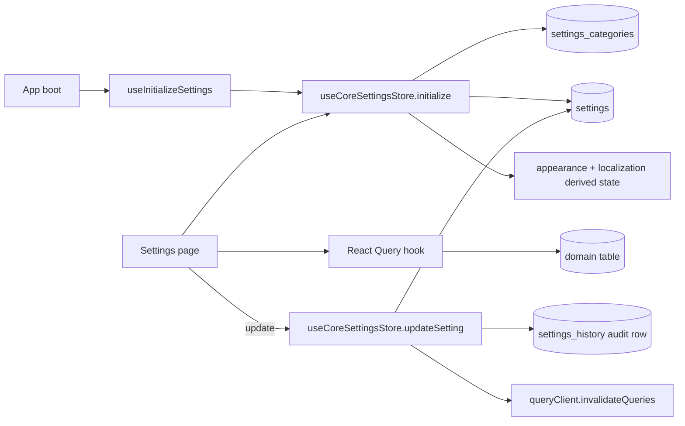

# Module 19 — Settings & Configuration

> Centralised configuration surface for the entire app. Combines a generic key/value `settings` table (with category, value-type, history) and dedicated business tables (tax rates, payment methods, business hours, printers, etc.). Powered by `useCoreSettingsStore` + a fan-out of React Query hooks.

---

## Vue d'ensemble

The Settings module is the broadest in the codebase: **42 pages** under `src/pages/settings/`, **30 components** in `src/components/settings/`, **20 hooks** in `src/hooks/settings/`, and a multi-source state machine.

Two storage paradigms coexist:

| Paradigm                   | Tables                                                         | Access                                          |
| -------------------------- | -------------------------------------------------------------- | ----------------------------------------------- |
| **Generic key/value**      | `settings_categories`, `settings`, `settings_history`          | `useCoreSettingsStore.getSetting('appearance.theme')` |
| **Domain-specific tables** | `tax_rates`, `payment_methods`, `business_hours`, `printer_configurations`, `terminal_settings`, `kds_stations`, `display_promotions`, `app_settings`, `roles`, `permissions`, `sound_assets`, `email_templates`, `receipt_templates` | Dedicated React Query hooks (`useTaxRates`, `usePaymentMethods`, …) |

A facade keeps the import surface stable: `src/stores/settingsStore.ts` re-exports from `src/stores/settings/coreSettingsStore.ts` so legacy `import { useSettingsStore } from '@/stores/settingsStore'` continues to work.

---

## Diagramme



---

## Tables DB

### Generic settings core (`009_system_settings`)

| Table                  | Rôle                                                                    |
| ---------------------- | ----------------------------------------------------------------------- |
| `settings_categories`  | Top-level grouping (`code`, `name_*`, `icon`, `sort_order`, `required_permission`) |
| `settings`             | Individual keys (`key`, `value` JSONB, `value_type`, `default_value`, `validation_rules`, `is_system`, `is_readonly`, `is_sensitive`, `requires_restart`) |
| `settings_history`     | Audit trail — `setting_id`, `old_value`, `new_value`, `reason`, `changed_by`, `changed_at` |
| `app_settings`         | Singleton-ish app-level config (kept for legacy)                        |

### Domain-specific tables (also in `009`, `010`)

| Table                     | Rôle                                                              |
| ------------------------- | ----------------------------------------------------------------- |
| `tax_rates`               | Tax definitions (PB1 10%, etc.)                                   |
| `payment_methods`         | Cash, card, transfer, voucher, OVO, GoPay, etc.                   |
| `business_hours`          | Per-day open/close + breaks                                       |
| `printer_configurations`  | Printer name, IP/serial, role (receipt/kitchen/barista)           |
| `terminal_settings`       | Per-terminal preferences                                           |
| `email_templates`         | Notification templates                                            |
| `receipt_templates`       | Custom receipt layouts                                            |
| `kds_stations`            | Kitchen station definitions                                        |
| `sound_assets`            | Notification chimes (KDS, display)                                |
| `settings_profiles`       | Saved profiles (e.g. "default", "weekend hours") for fast switch  |
| `lan_nodes`               | LAN device runtime presence (consumed by `/settings/lan`)         |
| `device_configurations`   | Persistent per-device config (consumed by `/settings/devices`)    |

### Important `settings` keys

| Key                                  | Type     | Default       | Page                         |
| ------------------------------------ | -------- | ------------- | ---------------------------- |
| `appearance.theme`                   | string   | `light`       | (global, app-wide)           |
| `appearance.primary_color`           | string   | `#2563eb`     | (global)                     |
| `appearance.pos_layout`              | enum     | `grid`        | POS Config                   |
| `appearance.pos_columns`             | int      | 4             | POS Config                   |
| `localization.default_language`      | enum     | `id`          | (suspended — English only)   |
| `localization.timezone`              | string   | `Asia/Makassar` | (global)                   |
| `localization.currency_code`         | string   | `IDR`         | (global)                     |
| `pos.session_timeout_minutes`        | int      | 30            | Security PIN page            |
| `pos.auto_print_receipt`             | boolean  | true          | POS Config                   |
| `pos.virtual_keypad_default`         | boolean  | true          | POS Config                   |
| `display.idle_timeout_seconds`       | int      | 30            | Display page                 |
| `display.promo_rotation_seconds`     | int      | 10            | Display page                 |
| `kds.auto_print_kitchen`             | boolean  | true          | KDS Config page              |
| `loyalty.points_per_currency_unit`   | float    | 0.001         | Loyalty page                 |
| `b2b.invoice_due_days`               | int      | 14            | B2B page                     |
| `inventory.low_stock_warning`        | int      | 10            | Inventory Config page        |
| `inventory.low_stock_critical`       | int      | 5             | Inventory Config page        |

(non-exhaustive — full list available via `SELECT key FROM settings ORDER BY key`)

---

## Hooks (20)

Located under `src/hooks/settings/` — re-exported through `src/hooks/settings/index.ts`.

| Hook                            | Rôle                                                                       |
| ------------------------------- | -------------------------------------------------------------------------- |
| `useInitializeSettings`         | One-shot bootstrap — calls `useCoreSettingsStore.initialize()` once        |
| `useSettingsCategories`         | Load `settings_categories` (5 min staleTime)                                |
| `useSettingsByCategory(code)`   | Load `settings` filtered by category code                                  |
| `useBusinessSettings`           | (composite) basic company info                                              |
| `useBusinessHolidays`           | Holiday calendar overrides on top of `business_hours`                      |
| `useCategorySettings`           | Product category config                                                    |
| `useModuleSettings`             | Generic per-module getter                                                  |
| `useModuleConfigSettings`       | Per-module config bundles (e.g. `useDisplaySettings`, `useKdsSettings`)    |
| `useNotificationEvents`         | Event types subscribable to notifications                                   |
| `useNotificationSettings`       | Per-user notification preferences                                          |
| `usePOSAdvancedSettings`        | POS advanced toggles (auto-print, virtual keypad, etc.)                    |
| `usePaymentSettings`            | Per-method config (limits, fees, rounding)                                  |
| `useRoles`                      | Roles + user_count + permission_ids (`update_role_permissions` mutation)   |
| `useSections`                   | Floor sections for table mapping                                            |
| `useSettingsCore`               | Core CRUD: `useUpdateSetting`, `useResetSetting`, `useSettingHistory`      |
| `useSettingsProfiles`           | Manage saved settings profiles                                              |
| `useSoundAssets`                | Notification chime catalog                                                  |
| `useSystemHealth`               | Sync queue depth, edge function up/down (`/settings/sync`)                 |
| `useTaxSettings`                | `useTaxRates`, `useUpsertTaxRate`, `useDeleteTaxRate`                       |
| `useTerminalSettings`           | Terminal registration, naming, station mapping                              |

`settingsKeys.ts` defines the React Query key factory: e.g. `settingsKeys.businessHours()`, `settingsKeys.settingsByCategory('appearance')`.

---

## Services

| Service                              | Rôle                                                                  |
| ------------------------------------ | --------------------------------------------------------------------- |
| `src/services/settingsService.ts`    | Lower-level wrapper used by `coreSettingsStore` for value coercion / parsing |

Most settings work goes directly through Supabase via the React Query hooks — there is intentionally minimal service indirection.

---

## Composants UI (30)

`src/components/settings/`:

| Composant                       | Rôle                                                          |
| ------------------------------- | ------------------------------------------------------------- |
| `SettingField`                  | Polymorphic input — renders text, number, boolean, JSON, enum based on `value_type` |
| `ModuleSettingsSection`         | Collapsible card grouping settings of a module                |
| `SettingsSectionsTab`           | Top-level tab container for SettingsLayout                    |
| `CompanyFormFields`             | Company info form fields                                      |
| `CompanyLogoSection`            | Logo upload (Supabase Storage)                                |
| `ArrayAmountEditor`             | Editor for array<number> values (e.g. discount presets)       |
| `DiscountPresetEditor`          | Specific editor for discount preset list                      |
| `FloorPlanEditor`               | Drag-and-drop floor-plan items editor                         |
| `NotificationSettingsSection`   | Per-event notification toggles                                |
| `SectionModal`                  | CRUD modal for floor sections                                 |
| `TaxRateModal`, `TaxRatesSection` | Tax rate CRUD                                               |
| `TerminalRegistrationModal`     | Register a new POS terminal                                   |
| `TerminalSettingsSection`       | Per-terminal config card                                      |
| Sub-folders: `categories/`, `floor-plan/`, `pos-advanced/`, `roles/` | Specialised editors    |

Page-level components live under `src/pages/settings/` (see Routes section).

---

## Stores

### `useCoreSettingsStore` (`src/stores/settings/coreSettingsStore.ts`) — `persist` + Supabase

```ts
{
  categories: ISettingsCategory[],
  settings: Record<string, ISetting>,    // keyed by setting.key
  isLoading: boolean,
  isInitialized: boolean,
  error: string | null,
  appearance: IAppearanceSettings,        // derived from settings.appearance.*
  localization: ILocalizationSettings,    // derived from settings.localization.*
}
```

Key methods:

- `initialize()` — idempotent boot; loads categories + all settings; computes `appearance` and `localization` derived blobs
- `getSetting<T>(key)` — typed accessor with JSON parsing
- `getSettingsByCategory(code)` — filter cached settings by category
- `updateSetting(key, value, reason?)` — `UPDATE settings`, append `settings_history` row, update local cache
- `updateSettings(updates)` — batch update
- `resetSetting(key)` — restore default value
- `resetCategorySettings(code)` — bulk reset
- `setAppearance(updates)` / `setLocalization(updates)` — derived-state setters that fan-out to multiple `settings.*` keys

Persisted via `localStorage` for fast cold-start render of theme + currency before Supabase round-trip resolves.

### Selectors exported via facade

`src/stores/settingsStore.ts` re-exports: `useSettingsStore` (alias for `useCoreSettingsStore`), `selectTheme`, `selectPrimaryColor`, `selectLanguage`, `selectCurrency`, `selectDateFormat`, `selectTimeFormat`.

---

## RPCs / Edge Functions

| Function                            | Rôle                                                          |
| ----------------------------------- | ------------------------------------------------------------- |
| `update_role_permissions(role_id, permission_ids[])` | Atomic permission set replacement (used by `useRoles`) |
| `set_user_pin(user_id, pin)`        | Hashes and stores PIN (called from Security PIN settings)     |
| `auth-user-management` (Edge)       | User CRUD invoked from Roles/Users settings flows             |
| `send-test-email` (Edge)            | Sanity-check SMTP from Notifications page                     |

No dedicated settings Edge Function — the table is hit directly from the browser, RLS gates writes.

---

## RLS / Permissions

| Table                  | Read                  | Write                                             |
| ---------------------- | --------------------- | ------------------------------------------------- |
| `settings`             | `is_authenticated()`  | `user_has_permission(uid, 'settings.update')`     |
| `settings_categories`  | `is_authenticated()`  | admin only                                        |
| `settings_history`     | `user_has_permission(uid, 'settings.update')` (read) | INSERT only via trigger / RPC      |
| `tax_rates`            | `is_authenticated()`  | `accounting.vat.manage`                           |
| `payment_methods`      | `is_authenticated()`  | `settings.update`                                 |
| `business_hours`       | `is_authenticated()`  | `settings.update`                                 |
| `printer_configurations` | `is_authenticated()` | `settings.network` OR `settings.update`          |
| `roles`                | `is_authenticated()`  | `users.roles`                                     |
| `permissions`          | `is_authenticated()`  | system-only (seed)                                |
| `role_permissions`     | `is_authenticated()`  | `users.roles` via `update_role_permissions` RPC   |

A dedicated `settings.network` permission lets cashiers manage printer/LAN devices without granting them full `settings.update` (POS terminals need to register printers without admin rights).

---

## Routes (42 pages)

`SettingsLayout` (`src/pages/settings/SettingsLayout.tsx`) is the shell at `/settings`. It does an index redirect based on the user's permissions (sends cashiers straight to `/settings/printing` if they only have `settings.network`).

Wrapped by `ModuleErrorBoundary moduleName="Settings"` and `RouteGuard permissions={['settings.view', 'settings.network']}`.

| Route                              | Page                              | Permission                              |
| ---------------------------------- | --------------------------------- | --------------------------------------- |
| `/settings/company`                | `CompanySettingsPage`             | `settings.view`                          |
| `/settings/hours`                  | `BusinessHoursPage`               | `settings.view`                          |
| `/settings/tax`                    | `TaxSettingsPage`                 | `settings.view`                          |
| `/settings/pos_config`             | `POSConfigSettingsPage`           | `settings.view`                          |
| `/settings/payments`               | `PaymentMethodsPage`              | `settings.view`                          |
| `/settings/loyalty`                | `LoyaltySettingsPage`             | `settings.view`                          |
| `/settings/inventory_config`       | `InventoryConfigSettingsPage`     | `settings.view`                          |
| `/settings/categories`             | `CategoriesPage`                  | `settings.view`                          |
| `/settings/product-types`          | `ProductTypeSettingsPage`         | `settings.view`                          |
| `/settings/kds_config`             | `KDSConfigSettingsPage`           | `settings.view`                          |
| `/settings/display`                | `DisplaySettingsPage`             | `settings.view`                          |
| `/settings/b2b`                    | `B2BSettingsPage`                 | `settings.view`                          |
| `/settings/printing`               | `PrintingSettingsPage`            | `settings.view` OR `settings.network`    |
| `/settings/notifications`          | `NotificationSettingsPage`        | `settings.view`                          |
| `/settings/security`               | `SecurityPinSettingsPage`         | `settings.view`                          |
| `/settings/financial`              | `FinancialSettingsPage`           | `settings.view`                          |
| `/settings/roles`                  | `RolesPage`                       | `users.roles`                            |
| `/settings/audit`                  | `AuditPage`                       | `users.roles`                            |
| `/settings/sync`                   | `SyncStatusPage`                  | `settings.view`                          |
| `/settings/lan`                    | `LanMonitoringPage`               | `settings.view` OR `settings.network`    |
| `/settings/devices`                | `NetworkDevicesPage`              | `settings.view` OR `settings.network`    |
| `/settings/history`                | `SettingsHistoryPage`             | `settings.view`                          |
| `/settings/sections`               | `SectionsSettingsPage`            | `settings.view`                          |
| `/settings/floorplan`              | `FloorPlanSettingsPage`           | `settings.view`                          |

Sub-folders (specialised inner components, not standalone routes):

- `src/pages/settings/devices/` — `DeviceConfigModal`, `NetworkScanTab`, `PrintersTab`, `RegisteredDevicesTab`, `ScanResultCard`
- `src/pages/settings/lan/` — `DevicesPanel`, `HubStatusCard`
- `src/pages/settings/audit/` — `AuditDetailModal`, `AuditFilters`, `AuditTable`
- `src/pages/settings/notifications/` — `AlertPreferencesSection`, `EventPreferencesSection`, `SmtpConfigSection`
- `src/pages/settings/payment-methods/` — `PaymentMethodModal`
- `src/pages/settings/sync-status/` — `SystemHealthCards`

---

## Flows E2E

### Flow A — Boot & hydrate

1. App root mounts → `useInitializeSettings()` called once
2. `useCoreSettingsStore.initialize()` — guard against re-entry (`isInitialized || isLoading`)
3. `Promise.all([loadCategories(), loadSettings()])` fires two Supabase queries
4. After resolution, derives `appearance` + `localization` from `settings.appearance.*` / `settings.localization.*`
5. `localStorage` persist layer caches the result for instant theme on next boot

### Flow B — Update a setting

1. User toggles "Auto-print receipt" in `POSConfigSettingsPage`
2. `useUpdateSetting.mutate({ key: 'pos.auto_print_receipt', value: false, reason: 'user toggle' })`
3. Mutation calls `useCoreSettingsStore.updateSetting()` → Supabase `UPDATE settings SET value = false WHERE key = …`
4. DB trigger inserts a row into `settings_history`
5. On success → `queryClient.invalidateQueries({ queryKey: settingsKeys.settingsByCategory('pos') })`
6. Listening pages re-render with new value

### Flow C — Role permissions update

1. Admin edits a role in `RolesPage`, ticks/unticks permission checkboxes
2. Save → `useUpdateRole` → calls `update_role_permissions(role_id, permission_ids[])` RPC
3. RPC atomically `DELETE FROM role_permissions WHERE role_id = …` then `INSERT` new set
4. Returns success → `queryClient.invalidateQueries(['roles'])` + `['permissions-matrix']`
5. All users currently logged in still hold their cached permission set until their next `auth-get-session` refresh — affected users may need to log out/in to see changes

### Flow D — Reset to defaults

1. Admin clicks "Reset category" in any settings card
2. `useCoreSettingsStore.resetCategorySettings('appearance')`
3. For each setting in category, `UPDATE settings SET value = default_value`
4. History rows logged with `reason: 'category reset'`
5. Cache invalidated, derived `appearance` recomputed

---

## Pitfalls

- **Cache invalidation after mutation**: every settings mutation MUST call `queryClient.invalidateQueries(...)` for both the list query and any composite query (e.g. updating `pos.auto_print_receipt` should invalidate `settingsKeys.settingsByCategory('pos')` AND any module hook that derives from it like `usePOSAdvancedSettings`). Forgetting this causes stale UI until a hard refresh.
- **`requires_restart` flag**: some settings have `requires_restart=true` (e.g. printer driver path). The UI should warn the user and ideally show a "Restart now" CTA — do not silently change without warning.
- **JSON value parsing**: `setting.value` is JSONB. `parseSettingValue<T>` handles both raw values and JSON-stringified values — never assume the raw shape; always go through `getSetting<T>(key)` for typed access.
- **Sensitive settings**: those flagged `is_sensitive=true` (SMTP password, API tokens) should NOT be rendered in plaintext in the UI. The current `SettingField` shows a "•••••" mask on read and reveals only on explicit "Show" click — keep this behaviour when adding new sensitive keys.
- **System settings lock**: `is_system=true` settings cannot be edited from the UI even by admins (they back app behaviour, e.g. schema versions). Check `setting.is_system` before rendering the edit control.
- **Settings vs domain tables**: don't shoehorn a tax rate into the generic `settings` table — use `tax_rates`. Don't shoehorn a string preference into `app_settings` — use `settings`. The split exists for a reason (history, validation rules, value-type system).
- **Permission-aware index redirect**: `SettingsLayout` redirects on mount based on permissions — if a new permission is introduced, update the redirect logic to avoid sending users to a 403 page.
- **Persisted store version**: `coreSettingsStore` uses `persist`. If you change the store shape, bump the persist `version` and add a `migrate` function — otherwise users with old localStorage will see crashes on boot.

---

## Voir aussi

- `04-modules/01-auth-users.md` — Roles/Permissions data model (this module manages them via UI)
- `04-modules/06-inventory.md` — `inventory.low_stock_*` thresholds source
- `04-modules/14-kds-kitchen.md` — KDS Config page consumed there
- `06-lan-architecture/` — `/settings/lan` and `/settings/devices` pages background
- `12-appendices/` — Full enum + permission code reference
