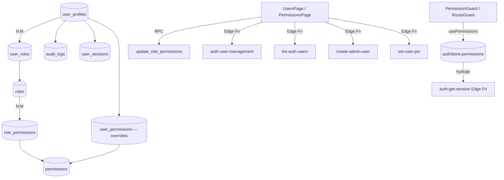

# Module 20 — Users & RBAC

> User profile management, role definitions, permission matrix, PIN-based authentication and audit logging. The RBAC backbone of the entire app — every page guard, every Edge Function, every RLS policy depends on the contracts established here.

---

## Vue d'ensemble

This module covers four concerns:

1. **User CRUD** — create / update / activate / deactivate user profiles, assign primary role + secondary roles.
2. **Role management** — CRUD on roles (`Owner`, `Admin`, `Manager`, `Cashier`, `Waiter`, `Kitchen`, `Accountant`, …), with `hierarchy_level` for ordering.
3. **Permission matrix** — N×M grid (roles × permissions) editable through `PermissionsPage`. Saved atomically via `update_role_permissions` RPC.
4. **Audit log** — every privileged action writes to `audit_logs` (admin-only viewer at `/settings/audit`).

Identity verification supports two modes:

- **Email + password** — Supabase Auth, suitable for back-office users. `auth_user_id` links `user_profiles` to `auth.users`.
- **PIN** — 4–8 digit code stored as bcrypt hash in `user_profiles.pin_hash` (plaintext column was removed in `20260210100000_remove_plaintext_pin.sql`). Used for fast in-store login at POS, KDS, tablets.

For the underlying authentication flow (sessions, lockouts, PIN verification), see `04-modules/01-auth-users.md`. This document focuses on the **user/role administration UI** and **RBAC enforcement contracts**.

---

## Diagramme



---

## Tables DB (`008_users_permissions`)

| Table              | Rôle                                                                                       |
| ------------------ | ------------------------------------------------------------------------------------------ |
| `roles`            | `id, code, name_fr/en/id, description, is_system, is_active, hierarchy_level`              |
| `permissions`      | `id, code, module, action, name_*, description, is_sensitive` — system seed, immutable     |
| `role_permissions` | M:N junction — `(role_id, permission_id)` PK                                               |
| `user_profiles`    | App-side user identity — `id, auth_user_id, employee_code, first_name, last_name, display_name, phone, preferred_language, timezone, pin_hash, last_login_at, failed_login_attempts, locked_until, is_active, created_by, updated_by` |
| `user_roles`       | M:N junction — `(user_id, role_id)` + `is_primary BOOLEAN`                                 |
| `user_permissions` | Per-user permission overrides (allow/deny) — bypass role grants                            |
| `user_sessions`    | Active sessions — `session_token, device_type, device_name, ip_address, user_agent, started_at, last_activity_at, ended_at, end_reason` |
| `audit_logs`       | Audit trail — `user_id, action, module, table_name, record_id, old_values, new_values, ip_address, severity, created_at` |

Indexes (key ones):

- `idx_user_profiles_auth ON user_profiles(auth_user_id) WHERE auth_user_id IS NOT NULL`
- `idx_user_roles_primary ON user_roles(is_primary) WHERE is_primary = TRUE`
- `idx_audit_logs_created ON audit_logs(created_at DESC)`
- `idx_audit_logs_severity ON audit_logs(severity)`

---

## Hooks

| Hook                    | Path                                          | Rôle                                                       |
| ----------------------- | --------------------------------------------- | ---------------------------------------------------------- |
| `usePermissions`        | `src/hooks/usePermissions.ts`                 | `hasPermission(code)`, `hasAnyPermission(codes)`, `hasAllPermissions(codes)`, `canAccessModule(module)`, `hasRole(code)`, `isAdmin` |
| `usePermissionsData`    | `src/hooks/usePermissionsData.ts`             | `usePermissionsMatrix()` (roles + permissions + role_permissions), `useSavePermissions()` |
| `useUsersWithRoles`     | `src/hooks/useUsers.ts`                       | List users + `user_roles` + nested `roles`                 |
| `useAuthUsers`          | `src/hooks/useAuthUsers.ts`                   | List Supabase `auth.users` (via `list-auth-users` Edge Fn) |
| `useActiveUsers`        | `src/hooks/useActiveUsers.ts`                 | Live user_sessions count                                    |
| `useAuditLogs`          | `src/hooks/useAuditLogs.ts`                   | Paginated audit log query with filters                      |
| `useRoles`              | `src/hooks/settings/useRoles.ts`              | Roles + user_count + permissions[] + CRUD mutations         |
| `usePermissionsList`    | `src/hooks/settings/useRoles.ts`              | All `permissions` rows (for matrix rendering)               |

---

## Services

| Service                                      | Rôle                                                                           |
| -------------------------------------------- | ------------------------------------------------------------------------------ |
| `src/services/userManagementService.ts`      | All user CRUD orchestration. Methods: `createUser`, `updateUser`, `deleteUser`, `toggleUserActive`, `createUserDirect`, `updateUserDirect`, `deleteUserDirect`, `toggleUserActiveDirect`, `getUsers`, `getRoles`, `getPermissions`, `getAuditLogs`. The `*Direct` variants bypass Edge Functions and call Supabase directly (for cases where the user has admin DB privileges); the non-Direct variants route through `auth-user-management` Edge Function (preferred — performs auth.users sync and audit). |
| `src/services/authService.ts`                | Session helpers consumed by user management (PIN verification, token retrieval) |

`buildAuthHeaders()` in `userManagementService` includes both `x-session-token` (PIN sessions) and `Authorization: Bearer …` (Supabase JWT for email-login users) — Edge Functions pick whichever is present.

---

## Composants UI

### Pages

| Page                  | Path                                       | Rôle                                                                       |
| --------------------- | ------------------------------------------ | -------------------------------------------------------------------------- |
| `UsersPage`           | `src/pages/users/UsersPage.tsx`            | User list + filters (role/status), stat cards, create/edit/delete CTA      |
| `PermissionsPage`     | `src/pages/users/PermissionsPage.tsx`      | Matrix layout: roles as columns, permissions as rows. Owner role is locked |
| `UserFormModal`       | `src/pages/users/UserFormModal.tsx`        | Create/edit user form (multi-role select, primary role, PIN, employee_code) |
| `UserTableRow`        | `src/pages/users/UserTableRow.tsx`         | Row renderer with quick actions                                            |
| `ResetPinModal`       | `src/pages/users/ResetPinModal.tsx`        | Manager-initiated PIN reset for a user                                     |
| `StatCard`            | `src/pages/users/StatCard.tsx`             | Reusable stat tile (Total / Active / Admins / Recent logins)               |
| `usersPageHelpers.ts` | `src/pages/users/usersPageHelpers.ts`      | `getRoleName(role, lang)`, etc.                                             |

### Permission components

| Composant                    | Path                                              | Rôle                                                          |
| ---------------------------- | ------------------------------------------------- | ------------------------------------------------------------- |
| `PermissionGuard`            | `src/components/auth/PermissionGuard.tsx`         | Inline guard — renders children only if permission granted; exports `RouteGuard` for route-level use |
| `ModuleAccessGuard`          | `src/components/auth/ModuleAccessGuard.tsx`       | Module-level guard (`POSAccessGuard`, `BackOfficeAccessGuard`) |
| `PermissionMatrixPanel`      | `src/components/permissions/PermissionMatrixPanel.tsx` | Core matrix renderer (used by RolesPage and PermissionsPage) |
| `PermissionModuleSection`    | `src/components/permissions/PermissionModuleSection.tsx` | Collapsible section per module                          |
| `PermissionRow`              | `src/components/permissions/PermissionRow.tsx`    | Single permission row (label + per-role checkboxes)            |
| `RoleListPanel`              | `src/components/permissions/RoleListPanel.tsx`    | Side rail with role list + create/edit                         |
| `RoleListItem`               | `src/components/permissions/RoleListItem.tsx`     | One row in the role list                                       |

---

## Stores

No dedicated user/RBAC store — identity, roles and permissions live in `useAuthStore` (`src/stores/authStore.ts`). Excerpt of the slice that matters here:

```ts
{
  user: IUserProfileExtended | null,
  roles: IRole[],
  permissions: IEffectivePermission[],   // resolved set with is_granted
  isAuthenticated: boolean,
  // …
}
```

`permissions` is the **effective** set: role grants merged with `user_permissions` overrides, deduped by `permission_code`. Computed server-side by `auth-get-session` and cached in the store.

---

## RPCs / Edge Functions

| Item                                              | Type        | Rôle                                                                   |
| ------------------------------------------------- | ----------- | ---------------------------------------------------------------------- |
| `update_role_permissions(p_role_id, p_permission_ids[])` | RPC  | Atomic replace of role's permission set; granted to `authenticated`. Defined in `20260323100100_atomic_expense_approval_and_role_permissions.sql` |
| `user_has_permission(p_user_id, p_permission_code)` | RPC STABLE SECURITY DEFINER | Used in RLS policies and `usePermissions` parity checks. Defined in `011_functions_triggers.sql` |
| `is_admin(p_user_id)`                             | RPC         | Convenience check for "is in admin/owner role"                          |
| `set_user_pin(p_user_id, p_pin)`                  | RPC         | Bcrypt-hash and store PIN. Plaintext column removed in `20260210100000_remove_plaintext_pin.sql` |
| `auth-user-management`                            | Edge Fn     | User CRUD — `action: 'create' | 'update' | 'delete' | 'toggle_active'`. `verify_jwt: true`. Performs auth.users sync + audit_log insert |
| `list-auth-users`                                 | Edge Fn     | List Supabase Auth users (admin context — uses service role)            |
| `create-admin-user`                               | Edge Fn     | Bootstrap an Owner/Admin during initial setup                          |
| `auth-get-session`                                | Edge Fn     | Resolve session token → user + roles + effective permissions            |
| `auth-verify-pin`                                 | Edge Fn     | Verify PIN against `pin_hash`, issue session                            |
| `auth-change-pin`                                 | Edge Fn     | Change own PIN (requires old PIN)                                       |
| `auth-logout`                                     | Edge Fn     | Invalidate session                                                      |
| `set-user-pin`                                    | Edge Fn     | Manager-initiated PIN reset (calls `set_user_pin` RPC server-side)     |

---

## RLS / Permissions

| Table              | SELECT                          | INSERT/UPDATE/DELETE                                              |
| ------------------ | ------------------------------- | ----------------------------------------------------------------- |
| `user_profiles`    | `is_authenticated()` (own row); `users.view` for others | `users.create` / `users.update` / `users.delete`        |
| `roles`            | `is_authenticated()`            | `users.roles`                                                     |
| `permissions`      | `is_authenticated()`            | system seed only — no user write                                  |
| `role_permissions` | `is_authenticated()`            | `users.roles` (via `update_role_permissions` RPC)                 |
| `user_roles`       | `is_authenticated()`            | `users.roles`                                                     |
| `user_permissions` | `is_authenticated()`            | `users.roles`                                                     |
| `user_sessions`    | own rows + admin                | INSERT via Edge Fn; UPDATE last_activity_at via session refresh   |
| `audit_logs`       | `users.roles` (admin viewer)    | INSERT via triggers / Edge Fns; never updated/deleted             |

### Permission codes (RBAC vocabulary)

The permissions table is seeded; codes follow the `module.action` pattern. Full list is in `12-appendices/02-permissions.md`. Key codes used here:

- `users.view`, `users.create`, `users.update`, `users.delete`
- `users.roles` — manage roles AND view audit log
- `settings.view`, `settings.update`, `settings.network`
- (plus all module-specific codes — `sales.*`, `inventory.*`, `accounting.*`, `reports.*`, etc.)

### Default role × permission matrix (excerpt)

| Permission                 | Owner | Admin | Manager | Cashier | Waiter | Kitchen | Accountant |
| -------------------------- | :---: | :---: | :-----: | :-----: | :----: | :-----: | :--------: |
| `sales.view`               |   *   |   *   |    *    |    *    |   *    |    -    |     *      |
| `sales.create`             |   *   |   *   |    *    |    *    |   *    |    -    |     -      |
| `sales.void`               |   *   |   *   |    *    |    -    |   -    |    -    |     -      |
| `sales.discount`           |   *   |   *   |    *    |    -    |   -    |    -    |     -      |
| `inventory.view`           |   *   |   *   |    *    |    *    |   -    |    *    |     *      |
| `inventory.adjust`         |   *   |   *   |    *    |    -    |   -    |    -    |     -      |
| `accounting.view`          |   *   |   *   |    *    |    -    |   -    |    -    |     *      |
| `accounting.manage`        |   *   |   *   |    -    |    -    |   -    |    -    |     *      |
| `users.view`               |   *   |   *   |    *    |    -    |   -    |    -    |     -      |
| `users.create`             |   *   |   *   |    -    |    -    |   -    |    -    |     -      |
| `users.roles`              |   *   |   *   |    -    |    -    |   -    |    -    |     -      |
| `settings.view`            |   *   |   *   |    *    |    -    |   -    |    -    |     *      |
| `settings.update`          |   *   |   *   |    -    |    -    |   -    |    -    |     -      |
| `settings.network`         |   *   |   *   |    *    |    *    |   -    |    -    |     -      |
| `reports.sales`            |   *   |   *   |    *    |    -    |   -    |    -    |     *      |

(Full reference: `12-appendices/02-permissions.md`. Owner role is **locked / read-only** in the matrix UI — system role granting all permissions.)

---

## Routes

Defined in `src/routes/adminRoutes.tsx`:

| Route                  | Component         | Guard                   |
| ---------------------- | ----------------- | ----------------------- |
| `/users`               | `UsersPage`       | `users.view`            |
| `/users/permissions`   | `PermissionsPage` | `users.roles`           |
| `/settings/roles`      | `RolesPage`       | `users.roles`           |
| `/settings/audit`      | `AuditPage`       | `users.roles`           |

All wrapped in `ModuleErrorBoundary moduleName="Users"` (or `"Settings"` for the role/audit pages inside `SettingsLayout`).

---

## Flows E2E

### Flow A — Create a user

1. Admin navigates to `/users`, clicks "+ New user"
2. `UserFormModal` collects: first/last name, employee_code, phone, preferred_language, role_ids[], primary_role_id, optional initial PIN
3. Submit → `userManagementService.createUser()` → `POST /functions/v1/auth-user-management { action: 'create', … }`
4. Edge Function:
   a. Validates caller has `users.create` via `user_has_permission`
   b. Inserts `user_profiles` row
   c. Inserts `user_roles` rows (one per role_id, marks primary)
   d. If PIN provided: hashes via bcrypt and updates `pin_hash`
   e. If email also provided: creates a corresponding `auth.users` row (Supabase Auth API)
   f. Inserts `audit_logs` row (action='user.create')
5. Returns the created user → React Query cache invalidated, table refreshes

### Flow B — Edit role permissions

1. Admin opens `/users/permissions`
2. `usePermissionsMatrix()` parallel-fetches `roles`, `permissions`, `role_permissions`
3. Matrix rendered — Owner column locked (system role)
4. Admin toggles checkboxes — local state diff tracked
5. Click "Save" → for each modified role: `useSavePermissions.mutate({ roleId, permissionIds })`
6. Mutation calls `supabase.rpc('update_role_permissions', { p_role_id, p_permission_ids })`
7. RPC atomically `DELETE` + `INSERT` rows in `role_permissions`
8. Cache invalidated for `['permissions-matrix']` and `['roles']`
9. Toast: "Permissions saved"
10. **Note**: users currently logged in still hold their cached effective set — they need to log out/in (or wait for next `auth-get-session` refresh) for changes to take effect

### Flow C — Reset a user's PIN

1. Admin clicks "Reset PIN" on a user row → `ResetPinModal` opens
2. Admin enters new PIN (4–8 digits) and their own admin PIN for confirmation
3. Submit → calls `set-user-pin` Edge Function with target user_id + new PIN + admin auth header
4. Edge Function verifies caller has `users.update` (or is the user themselves), then calls `set_user_pin(target_id, new_pin)` RPC
5. RPC bcrypt-hashes the PIN, updates `user_profiles.pin_hash`, and `pin_changed_at`
6. Audit log row inserted
7. Toast: "PIN reset for {user}"

### Flow D — Permission check at runtime

1. User clicks a guarded button: `<PermissionGuard permission="sales.void">…</PermissionGuard>`
2. `usePermissions().hasPermission('sales.void')` reads from `useAuthStore.permissions` (in-memory, zero network)
3. If `is_granted=true` → renders children, otherwise renders fallback (or nothing)
4. Server-side enforcement is independent — RLS on `orders` and the `void_order` RPC will both re-check via `user_has_permission()`. UI guards are UX-only.

### Flow E — Audit log review

1. Admin opens `/settings/audit`
2. `useAuditLogs({ filters })` paginates `audit_logs` (DESC by `created_at`)
3. `AuditFilters` component lets filter by user, module, action, severity, date range
4. Click a row → `AuditDetailModal` shows `old_values` / `new_values` JSON diff and full metadata

---

## Pitfalls

- **Last-admin protection**: do NOT allow deletion or deactivation of the only remaining user with the Owner or Admin role. The Edge Function `auth-user-management` MUST guard against this — count active admins before delete/deactivate; reject if count would drop to zero. (Add a `check_admin_count_after_change()` validation if not already present.)
- **PIN reset workflow**: only managers/admins (or the user themselves with old PIN) can change a PIN. The `set-user-pin` Edge Function uses `verify_jwt: true` AND re-checks permissions server-side — never trust the client's self-reported permission set.
- **Plaintext PIN removed**: as of `20260210100000_remove_plaintext_pin.sql`, the `pin_code` column was dropped. All PIN reads/writes must go through `pin_hash` (bcrypt). Do not reintroduce a plaintext column.
- **Effective permissions caching**: `authStore.permissions` is loaded once at session start. Permission changes by an admin do **not** retroactively affect already-authenticated users until they log out/in. Either accept this latency or implement a Realtime subscription on `role_permissions` + `user_roles` to invalidate the cache.
- **`*Direct` vs Edge Function variants**: `userManagementService` exposes both. Prefer Edge Function variants (auth-user-management) — they handle auth.users sync and audit logging. Only use `*Direct` if the caller is already privileged at the DB layer (rare).
- **Owner role is system-locked**: never allow editing of the Owner role's permissions through any UI. The matrix renders it disabled (`<Lock />` icon). The `update_role_permissions` RPC additionally rejects updates to `is_system=true` roles.
- **Audit log immutability**: never UPDATE or DELETE rows in `audit_logs`. Compliance and forensic integrity depend on append-only behaviour. RLS denies UPDATE/DELETE; do not add policies to allow them.
- **Hierarchy enforcement**: a user with `hierarchy_level=5` (Manager) should not be able to edit a user with `hierarchy_level=10` (Owner) even if granted `users.update`. This check is currently UI-side; back-end enforcement should be added in the Edge Function (TODO tracked separately — verify before granting `users.update` to non-admins).
- **`auth_user_id` nullable**: PIN-only users have `auth_user_id = NULL` (no Supabase Auth row). Anything joining `auth.users` must `LEFT JOIN` and handle nulls.
- **Role code uniqueness**: role `code` is the lookup key in code (`hasRole('cashier')`). Renaming a role's `code` will break those checks — prefer adding a new role + migrating users + retiring the old one.
- **Session timeout vs permission changes**: a long session (e.g. 8h before timeout) can hold stale permissions for hours. For high-security changes (revoking sales.void from a cashier mid-shift), force-terminate their `user_sessions` row to make them re-authenticate.

---

## Voir aussi

- `04-modules/01-auth-users.md` — PIN/email login flows, session management, lockout policies
- `04-modules/19-settings-configuration.md` — RolesPage and AuditPage UI inside Settings
- `12-appendices/02-permissions.md` — Full permission code reference + role × permission matrix
- `07-security/` — RLS patterns, Edge Function `verify_jwt`, audit retention policy
