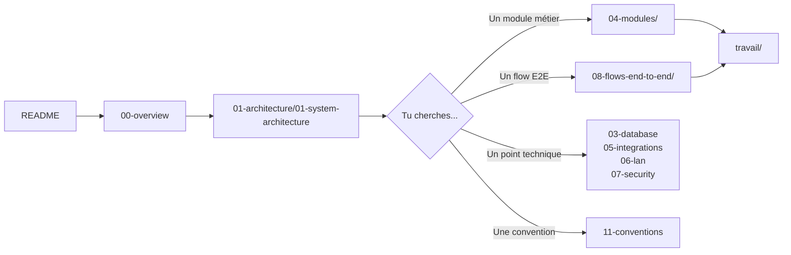

# AppGrav V2 — Documentation de référence

> **Last verified**: 2026-05-03
> **Version documentée**: V2 production (monolith Vite + React + Supabase déployé sur Vercel)
> **URL prod**: https://the-breakery-pos.vercel.app/
> **Périmètre**: V2 monolith **uniquement**. La reconstruction V3 (`breakery-platform/`) a sa propre documentation.

---

## À qui s'adresse cette doc

- **Nouveau développeur** qui rejoint le projet → commencer par `00-overview/` puis `01-architecture/01-system-architecture.md`
- **Audit externe** (sécu, qualité, comptabilité) → `07-security/`, `09-testing/`, `04-modules/10-accounting-double-entry.md`
- **Décisions techniques** → `04-modules/`, `08-flows-end-to-end/`
- **Migration V2 → V3** → `12-appendices/06-cross-reference-with-v3.md`
- **Backlog opérationnel par module** → dossier `travail/`

---

## Comment lire cette doc

Chaque page de référence (sauf `travail/`) commence par un en-tête `Last verified: AAAA-MM-JJ`. Si tu modifies une page, mets à jour la date.

---

## Index complet

### 00 — Overview
| Fichier | Contenu |
|---|---|
| [01-product-context.md](00-overview/01-product-context.md) | The Breakery, métier, contraintes, volumétrie |
| [02-tech-stack.md](00-overview/02-tech-stack.md) | Stack complet avec versions exactes |
| [03-repository-structure.md](00-overview/03-repository-structure.md) | Arbo repo, V2 vs V3 |
| [04-glossary.md](00-overview/04-glossary.md) | PB1, KDS, LAN hub, B2B, SAK EMKM, etc. |

### 01 — Architecture
| Fichier | Contenu |
|---|---|
| [01-system-architecture.md](01-architecture/01-system-architecture.md) | Vue C4 Container — front, Supabase, services externes |
| [02-frontend-architecture.md](01-architecture/02-frontend-architecture.md) | `src/` détaillé — components/pages/hooks/services/stores/types/routes/layouts/lib/utils |
| [03-state-management.md](01-architecture/03-state-management.md) | 14 stores Zustand + patterns react-query |
| [04-routing.md](01-architecture/04-routing.md) | 9 fichiers routes, ~116 routes, guards |
| [05-data-flow.md](01-architecture/05-data-flow.md) | DB → service → hook → store → component |
| [06-build-and-bundling.md](01-architecture/06-build-and-bundling.md) | Vite, code-splitting, lazy-loading, PWA |

### 02 — Design system (Luxe Dark)
| Fichier | Contenu |
|---|---|
| [01-luxe-dark-overview.md](02-design-system/01-luxe-dark-overview.md) | Philosophie, principes |
| [02-tokens.md](02-design-system/02-tokens.md) | Couleurs, typographie, spacing, radius, shadows |
| [03-shadcn-primitives.md](02-design-system/03-shadcn-primitives.md) | Les 29 composants `ui/` |
| [04-feature-components.md](02-design-system/04-feature-components.md) | Patterns par feature (POS cards, Report tabs, KDS tiles) |
| [05-layouts.md](02-design-system/05-layouts.md) | BackOfficeLayout, POS fullscreen, Mobile shell |
| [06-iconography-illustrations.md](02-design-system/06-iconography-illustrations.md) | Lucide, custom assets |
| [07-responsive-mobile.md](02-design-system/07-responsive-mobile.md) | Breakpoints, touch targets, mobile/tablet variants |

### 03 — Database
| Fichier | Contenu |
|---|---|
| [01-schema-overview.md](03-database/01-schema-overview.md) | ER global Mermaid |
| [02-tables-reference.md](03-database/02-tables-reference.md) | Toutes les tables avec colonnes, FKs, enums |
| [03-rpc-functions.md](03-database/03-rpc-functions.md) | RPCs (`complete_order_with_payments`, etc.) |
| [04-triggers.md](03-database/04-triggers.md) | Triggers SQL (sale JE, purchase JE, stock movement) |
| [05-views-and-matviews.md](03-database/05-views-and-matviews.md) | Vues métier |
| [06-rls-policies.md](03-database/06-rls-policies.md) | Pattern `is_authenticated()` + permissions |
| [07-migrations-history.md](03-database/07-migrations-history.md) | 223+ migrations, milestones |
| [08-seed-data.md](03-database/08-seed-data.md) | COA, permissions, enums seed |

### 04 — Modules métier (21 modules)
| # | Fichier |
|---|---|
| 00 | [Index des modules](04-modules/00-modules-index.md) |
| 01 | [Auth & Permissions](04-modules/01-auth-permissions.md) |
| 02 | [POS — Cart & Orders](04-modules/02-pos-cart-orders.md) |
| 03 | [Payments & Split](04-modules/03-payments-split.md) |
| 04 | [KDS Kitchen](04-modules/04-kds-kitchen.md) |
| 05 | [Products & Categories](04-modules/05-products-categories.md) |
| 06 | [Inventory & Stock](04-modules/06-inventory-stock.md) |
| 07 | [Purchasing & Suppliers](04-modules/07-purchasing-suppliers.md) |
| 08 | [Customers & Loyalty](04-modules/08-customers-loyalty.md) |
| 09 | [B2B Wholesale](04-modules/09-b2b-wholesale.md) |
| 10 | [Accounting (Double-entry)](04-modules/10-accounting-double-entry.md) |
| 11 | [Expenses](04-modules/11-expenses.md) |
| 12 | [Cash Register & Shift](04-modules/12-cash-register-shift.md) |
| 13 | [Promotions & Discounts](04-modules/13-promotions-discounts.md) |
| 14 | [Reports & Analytics](04-modules/14-reports-analytics.md) |
| 15 | [Production & Recipes](04-modules/15-production-recipes.md) |
| 16 | [Customer Display](04-modules/16-display-customer.md) |
| 17 | [Tablet Ordering](04-modules/17-tablet-ordering.md) |
| 18 | [Mobile Shell](04-modules/18-mobile-shell.md) |
| 19 | [Settings](04-modules/19-settings-configuration.md) |
| 20 | [Users & RBAC](04-modules/20-users-rbac.md) |

### 05 — Intégrations externes
| Fichier | Contenu |
|---|---|
| [01-supabase.md](05-integrations/01-supabase.md) | Client singleton, auth flow, realtime, storage |
| [02-edge-functions.md](05-integrations/02-edge-functions.md) | 17 Edge Functions Deno |
| [03-sentry-monitoring.md](05-integrations/03-sentry-monitoring.md) | `@sentry/react`, replay, sourcemaps |
| [04-capacitor-native.md](05-integrations/04-capacitor-native.md) | Android/iOS bridges |
| [05-pwa.md](05-integrations/05-pwa.md) | `vite-plugin-pwa`, manifest, offline.html |
| [06-print-server.md](05-integrations/06-print-server.md) | Express :3001, `/print/receipt`, `/drawer/open` |
| [07-pdf-excel-export.md](05-integrations/07-pdf-excel-export.md) | jsPDF + autotable, XLSX |
| [08-claude-proxy.md](05-integrations/08-claude-proxy.md) | Edge Function `claude-proxy` |
| [09-third-party-libs.md](05-integrations/09-third-party-libs.md) | date-fns, Recharts, @dnd-kit, Sonner, cmdk |

### 06 — Architecture LAN
| Fichier | Contenu |
|---|---|
| [01-hub-client-model.md](06-lan-architecture/01-hub-client-model.md) | `lanHub` vs `lanClient`, BroadcastChannel + Realtime |
| [02-discovery.md](06-lan-architecture/02-discovery.md) | 2-tier TCP→HTTP probe |
| [03-heartbeat-and-state.md](06-lan-architecture/03-heartbeat-and-state.md) | 30s interval, 120s stale |
| [04-print-routing.md](06-lan-architecture/04-print-routing.md) | `PRINT_REQUEST` flow |
| [05-message-protocol.md](06-lan-architecture/05-message-protocol.md) | `lanProtocol.ts` envelope, seq tracking |
| [06-device-types.md](06-lan-architecture/06-device-types.md) | POS terminal, KDS station, customer display, tablet |

### 07 — Sécurité
| Fichier | Contenu |
|---|---|
| [01-auth-flow-pin.md](07-security/01-auth-flow-pin.md) | End-to-end auth-verify-pin → guards |
| [02-rls-patterns.md](07-security/02-rls-patterns.md) | `is_authenticated()`, `user_has_permission()` |
| [03-rbac-permissions.md](07-security/03-rbac-permissions.md) | Codes permissions, `PermissionGuard` |
| [04-edge-function-security.md](07-security/04-edge-function-security.md) | `verify_jwt: true`, permission checks |
| [05-secrets-and-env.md](07-security/05-secrets-and-env.md) | `.env`, Vercel env, hook `protect-files.sh` |
| [06-pii-and-compliance.md](07-security/06-pii-and-compliance.md) | Sentry scrubbing |
| [07-known-risks.md](07-security/07-known-risks.md) | Limites + mitigations |

### 08 — Flows end-to-end (12 flows)
| # | Flow |
|---|---|
| 01 | [POS Sale Cash](08-flows-end-to-end/01-pos-sale-cash.md) |
| 02 | [POS Sale Split Payment](08-flows-end-to-end/02-pos-sale-split-payment.md) |
| 03 | [Void / Refund](08-flows-end-to-end/03-void-refund.md) |
| 04 | [Purchase Order Cycle](08-flows-end-to-end/04-purchase-order-cycle.md) |
| 05 | [Stock Opname](08-flows-end-to-end/05-stock-opname.md) |
| 06 | [B2B Order to Invoice](08-flows-end-to-end/06-b2b-order-to-invoice.md) |
| 07 | [Loyalty Earn / Redeem](08-flows-end-to-end/07-loyalty-earn-redeem.md) |
| 08 | [KDS Order Lifecycle](08-flows-end-to-end/08-kds-order-lifecycle.md) |
| 09 | [Promotion Evaluation](08-flows-end-to-end/09-promotion-evaluation.md) |
| 10 | [End of Day](08-flows-end-to-end/10-end-of-day.md) |
| 11 | [Shift Cash Reconciliation](08-flows-end-to-end/11-shift-cash-reconciliation.md) |
| 12 | [Production Stock Impact](08-flows-end-to-end/12-production-stock-impact.md) |

### 09 — Testing
| Fichier | Contenu |
|---|---|
| [01-test-strategy.md](09-testing/01-test-strategy.md) | Vitest, ~1770 tests |
| [02-unit-tests.md](09-testing/02-unit-tests.md) | Stores, services, hooks, utils |
| [03-component-tests.md](09-testing/03-component-tests.md) | `@testing-library/react` |
| [04-known-failures.md](09-testing/04-known-failures.md) | 9 tests Edge Function |
| [05-running-tests.md](09-testing/05-running-tests.md) | Commandes, mocks, fixtures |

### 10 — Deployment & Ops
| Fichier | Contenu |
|---|---|
| [01-vercel-deployment.md](10-deployment-ops/01-vercel-deployment.md) | Build, env vars, domains |
| [02-supabase-environments.md](10-deployment-ops/02-supabase-environments.md) | ap-southeast-1 (Singapore) |
| [03-android-build.md](10-deployment-ops/03-android-build.md) | `npm run android:build` |
| [04-ios-build.md](10-deployment-ops/04-ios-build.md) | iOS specifics |
| [05-database-migrations-deploy.md](10-deployment-ops/05-database-migrations-deploy.md) | Application des migrations |
| [06-edge-functions-deploy.md](10-deployment-ops/06-edge-functions-deploy.md) | `supabase functions deploy` |
| [07-monitoring-runbook.md](10-deployment-ops/07-monitoring-runbook.md) | Sentry alertes, runbooks |
| [08-incident-response.md](10-deployment-ops/08-incident-response.md) | Rollback, hotfix |

### 11 — Conventions
| Fichier | Contenu |
|---|---|
| [01-coding-conventions.md](11-conventions/01-coding-conventions.md) | PascalCase, camelCase, I/T prefix |
| [02-file-organization.md](11-conventions/02-file-organization.md) | 300 lignes max, named exports |
| [03-react-patterns.md](11-conventions/03-react-patterns.md) | Hooks custom, error boundaries, lazy |
| [04-supabase-patterns.md](11-conventions/04-supabase-patterns.md) | Targeted selects, RPC, realtime |
| [05-error-handling.md](11-conventions/05-error-handling.md) | `ModuleErrorBoundary`, Sonner, Sentry |
| [06-pitfalls.md](11-conventions/06-pitfalls.md) | Pièges connus + exemples |

### 12 — Annexes
| Fichier | Contenu |
|---|---|
| [01-business-rules.md](12-appendices/01-business-rules.md) | IDR rounding, PB1 tax, loyalty tiers |
| [02-permission-codes-matrix.md](12-appendices/02-permission-codes-matrix.md) | Matrice permissions × rôles |
| [03-environment-variables.md](12-appendices/03-environment-variables.md) | Toutes les `VITE_*`, `SENTRY_*` |
| [04-keyboard-shortcuts.md](12-appendices/04-keyboard-shortcuts.md) | Shortcuts POS |
| [05-known-issues-backlog.md](12-appendices/05-known-issues-backlog.md) | Lien `CURRENT_STATE.md` |
| [06-cross-reference-with-v3.md](12-appendices/06-cross-reference-with-v3.md) | Mapping V2 → V3 |

### travail/ — Backlog opérationnel
26 fichiers de tâches détaillées par module (objectifs + critères d'acceptation + estimation + dépendances). Voir [travail/00-README.md](travail/00-README.md) pour le format.

---

## Conventions de cette doc

- **Liens internes** : relatifs au fichier courant (`../04-modules/...`)
- **Références au code** : format `chemin/du/fichier.ts:42` quand une ligne précise est citée
- **Diagrammes** : Mermaid (rendu natif sur GitHub, GitLab, et la plupart des éditeurs Markdown)
- **Statuts** : ✅ implémenté · 🚧 partiel · ⏳ planifié · 🐛 bug connu · ⚠️ pitfall
- **Langue** : français pour la doc, anglais pour les noms de code/UI/types

---

## Documents externes référencés (hors `v2-reference/`)

| Document | Usage |
|---|---|
| [`CLAUDE.md`](../../CLAUDE.md) | Instructions agents IA, conventions condensées |
| [`DESIGN.md`](../../DESIGN.md) | Source design "Luxe Dark" (distillée dans `02-design-system/`) |
| [`CURRENT_STATE.md`](../../CURRENT_STATE.md) | Sprint progress + backlog vivant |
| [`docs/v2/APP_REFERENCE.md`](../v2/APP_REFERENCE.md) | Spec historique V2 (645 lignes) — conservée pour référence |
| [`docs/v2/modules/`](../v2/modules/) | 11 specs modules historiques (à comparer avec `04-modules/`) |
| [`docs/audit/`](../audit/) | 8 rapports d'audit (sécu, accounting, code, reports, UX, doc, backlog, ops) |
| [`docs/_archive/`](../_archive/) | Documentation V1 et stories pré-BMAD archivées |
