# Roadmap globale — Travail AppGrav V2

> Last updated: 2026-05-03
> Source : agrégation des 8 audits 2026-04-09 + `CURRENT_STATE.md` + revue de code 2026-05-03

---

## Vue d'ensemble

AppGrav V2 est en production depuis 2026-03-23 (~200 tx/jour, ~20 utilisateurs, The Breakery, Lombok). L'audit global 2026-04-09 (8 agents BMAD + 7 skills) a produit un état des lieux solide : **architecture 8/10**, **sécurité 7.5/10**, **complétude produit 88 %**, **53 rapports actifs**. La majorité des P0 d'audit ont été corrigés dans la passe « Global Audit & Fixes » du 2026-04-09 (triggers comptables restaurés, expense approval RPC, VAT RPC, CSP/HSTS, error leakage, Sonner, French strings, .limit() reports).

**Ce qui reste** se répartit en 3 catégories :

1. **Hardening** — finir le ménage post-audit : timezone reports, modal focus traps, hex hardcodés, modale shadcn Dialog, message dedup LAN, rate limiting Edge Functions, table fantômes (system_alerts, stock_reservations, customer_invoices).
2. **Gaps fonctionnels bakery** — F1 expiry tracking (P0 sécurité alimentaire), F6 sub-recipes (P0 costing bakery), F5 yield, F7 cash flow, scheduling production.
3. **Compliance fiscale Indonésie** — I1 Faktur Pajak, I2 e-Faktur, I3 DJP. **Bloqué tant que le statut PKP n'est pas confirmé** par le propriétaire.

**Prochains jalons** : (a) sprint Hardening 2 semaines pour solder les findings P1 d'audit, (b) sprint Bakery Production (F1+F6) car ce sont les seuls vrais manques métier d'un bakery, (c) sprint Compliance dès que PKP confirmé.

---

## Top 10 priorités cross-modules

Triées par impact business + risque. Chaque ligne pointe vers le fichier de travail détaillé.

| # | Tâche | Module | Pri | Estim | Source audit |
|---|-------|--------|-----|-------|--------------|
| 1 | Confirmer le statut PKP de The Breakery (débloque I1/I2/I3) | n/a (business) | P0 | S | `07-product-backlog-audit.md§Recommandations Immédiates` |
| 2 | Standardiser timezone `toLocalDateStr()` dans 4 services reporting | 10-reports (à créer) | P1 | M | `04-reports-testing-audit.md§P1-1` |
| 3 | Granulariser permissions reports (`.sales`/`.inventory`/`.financial`/`.audit`) | 01-auth + 10-reports | P1 | M | `04-reports-testing-audit.md§P1-2` |
| 4 | Rate limiting IP-level sur `auth-verify-pin` Edge Function | 01-auth | P1 | M | `01-architecture-security-audit.md§P1-02` + `08-operations-lan-audit.md§P2-4` |
| 5 | Auditer & remplacer 16 RLS `anon USING(true)` par auth-only | 01-auth | P1 | L | `01-architecture-security-audit.md§P1-01` |
| 6 | Message dedup LAN (TTL 5s) hub + client | 11-lan (à créer) | P1 | M | `08-operations-lan-audit.md§P1-1` |
| 7 | F1 — Expiry date tracking (sécurité alimentaire bakery) | 06-inventory | P0* | XL | `07-product-backlog-audit.md§Critical-1` |
| 8 | F6 — Sub-recipes (croissant dough → pain au choco, etc.) | 05-products | P0* | XL | `07-product-backlog-audit.md§Critical-3` |
| 9 | Migration phantom tables : créer ou supprimer `system_alerts`, `stock_reservations`, `customer_invoices` | 06-inventory + 08-customers | P1 | L | `03-code-quality-schema-audit.md§A1` |
| 10 | Fix modal focus traps : migrer modales custom vers shadcn `Dialog` (Radix) | 02-pos + cross-modules | P1 | L | `05-uiux-design-audit.md§A1-3` |

\* P0 *fonctionnel bakery* — la production tourne sans, mais c'est un gap métier fondamental (food safety + costing).

---

## Diagramme de dépendances

```mermaid
graph TD
  PKP["Confirmer statut PKP (business decision)"] --> I1[I1 Faktur Pajak]
  PKP --> I2[I2 e-Faktur CSV]
  I1 --> I2
  I2 --> I3[I3 DJP integration]

  GenTypes["/gen-types regenerate database.generated.ts"] --> EnumFix[Fix enum drift TItemStatus, TMovementType]
  GenTypes --> NullableFix[Fix IAccount nullability]
  EnumFix --> Phantom[Migration phantom tables system_alerts/stock_reservations/customer_invoices]

  RLSAudit[Audit RLS anon USING true] --> RateLimit[Rate limiting Edge Functions]
  RateLimit --> SessionTimeout[Session timeout config granulaire]

  F1[F1 Expiry tracking schema + UI] --> F1Reports[F1 Expiry stock reports + alerts]
  F1 --> F2[F2 Batch/lot tracking]

  F6[F6 Sub-recipes schema] --> F5[F5 Yield tracking]
  F5 --> COGSReports[COGS production reports refresh]
  F6 --> ProductionPlanning[Production scheduling P3]

  AccountingP0Done[Phase 1 accounting P0 DONE 2026-04-09] --> CashFlow[F7 Cash flow statement]
  AccountingP0Done --> CurrentYearEarnings[Account 3300 Current Year Earnings]

  TimezoneFix[Standardiser toLocalDateStr partout] --> ReportsPermissions[Granulariser permissions reports]
  ReportsPermissions --> AuditReportsTab[Audit/security reports gated par .audit]

  LanDedup[Message dedup LAN TTL 5s] --> LanReconnect[Fix hub zombie state après max retries]
  LanDedup --> PrintQueue[Print retry queue]

  Phantom --> CleanCode[Cleanup dead code anomalyAlerts/stockReservation services]
```

---

## Cycles de release

- **Sprint 1 — Hardening (2 semaines)** : tâches P1 cross-modules issues d'audit (timezone, permissions reports, rate limiting, RLS anon, message dedup LAN, modal focus). Cible ~30 points.
- **Sprint 2 — Schema cleanup + UI polish (2 semaines)** : phantom tables (créer ou supprimer), nullability `IAccount`, modale Dialog migration, hex hardcodés, motion-reduce. Cible ~25 points.
- **Sprint 3 — Bakery Production (2-3 semaines)** : F1 Expiry + F6 Sub-recipes en parallèle (devs distincts). Inclut migration schema, hooks, écrans, alertes, reports. Cible 30-40 points.
- **Sprint 4 — Compliance (conditionnel PKP)** : I1+I2 si PKP confirmé. Sinon : F5 yield + F7 cash flow + production scheduling.
- **Sprint 5 — Quality of life** : T2 staging Vercel, T4 décomposition fichiers >500L, T7 test coverage, T8 ARIA tables.

**Cycles de revue** : tous les 2 sprints, relire `docs/audit/` et radier les findings résolus. Re-runner `/security-review`, `/db-schema-audit`, `/accounting-audit` une fois par trimestre.

---

## Indicateurs de santé

| Indicateur | Cible | Source |
|------------|-------|--------|
| `select('*')` en code source | 0 (actuellement 3 résiduels) | `03-code-quality-schema-audit.md§A8` |
| Phantom tables/RPCs | 0 | `03-code-quality-schema-audit.md§A1-A2` |
| ESLint warnings | < 50 (actuellement max 80, ~36 réels) | `CLAUDE.md` |
| Test coverage | 70 % (actuellement ~60 %) | `CURRENT_STATE.md` T7 |
| Fichiers > 300 lignes | < 30 (actuellement 78) | `03-code-quality-schema-audit.md§B1` |
| RLS `anon USING(true)` sur tables PII | 0 | `01-architecture-security-audit.md§P1-01` |
| Findings P0 audits | 0 | `00-executive-summary.md` |
| Findings P1 audits | < 10 (actuellement 37+) | `00-executive-summary.md` |

---

## Pointeurs vers les fichiers travail/

| Module | Fichier | Tâches |
|--------|---------|--------|
| Auth & Permissions | [`01-auth-permissions.md`](./01-auth-permissions.md) | 8 |
| POS / Cart / Orders | [`02-pos-cart-orders.md`](./02-pos-cart-orders.md) | 9 |
| Payments & Split | [`03-payments-split.md`](./03-payments-split.md) | 7 |
| KDS / Kitchen | [`04-kds-kitchen.md`](./04-kds-kitchen.md) | 8 |
| Products / Categories | [`05-products-categories.md`](./05-products-categories.md) | 8 |
| Inventory / Stock | [`06-inventory-stock.md`](./06-inventory-stock.md) | 9 |
| Purchasing / Suppliers | [`07-purchasing-suppliers.md`](./07-purchasing-suppliers.md) | 7 |
| Customers / Loyalty | [`08-customers-loyalty.md`](./08-customers-loyalty.md) | 7 |

Modules à créer ultérieurement : 09-accounting, 10-reports, 11-lan, 12-mobile, 13-settings, 14-docs.
