# Roadmap globale — The Breakery ERP (V3 monorepo)

> Last updated: 2026-05-18 (S21 refresh)
> Source initiale : agrégation des 8 audits 2026-04-09 + `CURRENT_STATE.md` + revue de code 2026-05-03
> Refresh : intègre l'avancement S13-S20 (Sessions 13 à 19 mergées, S20 prête à merger)

---

## Vue d'ensemble

### Contexte initial (2026-04-09)

AppGrav V2 est en production depuis 2026-03-23 (~200 tx/jour, ~20 utilisateurs, The Breakery, Lombok). L'audit global 2026-04-09 (8 agents BMAD + 7 skills) a produit un état des lieux : **architecture 8/10**, **sécurité 7.5/10**, **complétude produit 88 %**, **53 rapports actifs**. La majorité des P0 d'audit ont été corrigés dans la passe « Global Audit & Fixes » du 2026-04-09 (triggers comptables restaurés, expense approval RPC, VAT RPC, CSP/HSTS, error leakage, Sonner, French strings, .limit() reports).

### Transition V3 et avancement S13-S20

Entre Session 13 (2026-05-13) et Session 20 (2026-05-17), The Breakery a effectué une transition complète vers le monorepo V3 (pnpm + turbo, apps/pos + apps/backoffice + packages/{domain,supabase,ui,utils}) et résolu la majorité des gaps fonctionnels bakery historiquement identifiés. La Session 19 (Hardening polish) a clôturé les 3 derniers items P1/P2 du module 01-auth-permissions (rate limiting durable, session timeout per role, PIN strength warn). La Session 20 (GRANT hardening) a clôturé le gap de sécurité anon GRANT au niveau tables, vues et fonctions — defense-in-depth complémentaire au RLS S13.

### Ce qui reste (état 2026-05-17)

1. **Compliance fiscale Indonésie** — I1 Faktur Pajak, I2 e-Faktur, I3 DJP. **Bloqué tant que le statut PKP n'est pas confirmé** par le propriétaire. **Reste l'unique gap métier majeur.**
2. **Hardening résiduel** — ~~audit RLS `anon USING(true)` sur tables PII~~ DONE S13+S20 ; ~~message dedup LAN (TTL 5s)~~ DONE S13+S21 (audit + GC tests) ; ~~Playwright E2E en CI~~ DONE S21 (3-flow smoke nightly cron) ; ~~`pg_net` birthday cron~~ DONE S21 ; ~~Cash Flow Investing/Financing sections~~ DONE S21 ; ~~staging-deploy.yml secrets~~ DONE S21.
3. **WAC polish** — landed cost shipping/douane pro-rata (TASK-07-012 partial S17), manual cost_price bypass de WAC (DEV-S17-1.B-01), opt-out sample/promo (DEV-S17-1.C-01).
4. **Backlog métier secondaire** — modules 17 (tablet ordering polish), 18 (mobile shell Capacitor, gros chantier), 22 (design-system finitions), 16 (display polish).

### Prochains jalons

- **Session 20+** : triage du backlog résiduel post-S19, probables thèmes : compliance fiscale (si PKP confirmé) ; ou polish hardening reliquat (RLS anon, message dedup LAN) ; ou mobile shell ; ou WAC landed cost.
- **Cycle review** : tous les 3-5 sessions, refresh de cette roadmap + des Status notes (`docs/workplan/backlog-by-module/0N-*.md`).

---

## Top priorités cross-modules (état 2026-05-17)

Triées par impact business + risque. Le top 10 historique avait 5 items déjà résolus en S13-S15 — cette table consolide ce qui reste actionnable.

### Actifs

| # | Tâche | Module | Pri | Estim | Source / contexte |
|---|-------|--------|-----|-------|-------------------|
| 1 | Confirmer le statut PKP de The Breakery (débloque I1/I2/I3) | n/a (business) | P0 | S | `07-product-backlog-audit.md§Recommandations Immédiates` — **bloqueur business**, pas technique |
| ~~3~~ | ~~Message dedup LAN (TTL 5s) hub + client~~ → **DONE S13 (impl) + S21 (audit confirme TTL 5s + 2 GC tests)** (Module 21-lan) | 21-lan | — | — | Closed S21 |
| 5 | Fix modal focus traps : migrer modales custom vers shadcn `Dialog` (Radix) | 02-pos + cross-modules | P1 | L | `05-uiux-design-audit.md§A1-3` |
| ~~6~~ | ~~Playwright E2E en CI (D-W6-6C-05)~~ → **DONE S21** (Module 23-tests) | 23-tests | — | — | Closed S21 |
| 7 | WAC landed cost shipping pro-rata (TASK-07-012 finir partial S17) | 07-purchasing | P3 | M | DEV-S17-1.B-01 + DEV-S17-1.C-01..02 |
| 8 | Mobile shell Capacitor + push native (TASK-15-009 + TASK-18-***) | 18-mobile | P3 | XL | Wave 7 deferred, Session 16+ scope |
| 9 | Compliance fiscale I1/I2/I3 (si PKP confirmé) | n/a (cross) | P0* | XL | `07-product-backlog-audit.md§Compliance` |

### Top 10 historique — items DONE (référence)

- ~~Standardiser timezone `toLocalDateStr()` reports~~ → **DONE S13** TASK-14-003 (Phase 2.B)
- ~~Granulariser permissions reports `.sales`/`.inventory`/`.financial`/`.audit`~~ → **DONE S13** TASK-14-004
- ~~F1 Expiry date tracking~~ → **DONE S13** TASK-06-001 + TASK-06-002 (FIFO, cron expire, ExpiringStockPage)
- ~~F6 Sub-recipes~~ → **DONE S15+S17** TASK-15-001 (anti-cycle 5-niveaux + cost cascade complète depth-5 + `recipe_versions` + `recipe_bom_full_v1`)
- ~~Phantom table `stock_reservations`~~ → **DONE S13** TASK-06-003
- ~~Rate limiting durable Postgres backstop~~ → **DONE S13+S19** TASK-01-002 (in-memory S13, Postgres-backed S19 — `record_rate_limit_v1` RPC + `pg_cron rl-purge` + 5 EFs wired)
- ~~Auditer & remplacer 16 RLS `anon USING(true)` par auth-only (reliquat historique post-S13)~~ → **DONE S13 (RLS) + S20 (GRANT defense-in-depth — tables, views, functions)** TASK-01-001 (S13 PII tables RLS ; S20 REVOKE table+view GRANTs + REVOKE EXECUTE on functions + ALTER DEFAULT PRIVILEGES future-proofed)
- ~~Vérifier phantom tables résiduelles : `system_alerts`, `customer_invoices`~~ → **DONE S14 (D2 decision pack) ; verified absent on V3 dev S20** (`information_schema.tables` query 2026-05-17 — `orders.invoice_number` + `view_b2b_invoices` is the canonical path)

---

## Diagramme de dépendances

```mermaid
graph TD
  PKP["Confirmer statut PKP (business decision)"] --> I1[I1 Faktur Pajak]
  PKP --> I2[I2 e-Faktur CSV]
  I1 --> I2
  I2 --> I3[I3 DJP integration]

  V3Monorepo["V3 monorepo (S12-S13)"] --> Hardening[Hardening résiduel]
  Hardening --> RLSAudit[Audit RLS anon USING true]
  RLSAuditDone["Rate limiting durable ✅ DONE S13+S19"] --> SessionTimeoutDone["Session timeout per role ✅ DONE S19"]
  SessionTimeoutDone --> PinStrengthDone["PIN strength warn ✅ DONE S19"]

  F1Done["F1 Expiry tracking ✅ DONE S13"] --> F2[F2 Batch/lot tracking]
  F6Done["F6 Sub-recipes ✅ DONE S15+S17"] --> F5Done["F5 Yield tracking ✅ DONE S15"]
  F5Done --> COGSReports["COGS reports refresh ✅ DONE S18"]
  F6Done --> ProductionPlanningDone["Production scheduling ✅ DONE S15"]
  F6Done --> CostHistory["Recipe Cost History ✅ DONE S18"]

  WAC["WAC products.cost_price auto-update ✅ DONE S17"] --> LandedCost[Landed cost shipping pro-rata TASK-07-012]
  WAC --> CascadeSnapshots["recipe_versions cascade ancestres ✅ DONE S17"]

  AccountingP0Done["Phase 1 accounting P0 ✅ DONE 2026-04-09"] --> CashFlowDone["F7 Cash flow ✅ DONE S13"]
  AccountingP0Done --> CurrentYearEarnings[Account 3300 Current Year Earnings]
  CashFlowDone --> CashFlowFinancing[Cash Flow Investing/Financing sections D-W6-6A-2]

  TimezoneFixDone["Standardiser toLocalDateStr ✅ DONE S13"] --> ReportsPermissionsDone["Granulariser permissions reports ✅ DONE S13"]
  ReportsPermissionsDone --> CostHistory

  LanDedup[Message dedup LAN TTL 5s] --> LanReconnect[Fix hub zombie state après max retries]
  LanDedup --> PrintQueue[Print retry queue]

  PgTAPNightly["pg_TAP nightly cron ✅ DONE S16"] --> PlaywrightCI[Playwright E2E en CI D-W6-6C-05]
```

---

## Cadence Sessions (historique + à venir)

### Sessions complétées

| Session | Date merge | Branch / commit | Thème principal |
|---|---|---|---|
| S13 | 2026-05-14 | PR #13 (commit `bdf21aa`) | Cascade docs + Phase 2.A/2.B/3.A/4.A/5.A/6.A (productions, reports, purchasing, expenses, B2B, POS UX, KDS, display, tablet, LAN, notifs, settings, RBAC, reports cascade, marketing) |
| S14 | 2026-05-14 | `d7d60d5` | UX completion (68 commits, 6 waves) |
| S15 | 2026-05-16 | `swarm/session-15` | Bakery Production : sub-recipes F6 + yield F5 + recipe pro features (IngredientPicker, DnD, Duplicate, Batch, Schedule, Margin alerts, Boulanger %, EU allergens) (53 commits, 32 migrations) |
| S16 | 2026-05-16 | PR #20 (commit `f7c83b2`) | CI revival pgTAP nightly + S15 follow-ups (`is_semi_finished` + pg_trgm + per-version cost + multi-level preview) (11 commits, 8 migrations) |
| S17 | 2026-05-17 | PR #21 (commit `5e79509`) | Full price chain : PO receipt → WAC → cascade recipe ancestres → `recipe_bom_full_v1` RPC + `IngredientAggregatePreview` rewire (6 commits, 7 migrations) |
| S18 | 2026-05-17 | `swarm/session-18` | Recipe Cost History Report : RPC dual-mode + 2 pages BO (Overview + Timeline recharts) (5 commits, 1 migration) |
| S19 | 2026-05-17 | swarm/session-19 | Hardening polish : durable rate-limit + session timeout per role + PIN strength warn (12-14 commits, 7 migrations) |
| S20 | 2026-05-17 | swarm/session-20 | Defense-in-depth GRANT hardening : refund_sequences RLS, anon table-GRANT sweep, anon function-EXECUTE sweep (+ PUBLIC inheritance corrective `_31`), 5 operational authenticated USING(true) policies tightened (5 migrations) |
| S21 | 2026-05-18 | swarm/session-21 | Polish hardening reliquat : pg_net birthday cron + cash flow 3-sections + Playwright E2E 3-flow CI + staging-deploy secrets + LAN dedup tests + idle warning toast + PIN regex fix + ChangePinModal UX (5 migrations, 1 EF, 3 e2e specs, 4 UI fixes) |

### Cadence prévisionnelle

Le rythme actuel est de **~1 session tous les 1-3 jours**, taille variable (5-68 commits, 1-32 migrations). Pas de sprint formel — chaque session a son **INDEX** (`docs/workplan/plans/2026-MM-DD-session-N-INDEX.md`) qui sert de plan et de récap après merge. Les sessions sont organisées en Waves (0=spec, 1=DB+domain, 2=UI+BO, 3=review+types regen, 4=closeout).

- **Session 22+ : TBD** — triage post-S21 merge. Candidats : compliance fiscale (si PKP confirmé) | WAC landed cost (TASK-07-012 partial) | modal focus-trap migration cross-modules | mobile shell Capacitor | DEV-S21-1.A.1-04 (rotate cron secret to vault.secrets).

---

## Indicateurs de santé (V3 monorepo)

| Indicateur | Cible | État actuel (2026-05-17) |
|------------|-------|--------------------------|
| `select('*')` dans `apps/` ou `packages/` | 0 | À auditer (audit V2 historique : 3 résiduels) |
| Phantom tables/RPCs | 0 | `stock_reservations` DONE S13 ; `system_alerts` / `customer_invoices` à vérifier |
| Fichiers > 500 lignes (CLAUDE.md rule) | 0 | À auditer périodiquement (BakerPreviewPanel.tsx extrait S15 pour rester sous 500) |
| Test coverage modules critiques | 70 % lines / 60 % branches | À mesurer (S15 a ajouté ~50+ tests Vitest + pgTAP, S19 ajoute 17 tests pgTAP + EF/cross-instance) |
| RLS `anon USING(true)` sur tables PII | 0 | PII tables traitées S13 ; 16 historiques à recompter et purger |
| Findings P0 audits 2026-04 | 0 | DONE (Global Audit & Fixes 2026-04-09 + S13 P0 cleanup) |
| Findings P1 audits 2026-04 | < 10 | 37+ historiques, plusieurs résolus en S13-S19 (à recompter) |
| Migrations cloud V3 dev appliquées | monotonic, no drift | OK (`list_migrations` MCP, dernier bloc S19 `20260523000022`) |
| pgTAP nightly cron | green | DONE S16 (`.github/workflows/pgtap-nightly.yml`) |
| TypeScript types regen post-migration | toujours | Convention CLAUDE.md, à vérifier régulièrement |
| Durable Postgres rate-limit sur EFs auth/order | enabled | DONE S19 (5 EFs wired : `auth-verify-pin`, `kiosk-issue-jwt` ×2, `refund-order`, `void-order`, `cancel-item`) |
| Session timeout per role | configurable | DONE S19 (`roles.session_timeout_minutes` + `/settings/security` BO page) |
| anon GRANTs / EXECUTE on `public.*` | 0 | DONE S20 (tables + views + functions, ALTER DEFAULT PRIVILEGES future-proofed) |
| Items hardening reliquat S13-S19 fermés | 8/8 | DONE S21 |

---

## Pointeurs vers les fichiers backlog par module

| Module | Fichier | Items |
|--------|---------|-------|
| Auth & Permissions | [`01-auth-permissions.md`](./01-auth-permissions.md) | 10 (S19 closes TASK-01-002 follow-up, 006, 008) |
| POS / Cart / Orders | [`02-pos-cart-orders.md`](./02-pos-cart-orders.md) | 27 |
| Payments & Split | [`03-payments-split.md`](./03-payments-split.md) | 7 |
| KDS / Kitchen | [`04-kds-kitchen.md`](./04-kds-kitchen.md) | 17 |
| Products / Categories | [`05-products-categories.md`](./05-products-categories.md) | 8 |
| Inventory / Stock | [`06-inventory-stock.md`](./06-inventory-stock.md) | 11 (S17 WAC) |
| Purchasing / Suppliers | [`07-purchasing-suppliers.md`](./07-purchasing-suppliers.md) | 14 |
| Customers / Loyalty | [`08-customers-loyalty.md`](./08-customers-loyalty.md) | 12 |
| B2B / Wholesale | [`09-b2b-wholesale.md`](./09-b2b-wholesale.md) | 17 |
| Accounting (double-entry) | [`10-accounting-double-entry.md`](./10-accounting-double-entry.md) | 22 |
| Expenses | [`11-expenses.md`](./11-expenses.md) | 11 |
| Cash Register / Shift | [`12-cash-register-shift.md`](./12-cash-register-shift.md) | 12 |
| Promotions & Discounts | [`13-promotions-discounts.md`](./13-promotions-discounts.md) | 12 |
| Reports & Analytics | [`14-reports-analytics.md`](./14-reports-analytics.md) | 21 (S18 cost history) |
| Production & Recipes | [`15-production-recipes.md`](./15-production-recipes.md) | 12 (9 DONE S15-S18) |
| Display Customer | [`16-display-customer.md`](./16-display-customer.md) | 13 |
| Tablet Ordering | [`17-tablet-ordering.md`](./17-tablet-ordering.md) | 14 |
| Mobile Shell | [`18-mobile-shell.md`](./18-mobile-shell.md) | 10 (bloqué Capacitor) |
| Settings & Configuration | [`19-settings-configuration.md`](./19-settings-configuration.md) | 14 (S19 `/settings/security`) |
| Users / RBAC | [`20-users-rbac.md`](./20-users-rbac.md) | 16 |
| LAN Architecture | [`21-lan-architecture.md`](./21-lan-architecture.md) | 11 |
| Design System | [`22-design-system.md`](./22-design-system.md) | 13 |
| Tests | [`23-tests.md`](./23-tests.md) | 12 (S16 pgTAP nightly, S19 +17 tests) |
| Deployment & Ops | [`24-deployment-ops.md`](./24-deployment-ops.md) | 11 |
| Security | [`25-security.md`](./25-security.md) | 17 (S19 closes rate-limit + REVOKE-anon hardening) |

**Total : 25 modules, ~344 items, ~88 DONE (S13-S19).**

---

## Conventions de mise à jour

- Statut item : `[TODO]`, `[DOING]`, `[DONE]`, `[BLOCKED]`, `[OBSOLETE]` en suffixe du titre H3 (voir [`00-README.md`](./00-README.md) pour la légende complète).
- **Append-only Status notes** : ne jamais réécrire une `**Status note (YYYY-MM-DD)**` existante. Ajouter une nouvelle ligne datée avec préfixe `S15 update:` / `S16 update:` / `S17 update:` / `S18 update:` / `S19 update:` (etc.) sous la note précédente.
- **Source de vérité par session** : `docs/workplan/plans/2026-MM-DD-session-N-INDEX.md` (deliverables + deviations §10/§13 selon session).
- **WONTFIX** : convention non-formelle (pas de statut dédié), tracée en Status note avec mention `WONTFIX YYYY-MM-DD per user decision` et lien vers memory si applicable. Exemple : DEV-S15-5.C-01 allergens receipt/display (memory `project_allergens_wontfix`).
